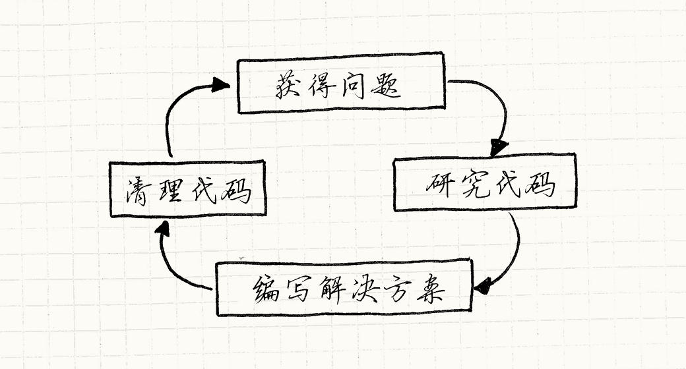

# 架构，性能和游戏

## 游戏设计模式 Introduction

在一头扎入一堆设计模式之前，我想先讲一些我对软件架构和其应用到游戏之中的理解， 这也许能帮你更好地理解这本书的其余部分。 至少，在你被卷入一场关于设计模式和软件架构有多么糟糕（或多么优秀）的辩论时， 这可以给你一些火力支援。

## 什么是软件架构？

如果把本书从头到尾读一遍， 你不会学会 3D 图形背后的线性代数或者游戏物理背后的微积分。 这书不会告诉你如何用α-β修剪你的 AI 树，也不会告诉你如何在音频播放中模拟房间中的混响。

相反，这本书告诉你在这些*之间*的事情。 与其说这本书是关于如何写代码，不如说是关于如何*架构*代码的。 每个程序都有*一定*架构，哪怕这架构是“将所有东西都塞到`main()`中看看如何”， 所以我认为讲讲什么造成了*好*架构是很有意思的。我们如何区分好架构和坏架构呢？

我思考这个问题五年了。当然，像你一样，我有对好设计有一种直觉。 我们都被糟糕的代码折磨的不轻，你唯一能做的好事就是删掉它们，结束它们的痛苦。

少数幸运儿有相反的经验，有机会在好好设计的代码库上工作。 那种代码库看上去是间豪华酒店，里面的门房随时准备满足你心血来潮的需求。 这两者之间的区别是什么呢？

### 什么是*好的*软件架构？

对我而言，好的设计意味着当我作出改动，整个程序就好像正等着这种改动。 我可以加使用几个函数调用完成任务，而代码库本身无需改动。

这听起来很棒，只是完全不可行。“把代码写到改动不会影响其平静表面。”够了。

让我们通俗些。第一个关键点是*架构是有关于改动的*。 总有人改动代码。如果没人碰代码——无论是因为代码至善至美， 还是因为代码糟糕透顶以至于没人会为了修改它而玷污自己的文本编辑器——那么它的架构设计就无关紧要。 评价架构设计的好坏就是评价它应对改动有多么轻松。 没有了改动，架构好似永远不会离开起跑线的运动员。

### 你如何处理改动？

在你改动代码去添加新特性，去修复漏洞，或者随便什么需要使用文本编辑器的时候， 你需要理解代码正在做什么。当然，你不需要理解整个程序， 但你需要将所有相关的东西装进你的大脑。

我们通常无视了这步，但这往往是编程中最耗时的部分。 如果你认为将数据从磁盘上分页到 RAM 上很慢， 那么试试通过一对神经纤维将数据分页到大脑中。

一旦把所有正确的上下文都记到了你的大脑里， 想一会，你就能找到解决方案。 可能需要反复斟酌的时刻，但通常比较简单。 一旦理解了问题和需要改动的代码，实际的编码工作有时是微不足道的。

你用手指在键盘上敲打一阵，直到屏幕上闪着正确的光芒， 搞定了，对吧？还没呢！ 在你为之写测试并发送到代码评审之前，你通常有些清理工作要做。

你将一些代码加入了游戏，但不想下一个人被留下来的小问题绊倒。 除非改动很小，否则就还需要一些工作去微调新代码，使之无缝对接到程序的其他部分。 如果你做对了，那么下个编写代码的人无法察觉到哪些代码是新加入的。

简而言之，编程的流程图看起来是这样的：

### 解耦帮了什么忙？

虽然并不明显，但我认为很多软件架构都是关于研究代码的阶段。 将代码载入到神经元太过缓慢，找些策略减少载入的总量是件很值得做的事。 这本书有整整一章是关于*解耦*模式， 还有很多*设计模式*是关于同样的主题。

可以用多种方式定义“解耦”，但我认为如果有两块代码是耦合的， 那就意味着无法只理解其中一个。 如果*解*耦了它俩，就可以独自地理解某一块。 这当然很好，因为只有一块与问题相关， 只需将*这一块*加载到你的大脑脑中而不需要加载另外一块。

对我来说，这是软件架构的关键目标： **最小化在编写代码前需要了解的信息**。

当然，也可以从后期阶段来看。 另一种解耦的定义是：当一块代码有*改动*时，没必要修改另一块的代码。 肯定需要修改*一些东西*，但耦合程度越小，改动会波及的范围就越小。

## 代价呢？

听起来很棒，对吧？解耦任何东西，然后像风一样编码。 每个改动都只需修改一两个特定方法，在代码库上行云流水地编写代码。

这就是人们对抽象，模块化，设计模式和软件架构兴奋的原因。 在架构优良的程序上工作是极佳的体验，每个人都希望能更有效率地工作。 好架构能造成生产力上*巨大的*不同。它影响大得无以复加。

但是，天下没有免费的午餐。好的设计需要汗水和纪律。 每次做出改动或是实现特性，你都需要将它优雅的集成到程序的其他部分。 需要花费大量的努力去管理代码， 在开发过程中面对数千次变化仍然*保持*它的结构。

你得考虑程序的哪部分需要解耦，然后再引入抽象。 同样，你需要决定哪部分能支持扩展来应对未来的改动。

人们对这点变得狂热。 他们设想，未来的开发者（或者他们自己）进入代码库， 发现它极为开放，功能强大，只需扩展。 他们想要有“至尊代码应众求”。（译著：这里是“至尊魔戒御众戒”的梗，很遗憾翻译不出来）

但是，事情从这里开始变得棘手。 每当你添加了抽象或者扩展支持，你是*赌*以后这里需要灵活性。 你向游戏中添加了代码和复杂性，这需要时间来开发，调试和维护。

如果你赌对了，后来使用了这些代码，那么功夫不负有心人。 但预测未来*很难*，模块化如果最终无益，那就有害。 毕竟，你得处理更多的代码。

当你过分关注这点时，代码库就失控了。 接口和抽象无处不在。插件系统，抽象基类，虚方法，还有各种各样的扩展点，它们遍地都是。

你要消耗无尽的时间回溯所有的脚手架，去找真正做事的代码。 当需要作出改动，当然，有可能某个接口能帮上忙，但能不能找到就只能听天由命了。 理论上，解耦意味着在修改代码之前需要了解更少的代码， 但抽象层本身也会填满大脑。

像这样的代码库让人*反对*软件架构，特别是设计模式。 人们很容易沉浸在代码中，忽略目标是要发布*游戏*。 无数的开发者听着加强可扩展性的警报，花费多年时间制作“引擎”， 却没有搞清楚做引擎是*为了什么*。

## 性能和速度

软件架构和抽象有时因损伤性能而被批评，而游戏开发尤甚。 让代码更灵活的许多模式依靠虚拟调度、 接口、 指针、 消息和其他机制， 它们都会加大运行时开销。

还有一个原因。很多软件架构的目的是使程序更加灵活，作出改动需要更少的付出，编码时对程序有更少的假设。 你可以使用接口，让代码可与*任何*实现了接口的类交互，而不仅仅是*现在*写的类。 今天，你可以使用观察者和消息让游戏的两部分交流， 以后可以很容易地扩展为三个或四个部分相互交流。

但性能与假设相关。实现优化需要基于确定的限制。 敌人永远不会超过 256 个？好，可以将敌人 ID 编码为一个字节。 只在这种类型上调用方法吗？好，可以做静态调度或内联。 所有实体都是同一类？太好了，可以使用 连续数组存储它们。

但这并不意味着灵活性不好！它可以让我们快速改进游戏， *开发* 速度是获取有趣开发经验的绝对重要因素。 没有人，哪怕是 Will Wright，能在纸面上构建一个平衡的游戏。这需要迭代和实验。

越快尝试想法看看效果，就能尝试越多东西，越可能找到有价值的东西。 就算找到正确的机制，你也需要足够的时间调整。 一个微小的不平衡就有可能破坏整个游戏的乐趣。

这里没有普适的答案。 让你的程序更加灵活，在损失一点点性能的前提下更快地做出原型。 或者，优化代码，损失一些灵活性。

就我个人经验而言，让有趣的游戏变得高效比让高效的游戏变有趣简单得多。 一种折中的办法是保持代码灵活直到确定设计，再去除抽象层来提高性能。

## 糟糕代码的优势

下一观点：不同的代码风格各有千秋。 这本书的大部分是关于保持干净可控的代码，所以我坚持应该用*正确*方式写代码，但糟糕的代码也有一定的优势。

编写良好架构的代码需要仔细地思考，这会消耗时间。 在项目的整个周期中*保持*良好的架构需要花费大量的努力。 你需要像露营者处理营地一样小心处理代码库：总是保持其优于你刚刚接触它的时候。

当你要在项目上花费很久时间的话，这很好。 但，就像早先提到的，游戏设计需要很多实验和探索。 特别是在早期，写一些你*知道*要扔掉的代码是很普遍的事情。

如果只想试试游戏的某些点子是否可行的， 良好的架构意味着在屏幕上看到和获取反馈之前要消耗很长时间。 如果最后证明这点子不对，那么删除代码时，那些让代码更优雅的时间就付之东流了。

原型——一坨勉强拼凑在一起，只能完成某个点子的简单代码——是个完全合理的编程实践。 虽然当你写一次性代码时，*必须* 保证将来可以扔掉它。 我见过很多次糟糕的经理人在玩这种把戏：

> 老板：“嗨，我有些想试试的点子。只要原型，不需要做的很好。你能多快搞定？”
> 
> 开发者：“额，如果删掉这些部分，不测试，不写文档，允许很多的漏洞，那么几天能给你临时的代码文件。”
> 
> 老板：“太好了。”

*几天后*

> 老板：“嘿，原型很棒，你能花上几个小时清理一下然后变为成品吗？”

你得让人们清楚，可抛弃的代码即使看上去能工作，也不能被*维护*，*必须* 重写。 如果*有可能*要维护这段代码，就得防御性好好编写它。

## 保持平衡

有些因素在相互角力：

1\. 为了在项目的整个生命周期保持其可读性，需要好架构。 2\. 需要更好的运行时性能。 3\. 需要让现在的特性更快的实现。

这些目标至少是部分对立的。 好架构长期来看提高了生产力， 也意味着每个改动都需要消耗更多努力保持代码整洁。

草就的代码很少是*运行时*最快的。 相反，提升性能需要很多的编程时间。 一旦完成，它就会污染代码库：高度优化的代码不灵活，很难改动。

总有今日事今日毕的压力。但是如果尽可能快地实现特性， 代码库就会充满黑魔法，漏洞和混乱，阻碍未来的产出。

没有简单的答案，只有权衡。 从我收到的邮件看，这伤了很多人的心，特别是那些只是想做个游戏的人。 这似乎是在恐吓，“没有正确的答案，只有不同的错误。”

但，对我而言，这让人兴奋！看看任何人们从事的领域， 你总能发现某些相互抵触的限制。无论如何，如果有简单的答案，每个人都会那么做。 一周就能掌握的领域是很无聊的。你从来没有听说过有人讨论挖坑。

对我来说，这和游戏有很多相似之处。 国际象棋之类的游戏永远不能被掌握，因为每个棋子都很完美的与其他棋子相平衡。 这意味你可以花费一生探索广阔的可选策略。糟糕的游戏就像井字棋，玩上几遍就会厌倦就退出。

## 简单

最近，我感觉如果有什么能简化这些限制，那就是*简单*。 在我现在的代码中，我努力去写最简单，最直接的解决方案。 你读过这种代码后，完全理解了它在做什么，想不到其他完成的方法。

我的目标是正确获得数据结构和算法（大致是这样的先后），然后在从那里开始。 我发现如果能让事物变得简单，就有更少的代码， 就意味着改动时有更少的代码载入脑海。

它通常跑的很快，因为没什么开销，也没什么代码需要执行。 （虽然大部分时候事实并非如此。你可以在一小段代码里加入大量的循环和递归。）

但是，注意我并没有说简单的代码需要更少的时间*编写*。 你会这么觉得是因为最终得到了更少的代码，但是好的解决方案不是往代码中注水，而是*蒸干*代码。

我们很少遇到优雅表达的问题，一般反而是一堆用况。 你想要 X 在 Z 情况下做 Y，在 A 情况下做 W，诸如此类。换言之，一长列不同行为。

最节约心血的方法是为每段用况编写一段代码。 看看新手程序员，他们经常这么干：为每个手头的问题编写条件逻辑。

但这一点也不优雅，那种风格的代码遇到一点点没想到的输入就会崩溃。 当我们想象优雅的代码时，想的是*通用*的那一个： 只需要很少的逻辑就可以覆盖整个用况。

找到这样的方法有点像模式识别或者解决谜题。 需要努力去识别散乱的用例下隐藏的规律。 完成时你会感觉好得不能再好。

## 就快完了

几乎每个人都会跳过介绍章节，所以祝贺你看到这里。 我没有太多东西回报你的耐心，但还有些建议给你，希望对你有用：

*   抽象和解耦让扩展代码更快更容易，但除非确信需要灵活性，否则不要在这上面浪费时间。

*   在整个开发周期中考虑并为性能设计，但是尽可能推迟那些底层的，基于假设的优化，那会锁死代码。

*   快速地探索游戏的设计空间，但不要跑的太快，在身后留下烂摊子。毕竟，你总得回来打扫。

*   如果打算抛弃这段代码，就不要尝试将其写完美。摇滚明星将旅店房间弄得一团糟，因为他们知道明天他们就走人了。

*   但最重要的是，**如果你想要做出让人享受的东西，那就享受做它的过程。**