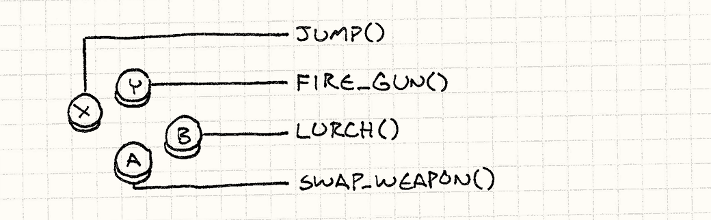
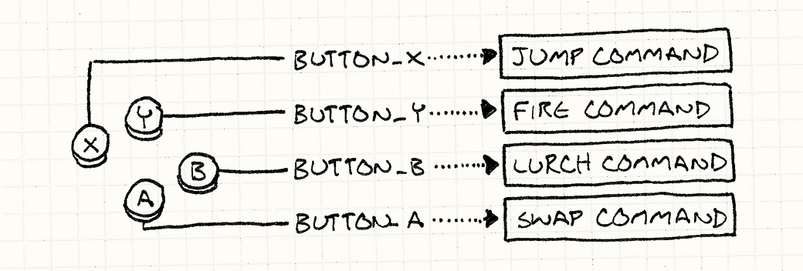
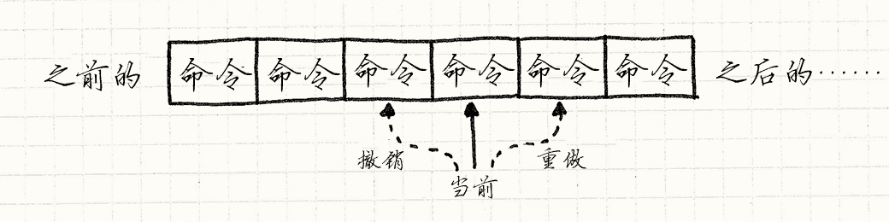

# 命令模式

## 游戏设计模式 Design Patterns Revisited

命令模式是我最喜欢的模式之一。 大多数我写的大型程序，游戏或者别的什么，都会在某处用到它。 当在正确的地方使用时，它可以将复杂的代码清理干净。 对于这样一个了不起的模式，不出所料，GoF 有个深奥的定义：

> 将一个请求封装为一个对象，从而使你可用不同的请求对客户进行参数化； 对请求排队或记录请求日志，以及支持可撤销的操作。

我想你也会觉得这个句子晦涩难懂。 第一，它的比喻难以理解。 在软件之外的狂野世界，词语可以指代任何事物，“客户”是一个*人*——那些和你做生意的人。 据我查证，人类不能被“参数化”。

然后，句子余下的部分介绍了可能会使用这个模式的场景。 如果你的场景不在这个列表中，那么这对你就没什么用处。 *我的*命令模式精简定义为：

**命令是*具现化的方法调用*。**

当然，“精简”往往意味着着“缺少必要信息”，所以这可能没有太大的改善。 让我扩展一下。“具现化”，如果你没有听说过的话，它的意思是“实例化，对象化”。 另外一种具现化的解释方式是将某事物作为“第一公民”对待。

两种术语都意味着将*概念*变成*数据* ——一个对象——可以存储在变量中，传给函数。 所以称命令模式为“具现化方法调用”，意思是方法调用被存储在对象中。

这听起来有些像“回调”，“第一公民函数”，“函数指针”，“闭包”，“偏函数”， 取决于你在学哪种语言，事实上大致上是同一个东西。GoF 随后说：

> 命令模式是一种回调的面向对象实现。

这是一种对命令模式更好的解释。

但这些都既抽象又模糊。我喜欢用实际的东西作为章节的开始，不好意思，搞砸了。 作为弥补，从这里开始都是命令模式能出色应用的例子。

## 配置输入

在每个游戏中都有一块代码读取用户的输入——按钮按下，键盘敲击，鼠标点击，诸如此类。 这块代码会获取用户的输入，然后将其变为游戏中有意义的行为：



下面是一种简单的实现：

```
void InputHandler::handleInput()
{
  if (isPressed(BUTTON_X)) jump();
  else if (isPressed(BUTTON_Y)) fireGun();
  else if (isPressed(BUTTON_A)) swapWeapon();
  else if (isPressed(BUTTON_B)) lurchIneffectively();
} 
```

这个函数通常在游戏循环中每帧调用一次，我确信你可以理解它做了什么。 在我们想将用户的输入和程序行为硬编码在一起时，这段代码可以正常工作，但是许多游戏允许玩家*配置*按键的功能。

为了支持这点，需要将这些对`jump()`和`fireGun()`的直接调用转化为可以变换的东西。 “变换”听起来有点像变量干的事，因此我们需要表示游戏行为的*对象*。进入：命令模式。

我们定义了一个基类代表可触发的游戏行为：

```
class Command
{
public:
  virtual ~Command() {}
  virtual void execute() = 0;
}; 
```

然后我们为不同的游戏行为定义相应的子类：

```
class JumpCommand : public Command
{
public:
  virtual void execute() { jump(); }
};

class FireCommand : public Command
{
public:
  virtual void execute() { fireGun(); }
};

// 你知道思路了吧 
```

在代码的输入处理部分，为每个按键存储一个指向命令的指针。

```
class InputHandler
{
public:
  void handleInput();

  // 绑定命令的方法……

private:
  Command* buttonX_;
  Command* buttonY_;
  Command* buttonA_;
  Command* buttonB_;
}; 
```

现在输入处理部分这样处理：

```
void InputHandler::handleInput()
{
  if (isPressed(BUTTON_X)) buttonX_->execute();
  else if (isPressed(BUTTON_Y)) buttonY_->execute();
  else if (isPressed(BUTTON_A)) buttonA_->execute();
  else if (isPressed(BUTTON_B)) buttonB_->execute();
} 
```

以前每个输入直接调用函数，现在会有一层间接寻址：



这是命令模式的简短介绍。如果你能够看出它的好处，就把这章剩下的部分作为奖励吧。

## 角色说明

我们刚才定义的类可以在之前的例子上正常工作，但有很大的局限。 问题在于假设顶层的`jump()`, `fireGun()`之类的函数可以找到玩家的角色，然后像操纵木偶一样操纵它。

这些假定的耦合限制了这些命令的用处。`JumpCommand`*只能* 让玩家的角色跳跃。让我们放松这个限制。 不让函数去找它们控制的角色，我们将函数控制的角色对象*传进去*：

```
class Command
{
public:
  virtual ~Command() {}
  virtual void execute(GameActor& actor) = 0;
}; 
```

这里`GameActor`是代表游戏世界中角色的“游戏对象”类。 我们将其传给`execute()`，这样可以在命令的子类中添加函数，来与我们选择的角色关联，就像这样：

```
class JumpCommand : public Command
{
public:
  virtual void execute(GameActor& actor)
  {
    actor.jump();
  }
}; 
```

现在，我们可以使用这个类让游戏中的任何角色跳来跳去了。 在输入控制部分和在对象上调用命令部分之间，我们还缺了一块代码。 第一，我们修改`handleInput()`，让它可以*返回*命令：

```
Command* InputHandler::handleInput()
{
  if (isPressed(BUTTON_X)) return buttonX_;
  if (isPressed(BUTTON_Y)) return buttonY_;
  if (isPressed(BUTTON_A)) return buttonA_;
  if (isPressed(BUTTON_B)) return buttonB_;

  // 没有按下任何按键，就什么也不做
  return NULL;
} 
```

这里不能立即执行，因为还不知道哪个角色会传进来。 这里我们享受了命令是具体调用的好处——`延迟`到调用执行时再知道。

然后，需要一些接受命令的代码，作用在玩家角色上。像这样：

```
Command* command = inputHandler.handleInput();
if (command)
{
  command->execute(actor);
} 
```

将`actor`视为玩家角色的引用，它会正确的按着玩家的输入移动， 所以我们赋予了角色和前面例子中相同的行为。 通过在命令和角色间增加了一层重定向， 我们获得了一个灵巧的功能：*我们可以让玩家控制游戏中的任何角色，只需向命令传入不同的角色。*

在实践中，这个特性并不经常使用，但是*经常*会有类似的用例跳出来。 到目前为止，我们只考虑了玩家控制的角色，但是游戏中的其他角色呢？ 它们被游戏 AI 控制。我们可以在 AI 和角色之间使用相同的命令模式；AI 代码只需生成`Command`对象。

在选择命令的 AI 和展现命令的游戏角色间解耦给了我们很大的灵活度。 我们可以对不同的角色使用不同的 AI，或者为了不同的行为而混合 AI。 想要一个更加有攻击性的同伴？插入一个更加有攻击性的 AI 为其生成命令。 事实上，我们甚至可以为*玩家角色*加上 AI， 这在原型阶段，游戏需要自动演示时是很有用的。

把控制角色的命令变为第一公民对象，去除直接方法调用中严厉的束缚。 将其视为命令队列，或者是命令流：


一些代码（输入控制器或者 AI）产生一系列命令放入流中。 另一些代码（调度器或者角色自身）调用并消耗命令。 通过在中间加入队列，我们解耦了消费者和生产者。

## 撤销和重做

最后的这个例子是这种模式最广为人知的使用情况。 如果一个命令对象可以*做*一件事，那么它亦可以*撤销*这件事。 在一些策略游戏中使用撤销，这样你就可以回滚那些你不喜欢的操作。 在人们*创造*游戏时，这是*必不可少的*工具。 一个不能撤销误操作导致的错误的编辑器，肯定会让游戏设计师恨你。

没有了命令模式，实现撤销非常困难，有了它，就是小菜一碟。 假设我们在制作单人回合制游戏，想让玩家能撤销移动，这样他们就可以集中注意力在策略上而不是猜测上。

我们已经使用了命令来抽象输入控制，所以每个玩家的举动都已经被封装其中。 举个例子，移动一个单位的代码可能如下：

```
class MoveUnitCommand : public Command
{
public:
  MoveUnitCommand(Unit* unit, int x, int y)
  : unit_(unit),
    x_(x),
    y_(y)
  {}

  virtual void execute()
  {
    unit_->moveTo(x_, y_);
  }

private:
  Unit* unit_;
  int x_, y_;
}; 
```

注意这和前面的命令有些许不同。 在前面的例子中，我们需要从修改的角色那里*抽象*命令。 在这个例子中，我们将命令*绑定*到要移动的单位上。 这条命令的实例不是通用的“移动某物”命令；而是游戏回合中特殊的一次移动。

这展现了命令模式应用时的一种情形。 在某些情形中，就像之前例子，指令是可重用的对象，代表了*可执行的事件*。 我们早期的输入控制器将其实现为一个命令对象，然后在按键按下时调用其`execute()`方法。

这里的命令更加特殊。它们代表了特定时间点能做的特定事件。 这意味着输入控制代码可以在玩家下决定时*创造*一个实例。就像这样：

```
Command* handleInput()
{
  Unit* unit = getSelectedUnit();

  if (isPressed(BUTTON_UP)) {
    // 向上移动单位
    int destY = unit->y() - 1;
    return new MoveUnitCommand(unit, unit->x(), destY);
  }

  if (isPressed(BUTTON_DOWN)) {
    // 向下移动单位
    int destY = unit->y() + 1;
    return new MoveUnitCommand(unit, unit->x(), destY);
  }

  // 其他的移动……

  return NULL;
} 
```

命令是一次性为我们很快地赢得了一个优点。 为了让指令可被取消，我们为每个类定义另一个需要实现的方法：

```
class Command
{
public:
  virtual ~Command() {}
  virtual void execute() = 0;
  virtual void undo() = 0;
}; 
```

`undo()`方法回滚了`execute()`方法造成的游戏状态改变。 这里是添加了撤销功能后的移动命令：

```
class MoveUnitCommand : public Command
{
public:
  MoveUnitCommand(Unit* unit, int x, int y)
  : unit_(unit),
    xBefore_(0),
    yBefore_(0),
    x_(x),
    y_(y)
  {}

  virtual void execute()
  {
    // 保存移动之前的位置
    // 这样之后可以复原。

    xBefore_ = unit_->x();
    yBefore_ = unit_->y();

    unit_->moveTo(x_, y_);
  }

  virtual void undo()
  {
    unit_->moveTo(xBefore_, yBefore_);
  }

private:
  Unit* unit_;
  int xBefore_, yBefore_;
  int x_, y_;
}; 
```

注意我们为类添加了更多的状态。 当单位移动时，它忘记了它之前是什么样的。 如果我们想要撤销这个移动，我们需要记得单位之前的状态，也就是`xBefore_`和`yBefore_`的作用。

为了让玩家撤销移动，我们记录了执行的最后命令。当他们按下`control+z`时，我们调用命令的`undo()`方法。 （如果他们已经撤销了，那么就变成了“重做”，我们会再一次执行命令。）

支持多重的撤销也不太难。 我们不单单记录最后一条指令，还要记录指令列表，然后用一个引用指向“当前”的那个。 当玩家执行一条命令，我们将其添加到列表，然后将代表“当前”的指针指向它。



当玩家选择“撤销”，我们撤销现在的命令，将代表当前的指针往后退。 当他们选择“重做”，我们将代表当前的指针往前进，执行该指令。 如果在撤销后选择了新命令，那么清除命令列表中当前的指针所指命令之后的全部命令。

第一次在关卡编辑器中实现这点时，我觉得自己简直就是个天才。 我惊讶于它如此的简明有效。 你需要约束自己，保证每个数据修改都通过命令完成，一旦你做到了，余下的都很简单。

## 用类还是用函数？

早些时候，我说过命令与第一公民函数或者闭包类似， 但是在这里展现的每个例子都是通过类完成的。 如果你更熟悉函数式编程，你也许会疑惑函数都在哪里。

我用这种方式写例子是因为 C++对第一公民函数支持非常有限。 函数指针没有状态，函子很奇怪而且仍然需要定义类， 在 C++11 中的 lambda 演算需要大量的人工记忆辅助才能使用。

这并*不是*说你在其他语言中不可以用函数来完成命令模式。 如果你使用的语言支持闭包，不管怎样，快去用它！ 在某种程度上，命令模式是为一些没有闭包的语言模拟闭包。

举个例子，如果我们使用 javascript 来写游戏，那么我们可以用这种方式来写让单位移动的命令：

```
function makeMoveUnitCommand(unit, x, y) {
  // 这个函数就是命令对象:
  return function() {
    unit.moveTo(x, y);
  }
} 
```

我们可以通过一对闭包来为撤销提供支持：

```
function makeMoveUnitCommand(unit, x, y) {
  var xBefore, yBefore;
  return {
    execute: function() {
      xBefore = unit.x();
      yBefore = unit.y();
      unit.moveTo(x, y);
    },
    undo: function() {
      unit.moveTo(xBefore, yBefore);
    }
  };
} 
```

如果你习惯了函数式编程风格，这种做事的方法是很自然的。 如果你没有，我希望这章可以帮你了解一些。 对于我而言，命令模式展现了函数式范式在很多问题上的高效性。

## 参见

*   你最终可能会得到很多不同的命令类。 为了更容易实现这些类，定义一个具体的基类，包含一些能定义行为的高层方法，往往会有帮助。 这将命令的主体`execute()`转到子类沙箱中。

*   在上面的例子中，我们明确地指定哪个角色会处理命令。 在某些情况下，特别是当对象模型分层时，也可以不这么简单粗暴。 对象可以响应命令，或者将命令交给它的从属对象。 如果你这样做，你就完成了一个[职责链模式](http://en.wikipedia.org/wiki/Chain-of-responsibility_pattern)。

* 有些命令是无状态的纯粹行为，比如第一个例子中的`JumpCommand`。 在这种情况下，有多个实例是在浪费内存，因为所有的实例是等价的。 可以用享元模式解决。