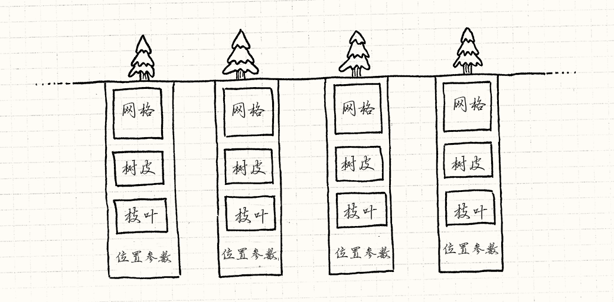
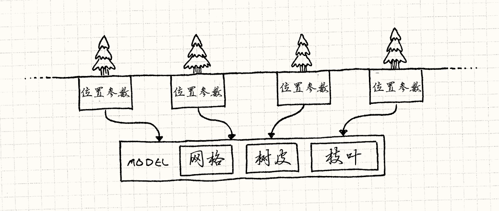
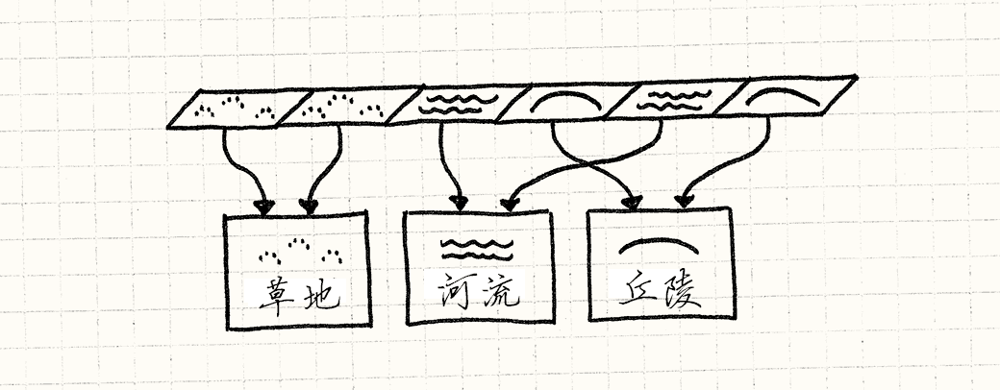

# 享元模式

## 游戏设计模式 Design Patterns Revisited

迷雾散尽，露出了古朴庄严的森林。古老的铁杉，在头顶编成绿色穹顶。 阳光在树叶间破碎成金色顶棚。从树干间远眺，远处的森林渐渐隐去。

这是我们游戏开发者梦想的超凡场景，这样的场景通常由一个模式支撑着，它的名字低调至极：享元模式。

## 森林

用几句话就能描述一片巨大的森林，但是在实时游戏中做这件事就完全是另外一件事了。 当屏幕上需要显示一整个森林时，图形程序员看到的是每秒需要送到 GPU 六十次的百万多边形。

我们讨论的是成千上万的树，每棵都由上千的多边形组成。 就算有足够的*内存*描述森林，渲染的过程中，CPU 到 GPU 的部分也太过繁忙了。

每棵树都有一系列与之相关的位：

*   定义树干，树枝和树叶形状的多边形网格。
*   树皮和树叶的纹理。
*   在森林中树的位置和朝向。
*   大小和色彩之类的调节参数，让每棵树都看起来与众不同。

如果用代码表示，那么会得到这样的东西：

```
class Tree
{
private:
  Mesh mesh_;
  Texture bark_;
  Texture leaves_;
  Vector position_;
  double height_;
  double thickness_;
  Color barkTint_;
  Color leafTint_;
}; 
```

这是一大堆数据，多边形网格和纹理体积非常大。 描述整个森林的对象在一帧的时间就交给 GPU 是太过了。 幸运的是，有一种老办法来处理它。

关键点在于，哪怕森林里有千千万万的树，它们大多数长得一模一样。 它们使用了相同的网格和纹理。 这意味着这些树的实例的大部分字段是*一样的*。



我们可以通过显式将对象切为两部分来更加明确地模拟。 第一，将树共有的数据拿出来分离到另一个类中：

```
class TreeModel
{
private:
  Mesh mesh_;
  Texture bark_;
  Texture leaves_;
}; 
```

游戏只需要一个这种类， 因为没有必要在内存中把相同的网格和纹理重复一千遍。 每个游戏世界中树的实例只需有一个对这个共享`TreeModel`的*引用*。 留在`Tree`中的是那些实例相关的数据：

```
class Tree
{
private:
  TreeModel* model_;

  Vector position_;
  double height_;
  double thickness_;
  Color barkTint_;
  Color leafTint_;
}; 
```

你可以将其想象成这样：



把所有的东西都存在主存里没什么问题，但是这对渲染也毫无帮助。 在森林到屏幕上之前，它得先到 GPU。我们需要用显卡可以识别的方式共享数据。

## 一千个实例

为了减少需要推送到 GPU 的数据量，我们想把共享的数据——`TreeModel`——只发送*一次*。 然后，我们分别发送每个树独特的数据——位置，颜色，大小。 最后，我们告诉 GPU，“使用同一模型渲染每个实例”。

幸运的是，今日的图形接口和显卡正好支持这一点。 这些细节繁琐且超出了这部书的范围，但是 Direct3D 和 OpenGL 都可以做[*实例渲染*](http://en.wikipedia.org/wiki/Geometry_instancing)。

在这些 API 中，你需要提供两部分数据流。 第一部分是一块需要渲染多次的共同数据——在例子中是树的网格和纹理。 第二部分是实例的列表以及绘制第一部分时需要使用的参数。 然后调用一次渲染，绘制整个森林。

## 享元模式

好了，我们已经看了一个具体的例子，下面我介绍模式的通用部分。 享元，就像它名字暗示的那样， 当你需要共享类时使用，通常是因为你有太多这种类了。

实例渲染时，每棵树通过总线送到 GPU 消耗的更多的是*时间*而非内存，但是基本要点是一样的。

这个模式通过将对象的数据分为两种来解决这个问题。 第一种数据没有特定指明是哪个对象的*实例*，因此可以在它们间分享。 Gof 称之为*固有*状态，但是我更喜欢将其视为“上下文无关”部分。 在这里的例子中，是树的网格和纹理。

数据的剩余部分是*变化*状态，那些每个实例独一无二的东西。 在这个例子中，是每棵树的位置，拉伸和颜色。 就像这里的示例代码块一样，这种模式通过在每个对象出现时共享一份固有状态，来节约内存。

就目前而言，这看上去像是基础的资源共享，很难被称为一种模式。 部分原因是在这个例子中，我们可以为共享状态划出一个清晰的*身份*：`TreeModel`。

我发现，当共享对象没有有效定义的实体时，使用这种模式就不那么明显（使用它也就越发显得精明）。 在那些情况下，这看上去是一个对象同时被魔术般的分配到了多个地方。 让我展示给你另外一个例子。

## 扎根之所

这些树长出来的地方也需要在游戏中表示。 这里可能有草，泥土，丘陵，湖泊，河流，以及其它任何你可以想到的地形。 我们*基于区块*建立地表：世界的表面被划分为由微小区块组成的巨大网格。 每个区块都由一种地形覆盖。

每种地形类型都有一系列特性会影响游戏玩法：

*   决定了玩家能够多快的穿过它的移动开销。
*   表明能否用船穿过的水域标识。
*   用来渲染它的纹理。

因为我们游戏程序员偏执于效率，我们不会在每个区块中保存这些状态。 相反，一个通用的方式是为每种地形使用一个枚举。

```
enum Terrain
{
  TERRAIN_GRASS,
  TERRAIN_HILL,
  TERRAIN_RIVER
  // 其他地形
}; 
```

然后，世界管理巨大的网格：

```
class World
{
private:
  Terrain tiles_[WIDTH][HEIGHT];
}; 
```

为了获得区块的实际有用的数据，我们做了一些这样的事情：

```
int World::getMovementCost(int x, int y)
{
  switch (tiles_[x][y])
  {
    case TERRAIN_GRASS: return 1;
    case TERRAIN_HILL:  return 3;
    case TERRAIN_RIVER: return 2;
      // 其他地形……
  }
}

bool World::isWater(int x, int y)
{
  switch (tiles_[x][y])
  {
    case TERRAIN_GRASS: return false;
    case TERRAIN_HILL:  return false;
    case TERRAIN_RIVER: return true;
      // 其他地形……
  }
} 
```

你知道我的意思了。这可行，但是我觉得很丑。 移动开销和水域标识是区块的*数据*，但这里它们散布在代码中。 更糟的是，简单地形的数据被众多方法拆开了。 如果能够将这些包裹起来就好了。毕竟，那是我们设计对象的目的。

如果我们有实际的地形*类*就好了，像这样：

```
class Terrain
{
public:
  Terrain(int movementCost,
          bool isWater,
          Texture texture)
  : movementCost_(movementCost),
    isWater_(isWater),
    texture_(texture)
  {}

  int getMovementCost() const { return movementCost_; }
  bool isWater() const { return isWater_; }
  const Texture& getTexture() const { return texture_; }

private:
  int movementCost_;
  bool isWater_;
  Texture texture_;
}; 
```

但是我们不想为每个区块都保存一个实例。 如果你看看这个类里面，你会发现里面实际上*什么也没有*， 唯一特别的是区块在*哪里*。 用享元的术语讲，区块的*所有*状态都是“固有的”或者说“上下文无关的”。

鉴于此，我们没有必要保存多个同种地形类型。 地面上的草区块两两无异。 我们不用地形区块对象枚举构成世界网格，而是用`Terrain`对象*指针*组成网格：

```
class World
{
private:
  Terrain* tiles_[WIDTH][HEIGHT];

  // 其他代码……
}; 
```

每个相同地形的区块会指向相同的地形实例。



由于地形实例在很多地方使用，如果你想要动态分配，它们的生命周期会有点复杂。 因此，我们直接在游戏世界中存储它们。

```
class World
{
public:
  World()
  : grassTerrain_(1, false, GRASS_TEXTURE),
    hillTerrain_(3, false, HILL_TEXTURE),
    riverTerrain_(2, true, RIVER_TEXTURE)
  {}

private:
  Terrain grassTerrain_;
  Terrain hillTerrain_;
  Terrain riverTerrain_;

  // 其他代码……
}; 
```

然后我们可以像这样来描绘地面：

```
void World::generateTerrain()
{
  // 将地面填满草皮.
  for (int x = 0; x < WIDTH; x++)
  {
    for (int y = 0; y < HEIGHT; y++)
    {
      // 加入一些丘陵
      if (random(10) == 0)
      {
        tiles_[x][y] = &hillTerrain_;
      }
      else
      {
        tiles_[x][y] = &grassTerrain_;
      }
    }
  }

  // 放置河流
  int x = random(WIDTH);
  for (int y = 0; y < HEIGHT; y++) {
    tiles_[x][y] = &riverTerrain_;
  }
} 
```

现在不需要`World`中的方法来接触地形属性，我们可以直接暴露出`Terrain`对象。

```
const Terrain& World::getTile(int x, int y) const
{
  return *tiles_[x][y];
} 
```

用这种方式，`World`不再与各种地形的细节耦合。 如果你想要某一区块的属性，可直接从那个对象获得：

```
int cost = world.getTile(2, 3).getMovementCost(); 
```

我们回到了操作实体对象的 API，几乎没有额外开销——指针通常不比枚举大。

## 性能如何？

我在这里说几乎，是因为性能偏执狂肯定会想要知道它和枚举比起来如何。 通过解引用指针获取地形需要一次间接跳转。 为了获得移动开销这样的地形数据，你首先需要跟着网格中的指针找到地形对象， 然后再找到移动开销。跟踪这样的指针会导致缓存不命中，降低运行速度。

就像往常一样，优化的金科玉律是*需求优先*。 现代计算机硬件过于复杂，性能只是游戏的一个考虑方面。 在我这章做的测试中，享元较枚举没有什么性能的优势。 享元实际上明显更快。但是这完全取决于内存中的事物是如何排列的。

我*可以*自信使用享元对象而不会搞到不可收拾。 它给了你面向对象的优势，而且没有产生一堆对象。 如果你创建了一个枚举，又在它上面做了很多分支跳转，考虑一下这个模式吧。 如果你担心性能，在把代码编程为难以维护的风格之前，至少先做些性能分析。

## 参见

*   在区块的例子中，我们只是为每种地形创建一个实例然后存储在`World`中。 这也许能更好找到和重用这些实例。 但是在多数情况下，你不会在一开始就创建*所有*享元。

如果你不能预料哪些是实际上需要的，最好在需要时才创建。 为了保持共享的优势，当你需要一个时，首先看看是否已经创建了一个相同的实例。 如果确实如此，那么只需返回那个实例。

这通常意味需要将构造函数封装在查询对象是否存在的接口之后。 像这样隐藏构造指令是[工厂方法](http://en.wikipedia.org/wiki/Factory_method_pattern)的一个例子。

*   为了返回一个早先创建的享元，需要追踪那些已经实例化的对象池。 正如其名，这意味着对象池是存储它们的好地方。

*   当使用状态模式时， 经常会出现一些没有任何特定字段的“状态对象”。 这个状态的标识和方法都很有用。 在这种情况下，你可以使用这个模式，然后在不同的状态机上使用相同的对象实例。