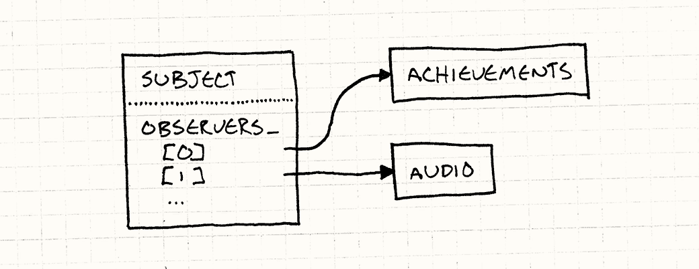
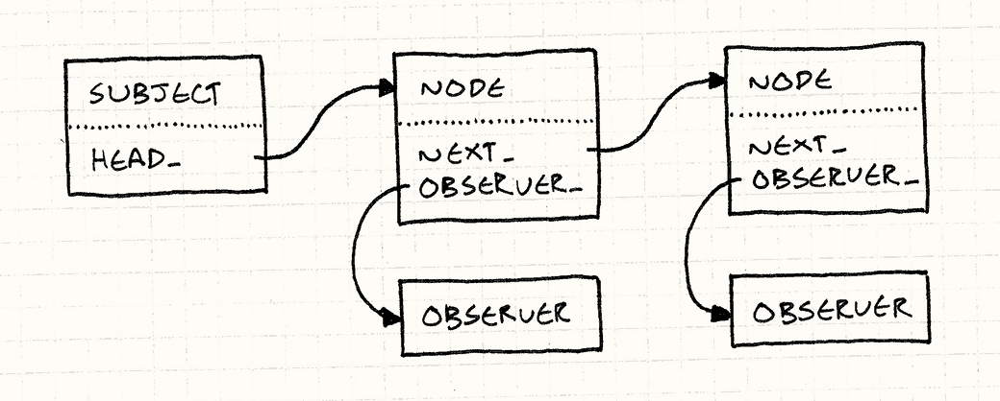

# 观察者模式

## 游戏设计模式 Design Patterns Revisited

随便打开电脑中的一个应用，很有可能它就使用了[MVC 架构](http://en.wikipedia.org/wiki/Model%E2%80%93view%E2%80%93controller)， 而究其根本，是因为观察者模式。 观察者模式应用广泛，Java 甚至将其放到了核心库之中（[`java.util.Observer`](http://docs.oracle.com/javase/7/docs/api/java/util/Observer.html)），而 C#直接将其嵌入了*语法*（[`event`](http://msdn.microsoft.com/en-us/library/8627sbea.aspx)关键字）。

观察者模式是应用最广泛和最广为人知的 GoF 模式，但是游戏开发世界与世隔绝， 所以对你来说，它也许是全新的。 假设你与世隔绝，让我给你举个形象的例子。

## 成就解锁

假设我们向游戏中添加了成就系统。 它存储了玩家可以完成的各种各样的成就，比如“杀死 1000 只猴子恶魔”，“从桥上掉下去”，或者“一命通关”。

要实现这样一个包含各种行为来解锁成就的系统是很有技巧的。 如果我们不够小心，成就系统会缠绕在代码库的每个黑暗角落。 当然，“从桥上掉落”和物理引擎相关， 但我们并不想看到的在处理撞击代码的线性代数时， 有个对`unlockFallOffBridge()`的调用是不？

我们喜欢的是，照旧，让关注游戏一部分的所有代码集成到一块。 挑战在于，成就在游戏的不同层面被触发。怎么解耦成就系统和其他部分呢？

这就是观察者模式出现的原因。 这让代码宣称有趣的事情发生了，*而不必关心到底是谁接受了通知。*

举个例子，有物理代码处理重力，追踪哪些物体待在地表，哪些坠入深渊。 为了实现“桥上掉落”的徽章，我们可以直接把成就代码放在那里，但那就会一团糟。 相反，可以这样做：

```
void Physics::updateEntity(Entity& entity)
{
  bool wasOnSurface = entity.isOnSurface();
  entity.accelerate(GRAVITY);
  entity.update();
  if (wasOnSurface && !entity.isOnSurface())
  {
    notify(entity, EVENT_START_FALL);
  }
} 
```

它做的就是声称，“额，我不知道有谁感兴趣，但是这个东西刚刚掉下去了。做你想做的事吧。”

成就系统注册它自己为观察者，这样无论何时物理代码发送通知，成就系统都能收到。 它可以检查掉落的物体是不是我们的失足英雄， 他之前有没有做过这种不愉快的与桥的经典力学遭遇。 如果满足条件，就伴着礼花和炫光解锁合适的成就，而这些都无需牵扯到物理代码。

事实上，我们可以改变成就的集合或者删除整个成就系统，而不必修改物理引擎。 它仍然会发送它的通知，哪怕实际没有东西接收。

## 它如何运作

如果你还不知道如何实现这个模式，你可能可以从之前的描述中猜到，但是为了减轻你的负担，我还是过一遍代码吧。

### 观察者

我们从那个需要知道别的对象做了什么事的类开始。 这些好打听的对象用如下接口定义：

```
class Observer
{
public:
  virtual ~Observer() {}
  virtual void onNotify(const Entity& entity, Event event) = 0;
}; 
```

任何实现了这个的具体类就成为了观察者。 在我们的例子中，是成就系统，所以我们可以像这样实现：

```
class Achievements : public Observer
{
public:
  virtual void onNotify(const Entity& entity, Event event)
  {
    switch (event)
    {
    case EVENT_ENTITY_FELL:
      if (entity.isHero() && heroIsOnBridge_)
      {
        unlock(ACHIEVEMENT_FELL_OFF_BRIDGE);
      }
      break;

      // 处理其他事件，更新 heroIsOnBridge_ 变量……
    }
  }

private:
  void unlock(Achievement achievement)
  {
    // 如果还没有解锁，那就解锁成就……
  }

  bool heroIsOnBridge_;
}; 
```

### 被观察者

被观察的对象拥有通知的方法函数，用 GoF 的说法，那些对象被称为“主题”。 它有两个任务。首先，它有一个列表，保存默默等它通知的观察者：

```
class Subject
{
private:
  Observer* observers_[MAX_OBSERVERS];
  int numObservers_;
}; 
```

重点是被观察者暴露了*公开的*API 来修改这个列表：

```
class Subject
{
public:
  void addObserver(Observer* observer)
  {
    // 添加到数组中……
  }

  void removeObserver(Observer* observer)
  {
    // 从数组中移除……
  }

  // 其他代码……
}; 
```

这就允许了外界代码控制谁接收通知。 被观察者与观察者交流，但是不与它们*耦合*。 在我们的例子中，没有一行物理代码会提及成就。 但它仍然可以与成就系统交流。这就是这个模式的聪慧之处。

被观察者有一*列表*观察者而不是单个观察者也是很重要的。 这保证了观察者不会相互干扰。 举个例子，假设音频引擎也需要观察坠落事件来播放合适的音乐。 如果客体只支持单个观察者，当音频引擎注册时，就会*取消*成就系统的注册。

这意味着这两个系统需要相互交互——而且是用一种极其糟糕的方式， 第二个注册时会使第一个的注册失效。 支持一列表的观察者保证了每个观察者都是被独立处理的。 就它们各自的视角来看，自己是这世界上唯一看着被观察者的。

被观察者的剩余任务就是发送通知：

```
class Subject
{
protected:
  void notify(const Entity& entity, Event event)
  {
    for (int i = 0; i < numObservers_; i++)
    {
      observers_[i]->onNotify(entity, event);
    }
  }

  // 其他代码…………
}; 
```

### 可被观察的物理系统

现在，我们只需要给物理引擎和这些挂钩，这样它可以发送消息， 成就系统可以和引擎连线来接受消息。 我们按照传统的*设计模式*方法实现，继承`Subject`：

```
class Physics : public Subject
{
public:
  void updateEntity(Entity& entity);
}; 
```

这让我们将`notify()`实现为了`Subject`内的保护方法。 这样派生的物理引擎类可以调用并发送通知，但是外部的代码不行。 同时，`addObserver()`和`removeObserver()`是公开的， 所以任何可以接触物理引擎的东西都可以观察它。

现在，当物理引擎做了些值得关注的东西，它调用`notify()`，就像之前的例子。 它遍历了观察者列表，通知所有观察者。



很简单，对吧？只要一个类管理一列表指向接口实例的指针。 难以置信的是，如此直观的东西是无数程序和应用框架交流的主心骨。

观察者模式不是完美无缺的。当我问其他程序员怎么看，他们提出了一些抱怨。 让我们看看可以做些什么来处理这些抱怨。

## 太慢了

我经常听到这点，通常是从那些不知道模式具体细节的程序员那里。 他们有一种假设，任何东西只要沾到了“设计模式”，那么一定包含了一堆类，跳转和浪费 CPU 循环其他行为。

观察者模式的名声特别坏，一些坏名声的事物与它如影随形， 比如“事件”，“消息”，甚至“数据绑定”。 其中的一些系统*确实会*慢。（通常是故意的，出于好的意图）。 他们使用队列，或者为每个通知动态分配内存。

现在你看到了模式是如何真正被实现的， 你知道事实并不如他们所想的这样。 发送通知只需简单地遍历列表，调用一些虚方法。 是的，这比静态调用慢*一点*，除非是性能攸关的代码，否则这点消耗都是微不足道的。

我发现这个模式在代码性能瓶颈以外的地方能有很好的应用， 那些你可以承担动态分配消耗的地方。 除那以外，使用它几乎毫无限制。 我们不必为消息分配对象，也无需使用队列。这里只多了一个用在同步方法调用上的额外跳转。

### 太*快*？

事实上，你得小心，观察者模式*是*同步的。 被观察者直接调用了观察者，这意味着直到所有观察者的通知方法返回后， 被观察者才会继续自己的工作。观察者会阻塞被观察者的运行。

这听起来很疯狂，但在实践中，这可不是世界末日。 这只是值得注意的事情。 UI 程序员——那些使用基于事件的编程的程序员已经这么干了很多年了——有句经典名言：“远离 UI 线程”。

如果要对事件同步响应，你需要完成响应，尽可能快的返回，这样 UI 就不会锁死。 当你有耗时的操作要执行时，将这些操作推到另一个线程或工作队列中去。

你需要小心地在观察者中混合线程和锁。 如果观察者试图获得被观察者拥有的锁，游戏就进入死锁了。 在多线程引擎中，你最好使用事件队列来做异步通信。

## “它做了太多动态分配”

整个程序员社区——包括很多游戏开发者——转向了拥有垃圾回收机制的语言， 动态分配今昔非比。 但在像游戏这样性能攸关的软件中，哪怕是在有垃圾回收机制的语言，内存分配也依然重要。 动态分配需要时间，回收内存也需要时间，哪怕是自动运行的。

在上面的示例代码中，我使用的是定长数组，因为我想尽可能保证简单。 在真实的项目中中，观察者列表随着观察者的添加和删除而动态地增长和缩短。 这种内存的分配吓坏了一些人。

当然，第一件需要注意的事情是只在观察者加入时分配内存。 *发送* 通知无需内存分配——只需一个方法调用。 如果你在游戏一开始就加入观察者而不乱动它们，分配的总量是很小的。

如果这仍然困扰你，我会介绍一种无需任何动态分配的方式来增加和删除观察者。

### 链式观察者

我们现在看到的所有代码中，`Subject`拥有一列指针指向观察它的`Observer`。 `Observer`类本身没有对这个列表的引用。 它是纯粹的虚接口。优先使用接口，而不是有状态的具体类，这大体上是一件好事。

但是如果我们*确实*愿意在`Observer`中放一些状态， 我们可以将观察者的列表分布到*观察者自己*中来解决动态分配问题。 不是被观察者保留一列表分散的指针，观察者对象本身成为了链表中的一部分：


为了实现这一点，我们首先要摆脱`Subject`中的数组，然后用链表头部的指针取而代之：

```
class Subject
{
  Subject()
  : head_(NULL)
  {}

  // 方法……
private:
  Observer* head_;
}; 
```

然后，我们在`Observer`中添加指向链表中下一观察者的指针。

```
class Observer
{
  friend class Subject;

public:
  Observer()
  : next_(NULL)
  {}

  // 其他代码……
private:
  Observer* next_;
}; 
```

这里我们也让`Subject`成为了友类。 被观察者拥有增删观察者的 API，但是现在链表在`Observer`内部管理。 最简单的实现办法就是让被观察者类成为友类。

注册一个新观察者就是将其连到链表中。我们用更简单的实现方法，将其插到开头：

```
void Subject::addObserver(Observer* observer)
{
  observer->next_ = head_;
  head_ = observer;
} 
```

另一个选项是将其添加到链表的末尾。这么做增加了一定的复杂性。 `Subject`要么遍历整个链表来找到尾部，要么保留一个单独`tail_`指针指向最后一个节点。

加在在列表的头很简单，但也有另一副作用。 当我们遍历列表给每个观察者发送一个通知， 最*新*注册的观察者最*先*接到通知。 所以如果以 A，B，C 的顺序来注册观察者，它们会以 C，B，A 的顺序接到通知。

理论上，这种还是那种方式没什么差别。 在好的观察者设计中，观察同一被观察者的两个观察者互相之间不该有任何顺序相关。 如果顺序*确实*有影响，这意味着这两个观察者有一些微妙的耦合，最终会害了你。

让我们完成删除操作：

```
void Subject::removeObserver(Observer* observer)
{
  if (head_ == observer)
  {
    head_ = observer->next_;
    observer->next_ = NULL;
    return;
  }

  Observer* current = head_;
  while (current != NULL)
  {
    if (current->next_ == observer)
    {
      current->next_ = observer->next_;
      observer->next_ = NULL;
      return;
    }

    current = current->next_;
  }
} 
```

因为使用的是链表，所以我们得遍历它才能找到要删除的观察者。 如果我们使用普通的数组，也得做相同的事。 如果我们使用*双向*链表，每个观察者都有指向前面和后面的指针， 就可以用常量时间移除观察者。在实际项目中，我会这样做。

剩下的事情只有发送通知了，这和遍历列表同样简单；

```
void Subject::notify(const Entity& entity, Event event)
{
  Observer* observer = head_;
  while (observer != NULL)
  {
    observer->onNotify(entity, event);
    observer = observer->next_;
  }
} 
```

不差嘛，对吧？被观察者现在想有多少观察者就有多少观察者，无需动态内存。 注册和取消注册就像使用简单数组一样快。 但是，我们牺牲了一些小小的功能特性。

由于我们使用观察者对象作为链表节点，这暗示它只能存在于一个观察者链表中。 换言之，一个观察者一次只能观察一个被观察者。 在传统的实现中，每个被观察者有独立的列表，一个观察者同时可以存在于多个列表中。

你也许可以接受这一限制。 通常是一个*被观察者*有多个*观察者*，反过来就很少见了。 如果这*真是*一个问题，这里还有一种不必使用动态分配的解决方案。 详细介绍的话，这章就太长了，但我会大致描述一下，其余的你可以自行填补……

### 链表节点池

就像之前，每个被观察者有一链表的观察者。 但是，这些链表节点不是观察者本身。 相反，它们是分散的小“链表节点”对象， 包含了指向观察者的指针和指向链表下一节点的指针。



由于多个节点可以指向同一观察者，这就意味着观察者可以同时在超过多个被观察者的列表中。 我们可以同时观察多个对象了。

避免动态分配的方法很简单：由于这些节点都是同样大小和类型， 可以预先在对象池中分配它们。 这样你只需处理固定大小的列表节点，可以随你所需使用和重用， 而无需牵扯到真正的内存分配器。

## 剩余的问题

我认为三个该模式将人们吓阻的主要问题已经被搞定了。 它简单，快速，对内存管理友好。 但是这意味着你总该使用观察者吗？

现在，这是另一个的问题。 就像所有的设计模式，观察者模式不是万能药。 哪怕可以正确高效的实现，它也不一定是好的解决方案。 设计模式有坏名声的原因之一就是人们将好模式用在错问题上，得到了糟糕的结果。

还有两个挑战，一个是关于技术，另一个更偏向是可维护性。 我们先处理关于技术的挑战，因为关于技术的问题总是更容易处理。

### 销毁被观察者和观察者

我们看到的样例代码健壮可用，但有一个严重的副作用： 当删除一个被观察者或观察者时会发生什么？ 如果你不小心的在某些观察者上面调用了`delete`，被观察者也许仍然持有指向它的指针。 那是一个指向一片已释放区域的悬挂指针。 当被观察者试图发送一个通知，额……就说发生的事情会出乎你的意料之外吧。

删除被观察者更容易些，因为在大多数实现中，观察者没有对它的引用。 但是即使这样，将被观察者所占的字节直接回收也许会造成一些问题。 这些观察者也许仍然期待在以后收到通知，而这是不可能的了。 它们没法继续观察了，真的，它们只是认为它们可以。

你可以用好几种方式处理这点。 最简单的就是像我做的那样，以后一脚踩空。 在被删除时取消注册是观察者的职责。 多数情况下，观察者*确实*知道它在观察哪个被观察者， 所以通常需要做的只是给它的析构器添加一个`removeObserver()`。

如果在删除被观察者时，你不想让观察者处理问题，这也很好解决。 只需要让被观察者在它被删除前发送一个最终的“死亡通知”。 这样，任何观察者都可以接收到，然后做些合适的行为。

人——哪怕是那些花费在大量时间在机器前，拥有让我们黯然失色才能的人——也是绝对地不可靠。 这就是为什么我们发明了电脑：它们不像我们那样经常犯错误。

更安全的方案是在每个被观察者销毁时，让观察者自动取消注册。 如果你在观察者基类中实现了这个逻辑，每个人不必记住就可以使用它。 这确实增加了一定的复杂度。 这意味着每个*观察者*都需要有它在观察的*被观察者*的列表。 最终维护一个双向指针。

### 别担心，我有垃圾回收器

你们那些装备有垃圾回收系统的孩子现在一定很洋洋自得。 觉得你不必担心这个，因为你从来不必显式删除任何东西？再仔细想想！

想象一下：你有 UI 显示玩家角色情况的状态，比如健康和道具。 当玩家在屏幕上时，你为其初始化了一个对象。 当 UI 退出时，你直接忘掉这个对象，交给 GC 清理。

每当角色脸上（或者其他什么地方）挨了一拳，就发送一个通知。 UI 观察到了，然后更新健康槽。很好。 当玩家离开场景，但你没有取消观察者的注册，会发生什么？

UI 界面不再可见，但也不会进入垃圾回收系统，因为角色的观察者列表还保存着对它的引用。 每一次场景加载后，我们给那个不断增长的观察者列表添加一个新实例。

玩家玩游戏时，来回跑动，打架，角色的通知发送给*所有*的界面。 它们不在屏幕上，但它们接受通知，这样就浪费 CPU 循环在不可见的 UI 元素上了。 如果它们会播放声音之类的，这样的错误就会被人察觉。

这在通知系统中非常常见，甚至专门有个名字：*失效监听者问题*。 由于被观察者保留了对观察者的引用，最终有 UI 界面对象僵死在内存中。 这里的教训是要及时删除观察者。

### 然后呢？

观察者的另一个深层次问题是它意图直接导致的。 我们使用它是因为它帮助我们放松了两块代码之间的耦合。 它让观察者与没有静态绑定的观察者间接交流。

当你要理解被观察者的行为时，这很有价值，任何不相关的事情都是在分散注意力。 如果你在处理物理引擎，你根本不想要编辑器——或者你的大脑——被一堆成就系统的东西而搞糊涂。

另一方面，如果你的程序没能运行，漏洞散布在多个观察者之间，理清信息流变得更加困难。 显式耦合中更易于查看哪一个方法被调用了。 这是因为耦合是静态的，IDE 分析它轻而易举。

但是如果耦合发生在观察者列表中，想要知道哪个观察者被通知到了，唯一的办法是看看哪个观察者在列表中，而且*处于运行中*。 不再是理清程序的*静态*交流结构，你得理清它的*命令式，动态*行为。

如何处理这个的指导原则很简单。 如果为了理解程序的一部分，两个交流的模块*都*需要考虑， 那就不要使用观察者模式，使用其他更加显式的东西。

当你在某些大型程序上用黑魔法时，你会感觉这样处理很笨拙。 我们有很多术语用来描述，比如“关注点分离”，“一致性和内聚性”和“模块化”， 总归就是“这些东西待在一起，而不是与那些东西待在一起。”

观察者模式是一个让这些不相关的代码块互相交流，而不必打包成更大块的好方法。 这在专注于一个特性或层面的单一代码块*内*不会太有用。

这就是为什么它能很好地适应我们的例子： 成就和物理是几乎完全不相干的领域，通常被不同人实现。 我们想要它们之间的交流最小化， 这样无论在哪一个上工作都不需要另一个的太多信息。

## 今日观察者

*设计模式*源于 1994。 那时候，面向对象语言*正是* 热门的编程范式。 每个程序员都想要“30 天学会面向对象编程”， 中层管理员根据程序员创建类的数量为他们支付工资。 工程师通过继承层次的深度评价代码质量。

观察者模式在那个时代中很流行，所以构建它需要很多类就不奇怪了。 但是现代的主流程序员更加适应函数式语言。 实现一整套接口只是为了接受一个通知不再符合今日的美学了。

它看上去是又沉重又死板。它*确实*又沉重又死板。 举个例子，在观察者类中，你不能为不同的被观察者调用不同通知方法。

现代的解决办法是让“观察者”只是对方法或者函数的引用。 在函数作为第一公民的语言中，特别是那些有闭包的， 这种实现观察者的方式更为普遍。

举个例子，C#有“事件”嵌在语言中。 通过这样，观察者是一个“委托”， （“委托”是方法的引用在 C#中的术语）。 在 JavaScript 事件系统中，观察者*可以*是支持了特定`EventListener`协议的类， 但是它们也可以是函数。 后者是人们常用的方式。

如果设计今日的观察者模式，我会让它基于函数而不是基于类。 哪怕是在 C++中，我倾向于让你注册一个成员函数指针作为观察者，而不是`Observer`接口的实例。

## 明日观察者

事件系统和其他类似观察者的模式如今遍地都是。 它们都是成熟的方案。 但是如果你用它们写一个稍微大一些的应用，你会发现一件事情。 在观察者中很多代码最后都长得一样。通常是这样：

1.  获知有状态改变了。
2.  下命令改变一些 UI 来反映新的状态。

就是这样，“哦，英雄的健康现在是 7 了？让我们把血条的宽度设为 70 像素。 过上一段时间，这会变得很沉闷。 计算机科学学术界和软件工程师已经用了*很长*时间尝试结束这种状况了。 这些方式被赋予了不同的名字：“数据流编程”，“函数反射编程”等等。

即使有所突破，一般也局限在特定的领域中，比如音频处理或芯片设计，我们还没有找到万能钥匙。 与此同时，一个更脚踏实地的方式开始获得成效。那就是现在的很多应用框架使用的“数据绑定”。

不像激进的方式，数据绑定不再指望完全终结命令式代码， 也不尝试基于巨大的声明式数据图表架构整个应用。 它做的只是自动改变 UI 元素或计算某些数值来反映一些值的变化。

就像其他声明式系统，数据绑定也许太慢，嵌入游戏引擎的核心也太复杂。 但是如果说它不会侵入游戏不那么性能攸关的部分，比如 UI，那我会很惊讶。

与此同时，经典观察者模式仍然在那里等着我们。 是的，它不像其他的新热门技术一样在名字中填满了“函数”“反射”， 但是它超简单而且能正常工作。对我而言，这通常是解决方案最重要的条件。