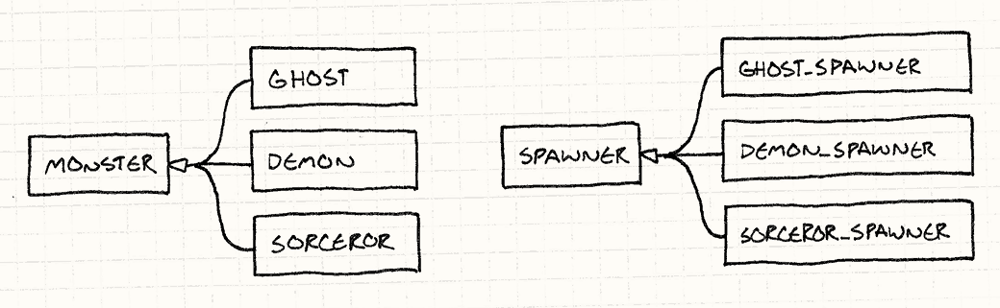
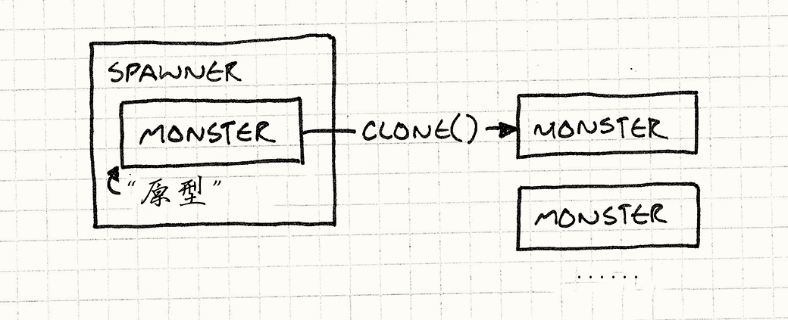
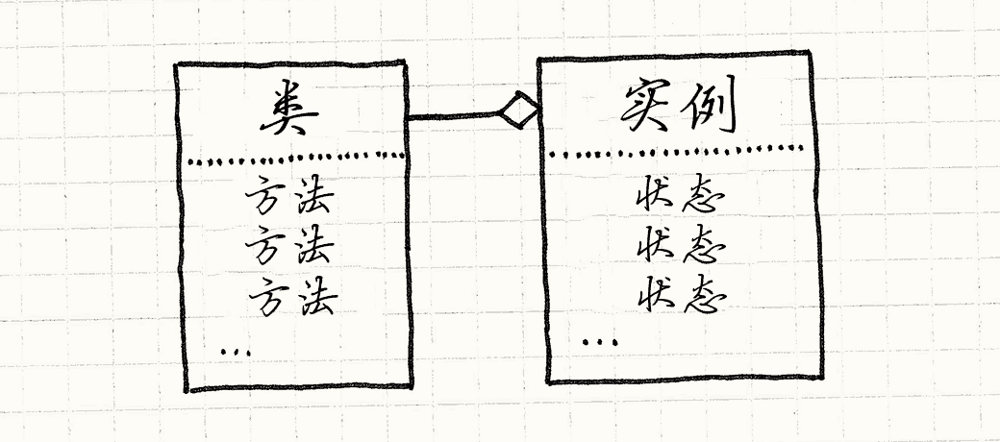
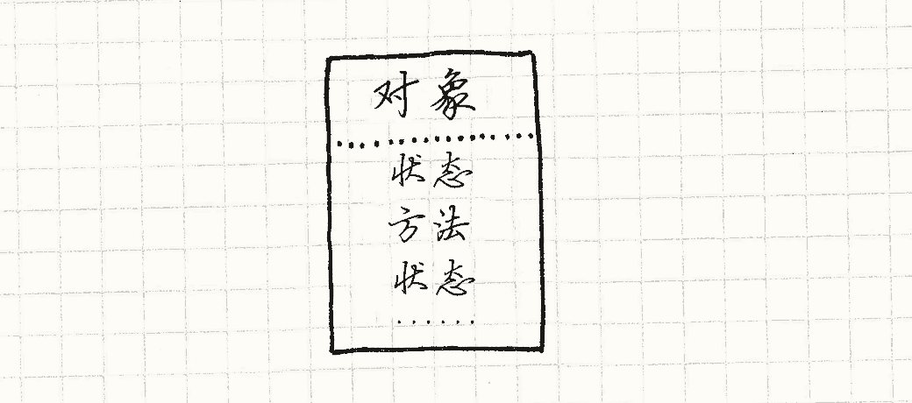
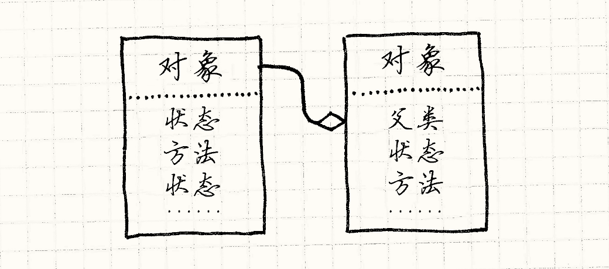
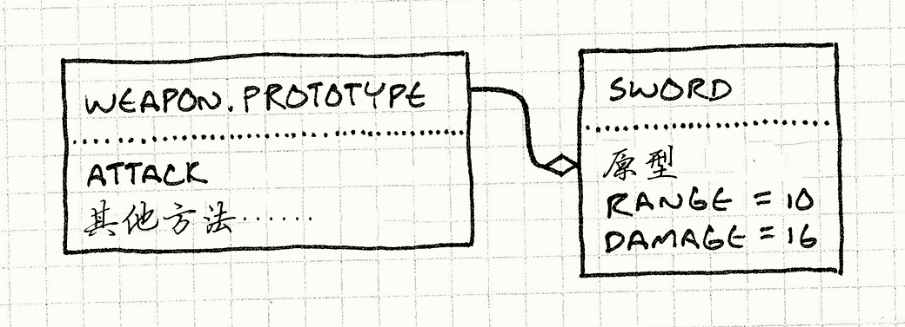

# 原型模式

## 游戏设计模式 Design Patterns Revisited

我第一次听到“原型”这个词是在*设计模式*中。 如今，似乎每个人都在用这个词，但他们讨论的实际不是[设计模式](http://en.wikipedia.org/wiki/Prototype_pattern)。 我们会讨论他们所说的原型，也会讨论术语“原型”的有趣之处，和其背后的理念。 但首先，让我们重访传统的设计模式。

## 原型设计模式

假设我们要用《圣铠传说》的风格做款游戏。 野兽和恶魔围绕着英雄，争着要吃他的血肉。 这些可怖的同行者通过“生产者”进入这片区域，每种敌人有不同的生产者。

在这个例子中，假设我们游戏中每种怪物都有不同的类——`Ghost`，`Demon`，`Sorcerer`等等，像这样：

```
class Monster
{
  // 代码……
};

class Ghost : public Monster {};
class Demon : public Monster {};
class Sorcerer : public Monster {}; 
```

生产者构造特定种类怪物的实例。 为了在游戏中支持每种怪物，我们*可以*用一种暴力的实现方法， 让每个怪物类都有生产者类，得到平行的类结构：



实现后看起来像是这样：

```
class Spawner
{
public:
  virtual ~Spawner() {}
  virtual Monster* spawnMonster() = 0;
};

class GhostSpawner : public Spawner
{
public:
  virtual Monster* spawnMonster()
  {
    return new Ghost();
  }
};

class DemonSpawner : public Spawner
{
public:
  virtual Monster* spawnMonster()
  {
    return new Demon();
  }
};

// 你知道思路了…… 
```

除非你会根据代码数量来获得工资， 否则将这些焊在一起很明显不是好方法。 众多类，众多引用，众多冗余，众多副本，众多重复自我……

原型模式提供了一个解决方案。 关键思路是*一个对象可以产出与它自己相近的对象。* 如果你有一个恶灵，你可以制造更多恶灵。 如果你有一个恶魔，你可以制造其他恶魔。 任何怪物都可以被视为*原型*怪物，产出其他版本的自己。

为了实现这个功能，我们给基类`Monster`一个抽象方法`clone()`：

```
class Monster
{
public:
  virtual ~Monster() {}
  virtual Monster* clone() = 0;

  // 其他代码……
}; 
```

每个怪兽子类提供一个特定实现，返回与它自己的类和状态都完全一样的新对象。举个例子：

```
class Ghost : public Monster {
public:
  Ghost(int health, int speed)
  : health_(health),
    speed_(speed)
  {}

  virtual Monster* clone()
  {
    return new Ghost(health_, speed_);
  }

private:
  int health_;
  int speed_;
}; 
```

一旦我们所有的怪物都支持这个， 我们不再需要为每个怪物类创建生产者类。我们只需定义一个类：

```
class Spawner
{
public:
  Spawner(Monster* prototype)
  : prototype_(prototype)
  {}

  Monster* spawnMonster()
  {
    return prototype_->clone();
  }

private:
  Monster* prototype_;
}; 
```

它内部存有一个怪物，一个隐藏的怪物， 它唯一的任务就是被生产者当做模板，去产生更多一样的怪物， 有点像一个从来不离开巢穴的蜂后。



为了得到恶灵生产者，我们创建一个恶灵的原型实例，然后创建拥有这个实例的生产者：

```
Monster* ghostPrototype = new Ghost(15, 3);
Spawner* ghostSpawner = new Spawner(ghostPrototype); 
```

这个模式的灵巧之处在于它不但拷贝原型的*类*，也拷贝它的*状态*。 这就意味着我们可以创建一个生产者，生产快速鬼魂，虚弱鬼魂，慢速鬼魂，而只需创建一个合适的原型鬼魂。

我在这个模式中找到了一些既优雅又令人惊叹的东西。 我无法想象自己是如何创造出它们的，但我更无法想象*不知道*这些东西的自己该如何是好。

### 效果如何？

好吧，我们不需要为每个怪物创建单独的生产者类，那很好。 但我们*确实*需要在每个怪物类中实现`clone()`。 这和使用生产者方法比起来也没节约多少代码量。

当你坐下来试着写一个正确的`clone()`，会遇见令人不快的语义漏洞。 做深层拷贝还是浅层拷贝呢？换言之，如果恶魔拿着叉子，克隆恶魔也要克隆叉子吗？

同时，这看上去没减少已存问题上的代码， 事实上还增添了些*人为的问题*。 我们需要将每个怪物有独立的类作为前提条件。 这绝对*不是*当今大多数游戏引擎运作的方法。

我们中大部分痛苦地学到，这样庞杂的类层次管理起来很痛苦， 那就是我们为什么用组件模式和类型对象为不同的实体建模，这样无需一一建构自己的类。

### 生产函数

哪怕我们确实需要为每个怪物构建不同的类，这里还有其他的实现方法。 不是使用为每个怪物建立分离的生产者*类*，我们可以创建生产*函数*，就像这样：

```
Monster* spawnGhost()
{
  return new Ghost();
} 
```

这比构建怪兽生产者类更简洁。生产者类只需简单地存储一个函数指针：

```
typedef Monster* (*SpawnCallback)();

class Spawner
{
public:
  Spawner(SpawnCallback spawn)
  : spawn_(spawn)
  {}

  Monster* spawnMonster()
  {
    return spawn_();
  }

private:
  SpawnCallback spawn_;
}; 
```

为了给恶灵构建生产者，你需要做：

```
Spawner* ghostSpawner = new Spawner(spawnGhost); 
```

### 模板

如今，大多数 C++开发者已然熟悉模板了。 生产者类需要为某类怪物构建实例，但是我们不想硬编码是哪类怪物。 自然的解决方案是将它作为模板中的*类型参数*：

```
class Spawner
{
public:
  virtual ~Spawner() {}
  virtual Monster* spawnMonster() = 0;
};

template <class T>
class SpawnerFor : public Spawner
{
public:
  virtual Monster* spawnMonster() { return new T(); }
}; 
```

像这样使用它：

```
Spawner* ghostSpawner = new SpawnerFor<Ghost>(); 
```

### 第一公民类型

前面的两个解决方案使用类完成了需求，`Spawner`使用类型进行参数化。 在 C++中，类型不是第一公民，所以需要一些改动。 如果你使用 JavaScript，Python，或者 Ruby 这样的动态类型语言， 它们的类*是*可以传递的对象，你可以用更直接的办法解决这个问题。

当你完成一个生产者，直接向它传递要构建的怪物类——那个代表了怪物类的运行时对象。超容易的，对吧。

综上所述，老实说，我不能说找到了一种情景，而在这个情景下，原型*设计模式*是最好的方案。 也许你的体验有所不同，但现在把它搁到一边，我们讨论点别的：将原型作为一种*语言范式*。

## 原型语言范式

很多人认为“面向对象编程”和“类”是同义词。 OOP 的定义却让人感觉正好相反， 毫无疑问，*OOP 让你定义“对象”，将数据和代码绑定在一起。* 与 C 这样的结构化语言相比，与 Scheme 这样的函数语言相比， OOP 的特性是它将状态和行为紧紧地绑在一起。

你也许认为类是完成这个的唯一方式方法， 但是包括 Dave Ungar 和 Randall Smith 的一大堆家伙一直在拼命区分 OOP 和类。 他们在 80 年代创建了一种叫做 Self 的语言。它不用类实现了 OOP。

### Self 语言

就单纯意义而言，Self 比基于类的语言*更加*面向对象。 我们认为 OOP 将状态和行为绑在一起，但是基于类的语言实际将状态和行为割裂开来。

拿你最喜欢的基于类的语言的语法来说。 为了接触对象中的一些状态，你需要在实例的内存中查询。状态*包含*在实例中。

但是，为了调用方法，你需要找到实例的类， 然后在*那里*调用方法。行为包含在*类*中。 获得方法总需要通过中间层，这意味着字段和方法是不同的。



Self 结束了这种分歧。*无论你要找啥*，都只需在对象中找。 实例同时包含状态和行为。你可以构建拥有完全独特方法的对象。



如果这就是 Self 语言的全部，那它将很难使用。 基于类的语言中的继承，不管有多少缺陷，给了有用的机制来重用代码，避免重复。 为了不使用类而实现一些类似的功能，Self 语言加入了*委托*。

如果要在对象中寻找字段或者调用方法，首先在对象内部查找。 如果能找到，那就成了。如果找不到，在对象的*父对象*中寻找。 这里的父类仅仅是一个对其他对象的引用。 当我们没能在第一个对象中找到属性，我们尝试它的父对象，然后父类的父对象，继续下去直到找到或者没有父对象为止。 换言之，失败的查找被*委托*给对象的父对象。



父对象让我们在不同对象间重用行为（还有状态！），这样就完成了类的公用功能。 类做的另一个关键事情就是给出了创建实例的方法。 当你需要新的某物，你可以直接`new Thingamabob()`，或者随便什么你喜欢的表达法。 类是实例的生产工厂。

不用类，我们怎样创建新的实例？ 特别的，我们如何创建一堆有共同点的新东西？ 就像这个设计模式，在 Self 中，达到这点的方式是使用*克隆*。

在 Self 语言中，就好像*每个*对象都自动支持原型设计模式。 任何对象都能被克隆。为了获得一堆相似的对象，你：

1.  将对象塑造成你想要的状态。你可以直接克隆系统内建的基本`Object`，然后向其中添加字段和方法。
2.  克隆它来产出……额……随你想要多少就克隆多少个对象。

无需烦扰自己实现`clone()`；我们就实现了优雅的原型模式，原型被内建在系统中。

这个系统美妙，灵巧，而且小巧， 一听说它，我就开始创建一个基于原型的语言来进一步学习。

### 它的实际效果如何？

能使用纯粹基于原型的语言让我很兴奋，但是当我真正上手时， 我发现了一个令人不快的事实：用它编程没那么有趣。

是的，语言本身很容易实现，那是因为它把复杂度甩给了用户。 一旦开始试着使用这语言，我发现我想念基于类语言中的层次结构。 最终，在构建语言缺失的库概念时，我放弃了。

鉴于我之前的经验都来自基于类的语言，因此我的头脑可能已经固定在它的范式上了。 但是直觉上，我认为大部分人还是喜欢有清晰定义的“事物”。

除去基于类语言自身的成功以外，看看有多少游戏用类建模描述玩家角色，以及不同的敌人、物品、技能。 不是游戏中的每个怪物都与众不同，你不会看到“洞穴人和哥布林还有雪混合在一起”这样的怪物。

原型是非常酷的范式，我希望有更多人了解它， 但我很庆幸不必天天用它编程。 完全皈依原型的代码是一团浆糊，难以阅读和使用。

### JavaScript 又怎么样呢？

好吧，如果基于原型的语言不那么友好，怎么解释 JavaScript 呢？ 这是一个有原型的语言，每天被数百万人使用。运行 JavaScript 的机器数量超过了地球上其他所有的语言。

Brendan Eich，JavaScript 的缔造者， 从 Self 语言中直接汲取灵感，很多 JavaScript 的语义都是基于原型的。 每个对象都有属性的集合，包含字段和“方法”（事实上只是存储为字段的函数）。 A 对象可以拥有 B 对象，B 对象被称为 A 对象的“原型”， 如果 A 对象的字段获取失败就会委托给 B 对象。

但除那以外，我相信在实践中，JavaScript 更像是基于类的而不是基于原型的语言。 一个要点是 JavaScript 移除了一些基

在 JavaScript 中没有方法来克隆一个对象。 最接近的方法是`Object.create()`，允许你创建新对象作为现有对象的委托。 这个方法在 ECMAScript5 中才添加，而那已是 JavaScript 出现后的十四年了。 相对于克隆，让我带你参观一下 JavaScript 中定义类和创建对象的经典方法。 我们从*构造器函数*开始：

```
function Weapon(range, damage) {
  this.range = range;
  this.damage = damage;
} 
```

这创建了一个新对象，初始化了它的字段。你像这样引入它：

```
var sword = new Weapon(10, 16); 
```

这里的`new`调用`Weapon()`函数，而`this`绑定在新的空对象上。 函数为新对象添加了一系列字段，然后返回填满的对象。

`new`也为你做了另外一件事。 当它创建那个新的空对象时，它将空对象的委托和一个原型对象连接起来。 你可以用`Weapon.prototype`来获得原型对象。

在构造器中添加属性，而通常向原型对象添加方法来定义*行为*。就像这样：

```
Weapon.prototype.attack = function(target) {
  if (distanceTo(target) > this.range) {
    console.log("Out of range!");
  } else {
    target.health -= this.damage;
  }
} 
```

这给武器原型添加了`attack`属性，其值是一个函数。 由于`new Weapon()`返回的每一个对象都有给`Weapon.prototype`的委托， 你现在可以调用`sword.attack()`，这样调用那个函数。 看上去像是这样：



让我们复习一下：

*   通过“new”操作创建对象，该操作引入代表类型的对象——构造器函数。
*   状态存储在实例中。
*   行为通过间接层——原型的委托——被存储在独立的对象中，代表了一系列特定类型对象的共享方法。

说我疯了吧，但这听起来很像是我之前描述的类。 你*可以*在 JavaScript 中写原型风格的代码（*不用* 克隆）， 但是就语法和惯用法更推荐基于类的实现。

个人而言，我认为这是好事。 就像我说的，我发现一切都使用原型，那么很难编写代码， 所以我喜欢 JavaScript，它将整个核心语义包上了一层糖衣。

## 为数据模型构建原型

好吧，我之前不断的讨论我*不喜欢*原型的原因，这让这一章读起来令人沮丧。 我认为这本书该更欢乐些，所以在最后，让我们讨论讨论原型*确实*有用，或者更加精确，*委托* 有用的地方。

随着编程的进行，如果你比较程序与数据的字节数， 那么你会发现数据的占比稳定地增长。 早期的游戏在程序中生成几乎所有东西，这样程序可以塞进磁盘和老式游戏卡带。 在今日的游戏中，代码只是驱动游戏的“引擎”，游戏是完全由数据定义的。

这很好，但是将内容推到数据文件中并不能魔术般解决组织大项目的挑战。 它只能把这挑战变得更难。 我们使用编程语言就因为它们有办法管理复杂性。

不再是将一堆代码拷来拷去，我们将其移入函数中，通过名字调用。 不再是在一堆类之间复制方法，我们将其放入单独的类中，让其他类可以继承或者组合。

当游戏数据达到一定规模时，你真的需要考虑一些相似的方案。 我不指望在这里能说清数据模式这个问题， 但我确实希望提出个思路，让你在游戏中考虑考虑：使用原型和委托来重用数据。

假设我们为早先提到的山寨版《圣铠传说》定义数据模型。 游戏设计者需要在很多文件中设定怪物和物品的属性。

一个常用的方法是使用 JSON。 数据实体一般是*字典*，或者*属性集合*，或者其他什么术语， 因为程序员就喜欢为旧事物发明新名字。

所以游戏中的哥布林也许被定义为像这样的东西：

```
{
  "name": "goblin grunt",
  "minHealth": 20,
  "maxHealth": 30,
  "resists": ["cold", "poison"],
  "weaknesses": ["fire", "light"]
} 
```

这看上去很易懂，哪怕是最讨厌文本的设计者也能使用它。 所以，你可以给哥布林大家族添加几个兄弟分支：

```
{
  "name": "goblin wizard",
  "minHealth": 20,
  "maxHealth": 30,
  "resists": ["cold", "poison"],
  "weaknesses": ["fire", "light"],
  "spells": ["fire ball", "lightning bolt"]
}

{
  "name": "goblin archer",
  "minHealth": 20,
  "maxHealth": 30,
  "resists": ["cold", "poison"],
  "weaknesses": ["fire", "light"],
  "attacks": ["short bow"]
} 
```

现在，如果这是代码，我们会闻到了臭味。 在实体间有很多的重复，训练优良的程序员*讨厌*重复。 它浪费了空间，消耗了作者更多时间。 你需要仔细阅读代码才知道这些数据*是不是*相同的。 这难以维护。 如果我们决定让所有哥布林变强，需要记得将三个哥布林都更新一遍。糟糕糟糕糟糕。

如果这是代码，我们会为“哥布林”构建抽象，并在三个哥布林类型中重用。 但是无能的 JSON 没法这么做。所以让我们把它做得更加巧妙些。

我们可以为对象添加`"prototype"`字段，记录委托对象的名字。 如果在此对象内没找到一个字段，那去委托对象中查找。

这样，我们可以简化我们的哥布林 JSON 内容：

```
{
  "name": "goblin grunt",
  "minHealth": 20,
  "maxHealth": 30,
  "resists": ["cold", "poison"],
  "weaknesses": ["fire", "light"]
}

{
  "name": "goblin wizard",
  "prototype": "goblin grunt",
  "spells": ["fire ball", "lightning bolt"]
}

{
  "name": "goblin archer",
  "prototype": "goblin grunt",
  "attacks": ["short bow"]
} 
```

由于弓箭手和术士都将 grunt 作为原型，我们就不需要在它们中重复血量，防御和弱点。 我们为数据模型增加的逻辑超级简单——基本的单一委托——但已经成功摆脱了一堆冗余。

有趣的事情是，我们没有更进一步，把哥布林委托的*抽象*原型设置成“基本哥布林”。 相反，我们选择了最简单的哥布林，然后委托给它。

在基于原型的系统中，对象可以克隆产生新对象是很自然的， 我认为在这里也一样自然。这特别适合记录那些只有一处不同的实体的数据。

想想 Boss 和其他独特的事物，它们通常是更加常见事物的重新定义， 原型委托是定义它们的好方法。 断头魔剑，就是一把拥有加成的长剑，可以像下面这样表示：

```
{
  "name": "Sword of Head-Detaching",
  "prototype": "longsword",
  "damageBonus": "20"
} 
```

只需在游戏引擎上多花点时间，你就能让设计者更加方便的添加不同的武器和怪物，而这些增加的丰富赌能够取悦玩家。