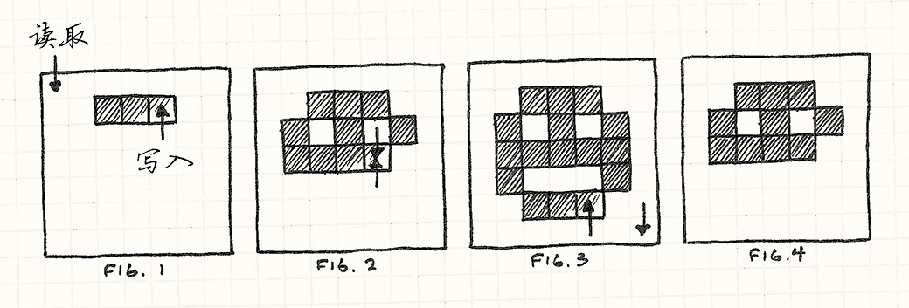
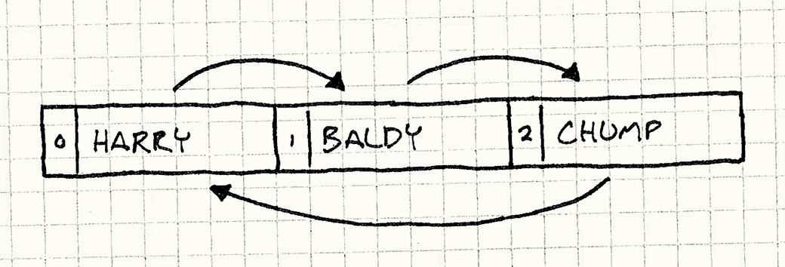
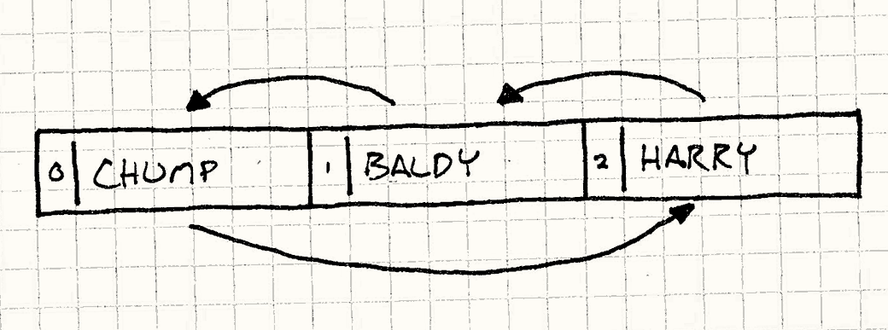

# 双缓冲模式

## 游戏设计模式 Sequencing Patterns

## 意图

*用序列的操作模拟瞬间或者同时发生的事情。*

## 动机

电脑具有强大的序列化处理能力。 它的力量来自于将大的任务分解为小的步骤，这样可以一步接一步的完成。 但是，通常用户需要看到事情发生在瞬间或者让多个任务同时进行。

一个典型的例子，也是每个游戏引擎都得掌控的问题，渲染。 当游戏渲染玩家所见的世界时，它同时需要处理一堆——远处的山，起伏的丘陵，树木，每个都在各自的循环中处理。 如果在用户*观察*时增量做这些，连续世界的幻觉就会被打破。 场景必须快速流畅地更新，显示一系列完整的帧，每帧都是立即出现的。

双缓冲解决了这个问题，但是为了理解其原理，让我们首先的复习下计算机是如何显示图形的。

### 计算机图形系统是如何工作的（概述）

在电脑屏幕上显示图像是一次绘制一个像素点。 它从左到右扫描每行像素点，然后移动至下一行。 当抵达了右下角，它退回左上角重新开始。 它做得飞快——每秒六十次——因此我们的眼睛无法察觉。 对我们来说，这是一整张静态的彩色像素——一张图像。

你可以将整个过程想象为软管向屏幕喷洒像素。 独特的像素从软管的后面流入，然后在屏幕上喷洒，每次对一个像素涂一点颜色。 所以软管怎么知道哪种颜色要喷到哪里？

在大多数电脑上，答案是从*帧缓冲*中获知这些信息。 帧缓冲是内存中的色素数组，RAM 中每两个字节代表表示一个像素点的颜色。 当软管向屏幕喷洒时，它从这个数组中读取颜色值，每次一个字节。

最终，为了让游戏显示在屏幕中，我们需要做的就是写入这个数组。 我们疯狂摆弄的图形算法最终都到了这里：设置帧缓冲中的字节值。 但这里有个小问题。

早先，我说过计算机是顺序处理的。 如果机器在运行一块渲染代码，我们不指望它同时还能做些别的什么事。 这通常是没啥问题，但是有些事*确实*在程序运行时发生。 其中一件是，当游戏运行时，视频输出正在*不断*从帧缓冲中读取数据。 这可能会为我们带来问题。

假设我们要在屏幕上显示一张笑脸。 程序在帧缓冲上开始循环，为像素点涂色。 我们没有意识到的是，在写入的同时，视频驱动正在读取它。 当它扫描过已写的像素时，笑脸开始浮现，但是之后它进入了未写的部分，就将没有写的像素绘制到了屏幕上。结果就是*撕裂*，你在屏幕上看到了绘制到一半的图像，这是可见的可怕漏洞。



这就是我们需要这个设计模式的原因。 程序一次渲染一个像素，但是显示需要一次全部看到——在这帧中啥也没有，下一帧笑脸全部出现。 双缓冲解决了这个问题。我会用类比来解释。

### 表演 1，场景 1

想象玩家正在观看我们的表演。 在场景一结束而场景二开始时，我们需要改变舞台设置。 如果让场务在场景结束后进去拖动东西，在场景的连贯性就被打破了。 我们可以减弱灯光（这是剧院真正所做的），但是观众还是知道*有什么*在进行，而我们想在场景间毫无跳跃的转换。

消耗一些地皮，我们想到了一个聪明的解决方案：建*两个*舞台，观众两个都能看到。 每个有它自己的一组灯光。我们称这些舞台为舞台 A 和舞台 B。 场景一在舞台 A 上。同时场务在处于黑暗之中的舞台 B 布置场景二。 当场景一完成后，切断场景 A 的灯光，将打开场景 B 的灯光。观众看向新舞台，场景二立即开始。

同时，场务到了黑咕隆咚的舞台*A*，收拾了场景一然后布置场景*三*。 一旦场景二结束，将灯光转回舞台 A。 我们在整场表演中进行这样的活动，使用黑暗的舞台作为布置下一场景的工作区域。 每一次场景转换，只是在两个舞台间切换灯光。 观众获得了连续的体验，场景转换时没有感到任何中断。他们从来没有见到场务。

### 重新回到图形

这就是双缓冲的工作原理， 这就是你看到的几乎每个游戏背后的渲染系统。 不只用一个帧缓冲，我们用*两个*。其中一个代表现在的帧，即类比中的舞台 A，也就是说是显卡读取的那一个。 GPU 可以想什么时候扫就什么时候扫。

同时，我们的渲染代码正在写入*另一个*帧缓冲。 即黑暗中的舞台 B。当渲染代码完成了场景的绘制，它将通过*交换*缓存来切换灯光。 这告诉图形硬件开始从第二块缓存中读取而不是第一块。 只要在刷新之前交换，就不会有任何撕裂出现，整个场景都会一下子出现。

这时可以使用以前的帧缓冲了。我们可以将下一帧渲染在它上面了。超棒！

## 模式

定义*缓冲类*封装了**缓冲**：一段可改变的状态。 这个缓冲被增量的修改，但我们想要外部的代码将修改视为单一的原子操作。 为了实现这点，类保存了*两个*缓冲的实例：**下一缓冲**和**当前缓冲**。

当信息*从*缓冲区中读取，它总是读取*当前的*缓冲区。 当信息需要写*到*缓存，它总是在*下一*缓冲区上操作。 当改变完成后，一个**交换**操作会立刻将当前缓冲区和下一缓冲区交换， 这样新缓冲区就是公共可见的了。旧的缓冲区成为下一个重用的缓冲区。

## 何时使用

这是那种你需要它时自然会想起的模式。 如果你有一个系统需要双缓冲，它可能有可见的错误（撕裂之类的）或者行为不正确。 但是，“当你需要时自然会想起”没提提供太多有效信息。 更加特殊的，以下情况都满足时，使用这个模式就很恰当：

*   我们需要维护一些被增量修改的状态。
*   在修改到一半的时候，状态可能会被外部请求。
*   我们想要防止请求状态的外部代码知道内部的工作方式。
*   我们想要读取状态，而且不想等着修改完成。

## 记住

不像其他较大的架构模式，双缓冲模式位于底层。 正因如此，它对代码库的其他部分影响较小——大多数游戏甚至不会感到有区别。 尽管这里还是有几个警告。

### 交换本身需要时间

在状态被修改后，双缓冲需要一个*swap*步骤。 这个操作必须是原子的——在交换时，没有代码可以接触到*任何一个*状态。 通常，这就是修改一个指针那么快，但是如果交换消耗的时间长于修改状态的时间，那可是毫无助益。

### 我们得保存两个缓冲区

这个模式的另一个结果是增加了内存的使用。 正如其名，这个模式需要你在内存中一直保留*两个*状态的拷贝。 在内存受限的设备上，你可能要付出惨痛的代价。 如果你不能接受使用两份内存，你需要使用别的方法保证状态在修改时不会被请求。

## 示例代码

我们知道了理论，现在看看如何它在实践中如何应用。 我们编写了一个非常基础的图形系统，允许我们在缓冲帧上描绘像素。 在大多数主机和电脑上，显卡驱动提供了这种底层的图形系统， 但是在这里手动实现有助于理解发生了什么。首先是缓冲区本身：

```
class Framebuffer
{
public:
  Framebuffer() { clear(); }

  void clear()
  {
    for (int i = 0; i < WIDTH * HEIGHT; i++)
    {
      pixels_[i] = WHITE;
    }
  }

  void draw(int x, int y)
  {
    pixels_[(WIDTH * y) + x] = BLACK;
  }

  const char* getPixels()
  {
    return pixels_;
  }

private:
  static const int WIDTH = 160;
  static const int HEIGHT = 120;

  char pixels_[WIDTH * HEIGHT];
}; 
```

它有将整个缓存设置成默认的颜色的操作，也将其一像素设置为特定颜色的操作。 它也有函数`getPixels()`，读取保存像素数据的数组。 虽然在这个例子没有出现，但在实际中，显卡驱动会频繁调用这个函数，将缓存中的数据输送到屏幕上。

我们将整个缓冲区封装在`Scene`类中。渲染某物需要做的是在这块缓冲区上调用一系列`draw()`。

```
class Scene
{
public:
  void draw()
  {
    buffer_.clear();

    buffer_.draw(1, 1);
    buffer_.draw(4, 1);
    buffer_.draw(1, 3);
    buffer_.draw(2, 4);
    buffer_.draw(3, 4);
    buffer_.draw(4, 3);
  }

  Framebuffer& getBuffer() { return buffer_; }

private:
  Framebuffer buffer_;
}; 
```

每一帧，游戏告诉场景去绘制。场景清空缓冲区然后一个接一个绘制一大堆像素。 它也提供了`getBuffer()`获得缓冲区，这样显卡可以接触到它。

这看起来直截了当，但是如果就这样做，我们会遇到麻烦。 显卡驱动可以在*任何*时间调用`getBuffer()`，甚至在这个时候：

```
buffer_.draw(1, 1);
buffer_.draw(4, 1);
// <- 图形驱动从这里读取像素！
buffer_.draw(1, 3);
buffer_.draw(2, 4);
buffer_.draw(3, 4);
buffer_.draw(4, 3); 
```

当上面的情况发生时，用户就会看到脸的眼睛，但是这一帧中嘴却消失了。 下一帧，又可能在某些别的地方发生冲突。最终结果是糟糕的闪烁图形。我们会用双缓冲修复这点：

```
class Scene
{
public:
  Scene()
  : current_(&buffers_[0]),
    next_(&buffers_[1])
  {}

  void draw()
  {
    next_->clear();

    next_->draw(1, 1);
    // ...
    next_->draw(4, 3);

    swap();
  }

  Framebuffer& getBuffer() { return *current_; }

private:
  void swap()
  {
    // 只需交换指针
    Framebuffer* temp = current_;
    current_ = next_;
    next_ = temp;
  }

  Framebuffer  buffers_[2];
  Framebuffer* current_;
  Framebuffer* next_;
}; 
```

现在`Scene`有存储在`buffers_`数组中的两个缓冲区，。 我们并不从数组中直接引用它们。而是通过两个成员，`next_`和`current_`，指向这个数组。 当绘制时，我们绘制在`next_`指向的缓冲区上。 当显卡驱动需要获得像素信息时，它总是通过`current_`获取*另一个*缓冲区。

通过这种方式，显卡驱动永远看不到我们正在施工的缓冲区。 解决方案的的最后一片碎片就是在场景完成绘制一帧的时候调用`swap()`。 它通过交换`next_`和`current_`的引用完成这一点。 下一次显卡驱动调用`getBuffer()`，它会获得我们刚刚完成渲染的新缓冲区， 然后将刚刚描绘好的缓冲区放在屏幕上。没有撕裂，也没有不美观的问题。

### 不仅是图形

双缓冲解决的核心问题是状态有可能在被修改的同时被请求。 这通常有两种原因。图形的例子覆盖了第一种原因——另一线程的代码或者另一个中断的代码直接访问了状态。

但是，还有一个同样常见的原因：*负责修改的* 代码试图访问同样正在修改状态。 这可能发生在很多地方，特别是实体的物理部分和 AI 部分，实体在相互交互。 双缓冲在那里也十分有用。

### 人工不智能

假设我们正在构建一个关于趣味喜剧的游戏的行为系统。 这个游戏包括一堆跑来跑去寻欢作乐的角色。这里是我们的基础角色：

```
class Actor
{
public:
  Actor() : slapped_(false) {}

  virtual ~Actor() {}
  virtual void update() = 0;

  void reset()      { slapped_ = false; }
  void slap()       { slapped_ = true; }
  bool wasSlapped() { return slapped_; }

private:
  bool slapped_;
}; 
```

每一帧，游戏要在角色身上调用`update()`，让角色做些事情。 特别的，从玩家的角度，*所有的角色都看上去应该同时更新*。

角色也可以相互交互，这里的“交互”，我指“可以互相扇对方巴掌”。 当更新时，角色可以在另一个角色身上调用`slap()`来扇它一巴掌，然后调用`wasSlapped()`看看自己是不是被扇了。

角色需要一个可以交互的舞台，让我们来布置一下：

```
class Stage
{
public:
  void add(Actor* actor, int index)
  {
    actors_[index] = actor;
  }

  void update()
  {
    for (int i = 0; i < NUM_ACTORS; i++)
    {
      actors_[i]->update();
      actors_[i]->reset();
    }
  }

private:
  static const int NUM_ACTORS = 3;

  Actor* actors_[NUM_ACTORS];
}; 
```

`Stage`允许我们向其中增加角色， 然后使用简单的`update()`调用来更新每个角色。 在用户看来，角色是同时移动的，但是实际上，它们是依次更新的。

这里需要注意的另一点是，每个角色的“被扇”状态在更新后就立刻被清除。 这样才能保证一个角色对一巴掌只反应一次。

作为一切的开始，让我们定义一个具体的角色子类。 这里的喜剧演员很简单。 他只面向一个角色。当他被扇时——无论是谁扇的他——他的反应是扇他面前的人一巴掌。

```
class Comedian : public Actor
{
public:
  void face(Actor* actor) { facing_ = actor; }

  virtual void update()
  {
    if (wasSlapped()) facing_->slap();
  }

private:
  Actor* facing_;
}; 
```

现在我们把一些喜剧演员丢到舞台上看看发生了什么。 我们设置三个演员，第一个面朝第二个，第二个面朝第三个，第三个面对第一个，形成一个环：

```
Stage stage;

Comedian* harry = new Comedian();
Comedian* baldy = new Comedian();
Comedian* chump = new Comedian();

harry->face(baldy);
baldy->face(chump);
chump->face(harry);

stage.add(harry, 0);
stage.add(baldy, 1);
stage.add(chump, 2); 
```

最终舞台布置如下图。箭头代表角色的朝向，然后数字代表角色在舞台数组中的索引。



我们扇哈利一巴掌，为表演拉开序幕，看看之后会发生什么：

```
harry->slap();

stage.update(); 
```

记住`Stage`中的`update()`函数轮流更新每个角色， 因此如果检视整个代码，我们会发现事件这样发生：

```
Stage updates actor 0 (Harry)
  Harry was slapped, so he slaps Baldy
Stage updates actor 1 (Baldy)
  Baldy was slapped, so he slaps Chump
Stage updates actor 2 (Chump)
  Chump was slapped, so he slaps Harry
Stage update ends 
```

在单独的一帧中，初始给哈利的一巴掌传给了所有的喜剧演员。 现在，让事物复杂起来，让我们重新排列舞台数组中角色的排序， 但是继续保持面向对方的方式。



我们不动舞台的其余部分，只是将添加角色到舞台的代码块改为如下：

```
stage.add(harry, 2);
stage.add(baldy, 1);
stage.add(chump, 0); 
```

让我们看看再次运行时会发生什么：

```
Stage updates actor 0 (Chump)
  Chump was not slapped, so he does nothing
Stage updates actor 1 (Baldy)
  Baldy was not slapped, so he does nothing
Stage updates actor 2 (Harry)
  Harry was slapped, so he slaps Baldy
Stage update ends 
```

哦不。完全不一样了。问题很明显。 更新角色时，我们修改了他们的“被扇”状态，这也是我们在更新时*读取*的状态。 因此，在更新中早先的状态修改会影响之后*同一*状态的修改的步骤。

而最终的结果是，一个角色对被扇作出反应可能是在被扇的*同一*帧或者*下一*帧， 这完全取决于两个角色在舞台上是如何排序的。 这没能满足我角色同时反应的需求——它们在同一帧中更新的顺序不该对结果有影响。

### 缓存巴掌

幸运的是，双缓冲模式可以帮忙。 这次，不是保存两大块“缓冲”，我们缓冲更小粒度的事物：每个角色的“被扇”状态。

```
class Actor
{
public:
  Actor() : currentSlapped_(false) {}

  virtual ~Actor() {}
  virtual void update() = 0;

  void swap()
  {
    // 交换缓冲区
    currentSlapped_ = nextSlapped_;

    // 清空新的“下一个”缓冲区。.
    nextSlapped_ = false;
  }

  void slap()       { nextSlapped_ = true; }
  bool wasSlapped() { return currentSlapped_; }

private:
  bool currentSlapped_;
  bool nextSlapped_;
}; 
```

不再使用一个`slapped_`状态，每个演员现在使用两个。 就像我们之前图形的例子一样，当前状态为读准备，下一状态为写准备。

`reset()`函数被替换为`swap()`。 现在，就在清除交换状态前，它将下一状态拷贝到当前状态上， 使其成为新的当前状态，这还需要在`Stage`中进行小小的改变：

```
void Stage::update()
{
  for (int i = 0; i < NUM_ACTORS; i++)
  {
    actors_[i]->update();
  }

  for (int i = 0; i < NUM_ACTORS; i++)
  {
    actors_[i]->swap();
  }
} 
```

`update()`函数现在更新所有的角色，*然后* 交换它们的状态。 最终结果是，角色在实际被扇*之后*的那帧才能看到巴掌。 这样一来，角色无论在舞台数组中如何排列，都会保持相同的行为。 无论外部的代码如何调用，所有的角色在一帧内同时更新。

## 设计决策

双缓冲很直观，我们上面看到的例子也覆盖了大多数你需要的场景。 使用这个模式之前，还有需要做两个主要的设计决策。

### 缓冲区是如何被交换的？

交换操作是整个过程的最重要的一步， 因为在其发生时，我们必须锁住两个缓冲区上的读取和修改。 为了让性能最优，我们需要它进行得越快越好。

*   **交换缓冲区的指针或者引用：** 这是我们图形例子中的做法，这也是大多数双缓冲图形通用的解决方法。

    *   *速度快。* 不管缓冲区有多大，交换都只需赋值一对指针。很难在速度和简易性上超越它。

    *   *外部代码不能存储对缓存的永久指针。* 这是主要限制。 由于我们没有真正地移动*数据*，本质上做的是周期性地通知代码库的其他部分去别处去寻找缓存， 就像前面的舞台类比一样。这就意味着代码库的其他部分不能存储指向缓冲区中数据的指针—— 它一段时间后可能就指向了错误的部分。

    这会严重误导那些期待缓冲帧永远在内存中的固定地址的显卡驱动。在这种情况下，我们不能这么做。

    *   *缓冲区中的数据是两帧之前的数据，而不是上一帧的数据。* 接下来的那帧绘制在帧缓冲区上，而不是在它们之间拷贝数据，就像这样：

        ```
        Frame 1 drawn on buffer A
        Frame 2 drawn on buffer B
        Frame 3 drawn on buffer A
        ... 
        ```

        你会注意到，当我们绘制第三帧时，缓冲区上的数据是*第一帧*的，而不是第二帧的。大多数情况下，这不是什么问题——我们通常在绘制之前清空整个帧。但如果想沿用某些缓存中已有的数据，就需要考虑数据其实比期望的更旧。

*   **在缓冲区之间拷贝数据：** 如果我们不能重定向到其他缓存，唯一的选项就是将下帧的数据实实在在的拷贝到现在这帧上。 这是我们的扇巴掌喜剧的工作方法。 这种情况下，使用这种方法因为拷贝状态——一个简单的布尔标识——不比修改指向缓存的指针开销大。

    *   *下一帧的数据和之前的数据相差一帧。* 拷贝数据与在两块缓冲区间跳来跳去正相反。 如果我们需要前一帧的数据，这样我们可以处理更新的数据。

    *   *交换也许更花时间。* 这个，当然，是最大的缺点。交换操作现在意味着在内存中拷贝整个缓冲区。 如果缓冲区很大，比如一整个缓冲帧，这需要花费可观的时间。 由于交换时没有东西可以读取或者写入*任何一个*缓冲区，这是一个巨大的限制。

### 缓冲的粒度如何？

这里另一问题是缓冲区本身是如何组织的——是单个数据块还是散布在对象集合中？ 图形例子是前一种，而角色例子是后一种。

大多数情况下，你缓存的方式自然而然会引导你找到答案，但是这里也有些灵活度。 比如，角色总能将消息存在独立的消息块中，使用索引来引用。

*   **如果缓存是一整块：**

    *   *交换操作更简单。* 由于只有一对缓存，一个简单的交换就完成了。 如果可以改变指针来交换，那么不必在意缓冲区大小，只需几部操作就可以交换整个缓冲区。
*   **如果很多对象都持有一块数据：**

    *   *交换操作更慢。* 为了交换，需要遍历整个对象集合，通知每个对象交换。

        在喜剧的例子中，这没问题，因为反正需要清除被扇状态 ——每块缓存的数据每帧都需要接触。 如果不需要接触较旧的帧，可以用一个优化在多个对象间分散状态，获得使用整块缓存一样的性能。

        思路是将“当前”和“下一”指针概念，将它们改为对象相关的*偏移量*。就像这样：

        ```
        class Actor
        {
        public:
          static void init() { current_ = 0; }
          static void swap() { current_ = next(); }

          void slap()        { slapped_[next()] = true; }
          bool wasSlapped()  { return slapped_[current_]; }

        private:
          static int current_;
          static int next()  { return 1 - current_; }

          bool slapped_[2];
        }; 
        ```

        角色使用`current_`在状态数组中查询，获得当前的被扇状态， 下一状态总是数组中的另一索引，这样可以用`next()`来计算。 交换状态只需改动`current_`索引。 聪明之处在于`swap()`现在是*静态*函数，它只需被调用一次，*每个* 角色的状态都会被交换。

## 参见

*   你可以在几乎每个图形 API 中找到双缓冲模式。举个例子，OpenGL 有`swapBuffers()`，Direct3D 有”swap chains”, Microsoft 的 XNA 框架有`endDraw()`方法。