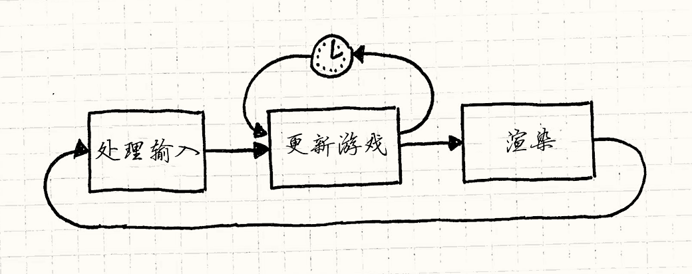

# 游戏循环

## 游戏设计模式 Sequencing Patterns

## 意图

*将游戏的进行和玩家输入解耦，和处理器速度解耦。*

## 动机

如果本书中有一个不可或缺模式，那非这个模式莫属了。 游戏循环是“游戏设计模式”的精髓。 几乎每个游戏都有，两两不同，而在非游戏的程序几乎没有使用。

为了看看它多有用，让我们快速缅怀一遍往事。 每个编写计算机程序的人都留着胡子的时代，程序像洗碗机一样工作。 你输入一堆代码，按个按钮，等待，然后获得结果，完成。 程序全都是*批处理模式*的——一旦工作完成，程序就停止了。

你在今日仍然能看到这些程序，虽然感谢上天，我们不必在打孔纸上面编写它们了。 终端脚本，命令行程序，甚至将 Markdown 翻译成这本书的 Python 脚本都是批处理程序。

### 采访 CPU

最终，程序员意识到将批处理代码留在计算办公室，等几个小时后拿到结果才能开始找程序漏洞的方式实在低效。 他们想要立即的反馈。*交互式* 程序诞生了。 第一批交互式程序中的就有游戏：

```
YOU ARE STANDING AT THE END OF A ROAD BEFORE A SMALL BRICK
BUILDING . AROUND YOU IS A FOREST. A SMALL
STREAM FLOWS OUT OF THE BUILDING AND DOWN A GULLY.

> GO IN
YOU ARE INSIDE A BUILDING, A WELL HOUSE FOR A LARGE SPRING. 
```

你可以和这个程序进行实时交互。 它等待你的输入，然后进行响应。 你再输入，这样一唱一和，就像相声一样。 当轮到你时，它停在那里啥也不做。像这样：

```
while (true)
{
  char* command = readCommand();
  handleCommand(command);
} 
```

### 事件循环

如果你剥开现代的图形 UI 的外皮，会惊讶地发现它们与老旧的冒险游戏差不多。 文本处理器通常呆在那里什么也不做，直到你按了个键或者点了什么东西：

```
while (true)
{
  Event* event = waitForEvent();
  dispatchEvent(event);
} 
```

这与冒险游戏主要的不同是，程序不是等待*文本指令*，而是等待*用户输入事件*——鼠标点击、按键按下之类的。 其他部分还是和以前的老式文本冒险游戏一样，程序*阻塞*等待用户的输入，这是个问题。

不像其他大多数软件，游戏即使没有玩家输入时也继续运行。 如果你站在那里看着屏幕，游戏不会冻结。动画继续动着。视觉效果继续闪烁。 如果不幸的话，怪物继续吞噬你的英雄。

这是真实游戏循环的第一个关键部分：*它处理用户输入，但是不等待它*。循环总是继续旋转：

```
while (true)
{
  processInput();
  update();
  render();
} 
```

我们之后会改善它，但是基本的部分都在这里了。 `processInput()`处理上次调用到现在的任何输入。 然后`update()`让游戏模拟一步。 运行 AI 和物理（通常是这种顺序）。 最终，`render()`绘制游戏，这样玩家可以看到发生了什么。

### 时间之外的世界

如果这个循环没有因为输入而阻塞，这就带来了明显的问题，要运转*多快*呢？ 每次进行游戏循环都会推动一定的游戏状态的发展。 在游戏世界的居民看来，他们手上的表就会滴答一下。

同时，*玩家的* 真实手表也在滴答着。 如果我们用实际时间来测算游戏循环运行的速度，就得到了游戏的“帧率”(FPS)。 如果游戏循环的更快，FPS 就更高，游戏运行的更流畅更快。 如果循环得过慢，游戏看上去就像是慢动作电影。

我们现在写的这个循环是能转多快转多快，两个因素决定了帧率。 一个是*每帧要做多少工作*。复杂的物理，众多游戏对象，图形细节都让 CPU 和 GPU 繁忙，这决定了需要多久能完成一帧。

另一个是*底层平台的速度。* 更快的芯片可以在同样的时间里执行更多的代码。 多核，GPU 组，独立声卡，以及系统的调度都影响了在一次滴答中能够做多少东西。

### 每秒的帧数

在早期的视频游戏中，第二个因素是固定的。 如果你为 NES 或者 Apple IIe 写游戏，你*明确*知道游戏运行在什么 CPU 上。 你可以（也必须）为它特制代码。 你只需担忧第一个因素：每次滴答要做多少工作。

早期的游戏被仔细地编码，一帧只做一定的工作，开发者可以让游戏以想要的速率运行。 但是如果你想要在快些或者慢些的机器上运行同一游戏，游戏本身就会加速或减速。

现在，很少有开发者可以奢侈地知道游戏运行的硬件条件。游戏必须自动适应多种设备。

这就是游戏循环的另一个关键任务：*不管潜在的硬件条件，以固定速度运行游戏。*

## 模式

一个**游戏循环**在游玩中不断运行。 每一次循环，它无阻塞地**处理玩家输入**，**更新游戏状态**，**渲染游戏**。 它追踪时间的消耗并**控制游戏的速度。**

## 何时使用

使用错误的模式比不使用模式更糟，所以这节通常告诫你不要过于热衷设计模式。 设计模式的目标不是往代码库里尽可能的塞东西。

但是这个模式有所不同。我可以很自信的说你*会*使用这个模式。 如果你使用游戏引擎，你不需要自己编写，但是它还在那里。

你可能认为在做回合制游戏时不需要它。 但是哪怕是那里，就算*游戏状态*到玩家回合才改变，*视觉*和*听觉* 状态仍会改变。 哪怕游戏在“等待”你进行你的回合，动画和音乐也会继续运行。

## 记住

我们这里谈到的循环是游戏代码中最重要的部分。 有人说程序会花费 90%的时间在 10%的代码上。 游戏循环代码肯定在这 10%中。 你必须小心谨慎，时时注意效率。

### 你也许需要与平台的事件循环相协调

如果你在操作系统的顶层或者有图形 UI 和内建事件循环的平台上构建游戏， 那你就有了两个应用循环在同时运作。 它们需要很好的协调。

有时候，你可以进行控制，只运行你的游戏循环。 举个例子，如果舍弃了 Windows 的珍贵 API，`main()`可以只用游戏循环。 其中你可以调用`PeekMessage()`来处理和分发系统的事件。 不像`GetMessage()`，`PeekMessage()`不会阻塞等待用户输入， 因此你的游戏循环会保持运作。

其他的平台不会让你这么轻松地摆脱事件循环。 如果你使用网页浏览器作为平台，事件循环已被内建在浏览器的执行模型深处。 这样，你得用事件循环作为游戏循环。 你会调用`requestAnimationFrame()`之类的函数，它会回调你的代码，保持游戏继续运行。

## 示例代码

在如此长的介绍之后，游戏循环的代码实际上很直观。 我们会浏览一堆变种，比较它们的好处和坏处。

游戏循环驱动了 AI，渲染和其他游戏系统，但这些不是模式的要点， 所以我们会调用虚构的方法。在实现了`render()`，`update()`之后， 剩下的作为给读者练习（挑战！）。

### 跑，能跑多快跑多快

我们已经见过了可能是最简单的游戏循环：

```
while (true)
{
  processInput();
  update();
  render();
} 
```

它的问题是你不能控制游戏运行的有多快。 在快速机器上，循环会运行的太快，玩家看不清发生了什么。 在慢速机器上，游戏慢的跟在爬一样。 如果游戏的一部分有大量内容或者做了很多 AI 或物理运算，游戏就会慢一些。

### 休息一下

我们看看增加一个简单的小修复如何。 假设你想要你的游戏以 60FPS 运行。这样每帧大约 16 毫秒。 只要你用少于这个时长进行游戏所有的处理和渲染，就可以以稳定的帧率运行。 你需要做的就是处理这一帧然后*等待*，直到处理下一帧的时候，就像这样：


代码看上去像这样：

```
while (true)
{
  double start = getCurrentTime();
  processInput();
  update();
  render();

  sleep(start + MS_PER_FRAME - getCurrentTime());
} 
```

如果它很快的处理完一帧，这里的`sleep()`保证了游戏不会运行太*快*。 如果你的游戏运行太*慢*，这无济于事。 如果需要超过 16ms 来更新并渲染一帧，休眠的时间就变成了*负的*。 如果计算机能回退时间，很多事情就很容易了，但是它不能。

相反，游戏变慢了。 可以通过每帧少做些工作来解决这个问题——减少物理效果和绚丽光影，或者把 AI 变笨。 但是这影响了那些有快速机器的玩家的游玩体验。

### 一小步，一大步

让我们尝试一些更加复杂的东西。我们拥有的问题基本上是：

1.  每次更新将游戏时间推动一个固定量。
2.  这消耗一定量的*真实*时间来处理它。

如果第二步消耗的时间超过第一步，游戏就变慢了。 如果它需要超过 16ms 来推动游戏时间 16ms，那它永远也跟不上。 但是如果一步中推动游戏时间*超过*16ms，那我们可以减少更新频率，就可以跟得上了。

接着的思路是基于上帧到现在有多少*真实*时间流逝来选择前进的时间。 这一帧花费的时间越长，游戏的间隔越大。 它总能跟上真实时间，因为它走的步子越来越大。 有人称之为*变化的*或者*流动的*时间间隔。它看上去像是：

```
double lastTime = getCurrentTime();
while (true)
{
  double current = getCurrentTime();
  double elapsed = current - lastTime;
  processInput();
  update(elapsed);
  render();
  lastTime = current;
} 
```

每一帧，我们计算上次游戏更新到现在有多少*真实*时间过去了（即变量`elapsed`）。 当我们更新游戏状态时将其传入。 然后游戏引擎让游戏世界推进一定的时间量。

假设有一颗子弹跨过屏幕。 使用固定的时间间隔，在每一帧中，你根据它的速度移动它。 使用变化的时间间隔，你*根据过去的时间拉伸速度*。 随着时间间隔增加，子弹在每帧间移动的更远。 无论是二十个快的小间隔还是四个慢的大间隔，子弹在*真实*时间里移动*同样*多的距离。 这看上去成功了：

*   游戏在不同的硬件上以固定的速度运行。
*   使用高端机器的玩家获得了更流畅的游戏体验。

但是，悲剧，这里有一个严重的问题： 游戏不再是确定的了，也不再稳定。 这是我们给自己挖的一个坑：

假设我们有个双人联网游戏，Fred 的游戏机是台性能猛兽，而 George 正在使用他祖母的老爷机。 前面提到的子弹在他们的屏幕上飞行。 在 Fred 的机器上，游戏跑的超级快，每个时间间隔都很小。 比如，我们塞了 50 帧在子弹穿过屏幕的那一秒。 可怜的 George 的机器只能塞进大约 5 帧。

这就意味着在 Fred 的机器上，物理引擎每秒更新 50 次位置，但是 George 的只更新 5 次。 大多数游戏使用浮点数，它们有*舍入误差*。 每次你将两个浮点数加在一起，获得的结果就会有点偏差。 Fred 的机器做了 10 倍的操作，所以他的误差要比 George 的更大。 *同样* 的子弹最终在他们的机器上到了*不同的位置*。

这是使用变化时间可引起的问题之一，还有更多问题呢。 为了实时运行，游戏物理引擎做的是实际机制法则的近似。 为了避免飞天遁地，物理引擎添加了阻尼。 这个阻尼运算被小心地安排成以固定的时间间隔运行。 改变了它，物理就不再稳定。

这种不稳定性太糟了，这个例子在这里的唯一原因是作为警示寓言，引领我们到更好的东西……

### 追逐时间

游戏中渲染通常*不会*被动态时间间隔影响到。 由于渲染引擎表现的是时间上的一瞬间，它不会计算上次到现在过了多久。 它只是将当前事物渲染在所在的地方。

我们可以利用这点。 以固定的时间间隔*更新*游戏，因为这让所有事情变得简单，物理和 AI 也更加稳定。 但是我们允许灵活调整*渲染*的时刻，释放一些处理器时间。

它像这样运作：自上一次游戏循环过去了一定量的真实时间。 需要为游戏的“当前时间”模拟推进相同长度的时间，以追上玩家的时间。 我们使用一*系列*的*固定*时间步长。 代码大致如下：

```
double previous = getCurrentTime();
double lag = 0.0;
while (true)
{
  double current = getCurrentTime();
  double elapsed = current - previous;
  previous = current;
  lag += elapsed;

  processInput();

  while (lag >= MS_PER_UPDATE)
  {
    update();
    lag -= MS_PER_UPDATE;
  }

  render();
} 
```

这里有几个部分。 在每帧的开始，根据过去了多少真实的时间，更新`lag`。 这变量表明了游戏世界时钟比真实世界落后了多少，然后我们使用一个固定时间步长的内部循环进行追赶。 一旦我们追上真实时间，我们就渲染然后开始新一轮循环。 你可以将其画成这样：



注意这里的时间步长不是*视觉上的*帧率了。 `MS_PER_UPDATE`只是我们更新游戏的*间隔*。 这个间隔越短，就需要越多的处理次数来追上真实时间。 它越长，游戏抖动的越厉害。 理想上，你想要它足够短，通常快过 60FPS，这样游戏在高速机器上会有高效的表现。

但是小心不要把它整得*太*短了。 你需要保证即使在最慢的机器上，这个时间步长也超过处理一次`update()`的时间。 否则，你的游戏就跟不上现实时间了。

幸运的是，我们给自己了一些喘息的空间。 技巧在于我们将*渲染拉出了更新循环*。 这释放了一大块 CPU 时间。 最终结果是游戏以固定时间步长*模拟*，该时间步长与硬件不相关。 只是使用低端硬件的玩家*看到的*会有抖动。

### 卡在中间

我们还剩一个问题，就是剩下的延迟。 以固定的时间步长更新游戏，在任意时刻渲染。 这就意味着从玩家的角度看，游戏经常在两次更新之间时显示。

这是时间线：


就像你看到的那样，我们以紧凑固定的时间步长进行更新。 同时，我们在任何可能的时候渲染。 它比更新发生的要少，而且也不稳定。 两者都没问题。糟糕的是，我们不总能在正确的时间点渲染。 看看第三次渲染时间。它发生在两次更新之间。


想象一颗子弹飞过屏幕。第一次更新时，它在左边。 第二次更新将它移到了右边。 这个游戏在两次更新之间的时间点渲染，所以玩家期望看到子弹在屏幕的中间。 而现在的实现中，它还在左边。这意味着看上去移动发生了卡顿。

方便的是，我们*实际*知道渲染时距离两次更新的时间：它被存储在`lag`中。 我们在`lag`比更新时间间隔小时，而不是`lag`是*零*时，跳出循环进行渲染。 `lag`的剩余量？那就是到下一帧的时间。 n we go to render, we’ll pass that in:

当我们要渲染时，我们将它传入：

```
render(lag / MS_PER_UPDATE); 
```

渲染器知道每个游戏对象*以及它当前的速度*。 假设子弹在屏幕左边 20 像素的地方，正在以 400 像素每帧的速度向右移动。 如果在两帧正中渲染，我们会给`render()`传 0.5。 它绘制了半帧之前的图形，在 220 像素，啊哈，平滑的移动。

当然，也许这种推断是错误的。 在我们计算下一帧时，也许会发现子弹碰撞到另一障碍，或者减速，又或者别的什么。 我们只是在上一帧位置和我们*认为的*下一帧位置之间插值。 但只有在完成物理和 AI 更新后，我们才能知道真正的位置。

所以推断有猜测的成分，有时候结果是错误的。 但是，幸运的，这种修正通常不可感知。 最起码，比你不使用推断导致的卡顿更不明显。

## 设计决策

虽然这章我讲了很多，但是有更多的东西我没讲。 一旦你考虑显示刷新频率的同步，多线程，多 GPU，真正的游戏循环会变得更加复杂。 即使在高层，这里还有一些问题你需要回答：

### 拥有游戏循环的是你，还是平台？

这个选择通常已经是平台决定的。 如果你在做浏览器中的游戏，很可能你*不能*编写自己的经典游戏循环。 浏览器本身的事件驱动机制阻碍了这一点。 类似的，如果你使用现存的游戏引擎，你很可能依赖于它的游戏循环而不是自己写一个。

*   **使用平台的事件循环：**

    *   *简单*。你不必担心编写和优化自己的游戏核心循环。

    *   *平台友好。* 你不必明确地给平台一段时间让它处理它自己的事件，不必缓存事件，不必管理任何平台输入模型和你的不匹配之处。

    *   *你失去了对时间的控制。* 平台会在它方便时调用代码。 如果这不如你想要的那样平滑或者频繁，太糟了。 更糟的是，大多数应用的事件循环并未为游戏设计，通常*是*又慢又卡顿。

*   **使用游戏引擎的循环：**

    *   *不必自己编写。* 编写游戏循环非常需要技巧。 由于是每帧都要执行的核心代码，小小的漏洞或者性能问题就对游戏有巨大的影响。 稳固的游戏循环是使用现有引擎的原因之一。

    *   *不必自己编写。* 当然，硬币的另一面是，如果引擎无法满足你*真正的*需求，你也没法获得控制权。

*   **自己写：**

    *   *完全的控制。* 你可以做任何想做的事情。你可以为游戏的需求订制开发。

    *   *你需要与平台交互。* 应用框架和操作系统通常需要时间片去处理自己的事件和其他工作。 如果你拥有应用的核心循环，平台就没有这些时间片了。 你得显式定期检查，保证框架没有挂起或者混乱。

### 如何管理能量消耗？

在五年前这还不是问题。 游戏运行在插到插座上的机器上或者专用的手持设备上。 但是随着智能手机，笔记本以及移动游戏的发展，现在需要关注这个问题了。 画面绚丽，但会耗干三十分钟前充的电，并将手机变成空间加热器的游戏，可不能让人开心。

现在，你需要考虑的不仅仅是让游戏看上去很棒，同时也要尽可能少的使用 CPU。 你需要设置一个性能的*上限*：完成一帧之内所需的工作后，让 CPU 休眠。

*   **尽可能快的运行：**

    这是 PC 游戏的常态（即使越来越多的人在笔记本上运行游戏）。 游戏循环永远不会显式告诉系统休眠。相反，空闲的循环被划在提升 FPS 或者图像显示效果上了。

    这会给你最好的游戏体验。 但是，也会尽可能多的使用电量。如果玩家在笔记本电脑上游玩，他们就得到了一个很好的加热器。

*   **固定帧率**

    移动游戏更加注意游戏的体验质量，而不是最大化图像画质。 很多这种游戏都会设置最大帧率（通常是 30 或 60FPS）。 如果游戏循环在分配的时间片消耗完之前完成，剩余的时间它会休眠。

    这给了玩家“足够好的”游戏体验，也让电池轻松了一点。

### 你如何控制游戏速度？

游戏循环有两个关键部分：不阻塞用户输入和自适应的帧时间步长。 输入部分很直观。关键在于你如何处理时间。 这里有数不尽的游戏可运行的平台， 每个游戏都需要在其中一些平台上运行。 如何适应平台变化就是关键。

*   **固定时间步长，没有同步：**

    见我们第一个样例中的代码。你只需尽可能快地运行游戏。

    *   *简单*。这是主要的（好吧，唯一的）好处。

    *   *游戏速度直接受到硬件和游戏复杂度影响。* 主要的缺点是，如果有所变化，会直接影响游戏速度。游戏速度与游戏循环紧密相关。

*   **固定时间步长，有同步：**

    对复杂度控制的下一步是使用固定的时间间隔，但在循环的末尾增加同步点，保证游戏不会运行得过快。

    *   *还是很简单。* 这比过于简单不可行的例子只多了一行代码。 在多数游戏循环中，你可能*总*需要做一些同步。 你可能需要双缓冲图形并将缓冲块与更新显示的频率同步。

    *   *电量友好。* 这对移动游戏至关重要。你不想消耗不必要的电量。 通过简单的休眠几个毫秒而不是试图每帧塞入更多的处理，你节约了电量。

    *   *游戏不会运行的太快。* 这解决了固定循环速度的一半问题。

    *   *游戏可能运行的太慢。* 如果花了太多时间更新和渲染一帧，播放也会减缓。 因为这种方案没有分离更新和渲染，它比更高级的方案更容易遇到这点。 没法扔掉*渲染*帧来追上真实时间，游戏本身会变慢。

*   **动态时间步长：**

    我把这个方案放在这里作为问题的解决办法之一，附加警告：大多数我认识的游戏开发者反对它。 不过记住*为什么*反对它是很有价值的。

    *   *能适应并调整，避免运行得太快或者太慢。* 如果游戏不能追上真实时间，它用越来越长的时间步长更新，直到追上。

    *   *让游戏不确定而且不稳定。* 这是真正的问题，当然。在物理和网络部分使用动态时间步长会遇见更多的困难。

*   **固定更新时间步长，动态渲染：**

    在示例代码中提到的最后一个选项是最复杂的，但是也是最有适应性的。 它以固定时间步长更新，但是如果需要赶上玩家的时间，可以扔掉一些*渲染*帧。

    *   *能适应并调整，避免运行得太快或者太慢。* 只要能实时*更新*，游戏状态就不会落后于真实时间。如果玩家用高端机器，它会回以更平滑的游戏体验。

    *   *更复杂。* 主要负面问题是需要在实现中写更多东西。 你需要将更新的时间步长调整的尽可能小来适应高端机，同时不至于在低端机上太慢。

## 参见

*   关于游戏循环的经典文章是 Glenn Fiedler 的”[Fix Your Timestep](http://gafferongames.com/game-physics/fix-your-timestep/)“。如果没有这篇文章，这章就不会是这个样子。

*   Witters 关于[game loops](http://www.koonsolo.com/news/dewitters-gameloop/)的文章也值得阅读。

*   [Unity](http://unity3d.com/)框架有一个复杂的游戏循环，细节在[这里](http://docs.unity3d.com/Manual/ExecutionOrder.html)有详尽的解释。