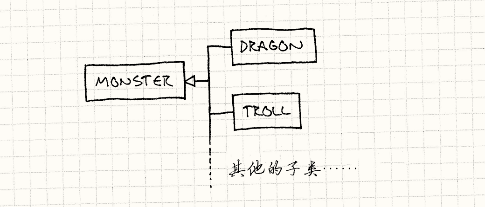

# 类型对象

## 游戏设计模式 Behavioral Patterns

## 意图

*创造一个类 A 来允许灵活的创造新“类型”，类 A 的每个实例都代表了不同的对象类型。*

## 动机

想象我们在制作一个奇幻 RPG 游戏。 我们的任务是为一群想要杀死英雄的恶毒怪物编写代码。 怪物有多个的属性：生命值，攻击力，图形效果，声音表现，等等。 但是为了说明介绍的目的我们先只考虑前面两个。

游戏中的每个怪物都有当前血值。 开始时是满的，每次怪物受伤，它就下降。 怪物也有一个攻击字符串。 当怪物攻击我们的英雄，那个文本就会以某种方式展示给用户。 （我们不在乎这里怎样实现。）

设计者告诉我们怪物有不同*品种*，像“龙”或者“巨魔”。 每个品种都描述了一*种*存在于游戏中的怪物，同时可能有多个同种怪物在地牢里游荡。

品种决定了怪物的初始健康——龙开始的血量比巨魔多，它们更难被杀死。 这也决定了攻击字符——同种的所有怪物都以相同的方式进行攻击。

### 传统的面向对象方案

想着这样的设计方案，我们启动了文本编辑器开始编程。 根据设计，龙是一种怪物，巨魔是另一种，其他品种的也一样。 用面向对象的方式思考，这引导我们创建`Monster`基类。

```
class Monster
{
public:
  virtual ~Monster() {}
  virtual const char* getAttack() = 0;

protected:
  Monster(int startingHealth)
  : health_(startingHealth)
  {}

private:
  int health_; // 当前血值
}; 
```

在怪物攻击英雄时，公开的`getAttack()`函数让战斗代码能获得需要显示的文字。 每个子类都需要重载它来提供不同的消息。

构造器是 protected 的，需要传入怪物的初始血量。 每个品种的子类的公共构造器调用这个构造器，传入对于该品种适合的起始血量。

现在让我们看看两个品种子类：

```
class Dragon : public Monster
{
public:
  Dragon() : Monster(230) {}

  virtual const char* getAttack()
  {
    return "The dragon breathes fire!";
  }
};

class Troll : public Monster
{
public:
  Troll() : Monster(48) {}

  virtual const char* getAttack()
  {
    return "The troll clubs you!";
  }
}; 
```

每个从`Monster`派生出来的类都传入起始血量，重载`getAttack()`返回那个品种的攻击字符串。 所有事情都一如所料的运行，不久以后，我们的英雄就可以跑来跑去杀死各种野兽了。 我们继续编程，在意识到之前，我们就有了酸泥怪到僵尸羊的众多怪物子类。

然后，很奇怪，事情陷入了困境。 设计者最终想要*几百个*品种，但是我们发现所有的时间都花费在写这些只有七行长的子类和重新编译上。 这会继续变糟——设计者想要协调已经编码的品种。我们之前富有产出的工作日退化成了：

1.  收到设计者将巨魔的血量从 48 改到 52 的邮件。
2.  签出并修改`Troll.h`。
3.  重新编译游戏。
4.  签入修改。
5.  回复邮件。
6.  重复。

我们度过了失意的一天，因为我们变成了填数据的猴子。 设计者也感到挫败，因为修改一个数据就要老久。 我们需要的是一种无需每次重新编译游戏就能修改品种的状态。 如果设计者创建和修改品种时无需*任何*程序员的介入那就更好了。

### 为类型建类

从较高的层次看来，我们试图解决的问题非常简单。 游戏中有很多不同的怪物，我们想要在它们之间分享属性。 一大群怪物在攻击英雄，我们想要它们中的一些使用相同的攻击文本。 我们声明这些怪物是相同的“品种”，而品种决定了攻击字符串。

这种情况下我们很容易想到类，那就试试吧。 龙是怪物，每条龙都是龙“类”的实例。 定义每个品种为抽象基类`Monster` 的子类，让游戏中每个怪物都是子类的实例反映了那点。最终的类层次是这样的：



每个怪物的实例属于摸个继承怪物类的类型。 我们有的品种越多，类层次越高。 这当然是问题：添加新品种就需要添加新代码，而每个品种都需要被编译为它自己的类型。

这可行，但不是唯一的选项。 我们也可以重构代码让每个怪物*有*品种。 不是让每个品种继承`Monster`，我们现在有单一的`Monster`类和`Breed`类。


这就成了，就两个类。注意这里完全没有继承。 通过这个系统，游戏中的每个怪物都是`Monster`的实例。 `Breed`类包含了在不同品种怪物间分享的信息：开始血量和攻击字符串。

为了将怪物与品种相关联，我们给了每个`Monster`实例对包含品种信息的`Breed`对象的引用。 为了获得攻击字符串，一个怪兽可以调用它品种的方法。 `Breed`类本质上定义了一个怪物的*类型*，这就是为啥这个模式叫做类型对象。

这个模式特别有用的一点是，我们现在可以定义全新的*类型*而无需搅乱代码库。 我们本质上将部分的类型系统从硬编码的继承结构中拉出，放到可以在运行时定义的数据中去。

我们可以通过用不同值实例化`Monster`来创建成百上千的新品种。 如果从配置文件读取不同的数据初始化品种，我们就有能力完全靠数据定义新怪物品种。 这么容易，设计者也可以做到！

## 模式

定义**类型对象**类和**有类型的对象**类。每个类型对象实例代表一种不同的逻辑类型。 每种有类型的对象保存**对描述它类型的类型对象的引用**。

实例相关的数据被存储在有类型对象的实例中，被同种类分享的数据或者行为存储在类型对象中。 引用同一类型对象的对象将会像同一类型一样运作。 这让我们在一组相同的对象间分享行为和数据，就像子类让我们做的那样，但没有固定的硬编码子类集合。

## 何时使用

在任何你需要定义不同“种”事物，但是语言自身的类型系统过于僵硬的时候使用该模式。尤其是下面两者之一成立时：

*   你不知道你后面还需要什么类型。（举个例子，如果你的游戏需要支持资料包，而资料包有新的怪物品种呢？）

*   修改或添加新类型不想改变代码或者重新编译就能。

## 记住

这个模型是关于将“类型”的定义从命令式僵硬的语言世界移到灵活但是缺少行为的对象内存世界。 灵活性很好，但是将类型提到数据丧失了一些东西。

### 需要手动追踪类型对象

使用像 C++类型系统这样的好处之一就是编译器自动记录类的注册。 定义类的数据自动编译到可执行的静态内存段然后就运作起来了。

使用类型对象模式，我们现在不但要负责管理内存中的怪物，同时要管理它们的*类型* ——我们要保证，只要我的怪物需要，所有的品种对象都能实例化并保存在内存中。 无论何时创建新的怪物，由我们来保证能初始化为有含有品种的引用。

我们从编译器的限制中解放了自己，但是代价是需要重新实现一些它以前为我们做的事情。

### 更难为每种类型定义*行为*

使用子类派生，你可以重载方法，然后做你想做的事——用程序计算值，调用其他代码，等等。 天高任鸟飞。如果我们想的话，可以定义一个怪物子类，根据月亮的阶段改变它的攻击字符串。（我觉得就像狼人。）

当我们使用类型对象模式时，我们将重载的方法替换成了成员变量。 不再让怪物的子类重载方法，用不同的*代码*来*计算*攻击字符串，我们的品种对象而是在不同的*变量*中*存储*攻击字符串。

这让使用类型对象定义类型相关的*数据*变得容易，但是定义类型相关的*行为*变得困难。 如果，举个例子，不同品种的怪物需要使用不同的 AI 算法，使用这个模式就面临着挑战。

有很多方式可以让我们跨越这个限制。 一个简单的方式是使用预先定义的固定行为， 然后类型对象中的数据简单的*选择*它们中的一个。 举例，假设我们的怪物 AI 总是处于“站着不动”、“追逐英雄”或者“恐惧地呜咽颤抖”（嘿，他们不可能都是强势的龙）。 我们可以定义函数来实现每种行为。 然后，我们在方法中存储合适函数的引用，将 AI 算法与品种相关联。

另一个更加彻底的解决方案是真正地在数据中支持定义行为。 [解释器](http://c2.com/cgi-bin/wiki?InterpreterPattern)模式和字节码模式让我们定义有行为的对象。 如果我们读取数据文件并用上面两种模式之一构建数据结构，我们就将行为完全从代码中移出，放入了数据之中。

## 示例代码

在第一遍实现中，让我们从简单的开始，只构建动机那节提到的基础系统。 我们从`Breed`类开始：

```
class Breed
{
public:
  Breed(int health, const char* attack)
  : health_(health),
    attack_(attack)
  {}

  int getHealth() { return health_; }
  const char* getAttack() { return attack_; }

private:
  int health_; // 初始血值
  const char* attack_;
}; 
```

很简单。它基本上只是两个数据字段的容器：起始血量和攻击字符串。 让我们看看怪物怎么使用它：

```
class Monster
{
public:
  Monster(Breed& breed)
  : health_(breed.getHealth()),
    breed_(breed)
  {}

  const char* getAttack()
  {
    return breed_.getAttack();
  }

private:
  int    health_; // 当前血值
  Breed& breed_;
}; 
```

当我们建构怪物时，我们给它一个品种对象的引用。 它定义了怪物的品种，取代了之前的子类。 在构造函数中，`Monster`使用的品种决定了起始血量。 为了获得攻击字符串，怪物简单的将调用转发给它的品种。

这段非常简单的代码是这章的核心思路。剩下的任何东西都是红利。

### 让类型对象更像类型：构造器

现在，我们可以直接构造怪物并负责传入它的品种。 和常用的 OOP 语言实现的对象相比这有些退步——我们通常不会分配一块空白内存，然后*赋予*它类型。 相反，我们根据类调用构造器，它负责创建一个新实例。

我们可以在类型对象上应用同样的模式。

```
class Breed
{
public:
  Monster* newMonster() { return new Monster(*this); }

  // Previous Breed code...
}; 
```

以及那个使用它们的类：

```
class Monster
{
  friend class Breed;

public:
  const char* getAttack() { return breed_.getAttack(); }

private:
  Monster(Breed& breed)
  : health_(breed.getHealth()),
    breed_(breed)
  {}

  int health_; // 当前血值
  Breed& breed_;
}; 
```

不同的关键点在于`Breed`中的`newMonster()`。 这是我们的“构造器”工厂方法。使用我们原先的实现，就像这样创建怪物：

```
Monster* monster = new Monster(someBreed); 
```

在我们改动后，它看上去是这样：

```
Monster* monster = someBreed.newMonster(); 
```

所以，为什么这么做？创建一个对象分为两步：内存分配和初始化。 `Monster`的构造器让我们做完了所有需要的初始化。 在例子中，那只存储了类型，但是在完整的游戏中，那需要加载图形，初始化怪物 AI 以及做其他的设置工作。

但是，那都发生在内存分配*之后*。 在构造器调用前，我们已经找到了内存放置怪物。 在游戏中，我们通常也想控制对象创造这一环节： 我们通常使用自定义的分配器或者对象池模式来控制对象最终在内存中的位置。

在`Breed`中定义“构造器”函数给了我们地方实现这些逻辑。 不是简单的调用`new`,`newMonster()`函数可以在将控制权传递给`Monster`初始化之前，从池中或堆中获取内存。 通过在*唯一*有能力创建怪物的`Breed`函数中放置这些逻辑， 我们保证了所有怪物变量遵守了内存管理规范。

### 通过继承分享数据

我们现在已经实现了能完美服务的类型对象系统，但是它非常基础。 我们的游戏最终有*上百*种不同品种，每种都有成打的特性。 如果设计者想要协调 30 中不同的巨魔，让它们变得强壮一点，他会的处理很多数据。

能帮上忙的是在不同*品种*间分享属性的能力，一如品种在不同的*怪物*间分享属性的能力。 就像我们在之前 OOP 方案中做的那样，我们可以使用派生完成这点。 只是，这次，不使用语言的继承机制，我们用类型对象实现它。

简单起见，我们只支持单继承。 就像类可以有一个父类，我们允许品种有一个父品种：

```
class Breed
{
public:
  Breed(Breed* parent, int health, const char* attack)
  : parent_(parent),
    health_(health),
    attack_(attack)
  {}

  int         getHealth();
  const char* getAttack();

private:
  Breed*      parent_;
  int         health_; // 初始血值
  const char* attack_;
}; 
```

当我们构建一个品种，我们先传入它继承的父品种。 我们可以为基础品种传入`NULL`表明它没有祖先。

为了让这有用，子品种需要控制它从父品种继承了哪些属性，以及哪些属性需要重载并由自己指定。 在我们的示例系统中，我们可以说品种用非零值重载了怪物的健康，用非空字符串重载了攻击字符串。 否则，这些属性要从它的父品种里继承。

实现方式有两种。 一种是每次属性被请求时动态处理委托，就像这样：

```
int Breed::getHealth()
{
  // 重载
  if (health_ != 0 || parent_ == NULL) return health_;

  // 继承
  return parent_->getHealth();
}

const char* Breed::getAttack()
{
  // 重载
  if (attack_ != NULL || parent_ == NULL) return attack_;

  // 继承
  return parent_->getAttack();
} 
```

如果品种在运行时修改种类，不再重载，或者不再继承某些属性时，这能保证做正确的事。 另一方面，这要更多的内存（它需要保存指向它的父品种的指针）而且更慢。 每次你查找属性都需要回溯继承链。

如果我们可以保证品种的属性不变，一个更快的解决方案是在*构造时*使用继承。 这被称为“复制”委托，因为在创建对象时，我们*复制*继承的属性*到*推导的类型。它看上去是这样的：

```
Breed(Breed* parent, int health, const char* attack)
: health_(health),
  attack_(attack)
{
  // 继承没有重载的属性
  if (parent != NULL)
  {
    if (health == 0) health_ = parent->getHealth();
    if (attack == NULL) attack_ = parent->getAttack();
  }
} 
```

注意现在我们不再需要给父品种的字段了。 一旦构造器完成，我们可以忘了父品种，因为我们已经拷贝了它的所有属性。 为了获得品种的属性，我们现在直接返回字段：

```
int         getHealth() { return health_; }
const char* getAttack() { return attack_; } 
```

又好又快！

假设游戏引擎从品种的 JSON 文件加载设置然后创建类型。它看上去是这样的：

```
{
  "Troll": {
    "health": 25,
    "attack": "The troll hits you!"
  },
  "Troll Archer": {
    "parent": "Troll",
    "health": 0,
    "attack": "The troll archer fires an arrow!"
  },
  "Troll Wizard": {
    "parent": "Troll",
    "health": 0,
    "attack": "The troll wizard casts a spell on you!"
  }
}

:::json
{
  "Troll": {
    "health": 25,
    "attack": "The troll hits you!"
  },
  "Troll Archer": {
    "parent": "Troll",
    "health": 0,
    "attack": "The troll archer fires an arrow!"
  },
  "Troll Wizard": {
    "parent": "Troll",
    "health": 0,
    "attack": "The troll wizard casts a spell on you!"
  }
} 
```

我们有一段代码读取每个品种，用新数据实例化品种实例。 就像你从`"parent": "Troll"`字段看到的， `Troll Archer`和`Troll Wizard`品种都由基础`Troll`品种继承而来。

由于派生类的初始血量都是 0，所以该值从基础`Troll`品种继承。 这意味着无论怎么调整`Troll`的血量，三个品种的血量都会被更新。 随着品种的数量和属性的数量增加，这节约了很多时间。 现在，通过一小块代码，系统给了设计者控制权，让他们能好好利用时间。 与此同时，我们可以回去编码其他特性了。

## 设计决策

类型对象模式让我们建立类型系统，就好像在设计自己的编程语言。 设计空间是开放的，我们可以做很多有趣的事情。

在实践中，有些东西打破了我们的幻想。 时间和可维护性阻止我们创建特别复杂的东西。 更重要的是，无论如何设计类型系统，用户（通常不是程序员）要能轻松地理解它。 我们将其做的越简单，它就越有用。 所以我们在这里谈到的是已经反复探索的领域，开辟新路就留给学者和探索者吧。

### 类型对象是封装的还是暴露的？

在我们的简单实现中，`Monster`有一个对品种的引用，但是它没有显式暴露这个引用。 外部代码不能直接获取怪物的品种。 从代码库的角度看来，怪物事实上是没有类型的，事实上它们拥有品种只是个实现细节。

我们可以很容易的改变这点，让`Monster`返回它的`Breed`：

```
class Monster
{
public:
  Breed& getBreed() { return breed_; }

  // 当前的代码……
}; 
```

这样做改变了`Monster`的设计。 事实是所有怪物都拥有品种是 API 的可见部分了，下面是这两者各自的好处：

*   **如果类型对象是封装的：**

    *   *类型对象模式的复杂性对代码库的其他部分是隐藏的。* 它成为了只有有类型的对象才需要考虑的实现细节。

    *   *有类型的对象可以选择性地修改类型对象的重载行为*。 假设我们想要怪物在它接近死亡时改变它的攻击字符串。 由于攻击字符串总是通过`Monster`获取的，我们有一个方便的地方放置代码：

        ```
        const char* Monster::getAttack()
        {
          if (health_ < LOW_HEALTH)
          {
            return "The monster flails weakly.";
          }

          return breed_.getAttack();
        } 
        ```

        如果外部代码直接调用品种的`getAttack()`，我们就没有机会能插入逻辑。

    *   *我们得为每个类型对象暴露的方法写转发。* 这是这个设计的冗长之处。如果类型对象有很多方法，对象类也得为每一个方法建立属于自己的公共可见方法。

*   **如果类型对象是暴露的：**

    *   *外部代码可以与类型对象直接交互，无需拥有类型对象的实例。* 如果类型对象是封装的，那么没有一个拥有它的对象就没法使用它。 这阻止我们使用构造器模式这样的方法，在品种上调用方法来创建新怪物。 如果用户不能直接获得品种，他们就没办法调用它。

    *   *类型对象现在是对象公共 API 的一部分了。* 大体上，窄接口比宽接口更容易掌控——你暴露给代码库其他部分的越少，你需要处理的复杂度和维护工作就越少。 通过暴露类型对象，我们扩宽了对象的 API，包含了所有类型对象提供的东西。

### 有类型的对象是如何创建的？

使用这个模式，每个“对象”现在都是一对对象：主对象和它的类型对象。 所以我们怎样创建并绑定两者呢？

*   **构造对象然后传入类型对象：**

    *   *外部代码可以控制分配。* 由于调用代码也是构建对象的代码，它可以控制其的内存位置。 如果我们想要 UI 在多种内存场景中使用（不同的分配器，在栈中，等等），这给了完成它的灵活性。
*   **在类型对象上调用“构造器”函数：**

    *   *类型对象控制了内存分配。* 这是硬币的另一面。如果我们*不想*让用户选择在内存中何处创建对象， 在类型对象上调用工厂方法可以达到这一点。 如果我们想保证所有的对象都来自具体的对象池或者其他的内存分配器时也有用。

### 能改变类型吗？

到目前为止，我们假设一旦对象创建并绑定到类型对象上，这永远不会改变。 对象创建时的类型就是它销毁时的类型。这其实没有必要。 我们*可以*允许对象随着时间改变它的类型。

让我们回想下我们的例子。 当怪物死去时，设计者告诉我们，有时它的尸体会复活成僵尸。 我们可以通过在怪物死亡时产生僵尸类型的新怪兽，但另一个选项是拿到现有的怪物，然后将它的品种改为僵尸。

*   **如果类型不改变：**

    *   *编码和理解都更容易。* 在概念上，大多数人不期望“类型”会改变。这符合大多数人的理解。

    *   *更容易查找漏洞。* 如果我们试图追踪怪物进入奇怪状态时的漏洞，*现在* 看到的品种就是怪物始终保持的品种可以大大简化工作。

*   **如果类型可以改变：**

    *   *需要创建的对象更少。* 在我们的例子中，如果类型不能改变，我们需要消耗 CPU 循环创建新的僵尸怪物对象， 把原先对象中需要保留的属性都拷贝过来，然后删除它。 如果我们可以改变类型，所有的工作都被一个简单的声明取代。

    *   *我们需要小心地做约束。* 在对象和它的类型间有强耦合是很自然的事情。 举个例子，一个品种也许假设怪物*当前的*血量永远高于品种中的初始血量。

        如果我们允许品种改变，我们需要确保已存对象满足新品种的需求。 当我们改变类型时，我们也许需要执行一些验证代码保证对象现在的状态对新类型是有意义的。

### 它支持何种继承？

*   **没有继承：**

    *   *简单。* 最简单的通常是最好的。如果你在类型对象间没有大量数据共享，为什么要为难自己呢？

    *   *这会带来重复的工作。* 我从未见过看到哪个编码系统中设计者*不*想要继承的。 当你有十五种不同的精灵时，协调血量就要修改十五处同样的数字真是糟透了。

*   **单继承：**

    *   *还是相对简单。* 它易于实现，但是，更重要的是，也易于理解。如果非技术用户正在使用这个系统，要操作的部分越少越好。 这就是很多编程语言只支持单继承的原因。这看起来是能力和简洁之间的平衡点。

    *   *查询属性更慢。* 为了在类型对象中获取一块数据，我们也许需要回溯继承链寻找是哪一个类型最终决定了值。 在性能攸关的代码上，我们也许不想花时间在这上面。

*   **多重继承：**

    *   *可以避免绝大多数代码重复。* 使用优良的多继承系统，用户可以为类型对象建立几乎没有冗余的层次。 改变数值时，我们可以避免很多复制和粘贴。

    *   *复杂。* 不幸的是，它的好处更多的是理论上的而非实际上的。多重继承很难理解。

        如果僵尸龙继承僵尸和龙，哪些属性来自僵尸，哪些来自于龙？ 为了使用系统，用户需要理解如何继承图的遍历，还需要有设计优秀层次的远见。

        我看到的大多数 C++编码标准趋向于禁止多重继承，Java 和 C#完全移除了它。 这承认了一个悲伤的事实：它太难掌握了，最好根本不要用。 尽管值得考虑，但你很少想要在类型对象上实现多重继承。就像往常一样，简单的总是最好的。

## 参见

*   这个模式处理的高层问题是在多个对象间分享数据和行为。 另一个用另一种方式解决了相同问题的模式是原型模式。

*   类型对象是享元模式的近亲。 两者都让你在实例间分享代码。使用享元，意图是节约内存，而分享的数据也许不代表任何概念上对象的“类型”。 使用类型对象模式，焦点在组织性和灵活性。

*   这个模式和状态模式有很多相似之处。 两者都委托对象的部分定义给另外一个对象。 通过类型对象，我们通常委托*是*什么：不变的数据概括描述对象。 通过状态，我们委托*现在是什么*：暂时描述对象当前状态的数据。

    当我们讨论对象改变它的类型时，你可以将其认为类型对象起到了和状态相似的职责。