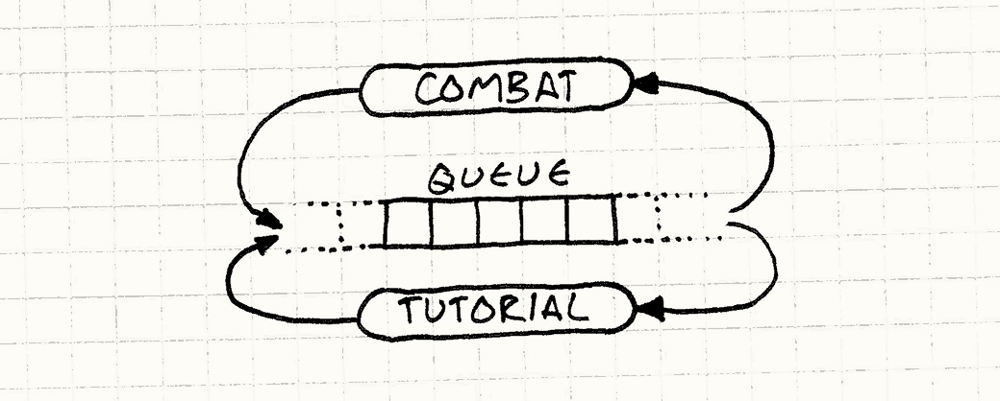
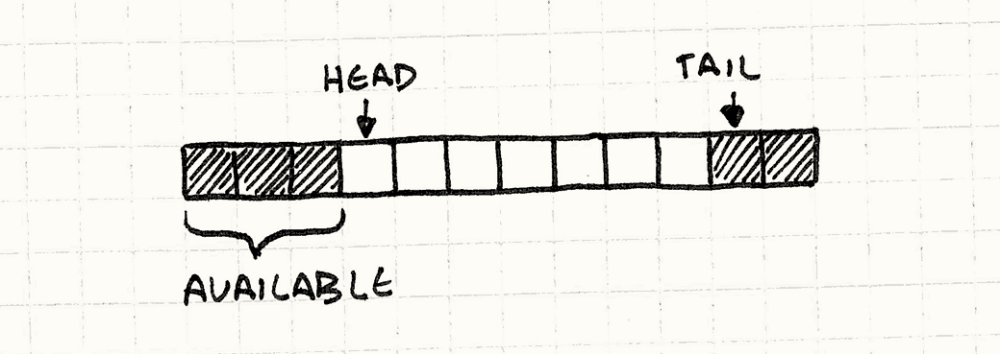

# 事件队列

## 游戏设计模式 Decoupling Patterns

## 意图

*解耦发出消息或事件的时间和处理它的时间。*

## 动机

除非还呆在一两个没有互联网接入的犄角旮旯，否则你很可能已经听说过“事件序列”了。 如果没有，也许“消息队列”或“事件循环”或“消息泵”可以让你想起些什么。 为了唤醒你的记忆，让我们了解几个此模式的常见应用吧。

### GUI 事件循环

如果你曾做过任何用户界面编程，你就会很熟悉*事件*。 每当用户与你的程序交互——点击按钮，拉出菜单，或者按个键——操作系统就会生成一个事件。 它会将这个对象扔给你的应用程序，你的工作就是获取它然后将其与有趣的行为相挂钩。

为了获取这些事件，代码底层是*事件循环*。它大体上是这样的：

```
while (running)
{
  Event event = getNextEvent();
  // 处理事件……
} 
```

对`getNextEvent()`的调用将一堆未处理的用户输出传到应用程序中。 你将它导向事件处理器，之后应用魔术般获得了生命。 有趣的部分是应用在*它*想要的时候*获取*事件。 操作系统在用户操作时不是直接跳转到你应用的某处代码。

这就意味着当用户输入进来时，它需要到某处去， 这样操作系统在设备驱动报告输入和应用去调用`getNextEvent()`之间不会漏掉它。 这个“某处”是一个*队列*。


当用户输入抵达时，操作系统将其添加到未处理事件的队列中。 当你调用`getNextEvent()`时，它从队列中获取最旧的事件然后交给应用程序。

### 中心事件总线

大多数游戏不是像这样事件驱动的，但是在游戏中使用事件循环来支撑中枢系统是很常见的。 你通常听到用“中心”“全局”“主体”描述它。 它通常被用于想要相互保持解耦的高层模块间通信。

假设游戏有新手教程系统，在某些特定游戏事件后显示帮助框。 举个例子，当玩家第一次击败了邪恶野兽，你想要一个显示着“按 X 拿起战利品！”的小气泡。

游戏玩法和战斗代码也许像上面一样复杂。 你最不想做的就是检查一堆教程的触发器。 相反，你可以使用中心事件队列。 任何游戏系统都可以发事件给队列，这样战斗代码可以在砍倒敌人时发出“敌人死亡”事件。

类似的，任何游戏系统都能从队列*接受*事件。 教程引擎在队列中注册自己，然后表明它想要收到“敌人死亡”事件。 用这种方式，敌人死了的消息从战斗系统传到了教程引擎，而不需要这两个系统直接知道对方的存在。



我本想将这个作为这章其他部分的例子，但是我真不喜欢这样巨大的全局系统。 事件队列不需要在整个游戏引擎中沟通。在一个类或者领域中沟通就足够有用了。

### 你说什么？

所以说点别的，让我们给游戏添加一些声音。 人类是视觉动物，但是听觉强烈影响到情感系统和空间感觉。 正确模拟的回声可以让漆黑的屏幕感觉上是巨大的洞穴，而适时的小提琴慢板可以让心弦拉响同样的旋律。

为了获得优秀的音效表现，我们从最简单的解决方法开始，看看结果如何。 添加一个“声音引擎”，其中有使用标识符和音量就可以播放音乐的 API：

```
class Audio
{
public:
  static void playSound(SoundId id, int volume);
}; 
```

它负责加载合适的声音资源，找到可靠的播放频道，然后启动它。 这章不是关于某个平台真实的音频 API，所以我会假设在其他某处魔术般实现了一个。 使用它，我们像这样写方法：

```
void Audio::playSound(SoundId id, int volume)
{
  ResourceId resource = loadSound(id);
  int channel = findOpenChannel();
  if (channel == -1) return;
  startSound(resource, channel, volume);
} 
```

我们签入以上代码，创建一些声音文件，然后在代码中加入一些对`playSound()`的调用。 举个例子，在 UI 代码中，我们在选择菜单项变化时播放一点小音效：

```
class Menu
{
public:
  void onSelect(int index)
  {
    Audio::playSound(SOUND_BLOOP, VOL_MAX);
    // 其他代码……
  }
}; 
```

这样做了之后，注意到有时候你改变菜单项目，整个屏幕就会冻住几帧。 我们遇到了第一个问题：

*   **问题一：API 在音频引擎完成对请求的处理前阻塞了调用者。**

我们的`playSound()`方法是*同步*的——它在从播放器放出声音前不会返回调用者。 如果声音文件要从光盘上加载，那就得花费一定时间。 与此同时，游戏的其他部分被卡住了。

现在忽视这一点，我们继续。 在 AI 代码中，我们增加了一个调用，在敌人承受玩家伤害时发出痛苦的低号。 没有什么比在虚拟的生物身上施加痛苦更能温暖玩家心灵的了。

这能行，但是有时玩家打出暴击，他在同一帧可打到两个敌人。 这让游戏同时要播放两遍哀嚎。 如果你了解一些音频的知识，那么就知道要把两个不同的声音混合在一起，就要加和它们的波形。 当这两个是*同一*波形时，它与*一个*声音播放*两倍响*是一样的。那会很刺耳。

在 Boss 战中有个相关的问题，当有一堆小怪跑动制造伤害时。 硬件只能同时播放一定数量的音频。当数量超过限度时，声音就被忽视或者切断了。

为了处理这些问题，我们需要获得音频调用的整个*集合*，用来整合和排序。 不幸的是，音频 API 独立处理每一个`playSound()`调用。 看起来这些请求是从针眼穿过一样，一次只能有一个。

*   **问题二：请求无法合并处理。**

这个问题与下面的问题相比只是小烦恼。 现在，我们在很多不同的游戏系统中散布了`playSound()`调用。 但是游戏引擎是在现代多核机器上运行的。 为了使用多核带来的优势，我们将系统分散在不同线程上——渲染在一个，AI 在另一个，诸如此类。

由于我们的 API 是同步的，它在*调用者*的线程上运行。 当从不同的游戏系统调用时，我们从多个线程同时使用 API。 看看示例代码，看到任何线程同步性吗？我也没看到。

当我们想要分配一个*单独的*线程给音频，这个问题就更加严重。 当其他线程都忙于互相跟随和制造事物，它只是傻傻待在那里。

*   **问题三：请求在错误的线程上执行。**

音频引擎调用`playSound()`意味着，“放下任何东西，现在就播放声音！”*立即* 就是问题。 游戏系统在*它们*方便时调用`playSound()`，但是音频引擎不一定能方便去处理这个请求。 为了解决这点，我们需要将*接受*请求和*处理*请求解耦。

## 模式

**事件队列**在队列中按先入先出的顺序存储一系列**通知或请求**。 发送通知时，**将请求放入队列并返回**。 处理请求的系统之后稍晚**从队列中获取请求**并处理。 这**解耦了发送者和接收者**，既**静态**又**及时**。

## 何时使用

如果你只是想解耦*接收者*和发送者，像观察者模式 和命令模式都可以用较小的复杂度进行处理。 在解耦某些需要*及时*处理的东西时使用队列。

用推和拉来考虑。 有一块代码 A 需要另一块代码 B 去做些事情。 对 A 自然的处理方式是将请求*推*给 B。

同时，对 B 自然的处理方式是在*B*方便时将请求*拉*入。 当一端有推模型另一端有拉模型，你需要在它们间放缓存。 这就是队列比简单的解耦模式多提供的部分。

队列给了代码对拉取的控制权——接收者可以延迟处理，合并或者忽视请求。 但队列做这些事是通过将控制权从发送者那里*拿走*完成的。 发送者能做的就是向队列发送请求然后祈祷。 当发送者需要回复时，队列不是好选择。

## 记住

不像这书中的其他模式，事件队列很复杂，会对游戏架构引起广泛影响。 这就意味着你仔细考虑如何——或者要不要——使用它。

### 中心事件队列是一个全局变量

这个模式的常用方法是一个大的交换站，游戏中的每个部分都能将消息送过这里。 这是很有用的基础架构，但是*有用*并不代表*好用*。

可能要走一些弯路，但是我们中的大多数最终学到了全局变量是不好的。 当有一小片状态，程序的每部分都能接触到，会产生各种微妙的相关性。 这个模式将状态封装在协议中，但是它还是全局的，仍然有全局变量引发的全部危险。

### 世界的状态可以因你改变

假设在虚拟的小怪结束它一生时，一些 AI 代码将“实体死亡”事件发送到队列中。 这个事件在队列中等待了谁知有多少帧后才排到了前面，得以处理。

同时，经验系统想要追踪英雄的杀敌数，并对他的效率加以奖励。 它接受每个“实体死亡”事件，然后决定英雄击杀了何种怪物，以及击杀的难易程度，最终计算出合适的奖励。

这需要游戏世界的多种不同状态。 我们需要死亡的实体以获取击杀它的难度。 我们也许要看看英雄的周围有什么其他的障碍物或者怪物。 但是如果事件没有及时处理，这些东西都会消失。 实体可能被清除，周围的东西也有可能移开。

当你接到事件时，得小心，不能假设*现在的*状态反映了*事件发生时*的世界。 这就意味着队列中的事件比同步系统中的事件需要存储更多数据。 在后者中，通知只需说“某事发生了”然后接收者可以找到细节。 使用队列时，这些短暂的细节必须在事件发送时就被捕获，以方便之后使用。

### 会陷于反馈系统环路中

任何事件系统和消息系统都得担心环路：

1.  A 发送了一个事件
2.  B 接收然后发送事件作为回应。
3.  这个事件恰好是 A 关注的，所以它收到了。为了回应，它发送了一个事件。
4.  回到 2.

当消息系统是*同步的*，你很快就能找到环路——它们造成了栈溢出并让游戏崩溃。 使用队列，异步地使用栈，即使虚假事件晃来晃去时，游戏仍然可以继续运行。 避免这个的通用方法就是避免在*处理*事件的代码中*发送*事件。

## 示例代码

我们已经看到一些代码了。它不完美，但是有基本的正确功能——公用的 API 和正确的底层音频调用。 剩下需要做的就是修复它的问题。

第一个问题是我们的 API 是*阻塞的*。 当代码播放声音时，它不能做任何其他事情，直到`playSound()`加载完音频然后真正地开始播放。

我们想要推迟这项工作，这样 `playSound()` 可以很快的返回。 为了达到这一点，我们需要*具体化*播放声音的请求。 我们需要一个小结构存储发送请求时的细节，这样我们晚些时候可以使用：

```
struct PlayMessage
{
  SoundId id;
  int volume;
}; 
```

下面我们需要给`Audio`一些存储空间来追踪正在播放的声音。 现在，你的算法专家也许会告诉你使用激动人心的数据结构， 比如[Fibonacci heap](http://en.wikipedia.org/wiki/Fibonacci_heap)或者[skip list](http://en.wikipedia.org/wiki/Skip_list)或者最起码*链表*。 但是在实践中，存储一堆同类事物最好的办法是使用一个平凡无奇的经典数组：

*   没有动态分配。

*   没有为记录信息造成额外的开销或者多余的指针。

*   对缓存友好的连续存储空间。

所以让我们开干吧：

```
class Audio
{
public:
  static void init()
  {
    numPending_ = 0;
  }

  // 其他代码……
private:
  static const int MAX_PENDING = 16;

  static PlayMessage pending_[MAX_PENDING];
  static int numPending_;
}; 
```

我们可以将数组大小设置为最糟情况下的大小。 为了播放声音，简单的将新消息插到最后：

```
void Audio::playSound(SoundId id, int volume)
{
  assert(numPending_ < MAX_PENDING);

  pending_[numPending_].id = id;
  pending_[numPending_].volume = volume;
  numPending_++;
} 
```

这让`playSound()`几乎是立即返回，当然我们仍得播放声音。 那块代码在某处，即`update()`方法中：

```
class Audio
{
public:
  static void update()
  {
    for (int i = 0; i < numPending_; i++)
    {
      ResourceId resource = loadSound(pending_[i].id);
      int channel = findOpenChannel();
      if (channel == -1) return;
      startSound(resource, channel, pending_[i].volume);
    }

    numPending_ = 0;
  }

  // 其他代码……
}; 
```

现在我们需要从方便时候调用。 这个“方便”取决于你的游戏。 它也许要从主游戏循环中或者专注于音频的线程中调用。

这可行，但是这假定了我们在对`update()`的单一调用中可以处理*每个*声音请求。 如果你做了像在声音资源加载后处理异步请求的事情，这就没法工作了。 `update()`一次处理一个请求，它需要有完成一个请求后从缓存中再拉取一个请求的能力。 换言之，我们需要一个真实的队列。

### 环状缓存

有很多种方式能实现队列，但我最喜欢的是*环状缓存*。 它保留了数组的所有优点，同时能让我们不断从队列的前方移除事物。

现在，我知道你在想什么。 如果我们从数组的前方移除东西，不是需要将所有剩下的部分都移动一次吗？这不是很慢吗？

这就是为什么要学习链表——你可以从中移除一个节点，而无需移动东西。 好吧，其实你可以用数组实现一个队列而无需移动东西。 我会展示给你看，但是首先预习一些术语：

*   队列的**头部**是*读取*请求的地方。头部存储最早发出的请求。

*   **尾部** 是另一端。它是数组中下个*写入*请求的地方。注意它指向队列终点的下一个。你可以将其理解为一个半开半闭区间，如果这有帮助的话。

由于 `playSound()` 向数组的末尾添加了新的请求，头部开始指向元素 0 而尾部向右增长。


让我们开始编码。首先，我们显式定义这两个标记在类中的意义：

```
class Audio
{
public:
  static void init()
  {
    head_ = 0;
    tail_ = 0;
  }

  // 方法……
private:
  static int head_;
  static int tail_;

  // 数组……
}; 
```

在 `playSound()` 的实现中，`numPending_`被`tail_`取代，但是其他都是一样的：

```
void Audio::playSound(SoundId id, int volume)
{
  assert(tail_ < MAX_PENDING);

  // Add to the end of the list.
  pending_[tail_].id = id;
  pending_[tail_].volume = volume;
  tail_++;
} 
```

更有趣的变化在`update()`中：

```
void Audio::update()
{
  // 如果这里没有待处理的请求
  // 那就什么也不做。
  if (head_ == tail_) return;

  ResourceId resource = loadSound(pending_[head_].id);
  int channel = findOpenChannel();
  if (channel == -1) return;
  startSound(resource, channel, pending_[head_].volume);

  head_++;
} 
```

我们在头部处理，然后通过将头部指针向右移动来消除它。 我们定义头尾之间没有距离的队列为空队列。

现在，我们获得了一个队列——我们可以向尾部添加元素，从头部移除元素。 这里有很明显的问题。在我们让队列跑起来后，头部和尾部继续向右移动。 最终`tail_`碰到了数组的尾部，欢乐时光结束了。 接下来是这个方法的灵巧之处。



注意当尾部移动时，*头部* 也是如此。 这就意味着在数组*开始*部分的元素不再被使用了。 所以我们做的就是，当抵达末尾时，将尾部回折到数组的头部。 这就是为什么它被称为*环状*缓存，它表现的像是一个环状的数组。


这个的实现非常简单。 当我们入队一个事物时，只需要保证尾部在抵达结束的时候回折到数组的开头：

```
void Audio::playSound(SoundId id, int volume)
{
  assert((tail_ + 1) % MAX_PENDING != head_);

  // 添加到列表的尾部
  pending_[tail_].id = id;
  pending_[tail_].volume = volume;
  tail_ = (tail_ + 1) % MAX_PENDING;
} 
```

替代`tail++`，将增量设为数组长度的模，这样可将尾部回折回来。 另一个改变是断言。我们得保证队列不会溢出。 只要这里有少于`MAX_PENDING`的请求在队列中，在头部和尾部之间就有没有使用的间隔。 如果队列满了，那就不会有了，就像古怪的衔尾蛇一样，尾部会遇到头部然后覆盖它。 断言保证了这不会发生。

在`update()`中，头部也回折了：

```
void Audio::update()
{
  // 如果没有待处理的请求，就啥也不做
  if (head_ == tail_) return;

  ResourceId resource = loadSound(pending_[head_].id);
  int channel = findOpenChannel();
  if (channel == -1) return;
  startSound(resource, channel, pending_[head_].volume);

  head_ = (head_ + 1) % MAX_PENDING;
} 
```

这样就好——没有动态分配，没有数据拷贝，缓存友好的简单数组实现的队列完成了。

### 合并请求

现在有队列了，我们可以转向其他问题了。 首先来解决多重请求播放同一音频，最终导致音量过大的问题。 由于我们知道哪些请求在等待处理，需要做的所有事就是将请求和早先等待处理的请求合并：

```
void Audio::playSound(SoundId id, int volume)
{
  // 遍历待处理的请求
  for (int i = head_; i != tail_;
       i = (i + 1) % MAX_PENDING)
  {
    if (pending_[i].id == id)
    {
      // 使用较大的音量
      pending_[i].volume = max(volume, pending_[i].volume);

      // 无需入队
      return;
    }
  }

  // 之前的代码……
} 
```

当有两个请求播放同一音频时，我们将它们合并成只保留声音最大的请求。 这一“合并”非常简陋，但是我们可以用同样的方法做很多有趣的合并。

注意在请求*入队*时合并，而不是*处理*时。 在队列中处理更加容易，因为不需要在最终会被合并的多余请求上浪费时间。 这也更加容易被实现。

但是，这确实将处理的职责放在了调用者肩上。 对`playSound()`的调用返回前会遍历整个队列。 如果队列很长，那么会很慢。 在`update()`中合并也许更加合理。

这里有些要记住的要点。 我们能够合并的“同步”请求窗口只有队列长度那么大。 如果我们快速处理请求，队列长度就会保持较短，我们就有更少的机会合并东西。 同样的，如果处理慢了，队列满了，我们能找到更多的东西合并。

这个模式隔离了请求者和何时请求被处理，但如果你将整个队列交互视为与数组结构交互， 那么发出请求和处理它之间的延迟会显式的影响行为。 确认这么做之前保证这不会造成问题。

### 分离线程

最终，最险恶的问题。 使用同步的音频 API，调用`playSound()`的线程就是处理请求的线程。 这通常不是我们想要的。

在今日的多核硬件上，你需要不止一个线程来最大程度使用芯片。 有无数的编程范式在线程间分散代码，但是最通用的策略是将每个独立的领域分散到一个线程——音频，渲染，AI 等等。

我们很容易就能做到这一点是因为三个关键点：

1.  请求音频的代码与播放音频的代码解耦。
2.  有队列在两者之间整理它们。
3.  队列与程序其他部分是隔离的。

剩下要做的事情就是写修改队列的方法——`playSound()`和`update()`——使之线程安全。 通常，我会写一写具体代码完成之，但是由于这是一本关于架构的书，我不想着眼于一些特定的 API 或者锁机制。

从高层看来，我们只需保证队列不是同时被修改的。 由于`playSound()`只做了一点点事情——基本上就是声明字段。——不会阻塞线程太长时间。 在`update()`中，我们等待条件变量之类的东西，直到有请求需要处理时才会消耗 CPU 循环。

## 设计决策

很多游戏使用事件队列作为交流结构的关键部分，你可以花很多时间设计各种复杂的路径和消息过滤器。 但是在构建洛杉矶电话交换机之类的东西之前，我推荐你从简单开始。这里是几个需要在开始时思考的问题：

### 队列中存储了什么？

到目前为止，我交替使用“事件”和“消息”，因为大多时候两者的区别并不重要。 无论你在队列中塞了什么都可以获得解耦和合并的能力，但是还是有几个地方不同。

*   **如果你存储事件：**

    “事件”或者“通知”描绘*已经*发生的事情，比如“怪物死了”。 你入队它，这样其他对象可以对这个事件作出*回应*，有点像异步的观察者模式。

    *   *很可能允许多个监听者。* 由于队列包含的是已经发生的事情，发送者可能不关心谁接受它。 从这个层面来说，事件发生在过去，早已被遗忘。

    *   *访问队列的模块更广。* 事件队列通常*广播*事件到任何感兴趣的部分。为了最大程度允许哪些部分能兴趣，队列一般是全局可见的。

*   **如果你存储消息：**

    “消息”或“请求”描绘了*想要*发生*在未来*的事情，比如“播放声音”。可以将其视为服务的异步 API。

    *   *更可能只有一个监听者。* 在这个例子中，存储的消息只请求*音频 API*播放声音。如果引擎的随便什么部分都能从队列中拿走消息，那可不好。

### 谁能从队列中读取？

在例子中，队列是密封的，只有`Audio`类可以从中读取。 在用户交互的事件系统中，你可以在核心内容中注册监听器。 有时可以听到术语“单播”和“广播”来描述它，两者都很有用。

*   **单播队列：**

    在队列是类 API 的一部分时是，单播很自然的。 就像我们的音频例子，从调用者的角度，它们只能看到可以调用的`playSound()`方法。

    *   *队列变成了读取者的实现细节。* 发送者知道的所有事就是发条消息。

    *   *队列更封装。* 其他都一样时，越多封装越方便。

    *   *无须担心监听者之间的竞争。* 使用多个监听者，你需要决定每个队列中的事物*一对多*分给全部的监听者（广播） 还是*每个*队列中的事物*一对一*分给单独的监听者（更加像工作队列）。

        在两种情况下，监听者最终要么做了多余的事情要么在相互干扰，你得谨慎考虑想要的行为。 使用单一的监听者，这种复杂性消失了。

*   **广播队列：**

    这是大多数“事件”系统工作的方法。如果你有十个监听者，一个事件进来，所有监听者都能看到这个事件。

    *   事件可能无人接收。 *前面那点的必然推论就是如果有*零个*监听者，没有谁能看到这个事件。 在大多数广播系统中，如果处理事件时没有监听者，事件就消失了。

    *   *也许需要过滤事件。* 广播队列经常对程序的所有部分可见，最终你会获得一系列监听者。 很多事件乘以很多监听者，你会获取一大堆事件处理器。

        为了削减大小，大多数广播事件系统让监听者筛出其需要接受的事件。 比如，可能它们只想要接受鼠标事件或者在某一 UI 区域内的事件。

*   **工作队列：**

    类似广播队列，有多个监听器。不同之处在于每个队列中的东西只会投到监听器*其中的一个*。 常应用于将工作打包给同时运行的线程池。

    *   *你得规划。* 由于一个事物只有一个监听器，队列逻辑需要指出最好的选项。 这也许像 round robin 算法或者乱序选择一样简单，或者可以使用更加复杂的优先度系统。

### 谁能写入队列？

这是前一个设计决策的另一面。 这个模式兼容所有可能的读/写设置：一对一，一对多，多对一，多对多。

*   **使用单个写入器：**

    这种风格和同步的观察者模式很像。 有特定对象收集所有可接受的事件。

    *   *你隐式知道事件是从哪里来的。* 由于这里只有一个对象可向队列添加事件，任何监听器都可以安全的假设那就是发送者。

    *   *通常允许多个读取者。* 你可以使用单发送者对单接收者的队列，但是这样沟通系统更像纯粹的队列数据结构。

*   **使用多个写入器：**

    这是例子中音频引擎工作的方式。 由于`playSound()`是公开的方法，代码库的任何部分都能给队列添加请求。“全局”或“中心”事件总线像这样工作。

    *   *得更小心环路。* 由于任何东西都有可能向队列中添加东西，这更容易意外地在处理事件时添加事件。 如果你不小心，那可能会触发反馈循环。

    *   *很可能需要在事件中添加对发送者的引用。* 当监听者接到事件时，它不知道是谁发送的，因为可能是任何人。 如果它确实需要知道发送者，你得将发送者打包到事件对象中去，这样监听者才可以使用它。

### 对象在队列中的生命周期如何？

使用同步的通知，当所有的接收者完成了消息处理才会返回发送者。 这意味着消息本身可以安全的存在栈的局部变量中。 使用队列，消息比让它入队的调用活得更久。

如果你是用有垃圾回收的语言，你无需过度担心这个。 消息存到队列中，会一直存到需要它的时候。 而在 C 或 C++中，得由你来保证对象活的足够长。

*   **传递所有权：**

    这是手动管理内存的传统方法。当消息入队时，队列拥有了它，发送者不再拥有它。 当它被处理时，接收者获取了所有权，负责销毁他。

*   **共享所有权：**

    现在，甚至 C++程序员都更适应垃圾回收了，分享所有权更加可接受。 这样，消息只要有东西对其有引用就会存在，当被遗忘时自动释放。

*   **队列拥有它：**

    另一个选项是让消息*永远*存在于队列中。 发送者不再自己分配消息的内存，它向内存请求一个“新的”消息。 队列返回一个队列中已经在内存的消息的引用，接收者引用队列中相同的消息。

## 参见

*   我在之前提到了几次，很大程度上， 这个模式是广为人知的观察者模式的异步实现。

*   就像其他很多模式一样，事件队列有很多别名。 其中一个是“消息队列”。这通常指代一个更高层次的实现。 事件队列在应用*中*，消息队列通常在应用*间*交流。

    另一个术语是“发布/提交”，有时被缩写为“pubsub”。 就像“消息队列”一样，这通常指代更大的分布式系统，而不是现在关注的这个模式。

*   [确定状态机](http://en.wikipedia.org/wiki/Finite-state_machine)，很像 GoF 的状态模式，需要一个输入流。如果想要异步响应，可以考虑队列存储它们。

    当你有一对状态机相互发送消息时，每个状态机都有一个小小的未处理队列（被称为一个*信箱*）， 然后你需要重新发明[actor model](http://en.wikipedia.org/wiki/Actor_model)。

*   [Go](http://golang.org/)语言内建的“通道”类型本质上是事件队列或消息队列。