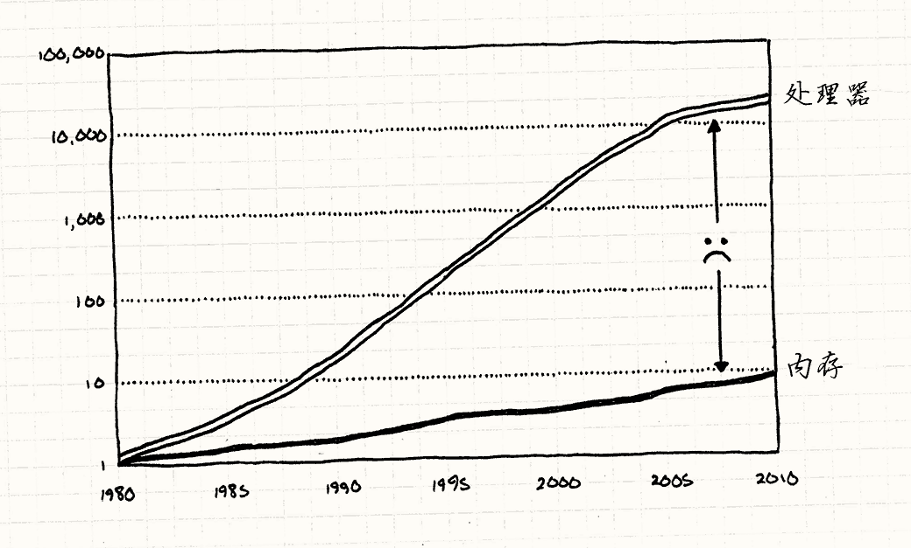
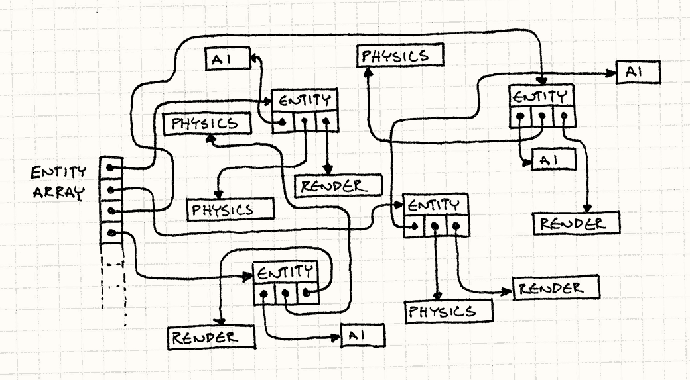

# 数据局部性

## 游戏设计模式 Optimization Patterns

## 意图

*合理组织数据，充分使用 CPU 的缓存来加速内存读取。*

## 动机

我们被欺骗了。 他们一直向我们展示 CPU 速度每年递增的图表，就好像摩尔定律不是观察历史的结果，而是某种定理。 无需吹灰之力，软件凭借着新硬件就可以奇迹般的加速。

芯片*确实*越来越快（就算现在增长的速度放缓了），但硬件巨头没有提到某些事情。 是的，我们可以更快地*处理*数据，但不能更快地*获得*数据。



为了让你超高速的 CPU 刮起指令风暴， 它需要从内存获取数据加载到寄存器。 如你所知，RAM 没有紧跟 CPU 的速度增长，差远了。

借助现代的硬件，要消耗*上百个*周期才能从 RAM 获得一比特的数据。 如果大部分指令需要的数据都需要上百个周期去获取， 那么为什么我们的 CPU 没有在 99%的时间空转着等待数据？

事实上，等待内存读取*确实*消耗很长时间，但是没有那么糟糕。 为了解释为什么，让我们看一看这一长串类比……

### 数据仓库

想象一下，你是小办公室里的会计。 你的任务是拿盒文件，然后做一些会计工作——把数据加起来什么的。 你必须根据一堆只有会计能懂的晦涩逻辑，取出特定标记的文件盒并工作。

感谢辛勤地工作，天生的悟性，还有进取心，你可以在一分钟内处理一个文件盒。 但是这里有一个小小的问题。所有这些文件盒都存储在分离的仓库中。 想要拿到一个文件盒，需要让仓库管理员带给你。 他开着叉车在传送带周围移动，直到找到你要的文件盒。

这会消耗他，认真的，一整天才能完成。 不像你，他下个月就不会被雇佣了。 这就意味着无论你有多快，一天只能拿到一个文件盒。 剩下的时间，你只能坐在那里，质疑自己怎么选了这个折磨灵魂的工作。

一天，一组工业设计师出现了。 他们的任务是提高操作的效率——比如让传送带跑得更快。 在看着你工作几天后，他们发现了几件事情：

*   通常，当你处理文件盒时，下一个需要处理的文件盒就在仓库同一个架子上。

*   叉车一次只取一个文件盒太愚蠢了。

*   在你的办公室角落里还是有些空余空间的。

他们想出来一个巧妙的办法。 无论何时你问仓库要一个盒子，他都会带给你一托盘的盒子。 他给你想要的盒子，以及它周围的盒子。 他不知道你是不是想要这些（而且，根据工作条件，他根本不在乎）； 他只是尽可能的塞满托盘，然后带给你。

无视工作场地的安全，他直接将叉车开到你的办公室，然后将托盘放在办公室的角落。

当你需要新盒子，你需要做的第一件事就是看看它在不在办公室角落的托盘里。 如果在，很好！你只需要几分钟拿起它然后继续计算数据。 如果一个托盘中有五十个盒子，而幸运的你需要*所有*盒子，你可以以五十倍的速度工作。

但是如果你需要的盒子*不在*托盘上，就要一新托盘的盒子。 由于你的办公室里只能放一托盘的盒子，你的仓库朋友只能将旧的拿走，带给你一托盘全新的盒子。

### CPU 的托盘

奇怪的是，这就是现代 CPU 运转的方式。如果还不够明显，你是 CPU。 你的桌子是 CPU 的寄存器，一盒文件就是寄存器能放下的数据。 仓库是机器的 RAM，那个烦人的仓库管理员是从主存加载数据到寄存器的总线。

如果我在三十年前写这一章，这个比喻就到此为止了。 但是芯片越来越快，而 RAM，好吧，“没有跟上”，硬件工程师开始寻找解决方案。 他们想到的是*CPU 缓存*技术。

现代的电脑在芯片内部有一小块存储器。 CPU 从那上面取数据比从内存取数据快得多。 它很小，因为需要放在芯片上，它很快，因为使用的（静态 RAM，或称 SRAM）内存更贵。

这一小片内存被称为*缓存*（特别的，芯片上的被称为*L1 级缓存*）， 在比喻中，它是由托盘扮演的。 无论何时芯片需要从 RAM 取一字节的数据，它自动将一整块内存读入——通常是 64 到 128 字节——然后将其放入缓存。 这些一次性传输的字节被称为*cache line*。


如果你需要的下一字节数据就在这块上， CPU 从缓存中直接读取，比从 RAM 中读取*快得多*。 成功从缓存中找到数据被称为“缓存命中”。 如果不能从中获得而得去主存里取，这就是一次*缓存不命中*。

当缓存不命中时，CPU*空转*——它不能执行下一条指令，因为它没有数据。 它坐在那里，无聊的等待几百个周期直到取到数据。 我们的任务是避免这一点。想象你在优化一块性能攸关的游戏代码，长得像这样：

```
for (int i = 0; i < NUM_THINGS; i++)
{
  sleepFor500Cycles();
  things[i].doStuff();
} 
```

你会做的第一个改动是什么？对了。 将那个无用的，代价巨大的函数调用拿出来。 这个调用等价于一次缓存不命中的代价。 每次跳到内存，都会延误你的代码。

### 等等，数据是性能？

当着手写这一章时，我花费了一些时间制作一个类似游戏的小程序，用于收集缓存使用最好情况和最坏情况。 我想要缓存速度的基准，这样可以得到缓存失效造成的性能浪费。

当看到一些工作的结果时，我惊到了。 我知道这是一个大问题，但眼见为实。 两个程序完成*完全相同*的计算，唯一的区别是它们会造成缓存不命中的数量。 较慢的程序比较快的程序慢*五十*倍。

这让我大开眼界。我一直从*代码*的角度考虑性能，而不是*数据*。 一个字节没有快慢，它是静态的。但是因为缓存的存在，*组织数据的方式直接影响了性能*。

现在真正的挑战是将这些打包成一章内可以讲完的东西。 优化缓存使用是一个很大的话题。 我还没有谈到*指令缓存*呢。 记住，代码也在内存上，而且在执行前需要加载到 CPU 上。 有些更熟悉这个主题的人可以就这个问题写一整本书。

既然你已经在阅读*这本书*了， 我有几个基本技术帮你考虑数据结构是如何影响性能的。

这可以归结成很简单的事情：芯片读内存时总是获得一整块 cache line。 你能从 cache line 读到越多你要的东西，跑得就越快。 所以目标是*组织数据结构，让要处理的数据紧紧相邻。*

换言之，如果你正处理`Thing`，然后`Another`然后`Also`，你需要它们这样呆在内存里：


注意，不是`Thing`，`Another`，和`Also`的*指针*，而是一个接一个的真实数据，。 CPU 读到`Thing`，也会读取`Another`和`Also`（取决于数据的大小和 cache line 的大小）。 当你开始下一个时，它们已经在缓存上了。芯片很高兴，你也很高兴。

## 模式

现代的 CPU 有**缓存来加速内存读取**。 它可以**更快的读取最近访问过的内存的毗邻内存**。 通过**提高内存局部性**来提高性能——保证数据**以处理顺序排列在连续内存上**。

## 何时使用

就像大多数优化方案，使用数据局部性的第一准则是*在遇到性能问题时使用。* 不要将其应用在代码库不经常使用的角落上。 优化代码不会让你过得更轻松，因为其结果往往更加复杂，更加缺乏灵活性。

就本模式而言，还得确认你的性能问题*确实由缓存不命中*引发。 如果代码是因为其他原因而缓慢，这个模帮不上忙。

简单的估算方案是手动添加指令，检查代码中两点间消耗的时间，寄希望于精确的计时器。 为了找到糟糕的缓存使用，你需要使用更加复杂的东西。 你想要知道有多少缓存不命中，又是在哪里发生的。

幸运的是，有现成的工具做这些。 在数据结构上做大手术前，花一些时间了解这些工具是如何工作， 理解它们抛出的一大堆数据（令人惊讶的复杂）是很有意义的。

话虽这么说，缓存不命中*仍会*影响游戏的性能。 虽然不应该花费大量时间提前优化缓存的使用，但是在设计过程中仍要思考数据结构是不是对缓存友好。

## 记住。

软件体系结构的特点之一是*抽象*。 这本书很多的章节都在谈论如何解耦代码块，这样可以更容易的进行改变。 在面向对象的语言中，这几乎总是意味着接口。

在 C++中，使用接口意味着通过指针或者引用访问对象。 但是使用指针就意味在内存中跳跃，这就带来了这章想要避免的缓存不命中。

为了讨好这个模式，你需要牺牲一些宝贵的抽象。 你越围绕数据局部性设计程序，就越放弃继承、接口和它们带来的好处。 没有银弹，只有挑战性的权衡。这就是乐趣所在！

## 示例代码

如果你真的要一探数据局部性优化的深处，那么你会发现有无数的方法去分割数据结构， 将其切为 CPU 更好处理的小块。 为了热热身，我会先从一些最通用的分割方法开始。 我们会在游戏引擎的特定部分介绍它们， 但是（像其他章节一样）记住这些通用方法也能在其他部分使用。

### 连续数组

让我们从处理一系列游戏实体的游戏循环开始。 实体使用了组件模式，被分解到不同的领域——AI，物理，渲染。 这里是`GmaeEntity`类。

```
class GameEntity
{
public:
  GameEntity(AIComponent* ai,
             PhysicsComponent* physics,
             RenderComponent* render)
  : ai_(ai), physics_(physics), render_(render)
  {}

  AIComponent* ai() { return ai_; }
  PhysicsComponent* physics() { return physics_; }
  RenderComponent* render() { return render_; }

private:
  AIComponent* ai_;
  PhysicsComponent* physics_;
  RenderComponent* render_;
}; 
```

每个组件都有相对较少的状态，也许只有几个向量或一个矩阵， 然后会有方法去更新它。这里的细节无关紧要，但是想象一下，大概是这样的：

```
class AIComponent
{
public:
  void update() { /* 处理并修改状态…… */ }

private:
  // 目标，情绪，等等……
};

class PhysicsComponent
{
public:
  void update() { /* 处理并修改状态…… */ }

private:
  // 刚体，速度，质量，等等……
};

class RenderComponent
{
public:
  void render() { /* 处理并修改状态…… */ }

private:
  // 网格，纹理，着色器，等等……
}; 
```

游戏循环管理游戏世界中一大堆实体的指针数组。每个游戏循环，我们都要做如下事情：

1.  为每个实体更新他们的 AI 组件。
2.  为每个实体更新他们的物理组件。
3.  为每个实体更新他们的渲染组件。

很多游戏引擎以这种方式实现：

```
while (!gameOver)
{
  // 处理 AI
  for (int i = 0; i < numEntities; i++)
  {
    entities[i]->ai()->update();
  }

  // 更新物理
  for (int i = 0; i < numEntities; i++)
  {
    entities[i]->physics()->update();
  }

  // 绘制屏幕
  for (int i = 0; i < numEntities; i++)
  {
    entities[i]->render()->render();
  }

  // 其他和时间有关的游戏循环机制……
} 
```

在你听说 CPU 缓存之前，这些看上去完全无害。 但是现在，你得看到这里有隐藏着的不对之处。 这不是在颠簸缓存，这是在四处乱晃然后猛烈地敲击。看看它做了什么：

1.  游戏实体的数组存储的是*指针*，所以为了获取游戏实体，我们得转换指针。缓存不命中。
2.  然后游戏实体有组件的指针。又一次缓存不命中。
3.  然后我们更新组件。
4.  再然后我们退回第一步，为*游戏中的每个实体*做这件事。

令人害怕的是，我们不知道这些对象是如何在内存中布局的。 我们完全任由内存管理器摆布。 随着实体的分配和释放，堆会组织更加乱。



如果我们目标是在游戏地址空间中四处乱转，完成“256MB 内存四晚廉价游”，这也许是一个很好的决定。 但是我们的目标是让游戏跑得尽可能快，而在主存四处乱逛*不是*一个好办法。 记得`sleepFor500Cycles()`函数吗？上面的代码效率和它也差不多了。

我们能做得更好。 第一个发现是，之所以跟着指针去寻找游戏实体，是因为可以立刻跟着*另一个*指针去获得组件。 `GameEntity`本身没有有意义的状态和有用的方法。*组件* 才是游戏循环需要的。

众多实体和组件不能像星星一样散落在黑暗的天空中，我们得脚踏实地。 我们将每种组件存入巨大的数组：一个数组给 AI 组件，一个给物理，另一个给渲染。

就像这样：

```
AIComponent* aiComponents =
    new AIComponent[MAX_ENTITIES];
PhysicsComponent* physicsComponents =
    new PhysicsComponent[MAX_ENTITIES];
RenderComponent* renderComponents =
    new RenderComponent[MAX_ENTITIES]; 
```

让我强调一点，这些都是*组件*的数组，而不是*指向组件的指针*。数据都在那里一个接着一个排列。 游戏循环现在可以直接遍历它们了。

```
while (!gameOver)
{
  // 处理 AI
  for (int i = 0; i < numEntities; i++)
  {
    aiComponents[i].update();
  }

  // 更新物理
  for (int i = 0; i < numEntities; i++)
  {
    physicsComponents[i].update();
  }

  // 绘制屏幕
  for (int i = 0; i < numEntities; i++)
  {
    renderComponents[i].render();
  }

  // 其他和时间有关的游戏循环机制……
} 
```

我们消除了所有的指针追逐。不在内存中跳来跳去，而是直接在三个数组中做直线遍历。


这将一股字节流直接泵到了 CPU 饥饿的肚子里。 在我的测试中，这个改写后的更新循环是之前性能的*50*倍。

有趣的是，我们并没有在这里放弃太多的封装。 是的，游戏循环直接更新的游戏组件而不是通过游戏实体，但在此之前它已经确保了以正确的顺序运行。 即使如此，每个组件的内部还是具有很好的封装性。 它们的封装性取决于自身的数据和方法。我们只是改变了使用它们的方法。

这也不意味着我们摆脱了`GameEntity`。它拥有它组件的指针这一状态仍然得以保持。 它的组件指针现在只是指到了这个数组之中。 对游戏的其他部分，如果你还是想传递一个“游戏实体”，一切照旧。 重要的是性能攸关的游戏循环部分回避了这点，直接获取数据。

### 打包数据

假设我们在做粒子系统。 根据上节的建议，将所有的粒子放在巨大的连续数组中。让我们用管理类封装它。

```
class Particle
{
public:
  void update() { /* 重力，等等…… */ }
  // 位置，速度，等等……
};

class ParticleSystem
{
public:
  ParticleSystem()
  : numParticles_(0)
  {}

  void update();
private:
  static const int MAX_PARTICLES = 100000;

  int numParticles_;
  Particle particles_[MAX_PARTICLES];
}; 
```

系统中的基本更新方法看起来是这样的：

```
void ParticleSystem::update()
{
  for (int i = 0; i < numParticles_; i++)
  {
    particles_[i].update();
  }
} 
```

但实际上不需要同时更新*所有的*粒子。 粒子系统维护固定大小的对象池，但是粒子通常不是同时在屏幕上活跃。 最简单的解决方案是这样的：

```
for (int i = 0; i < numParticles_; i++)
{
  if (particles_[i].isActive())
  {
    particles_[i].update();
  }
} 
```

我们给`Particle`一个标志位来追踪其是否在使用状态。 在更新循环时，我们检查每个粒子的这个标志位。 这会将粒子其他部分的数据也加载到缓存中。 如果粒子*没有*在使用，那么跳过它去检查下一个。 这时粒子加载到内存中的其他数据都是浪费。

活跃的粒子越少，要在内存中跳过的部分就越多。 越这样做，在两次活跃粒子有效更新之间发生的缓存不命中就越多。 如果数组很大又有*很多*不活跃的粒子，我们又在颠簸缓存了。

如果连续数组中的对象不是连续处理的，实际上这个办法也没有太多效果。 如果有太多不活跃的对象需要跳过，就又回到了问题的起点。

鉴于本节的标题，你大概可以猜出答案是什么了。 我们不*监测*活跃与否的标签，我们根据标签*排序*粒子。 将所有活跃的粒子放在列表的前头。 如果知道了这些粒子都是活跃的，就不必再检查这些标识位了。

还可以很容易地追踪有多少活跃的粒子。这样，更新循环变成了这种美丽的东西：

```
for (int i = 0; i < numActive_; i++)
{
  particles[i].update();
} 
```

现在没有跳过*任何*数据。 加载入缓存的每一字节都是需要处理的粒子的一部分。

当然，我可没说每帧都要对整个数组做快排。 这将抵消这里的收益。我们想要的是*保持*数组的顺序。

假设数组已经排好序了——开始时确实如此，因为所有粒子都不活跃——它变成未排序的时候即是粒子被激活或者被反激活时。 我们可以很轻易的处理这两种情况。 当一个粒子激活时，我们让它占据第一个*不*活跃粒子的位置， 将不活跃粒子移动到激活序列的尾端，完成一次交换：

```
void ParticleSystem::activateParticle(int index)
{
  // 不应该已被激活！
  assert(index >= numActive_);

  // 将它和第一个未激活的粒子交换
  Particle temp = particles_[numActive_];
  particles_[numActive_] = particles_[index];
  particles_[index] = temp;

  // 现在多了一个激活粒子
  numActive_++;
} 
```

为了反激活粒子，只需做相反的事情：

```
void ParticleSystem::deactivateParticle(int index)
{
  // 不应该已被激活！
  assert(index < numActive_);

  // 现在少了一个激活粒子
  numActive_--;

  // 将它和最后一个激活粒子交换
  Particle temp = particles_[numActive_];
  particles_[numActive_] = particles_[index];
  particles_[index] = temp;
} 
```

很多程序员（包括我在内）已经对于在内存中移动数据过敏了。 将一堆数据移来移去*感觉*比发送指针要消耗大得多。 但是如果你加上了*解析*指针的代价，有时候这种估算是错误的。 在有些情况下，如果能够保证缓存命中，在内存中移动数据消耗更小。

将粒子根据激活状态保持*排序*——就不需要给每个粒子都添加激活标志位了。 这可以由它在数组中的位置和`numActive_`计数器推断而得。 这让粒子对象更小，意味着在 cache lines 中能够打包更多数据，能跑得更快。

但是并非完事如意。 你可以从 API 看出，我们放弃了一定的面向对象思想。 `Particle`类不再控制其激活状态了。 你不能在它上面调用`activate()`因为它不知道自己的索引。 相反，任何想要激活粒子的代码都需要接触到粒子*系统*。

在这个例子中，将`ParticleSystem`和`Particle`这样牢牢绑一起没有问题。 我将它们视为两个物理*类*的的组合概念。 这意味着粒子只在*特定*的粒子系统中有意义。 在这种情况下，很可能是粒子系统在复制和销毁粒子。

### 冷/热 分割

这里是最后一种取悦缓存的技术例子。 假设某些游戏实体有 AI 控件。 其中包括一些状态——现在正在播放的动画，正在前往的方向，能量等级，等等——这些东西每帧都会发生变化。 就像这样：

```
class AIComponent
{
public:
  void update() { /* ... */ }

private:
  Animation* animation_;
  double energy_;
  Vector goalPos_;
}; 
```

但它也有一些罕见事件的状态。 它存储了一些数据，描述它遭到猎枪痛击后会掉落什么战利品。 掉落数据在实体的整个生命周期只会使用一次，就在它结束的前一霎那：

```
class AIComponent
{
public:
  void update() { /* ... */ }

private:
  // 之前的字段……
  LootType drop_;
  int minDrops_;
  int maxDrops_;
  double chanceOfDrop_;
}; 
```

假设我们遵循前面的章节，那么当我们更新 AI 组件时，就穿过了一序列打包好的连续数组。 那个数据包含所有掉落物的信息。 这让每个组件都变得更大了，这就减少了我们能够加载到 cache line 中的组件个数。 每帧的每个组件都会将战利品数据加载到内存中去，即使我们根本不会去使用它。

这里的解决方案被称为“冷/热分割”。这个点子源于将数据结构划分为两个分离的部分。 第一部分保存“热”数据，那些每帧都要调用的数据。 剩下的片段被称为“冷”数据，在那里的存储使用的次数较少的数据。

这里的热部分是 AI 组件的*主体*。 它是使用最多的部分，所以我们不希望解析指针去找到它。 冷组件可以被归到一边去，但是我们还是需要访问它，因此我们在热组件中包含一个指向它的指针，就像这样：

```
class AIComponent
{
public:
  // 方法……
private:
  Animation* animation_;
  double energy_;
  Vector goalPos_;

  LootDrop* loot_;
};

class LootDrop
{
  friend class AIComponent;
  LootType drop_;
  int minDrops_;
  int maxDrops_;
  double chanceOfDrop_;
}; 
```

现在我们每帧都要遍历 AI 组件，加载到内存的数据只包含必需的数据（以及那个指向冷数据的指针）。

你可以看到事情是怎么变得模棱两可的。 在我的例子中，哪些是冷数据，哪些是热数据是很明确的，但是在真实的游戏中一般很少可以这么明显的分割。 如果你有一部分数据，实体在一种状态下会经常使用，另一种状态则不会，那该怎么办？ 如果实体只在特定关卡时使用一块特定的数据，又该怎么办？

做这种优化有时就是在走钢丝。 很容易陷入其中，消耗无尽的时间把数据挪来挪去看看性能如何。 需要通过实践来掌握在哪里付出努力。

## 设计决策

这章更接近于介绍一种思维定势——将数据的组织模式作为游戏性能的关键部分。 实际上具体的设计空间是开放的。 你可以让数据局部性影响整个架构，或者只在局部几个核心数据结构上使用这模式。

最需要关心的问题是在何时何地使用这个模式，但是这里还有其他几个问题需要回答。

### 你如何处理多态？

到了现在，我们避开了子类和虚方法。 我们假设有打包好的*同类*对象。 这种情况下，我们知道它们有同样的大小。 但是多态和动态调用也是有用的工具。我们如何调和呢？

*   *别这么干*

    最简单的解决方案是避免子类，至少在做内存优化的部分避免使用。 无论如何，软件工程师文化已经和大量使用继承渐行渐远了。

    *   *简洁安全。* 你知道在处理什么类，所有的对象都是同样大小。
    *   *更快* 动态调用意味着在跳转表中寻找方法，然后跟着指针寻找特定的代码。 这种消耗在不同硬件区别很大，但动态调用总会带来*一些*代价。
    *   *不灵活* 当然，使用动态调用的原因就是它给了在不同对象间展示不同的行为的强大能力。 如果游戏想要不同的实体使用独特的渲染、移动或攻击，虚方法是处理它的好方法。 把它换成包含巨大的`switch`的非虚方法会超级慢。
*   *为每种类型使用分离的数组：*

    我们使用多态，这样即使不知道对象的类型，也能引入行为。 换言之，有了一包混合的东西，我们想要其中每个对象在接到通知时去做自己的事情。

    但是这提出来一个问题：为什么开始的时候要把它们混在一起呢？ 取而代之，为什么不为每种类型保持一个单独的集合呢？

    *   *对象被紧密的排列着。* 每个数组只包含同类的对象，这里没有填充或者其他的古怪。

    *   *静态调度*。 一旦获得了对象的类型，你不必在所有时候使用多态。你可以使用常规的非虚方法调用。

    *   *得追踪每个集合*。 如果你有很多不同类型，这种管理每种类型分别的数组可是件苦差事。

    *   *得明了每一种类型*。 由于你为每种类型管理分离的集合，你无法解耦*类型集合*。 多态的魔力之一在于它是*开放的*——与一个接口交互的代码可以与实现此接口的众多类型解耦。

*   *使用指针的集合：*

    如果你不太担心缓存，这是自然的解法。 只要一个指针数组指向基类或者接口类型，你就获得了想要的多态，以及想多大多大的对象。

    *   *灵活*。这样构建集合的代码可以与任何支持接口的类工作。完全开放。

    *   *对缓存不友好*。 当然，我们在这里讨论其他方案的原因就是指针跳转导致的缓存不友好。 但是，记住，如果代码不是性能攸关的，这很有可能是行得通的。

### 游戏实体是如何定义的？

如果与组件模式串联使用此模式， 你会获得多个数组，包含组成游戏实体的组件。 游戏循环会在那里直接遍历它们，所以实体本身就不是那么重要了， 但是在其他你想要与“实体”交互的代码库部分，一个概念上的实体还是很有用的。

这里的问题是它该如何被表示？如何追踪这些组件？

*   *如果游戏实体是拥有它组件指针的类：*

    这是第一个例子中的情况。纯 OOP 解决方案。 你得到了`GameEntity`类，以及指向它拥有的组件的指针。 由于它们只是指针，并不知道这些组件是如何在内存中组织的了。

    *   *你可以将实体存储到连续数组中。* 既然游戏实体不在乎组件在哪里，你可以将组件好好打包，组织数组中，来优化遍历。

    *   *拿到一个实体，可以轻易的获得它的组件。* 就在一次指针跳转后的位置。

    *   *在内存中移动组件很难。* 当组件启用或者关闭时，你可能想要在数组中移动它们，保证启用的组件位于前列。 如果在实体中有指针指向组件时直接移动该组件，一不小心指针就会损毁。你得保证同时更新指向组件的指针。

*   *如果游戏实体是拥有组件 ID 的类：*

    使用裸指针的挑战在于内存中移动它很难。你可以使用更加直接的方案：使用 ID 或者索引来*查找*组件。

    ID 的实际查找过程是由你决定的，它可能很简单，只需为每个实体保存独特的 ID，然后遍历数组查找， 或者更加复杂地使用哈希表，将 ID 映射到组件现有位置。

    *   *更复杂*。 ID 系统不是高科技，但是还是需要比指针多做些事情。你得实现它然后排除漏洞，这里需要消耗内存。

    *   *更慢*。 很难比直接使用指针更快。需要使用搜索或者哈希来帮助实体找到它的组件。

    *   *你需要访问组件“管理器”*。 基本思路是用抽象的 ID 标识组件。你可以使用它来获得对应组件对象的引用。 但是为了做到这点，你需要让 ID 有办法找到对应的组件。 正是包裹着整个连续组件数组的对所要做的。

        通过裸指针，如果你有游戏实体，你可以直接找到组件，而这种方式你需要接触游戏实体和*组件注册器*。

*   *如果游戏实体*本身*就是一个 ID：*

    这是某些游戏引擎使用的新方式。一旦实体的行为和状态被移出放入组件，还剩什么呢？ 事实上，没什么了。实体干的唯一事情就是将组件连接在一起。 它的存在只是为了说明：*这个*AI 组件和*这个*物理组件还有*这个* 渲染组件合起来， 定义了一个存在于游戏世界中的实体。

    这很重要，因为组件要相互交互。 渲染组件需要知道实体位于何处，而位置信息也许是物理组件的属性。 AI 组件想要移动实体，因此它需要对物理组件施加力。每个组件都需要以某种方式获得同一实体中的其他组件。

    有些聪明人意识到你需要的唯一东西就是 ID。不是实体知道组件，而是组件知道实体。 每个组件都知道拥有它实体的 ID。当 AI 组件需要它所属实体的物理组件时，它只需要找到那个拥有同样 ID 的物理组件。

    你的实体*类*整个消失了，取而代之的是围绕数字的华丽包装。

    *   *实体很小*。当你想要传递游戏实体的引用时，只需一个简单的值。

    *   *实体是空的*。当然，将所有东西移出实体的代价是，你*必须*将所有东西移出。 不能再拥有组件独有的状态和行为，这样更加依赖于组件模式。

    *   *不必管理实体的生命周期。* 由于实体只是内置值类型，不需要被显式分配和释放。当它所有的组件都被释放时，对象就隐式“死亡”了。

    *   *查找实体的某一组件也许会很慢。* 这和前一方案有相同的问题，但在另一个方向上。 为了找某个实体的组件，你需要给 ID 做对象映射。这一过程消耗也许很大。

        但是，这一次*是*性能攸关的。 在更新时，组件经常与它的兄弟组件交互，因此你需要经常的查找组件。 解法是让组件在数组中的索引作为实体的“ID”。

        如果每个实体都是拥有相同组件的集合，那么组件数组就是完全同步的。 组件数组三号位的 AI 组件与在*物理组件*数组三号位的组件相关联。

        但是，记住，这*强迫*你保持这些数组平行。 如果你想要用不同的方式排序或者打包它们就会变得很难。 你也许需要一些没有物理组件或者没有渲染组件的实体。 而它们仍保证与其他组件同步，没有办法独自排序物理组件数组和渲染组件数组。

## 参见

*   这一章大部分围绕着组件模式。 这种模式的数据结构绝对是为缓存优化的最常见例子。事实上，使用组件模式让这种优化变得容易了。 由于实体是按“领域”（AI，物理，等等）更新的，将它们划出去变成组件，更容易将它们保存为对缓存友好的合适大小。

    但是这不意味你*只能*为组件使用这个模式！ 任何需要接触很多数据的关键代码，考虑数据局部性都是很重要的。

*   Tony Albrecht 的 [《Pitfalls of Object-Oriented Programming》](http://research.scee.net/files/presentations/gcapaustralia09/Pitfalls_of_Object_Oriented_Programming_GCAP_09.pdf) 也许是最广为人知的内存友好游戏设计指南。它让很多人（包括我！）明白了数据结构对性能是多么重要。

*   几乎同时，Noel Llopis 关于同一话题写了一篇 [非常有影响力的博客](http://gamesfromwithin.com/data-oriented-design)。

*   这一模式几乎完全得益于同类对象的连续存储数组。 随着时间的推移，你也许需要向那个数组增加或删除对象。 对象池模式正是关于这一点。

*   游戏引擎[Artemis](http://gamadu.com/artemis/)是首个也是最著名的为游戏实体使用简单 ID 的游戏框架。