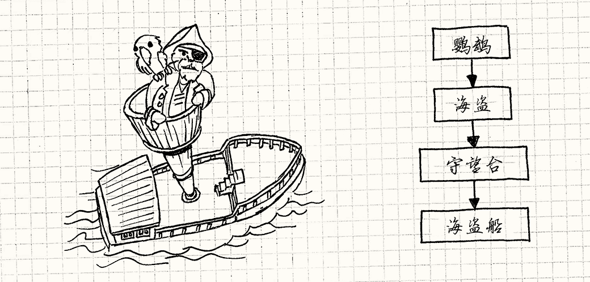
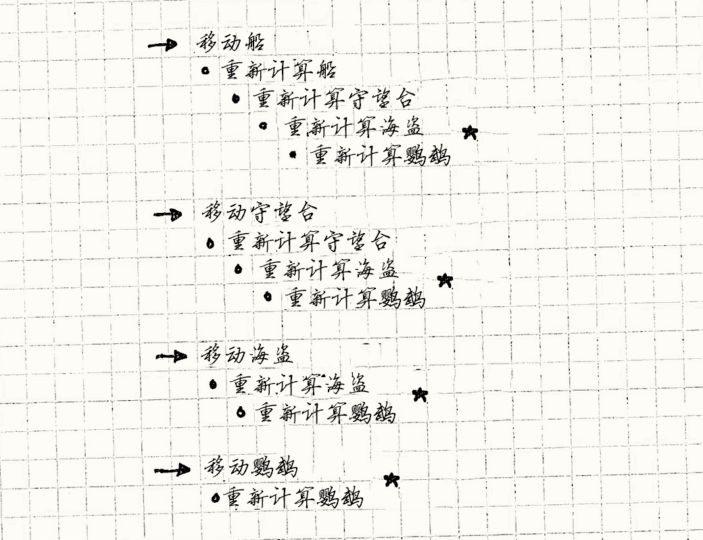
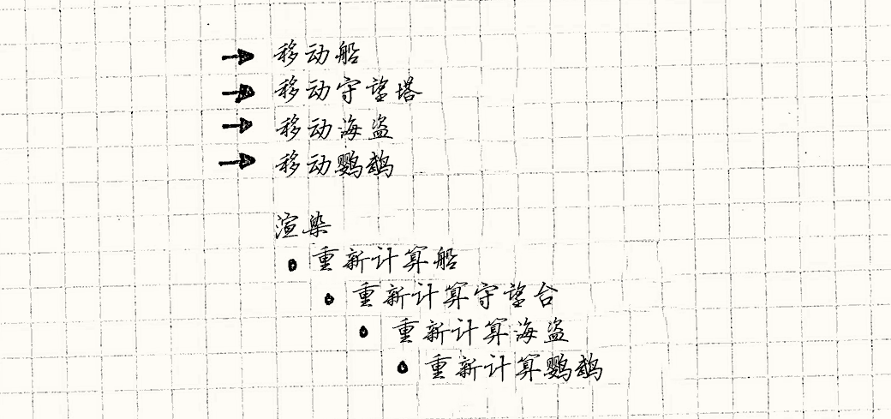

# 脏标识模式

## 游戏设计模式 Optimization Patterns

## 意图

*将工作延期至需要其结果时才去执行，避免不必要的工作。*

## 动机

很多游戏有*场景图*。 那是一个巨大的数据结构，包含了游戏世界中所有的对象。 渲染引擎使用它决定在屏幕哪里画东西。

最简单的实现中，场景图只是对象列表。 每个对象都有模型，或者其他的原始图形，以及*变换*。 变换描述了对象在世界中的位置，方向，拉伸。 为了移动或者旋转对象，只需简单地改变它的变换。

当渲染系统描绘对象，它取出对象的模型，对其应用变换，然后将渲染到游戏世界中。 如果我们有场景*包*而不是场景*图*，那就是这样了，生活很简单。

但是，大多数场景图都是*分层的*。 场景图中的对象也许拥有锚定的父对象。 这种情况下，它的变换依赖于*父对象*的位置，而不是游戏世界上的绝对位置。

举个例子，想象游戏世界中有一艘海上的海盗船。 桅杆的顶端有瞭望塔，瞭望塔中有海盗，海盗肩上有鹦鹉。 船本身的变换定位船在海上的位置。瞭望塔的变换定位它在船上的位置，诸如此类。



这样的话，当父对象移动时，子节点也自动的跟着移动。 如果改变了船的自身变换，瞭望塔，海盗和鹦鹉都会随之变动。 如果当船移动时，就得手动调整每个对象的变换来防止滑动，那可相当令人头疼。

但是为了在屏幕上真正的描绘鹦鹉，我需要知道它在世界上的绝对位置。 我会调用父节点相关的变换对对象的*自身变换*进行变换。 为了渲染对象，我需要知道对象的*世界变换*。

### 自身变换和世界变换

计算对象的世界变换很直接——从它的父根节点一直追踪到对象，将经过的所有变换绑在一起。 换言之，鹦鹉的世界变换如下：


我们每帧需要为游戏世界的每个对象计算世界变换，因此哪怕每个模型只有一部分矩阵乘法， 它也是代码影响性能的关键所在。 保持它们及时更新是有技巧的，因为当父对象移动时，它影响自己的世界变换，并递归影响所有子节点。

最简单的方法是在渲染时计算变换。 每一帧，我们从最高层递归遍历整个场景图。 我们计算每个对象的世界变换然后立刻绘制它。

但这完全是在浪费 CPU！ 很多游戏世界的对象*不是*在每帧都移动。 想想那些构成关卡的静态几何图形。 在没有改变的情况下每帧计算它们的世界变换是一种浪费。

### 缓存世界变换

明显的解决方案是*缓存*它。 在每个对象中，我们存储它的自身变换和世界变换。 当我们渲染时使用预计算的世界变换。 如果对象从未移动，缓存的变换永远是最新的变换，每个人都很开心。

当一个对象*确实*移动了，简单的解决方式是之后就更新世界变换。 但是不要忘记层次性！当父节点移动时，我们得计算它的世界变换并*递归计算它所有的子对象*。

想象游戏中忙碌的时刻。 在一帧中，船在海上颠簸，瞭望塔在风中摇晃，海盗被甩到了边缘，而鹦鹉撞上了他的脑袋。 我们改变了四个自身变换。如果每次自身变换都立即更新世界变换，会发生什么？



我只移动四个对象，但我们做了*十次*世界变换计算。 那就有六次在被渲染器使用前浪费了。 我们计算了鹦鹉的世界变换*四*次，但它只需渲染一次。

问题在于世界变换也许会依赖于多个自身变换。 由于我们*每次*变化就立即重新计算，当自身变换依赖的多个世界变换在同一帧发生变化时， 我们就对同一变换做了多次重新计算。

### 延期重计算

我们会通过解耦自身变换和世界变换的更新来解决这个问题。 这让我们先在一次批处理中改变自身变换，在这些改变完成*之后*，在渲染它之前，重新计算它们世界变换。

为了做到这点，我们为图中的每个对象添加*标识*。 “标识”和“位”在编程中密切相关——都代表处在两种状态之一的一小块数据。 我们称之为“真”和“假”，或者有时称为“设置”和“清除”。 我之后会交替使用它们。

当自身变换改变了，我们设置它。 当我们需要对象的世界变换时，我们检查这位。 如果它被设置了，计算世界变换然后清除标识。 那个标识代表着，“世界变换过时了吗？” 由于它们没有被清除，这种“过时的杂乱”被称为“脏”。 也就是*脏标识*。“脏位”也是这模式通常使用的名字，但是我决定使用不那么下流的称呼。

如果我们运用这个模式，然后移动之前例子中所有对象，那么游戏最终是这样的：



这就是你能希望得到的最好结果了——每个受影响对象的世界变换只被计算一次。 使用仅仅一位数据，这个模式为我们做了以下事情：

*   它将对象的父节点链上的众多的自身变换变化归并成对象上的一次计算。

*   它避免了在没有移动的对象上重新计算。

*   还有一个小小的意外收获：如果对象在渲染前被删除了，不必再计算它的世界变换。

## 模式

一组**原始数据**随着时间变化而改变。 使用**昂贵的过程**推定一组**导出数据**。 一个**“脏”标识**追踪导出数据是否与原始数据保持一致。 它在**原始数据改变时被设置。** 如果导出数据被请求时，该标识被设置了，那么**重新计算并清除标识** 否则的话，使用之前**缓存的导出数据**。

## 何时使用

与这本书中的其他模式相比，这个模式解决了一个非常特殊的问题。 同时，就像其他优化一样，只在性能问题足够大时，再使用这一模式增加代码的复杂度。

脏标识在两种任务上应用：“计算”和“同步”。 在两种情况下，从原始数据变换到导出数据消耗很多时间，或者有很多其他方面的消耗。

在我们的场景图例子中，这个过程非常缓慢是因为需要执行很多数学运算。 在同步上使用这个模式是另一个应用场景， 导出数据在*别的地方*——在磁盘上或者在网络另一头的终端机上——从点 A 传输到点 B 消耗很大。

这里是一些其他的应用场景：

*   **原始数据的变化速度远高于导出数据的使用速度。** 避免在导出数据使用前原始数据多次变化带来的不必要计算。 如果你总在原始数据变化后立即使用导出数据，这个模式无法帮忙。

*   **增量更新十分困难。** 假设海盗船只能携带特定数量的战利品。我们需要获取携带事物的总重量。 我们*可以*使用这个模式，然后为总重量设脏标识。每次添加或者移除一些战利品，我们设置这个标识。 当我们需要总量时，将所有战利品重量加起来，然后清除标识。

    但是更简单的解决方法是*保存计算总量*。 当我们添加或删除事物，直接从现在的总重量添加或者删除它的重量。 如果我们可以*承担得起消耗*，保持导出数据的更新，那么更好的选择是不用这个模式， 每次需要时重新计算导出数据。

这听起来脏标识很少有能使用的时候，但你总会找到一两个部分它能帮得上忙。 直接在你的游戏代码库中搜索“dirty”，通常会发现这个模式的使用之处。

## 记住

哪怕是在说服自己这个模式在这里很恰当之后，这里还有一些瑕疵可能会让你不爽。

### 延期太久是有代价的

这个模式将某些耗时的工作延期到真正需要结果的时候，但是当它要的时候，通常是*现在就要*。 但是我们使用这个模式的原因是计算很耗时！

在例子中，这不是问题，因为我们还是可以在一帧之内计算世界坐标，但是可以想象其他情况下，工作需要消耗可观时间。 如果玩家想要结果时才*开始*计算，这会引起不愉快的卡顿。

延期的另一个问题是，如果有东西出错了，你可能根本无法弥补。 当你使用这个模式将状态持久化时，问题更加突出。

举个例子，文本编辑器知道文档有“没保存的修改”。 在文件标题栏的小点或者星号就是可见的脏标识。 原始数据是在内存中打开的文档，推导数据是在磁盘上的文件。


很多程序直到文档关闭或者应用退出才保存到磁盘上。 在大多数情况下这很好，但是如果一不小心踢到了插线板，你的主要工作也就随风而逝了。

在后台自动保存备份的编辑器弥补了这一失误。 自动保存的频率保持在崩溃时不丢失太多数据和频繁保存文件之间。

### *每次* 状态改变你都得保证设置标识。

由于推导数据是从原始数据推导而来的，它本质上是缓存。 无论何时缓存了数据，都是需要保证*缓存一致性*——在缓存与原始数据不同步时通知之。 在这个模式上，这意味着在*任何*原始数据变化时设置脏标识。

一处遗漏，你的程序就使用了错误的推导数据。 这引起了玩家的困惑和非常难以追踪的漏洞。 当使用这个模式时，你也得注意，任何修改了原始数据的代码都得设置脏标识。

一种解决它的方法是将原始数据的修改隐藏在接口之后。 任何想要改变状态的代码都要通过 API，你可以在 API 那里设置脏标识来保证不会遗漏。

### 得将之前的推导数据保存在内存中。

当推导数据被请求而脏标识*没有*设置，就使用之前计算出的数据。 这很明显，但这需要在内存中保存推导数据，以防之后再次使用。

如果你没有使用这个模式，可在需要时计算推导数据，使用完后释放。 这避免将其存储回内存的开销，而代价是每次使用都需要重新计算。

就像很多优化一样，这种模式以内存换速度。 通过在内存中保存之前计算的结果，避免了在它没有改变的情况下重新计算。 这种交易在内存便宜而计算昂贵时是划算的。 当你手头有更多空闲的时间而不是内存的时候，最好在需求时重新计算。

## 示例代码

假设我们满足了超长的需求列表，看看在代码中是如何应用这个模式的。 就像我之前提到的那样，矩阵运算背后的数学知识超出了本书的范围，因此我将其封装在类中，假设在某处已经实现了：

```
class Transform
{
public:
  static Transform origin();

  Transform combine(Transform& other);
}; 
```

这里我们唯一需要的操作就是`combine()`， 这样可以将父节点链上所有的自身变换组合起来获得对象的世界变换。 同样有办法来获得原点变换——通常使用一个单位矩阵，表示没有平移，旋转，或者拉伸。

下面，我们勾勒出场景图中的对象类。这是在应用模式*之前*最低限度所需的东西：

```
class GraphNode
{
public:
  GraphNode(Mesh* mesh)
  : mesh_(mesh),
    local_(Transform::origin())
  {}

private:
  Transform local_;
  Mesh* mesh_;

  GraphNode* children_[MAX_CHILDREN];
  int numChildren_;
}; 
```

每个节点都有自身变换描述了它和父节点之间的关系。 它有代表对象图形的真实网格。（将`mesh_`置为`NULL`来处理子节点的不可见节点。） 最终，每个节点都包含一个有可能为空的子节点集合。

通过这样，“场景图”只是简单的`GraphNode`，它是所有的子节点（以及孙子节点）的根。

```
GraphNode* graph_ = new GraphNode(NULL);
// 向根图节点增加子节点…… 
```

为了渲染场景图，我们需要的就是从根节点开始遍历节点树，然后使用正确的世界变换为每个节点的网格调用函数：

```
void renderMesh(Mesh* mesh, Transform transform); 
```

我们不会直接在这里实现，但真正的实现中也是做渲染需要的事，将网格绘制在世界上给定的位置。 如果对场景图中的每个节点都正确有效地调用，这就愉快地完成了。

### 尚未优化的遍历

让我们开始吧，我们做一个简单的遍历，在渲染需要时去计算所有的世界位置。 这没有优化，但它很简单。我们添加一个新方法给`GraphNode`：

```
void GraphNode::render(Transform parentWorld)
{
  Transform world = local_.combine(parentWorld);

  if (mesh_) renderMesh(mesh_, world);

  for (int i = 0; i < numChildren_; i++)
  {
    children_[i]->render(world);
  }
} 
```

使用`parentWorld`将父节点的世界变换传入节点。 这样，需要获得*这个*节点的世界变换只需要将其和节点的自身变换相结合。 不需要*向上*遍历父节点去计算世界变换，因为我们可以在*向下*遍历时计算。

我们计算了节点的世界变换，将其存储到`world`，如果有网格，渲染它。 最后我们遍历进入子节点，传入*这个*节点的世界变换。 无论如何，这是一个紧密的，简单的遍历方法。

为了绘制整个场景图，我们从根节点开始整个过程。

```
graph_->render(Transform::origin()); 
```

### 让我们变脏

所以代码做了正确的事情——它在正确的地方渲染正确的网格——但是它没有高效地完成。 它每帧在图中的每个节点上调用`local_.combine(parentWorld)`。 让我们看看这个模式是如何修复这一点的。首先，我们给`GraphNode`添加两个字段：

```
class GraphNode
{
public:
  GraphNode(Mesh* mesh)
  : mesh_(mesh),
    local_(Transform::origin()),
    dirty_(true)
  {}

  // 其他方法……

private:
  Transform world_;
  bool dirty_;
  // 其他字段……
}; 
```

`world_`字段缓存了上一次计算出来的世界变换，和`dirty_`这个脏标识字段。 注意标识初始为`true`。当我们创建新节点时，我们还没有计算它的世界变换。 初始时，它与自身变换不是同步的。

我们需要这个模式的唯一原因是对象可以*移动*，因此让我们添加对这点的支持：

```
void GraphNode::setTransform(Transform local)
{
  local_ = local;
  dirty_ = true;
} 
```

这里重要的部分是同时设置脏标识。我们忘了什么吗？是的——子节点！

当父节点移动时，它所有子节点的世界坐标也改变了。 但是这里，我们不设置它们的脏标识。 我们*可以*那样做，但是那要递归，很缓慢。我们可以在渲染时做点更聪明的事。让我们看看：

```
void GraphNode::render(Transform parentWorld, bool dirty)
{
  dirty |= dirty_;
  if (dirty)
  {
    world_ = local_.combine(parentWorld);
    dirty_ = false;
  }

  if (mesh_) renderMesh(mesh_, world_);

  for (int i = 0; i < numChildren_; i++)
  {
    children_[i]->render(world_, dirty);
  }
} 
```

这与原先的原始实现很相似。 关键改变是我们在计算世界变换之前去检查节点是不是脏的，然后将结果存在字段中而不是本地变量中。 如果节点是干净的，我们完全跳过了`combine()`，使用老的但是正确的`world_`值。

这里的技巧是`dirty`参数。 如果父节点链上有任何节点是脏的，那么就是`true`。 当我们顺着层次遍历下来时，`parentWorld`用同样的方式更新它的世界变换，`dirty`追踪父节点链的是否有脏。

这让我们避免递归地调用`setTransform()`标注每个子节点的`dirty_`标识。 相反，我们在渲染时将父节点的脏标识传递给子节点，然后看看是否需要重新计算它的世界变换。

这里结果正是我们需要的： 改变节点的自身变换只是一些声明，渲染世界时只计算从上一帧以来所需的最小数量的世界变换。

## 设计决策

这种模式非常具体，所以只需注意几点：

### 什么时候清空脏标识？

*   **当结果被请求时？**

    *   *如果不需要结果，可以完全避免计算。* 如果原始数据变化的速度比推导数据获取的速度快得多，这效果很明显。

    *   *如果计算消耗大量时间，这会造成可察觉的卡顿。* 将工作推迟到玩家想要结果的时候会严重影响游戏体验。 这部分工作一般足够快，不会构成问题，但是如果构成问题，你就需要提前做这些工作。

*   **在精心设计的检查点处：**

    有时候，某个时间点或在游戏过程中很自然的需要推迟处理。 例如，只有海盗船驶入港口才会去保存游戏。 如果同步点不是游戏的机制，我们会将这些工作隐藏在加载画面或者过场动画之后。

    *   *这种工作不会影响到玩家体验。* 不像前一个选项，游戏在紧张运行时，你总能转移玩家的注意力。

    *   *在工作时丧失了控制权。* 这和前一个选项相反。你在处理时能进行微观控制，确保有效优雅地处理它。

        你*不能*保证玩家真的到了检查点或者满足了定义的条件。 如果他们在游戏中迷失了，或者游戏进入了奇怪的状态，最终工作会推迟得超乎预料的晚。

*   *在后台处理：*

    通常情况下，你为第一次更改时启动固定时长的计时器，然后在计时器到时间后处理之间的所有变化。

    *   *可以控制工作进行的频率。* 通过调节计时器，可以保证它发生的像预期一样频繁（或者不频繁）。

    *   *更多的冗余工作。* 如果原始状态在计时器运行之间只改变了很少的部分，最终大部分处理的都是没有改变的数据。

    *   *需要支持异步工作。* 在“后台”处理数据意味着玩家可以同时继续做事。 这就意味着你将会需要线程或者其他并行支持，这样游戏在处理数据的同时仍然可以继续游玩。

        由于玩家很可能与处理中的状态交互，你也需要考虑保持并行修改的安全性。

### 脏追踪的粒度有多细？

假设我们的海盗游戏允许玩家建造并个性化自己的船。 船在线时会自动保存，这样玩家可以离线后恢复。 我们使用脏标识记录船的哪块甲板被修改了并需要发送到服务器。 每一块发送给服务器的数据都包括了修改的数据和一些描述改动发生在何处的元数据。

*   **如果粒度更细：**

    假设你为甲板上的每个小木板都拍上一个脏标识。

    *   *你只需处理真正改变的数据。* 你只将船上修改了的数据发送到服务器。
*   **如果粒度更粗：**

    或者，我们可以为每层甲板关联一个脏标识。改变它上面的任何东西都会让整个甲板变脏。

    *   *最终需要处理没有变化的数据。* 在甲板上添加一个桶，就要将整层甲板发送到服务器。

    *   *用在存储脏标识上的内存更少。* 为甲板上添加十个桶只需要一位来追踪。

    *   *固定开销花费的时间更少。* 当处理某些修改后的数据时，通常处理数据之前有些固定的工作要做。 在这个例子中，是确认船上改动在哪里的元数据。 处理的块越大，那么要处理的数量就越少，这就意味着有更小的开销。

## 参见

*   在游戏之外，这个模式在像[Angular](http://angularjs.org/)的浏览器方向框架中是很常见的。 它们使用脏标识来追踪哪个数据在浏览器中被改变了，需要将其推向服务器。

*   物理引擎追踪哪些对象在运动中哪些在休息。 由于休息的骨骼直到有力施加在上面才会移动，在被碰到时才会需要处理。 “正在移动”就是一个脏标识，标注哪个对象上面有力施加并需要物理解析。