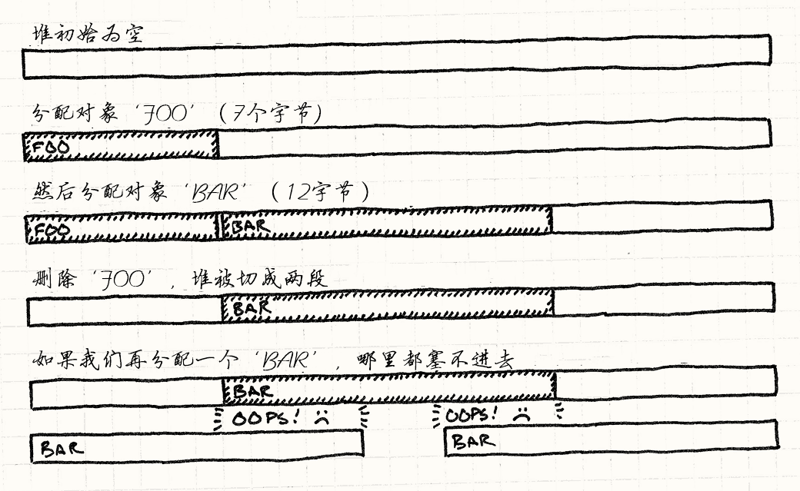

# 对象池模式

## 游戏设计模式 Optimization Patterns

## 意图

*放弃单独地分配和释放对象，从固定的池子中重用对象，以提高性能和内存使用率*

## 动机

我们在处理游戏的视觉效果。 当英雄释放了法术，我们想要在屏幕上爆发闪光。 这需要调用*粒子系统*，产生动态的闪烁图形，显示动画直到图形消失。

由于一次简单的魔杖挥舞就能产生成百上千的粒子，系统需要能够快速生成它们。 更重要的是，我们需要保证创建和销毁这些粒子不会造成*内存碎片*。

### 碎片的诅咒

为游戏主机或者移动设备编程在许多方面比为普通的计算机编程更像是嵌入式编程。 内存紧张，玩家希望游戏能如岩石般稳定运行，压缩内存的管理器很难有效。 在这种环境下，内存碎片是致命的。

碎片意味着在堆中的空余空间被打碎成了很多小的内存碎片，而不是大的连续内存块。 *总共的* 可用内存也许很大，但是最长的*连续*空间可能难以忍受的小。 假设我们有十四个空余字节，但是被一块正在使用的内存分割成了两个七字节的碎片。 而我们尝试分配十二字节的对象，那么就会失败。屏幕上不会有更多的闪烁火花了。



哪怕碎片化发生得不频繁，它也仍会逐渐把堆变成了有空洞和裂隙的不可用泡沫，最终完全无法运行游戏。

### 兼得鱼和熊掌

由于碎片化和可能很慢的内存分配，游戏中何时何处管理内存通常需要十分小心。 一个简单又有效的办法是——游戏开始时取一大块内存，然后直到游戏结束才去释放它。 但是这对要在游戏运行时创建和销毁事物的系统是痛苦的。

使用对象池能让我们兼得鱼和熊掌。 对内存管理器，我们只需要将一大块内存分出来，保持在游戏运行时不释放它。 对于池的使用者，我们可以简单的构造析构我们想要的内容对象。

## 模式

定义一个**池**对象，其包含了一组**可重用对象*。 其中每个可重用对象都支持**查询“使用中”状态**，说明它是不是“正在使用”。 池被初始化时，它就创建了整个对象集合（通常使用一次连续的分配），然后初始化所有对象到“不在使用中”状态。

当你需要新对象，向池子要一个。 它找到一个可用对象，初始化为“使用中”然后返回。 当对象不再被需要，它被设置回“不在使用中”。 通过这种方式，可以轻易的创建和销毁对象而不必分配内存或其他资源。

## 何时使用

这个模式广泛应用于可见的事物上，比如游戏实体和视觉效果， 但是它也可在不那么视觉化的数据结构上使用，比如正在播放的声音。 在以下情况中使用对象池：

*   需要频繁创建和销毁对象。

*   对象大小相仿。

*   在堆上进行对象内存分配十分缓慢或者会导致内存碎片。

*   每个对象都封装了像数据库或者网络连接这样很昂贵又可以重用的资源。

## 记住

你通常依赖垃圾回收机制或者`new`和`delete`来处理内存管理。 通过使用对象池，你是在说，“我知道如何更好地处理这些字节。” 这就意味着处理内存的责任落到了你头上。

### 池可能在不需要的对象上浪费内存

对象池的大小需要根据游戏的需求设置。 当池子太*小*时，很明显需要调整（没有什么比崩溃更能获得你的注意力了）。 但是小心池子没有太*大*。更小的池子提供了空余的内存做其他有趣的事情。

### 同时只能激活固定数量的对象

在某种程度上这是好事。 将内存按不同的对象类型划分单独池子保证了这点。 举个例子，一连串爆炸不会让粒子系统消耗掉*所有*可用内存，然后阻碍创建新敌人这样的关键事件。

尽管如此，这也意味着试图从池子重用对象可能会失败，因为它们都在使用中。 这里有几个常见对策：

*   *完全阻止这点。* 这是通常的“修复”：增加对象池的大小，这样无论用户做什么，它们都不会溢出。 对于重要对象，比如敌人或游戏道具，这通常是正确的选择。 也许没有“正确的”方法来处理玩家抵达关底时创建巨大 Boss 内存不足的问题，所以最聪明的办法就是保证这不发生。

    这个的副作用是强迫你为那些只在一两个罕见情况下需要的对象分配过多的内存。 因此，固定大小的对象池也许不对所有的游戏状态都适用。 举个例子，某些关卡也许需要更多的效果而其他的需要声音。 在这种情况下，考虑为每个场景调整对象池的大小。

*   *就不要创建对象了。* 这听起来很糟，但是对于像粒子系统这样的情况很有道理。 如果所有的粒子都在使用，那么屏幕已经充满了闪动的图形。 用户不会注意到下个爆炸不如现在的这个一样引人注目。

*   *强制干掉一个已有的对象。* 想想正在播放声音的内存池，假设需要播放新声音而对象池满了。 你*不想*简单地忽视新声音——用户会注意到魔法剑有时会发出戏剧般的声音，有时顽固的一声不吭。 更好的解决方法是找到播放中最轻的声音，然后用新声音替代之。新声音会覆盖掉前一个声音。

    大体上，如果已有对象的*消失*要比新对象的*出现*更不引人察觉，这也许是正确的选择。

*   *增加池的大小。* 如果游戏允许你使用一点内存上的灵活性，我们也许会在运行时增加池子的大小或者创建新的溢出池。 如果用这种方式获取内存，考虑下在增加的内存不再需要时，池子是否需要缩回原来的大小。

### 每个对象的内存大小是固定的

多数对象池将对象存储在一个数组中。 如果你所有的对象都是同样的类型，这很好。 但是，如果你想要在同一个对象池中存储不同类型的对象，或者存储子类的实例， 你需要保证池中的每个位置对*最大的*可能对象都有足够的内存。 否则，超过预期大小对象会占据下一个对象的内存空间，导致内存崩坏。

同时，如果对象大小是变化的，你是在浪费内存。 每个槽都需要能存储最大的对象。 如果对象很少那么大，每放进去一个小对象都是在浪费内存。 这很像是通过机场安检时，使用最大允许尺寸的箱子，而里面只放了钥匙和钱包。

当你发现在用这种方式浪费内存，思考将池根据对象的大小分割为分离的池子 ——大箱子给大行李，小箱子给口袋里东西。

### 重用对象不会自动清除。

很多内存管理系统拥有 debug 特性，会清除或释放所有内存成特定的值，比如`0xdeadbeef`。 这帮助你找到使用未初始化变量或使用已被释放内存造成的痛苦漏洞。

由于对象池重用对象不再经过内存管理系统，我们失去了这层安全网。 更糟的是，为“新”对象使用的内存之前存储的是同样类型的对象。 这使你很难分辨出创建新对象时的未初始化问题： 那个存储新对象的内存已经保存了来自于上个生命周期中*几乎完全*正确的数据。

由于这点，特别注意在池里初始化对象的代码，保证它*完全*地初始化了对象。 甚至很值得加个在对象回收时清空对象槽的 debug 选项。

### 未使用的对象会保留在内存中

对象池在支持垃圾回收的系统中很少见，因为内存管理系统通常会为你处理这些碎片。 但是对象池仍然是避免构建和析构的有用手段，特别是在有更慢 CPU 和更简陋垃圾回收系统的移动设备上。

如果你使用有垃圾回收的对象池系统，注意潜在的冲突。 由于池不会在对象不再使用时真正的析构它们，如果对象仍然保留任何对*其他*对象的引用，也会阻止垃圾回收器回收它。 为了避免这点，当池中对象不再使用，清除它对其他对象的所有引用。

## 示例代码

现实世界的粒子系统通常应用重力，风，摩擦，和其他物理效果。 我们简陋的例子只在直线上特定帧移动粒子，然后销毁粒子。 这不是工业级的代码，但足够说明如何使用对象池。

我们应该从最简单的可能实现开始。首先是小小的粒子类：

```
class Particle
{
public:
  Particle()
  : framesLeft_(0)
  {}

  void init(double x, double y,
            double xVel, double yVel, int lifetime)
  {
    x_ = x; y_ = y;
    xVel_ = xVel; yVel_ = yVel;
    framesLeft_ = lifetime;
  }

  void animate()
  {
    if (!inUse()) return;

    framesLeft_--;
    x_ += xVel_;
    y_ += yVel_;
  }

  bool inUse() const { return framesLeft_ > 0; }

private:
  int framesLeft_;
  double x_, y_;
  double xVel_, yVel_;
}; 
```

默认的构造器将粒子初始化为“不在使用中”。之后对`init()`的调用初始化粒子到活跃状态。 粒子随着时间播放动画，一帧调用一次`animate()`函数。

对象池需要知道哪个粒子可以被重用。它通过粒子的`inUse()`函数获知这点。 这个函数利用了粒子生命时间有限这点，并使用变量`framesLeft_`来决定哪些粒子在被使用，无需存储分离的标识。

对象池类也很简单：

```
class ParticlePool
{
public:
  void create(double x, double y,
              double xVel, double yVel, int lifetime);

  void animate()
  {
    for (int i = 0; i < POOL_SIZE; i++)
    {
      particles_[i].animate();
    }
  }

private:
  static const int POOL_SIZE = 100;
  Particle particles_[POOL_SIZE];
}; 
```

`create()`函数允许外部代码创建新粒子。 游戏每帧调用`animate()`一次，让对象池中的粒子轮流显示动画。

粒子本身被存储在对象池类中一个固定大小的数组里。 在这个简单的实现中，池的大小在类声明时被硬编码了，但是也可以使用动态大小的数组或使用由外部定义的模板变量。

创建新粒子很直观：

```
void ParticlePool::create(double x, double y,
                          double xVel, double yVel,
                          int lifetime)
{
  // 找到一个可用粒子
  for (int i = 0; i < POOL_SIZE; i++)
  {
    if (!particles_[i].inUse())
    {
      particles_[i].init(x, y, xVel, yVel, lifetime);
      return;
    }
  }
} 
```

我们遍历对象池找到第一个可用粒子。 当我们找到后，初始化它然后就完成了。 注意在这个实现中，如果这里没有找到任何可用的粒子，就不创建新的粒子。

做一个简单粒子系统的所有东西都在这里了，当然，没有包含渲染粒子。 我们现在可以创建对象池然后使用它创建粒子。当时间到了，粒子会自动失效。

这足够承载一个游戏了，但是敏锐的读者也许会注意到创建新粒子（可能）需要遍历整个集合，直到找到一个空闲槽。 如果池子很大很满，这可能很慢。 让我们看看可以怎样改进这一点。

### 空闲列表

如果不想浪费时间在*查找*空闲粒子上，明显的解决方案是不要失去对它们的追踪。 我们可以存储指向每个未使用粒子的单独指针列表。 然后，当需要创建粒子时，我们从列表中移除第一个指针，然后重用它指向的粒子。

不幸的是，这回要我们管理一个和对象池同样大小的单独数组。 无论如何，在我们创建池时，*所有的* 粒子都未被使用，所以列表初始会包含池中每个对象的指针。

如果*无需*牺牲任何内存就能修复性能问题那就好了。 方便的是，这里已经有可以借用的内存了——那些未使用粒子自身的内存。

当粒子未被使用时，它的大部分的状态都是无关紧要的。 它的位置和速度没有被使用。唯一需要的表示自身是否激活的状态。 在我们的例子中，那是`framesLeft_`成员。 其他的所有位都可以被重用。这里是改进后的粒子：

```
class Particle
{
public:
  // ...

  Particle* getNext() const { return state_.next; }
  void setNext(Particle* next) { state_.next = next; }

private:
  int framesLeft_;

  union
  {
    // 使用时的状态
    struct
    {
      double x, y;
      double xVel, yVel;
    } live;

    // 可重用时的状态
    Particle* next;
  } state_;
}; 
```

我们将除`framesLeft_`外的所有成员变量移到`live`结构中，而该结构存储在 union`state_`中。 这个结构保存粒子在播放动画时的状态。 当粒子被重用时，union 的其他部分，`next`成员被使用了。 它保留了一个指向这个粒子后面的可用粒子的指针。

我们可以使用这些指针构建链表，将池中每个未使用粒子都连在一起。 我们有可用粒子的列表，而且无需使用额外的内存。 我们使用了死亡粒子本身的内存来存储列表。

这种聪明的技术被称为[*freelist*](http://en.wikipedia.org/wiki/Free_list)。 为了让其工作，我们需要保证指针正确的初始化，在粒子创建和销毁时好好被管理了。 并且，当然，我们要追踪列表的头指针：

```
class ParticlePool
{
  // ...
private:
  Particle* firstAvailable_;
}; 
```

当首次创建对象池时，*所有的* 粒子都是可用的，所以空余列表应该贯穿整个对象池。对象池构造器设置了这些：

```
ParticlePool::ParticlePool()
{
  // 第一个可用的粒子
  firstAvailable_ = &particles_[0];

  // 每个粒子指向下一个
  for (int i = 0; i < POOL_SIZE - 1; i++)
  {
    particles_[i].setNext(&particles_[i + 1]);
  }

  // 最后一个终结的列表
  particles_[POOL_SIZE - 1].setNext(NULL);
} 
```

现在为了创建新粒子，我们直接跳到首个可用的粒子：

```
void ParticlePool::create(double x, double y,
                          double xVel, double yVel,
                          int lifetime)
{
  // 保证池没有满
  assert(firstAvailable_ != NULL);

  // 将它从可用粒子列表中移除
  Particle* newParticle = firstAvailable_;
  firstAvailable_ = newParticle->getNext();

  newParticle->init(x, y, xVel, yVel, lifetime);
} 
```

我们需要知道粒子何时死亡，这样可将其放回到空闲列表中， 所以我们将`animate()`改为在粒子不再活跃时返回`true`：

```
bool Particle::animate()
{
  if (!inUse()) return false;

  framesLeft_--;
  x_ += xVel_;
  y_ += yVel_;

  return framesLeft_ == 0;
} 
```

当那发生时，简单地将其放回列表：

```
void ParticlePool::animate()
{
  for (int i = 0; i < POOL_SIZE; i++)
  {
    if (particles_[i].animate())
    {
      // 将粒子加到列表的前部
      particles_[i].setNext(firstAvailable_);
      firstAvailable_ = &particles_[i];
    }
  }
} 
```

这样就成了，一个小对象池，拥有常量时间的构造和删除。

## 设计决策

如你所见，对象池最简单实现非常平凡：创建对象数组，在需要它们时重新初始化。 实际的代码很少会那么简单，这里还有很多方式让池更加的通用，安全，或容易管理。 在游戏中实现对象池时，你需要回答以下问题：

### 对象和池耦合吗？

第一个写对象池时需要思考的问题：是否对象本身需要知道它们在池子中。 大多数情况下它们需要，但是你不大可能写一个通用对象池类来保存任意对象。

*   **如果对象与池耦合：**

    *   *实现更简单。* 你可以在对象中简单地放个“在使用中”标识或者函数，就完成了。

    *   *你可以保证对象只能被对象池创建。* 在 C++中，做这事最简单的方法是让池对象是对象类的友类，将对象的构造器设为私有。

        ```
        class Particle
        {
          friend class ParticlePool;

        private:
          Particle()
          : inUse_(false)
          {}

          bool inUse_;
        };

        class ParticlePool
        {
          Particle pool_[100];
        }; 
        ```

        在类间保持这种关系来确保使用者无法创建对象池没有追踪的对象。

    *   *你也许可以避免显式存储“使用中”的标识。* 很多对象已经保存了可以告诉外界它有没有在使用的状态。 举个例子，粒子的位置如果不在屏幕上，也许它就可以被重用。 如果对象类知道它在对象池中，那它可以提供一个`inUse()`来查询这个状态。 这省下了对象池存储“在使用中”标识的多余内存。

*   **如果对象没有和对象池耦合：**

    *   *可以保存多种类型的对象。* 这是最大的好处。通过解耦对象和对象池，你可以实现通用的、可重用的对象池类。

    *   *必须在对象的外部追踪“使用中”状态。* 做这点最简单的方式是创建分离的位字段：

        ```
        template <class TObject>
        class GenericPool
        {
        private:
          static const int POOL_SIZE = 100;

          TObject pool_[POOL_SIZE];
          bool    inUse_[POOL_SIZE];
        }; 
        ```

### 谁负责初始化重用对象？

为了重用一个已经存在的对象，它必须用新状态重新初始化。 这里的关键问题是你需要在对象池的内部还是外部重新初始化。

*   **如果在对象池的内部重新初始化：**

    *   *对象池可以完全封装管理对象。* 取决于对象需要的其他能力，你可以让它们完全处于池子的内部。 这保证了其外部代码不会引用到已重用的对象。

    *   *对象池与对象是如何初始化的相绑定。* 池中对象也许提供了不同的初始化函数。 如果对象池控制了初始化，它的接口需要支持所有的初始化函数，然后转发给对象。

        ```
        class Particle
        {
          // 多种初始化方式……
          void init(double x, double y);
          void init(double x, double y, double angle);
          void init(double x, double y, double xVel, double yVel);
        };

        class ParticlePool
        {
        public:
          void create(double x, double y)
          {
            // 转发给粒子……
          }

          void create(double x, double y, double angle)
          {
            // 转发给粒子……
          }

          void create(double x, double y, double xVel, double yVel)
          {
            // 转发给粒子……
          }
        }; 
        ```

*   **如果外部代码初始化对象：**

    *   *对象池的接口更简单。* 无需提供覆盖每种对象初始化的多种函数，对象池只需要返回新对象的引用：

        ```
        class Particle
        {
        public:
          // 多种初始化方法
          void init(double x, double y);
          void init(double x, double y, double angle);
          void init(double x, double y, double xVel, double yVel);
        };

        class ParticlePool
        {
        public:
          Particle* create()
          {
            // 返回可用粒子的引用……
          }
        private:
          Particle pool_[100];
        }; 
        ```

        调用者可以使用对象暴露的任何方法进行初始化：

        ```
        ParticlePool pool;

        pool.create()->init(1, 2);
        pool.create()->init(1, 2, 0.3);
        pool.create()->init(1, 2, 3.3, 4.4); 
        ```

    *   *外部代码需要处理无法创建新对象的失败。* 前面的例子假设`create()`总能成功地返回一个指向对象的指针。 但如果对象池已经满了，返回的会是`NULL`。安全起见，你需要在初始化之前检查这一点。

        ```
        Particle* particle = pool.create();
        if (particle != NULL) particle->init(1, 2); 
        ```

## 参见

*   这看上去很像是享元模式。 两者都控制了一系列可重用的对象。不同在于“重用”的含义。 享元对象分享实例间*同时*拥有的相同部分。享元模式在不同上下文中使用相同对象避免了*重复*内存使用。

    对象池中的对象也被重用了，但是是在不同的时间点上被重用的。 “重用”在对象池中意味着对象在原先的对象用完*之后*分配内存。 对象池没有期待对象会在它的生命周期中分享什么。

*   将内存中同样类型的对象进行整合，能确保在遍历对象时 CPU 缓存总是满的。 数据局部性模式介绍了这一点。