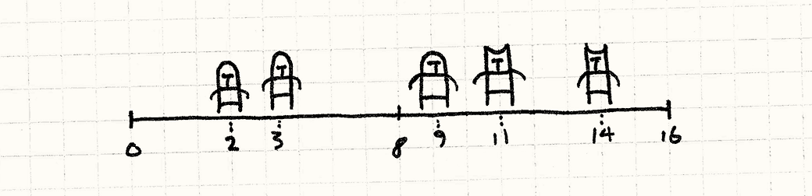
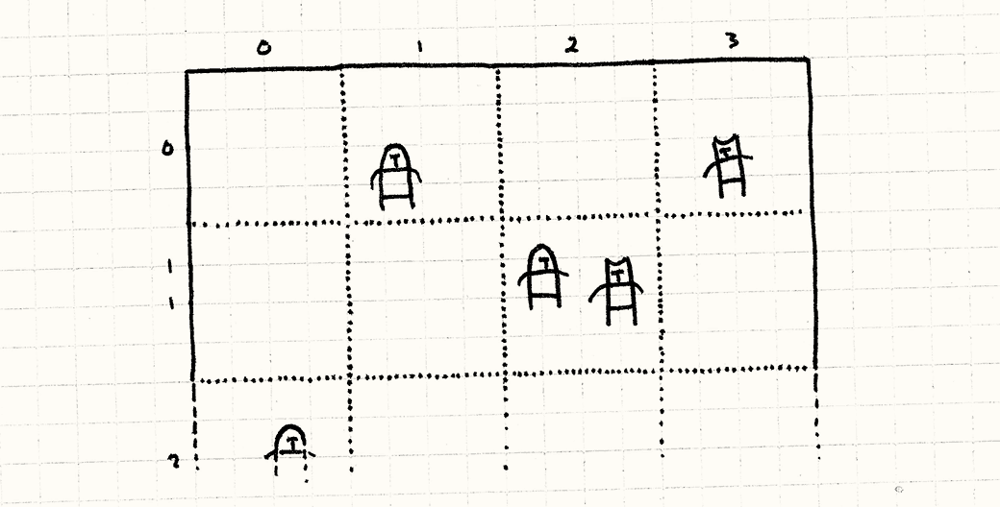
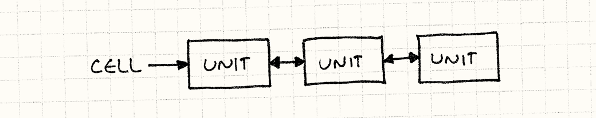
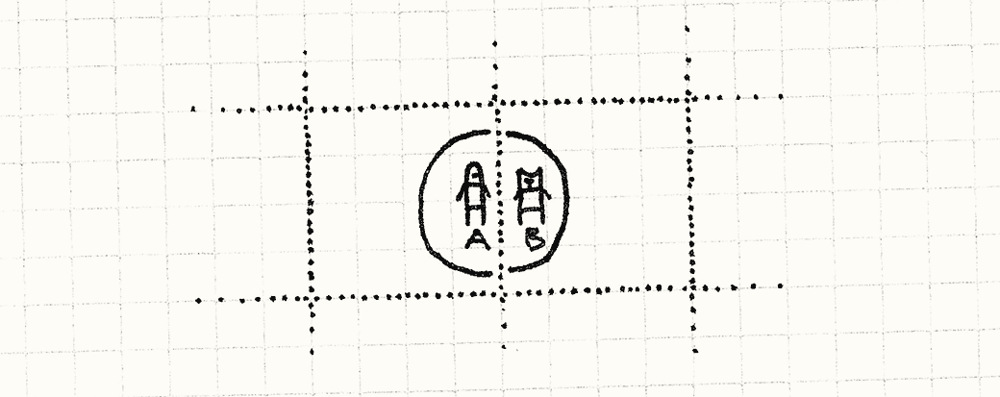
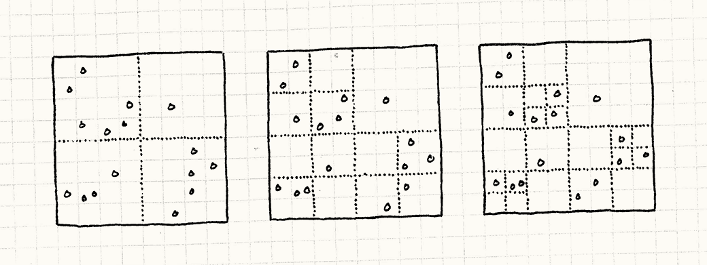

# 空间分区

## 游戏设计模式 Optimization Patterns

## 意图

*将对象根据它们的位置存储在数据结构中，来高效地定位对象。*

## 动机

游戏让我们能拜访其他世界，但这些世界通常和我们的世界没有太多不同。 它们通常有和我们宇宙同样的基础物理和可理解性。 这就是我们为什么会认为这些由比特和像素构建的东西是真实的。

我们这里注意的虚拟事实是*位置*。游戏世界有*空间*感，对象都在空间的某处。 它用很多种方式证明了这点。最明显的是物理——对象移动，碰撞，交互——但是还有其他方式。 音频引擎也许会考虑声源和玩家的距离，越远的声音响声越小。 在线交流也许局限在较近的玩家之间。

这意味着游戏引擎通常需要回答这个问题，“哪些对象在这个位置周围？” 如果每帧都需要回答这个问题，这就会变成性能瓶颈。

### 在战场上的单位

假设我们在做实时战略游戏。双方成百上千的单位在战场上撞在一起。 战士需要挥舞刀锋向最近的那个敌人砍去。 最简单的处理方法是检查每对单位，然后看看它们互相之间的距离：

```
void handleMelee(Unit* units[], int numUnits)
{
  for (int a = 0; a < numUnits - 1; a++)
  {
    for (int b = a + 1; b < numUnits; b++)
    {
      if (units[a]->position() == units[b]->position())
      {
        handleAttack(units[a], units[b]);
      }
    }
  }
} 
```

这里使用的是双重循环，每个循环都会遍历战场上的所有单位。 这就是意味着每帧进行的检测对数会随着单位数量的*平方*增长。 每个附加单位都需要和之前*所有*单位的进行检查。 如果有大量单位，这就完全失控了。

### 描绘战线

我们这里碰到的问题是没有指明数组中潜藏的对象顺序。 为了在某个位置附近找到单位，我们需要遍历整个数组。 现在，我们简化一下游戏。 不使用二维的战*场*，想象这是个一维的战*线*。



在这种情况下，我们可以通过根据单位在战线上的位置*排序*数组元素来简化问题。 一旦我们那样做，我们可以使用像[二分查找](http://en.wikipedia.org/wiki/Binary_search)之类的东西找到最近的对象而不必扫描整个数组。

这里的经验很明显：如果我们根据位置存储对象在数据结构中，就可以更快的找到它们。 这个模式便是将这个思路应用到多维空间上。

## 模式

对于一系列**对象**，每个对象都有**空间上的位置**。 将它们存储在根据位置组织对象的**空间数据结构**中，让你**有效查询在某处或者某处附近的对象**。 当对象的位置改变时，**更新空间数据结构**，这样它可以继续找到对象。

## 何时使用

这是存储活跃的，移动的游戏对象的常用模式，也可用于静态美术和世界地理。 复杂的游戏中，不同的内容有不同的空间分区。

这个模式的基本要求是一系列有位置的对象，而你做了太多的通过位置寻找对象的查询，导致性能下降。

## 记住

空间分区的存在是为了将*O(n)*或者*O(n²)* 的操作降到更加可控的数量级。 你拥有的对象*越多*，这就越重要。相反的，如果*n*足够小，也许不需要担心这个。

由于这个模式需要通过位置组织对象，可以*改变*位置的对象更难处理。 你需要重新组织数据结构来追踪在新位置的对象，这添加了更多的复杂性*并*消耗 CPU 循环。 保证这种交易是值得的。

空间分区也会因为记录划分的数据结构而使用额外的内存。 就像很多优化一样，它用内存换速度。如果内存比时钟周期更短缺，这回是个错误的选择。

## 示例代码

模式总会*变化*——每种实现都略有不同，空间分区也不例外。 不像其他的模式，它的每种变化都很好地被记录下来了。 学术界发表文章证明各种变化各自的性能优势。 由于我只关注模式背后的观念，我会给你展示最简单的空间分区：*固定网格*。

### 一张网格纸

想象整个战场。现在，叠加一张方格大小固定的网格在上面，就好像一张网格纸。 不是在单独的数组中存储我们的对象，我们将它们存到网格的格子中。 每个格子存储一组单位，它们的位置在格子的边界内部。



当我们处理战斗时，我们只需考虑在同一格子中的单位。 不是将每个游戏中的单位与其他所有单位比较，我们将战场*划分*为多个小战场，每个格子中的单位都较少。

### 一网格相邻单位

好了，让我们编码把。首先，一些准备工作。这是我们的基础`Unit`类。

```
class Unit
{
  friend class Grid;

public:
  Unit(Grid* grid, double x, double y)
  : grid_(grid),
    x_(x),
    y_(y)
  {}

  void move(double x, double y);

private:
  double x_, y_;
  Grid* grid_;
}; 
```

每个单位都有位置（2D 表示），以及一个指针指向它存在的`Grid`。 我们让`Grid`成为一个`friend`类， 因为，就像将要看到的，当单位的位置改变时，它需要和网格做复杂的交互，以确保所有事情都正确的更新了。

这里是网格的表示：

```
class Grid
{
public:
  Grid()
  {
    // 清空网格
    for (int x = 0; x < NUM_CELLS; x++)
    {
      for (int y = 0; y < NUM_CELLS; y++)
      {
        cells_[x][y] = NULL;
      }
    }
  }

  static const int NUM_CELLS = 10;
  static const int CELL_SIZE = 20;
private:
  Unit* cells_[NUM_CELLS][NUM_CELLS];
}; 
```

注意每个格子都是一个指向单位的指针。 下面我们扩展`Unit`，增加`next`和`prev`指针：

```
class Unit
{
  // 之前的代码……
private:
  Unit* prev_;
  Unit* next_;
}; 
```

这让我们将对象组织为[双向链表](http://en.wikipedia.org/wiki/Doubly_linked_list)，而不是数组。



每个网格中的指针都指向网格中的元素列表的第一个， 每个对象都有个指针指向它前面的对象，以及另一个指针指向它后面的对象。 我们很快会知道为什么要这么做。

### 进入战场

我们需要做的第一件事就是保证新单位创建时被放置到了网格中。 我们让`Unit`在它的构造函数中处理这个：

```
Unit::Unit(Grid* grid, double x, double y)
: grid_(grid),
  x_(x),
  y_(y),
  prev_(NULL),
  next_(NULL)
{
  grid_->add(this);
} 
```

`add()`方法像这样定义：

```
void Grid::add(Unit* unit)
{
  // 检测它在哪个网格中
  int cellX = (int)(unit->x_ / Grid::CELL_SIZE);
  int cellY = (int)(unit->y_ / Grid::CELL_SIZE);

  // 加到网格的对象列表前段
  unit->prev_ = NULL;
  unit->next_ = cells_[cellX][cellY];
  cells_[cellX][cellY] = unit;

  if (unit->next_ != NULL)
  {
    unit->next_->prev_ = unit;
  }
} 
```

除了链表带来的繁琐，基本思路是非常简单的。 我们找到单位所在的网格，然后将它添加到列表前部。 如果那已经存在有列表单位了，我们把新单位链接到旧单位的后面。

### 刀剑碰撞

一旦所有的单位都放入网格中，我们可以让它们开始互相交互。 使用这个新网格，处理战斗的主要方法看上去是这样的：

```
void Grid::handleMelee()
{
  for (int x = 0; x < NUM_CELLS; x++)
  {
    for (int y = 0; y < NUM_CELLS; y++)
    {
      handleCell(cells_[x][y]);
    }
  }
} 
```

它在每个网格它上面遍历并调用`handleCell()`。 就像你看到的那样，我们真的已经将战场分割为分离的小冲突。 每个网格之后像这样处理它的战斗：

```
void Grid::handleCell(Unit* unit)
{
  while (unit != NULL)
  {
    Unit* other = unit->next_;
    while (other != NULL)
    {
      if (unit->x_ == other->x_ &&
          unit->y_ == other->y_)
      {
        handleAttack(unit, other);
      }
      other = other->next_;
    }

    unit = unit->next_;
  }
} 
```

除了遍历链表的指针把戏，注意它和我们原先处理战斗的原始方法完全一样。 它对比每对单位，看看它们是否在同一位置。

不同之处是，我们不必再互相比较战场上*所有的*单位——只与那些近在一个格子中的相比较。 这就是优化的核心。

### 冲锋陷阵

我们解决了性能问题，但同时创建了新问题。 单位现在陷在它的格子中。 如果将单位移出了包含它的格子，格子中的单位就再也看不到它了，但其他单位也看不到它。 我们的战场有点*过度*划分了。

为了解决这点，需要每次单位移动时都做些工作。 如果它跨越了格子的边界，我们需要将它从原来的格子中删除，添加到新的格子中。 首先，我们给`Unit`添加一个改变位置的方法：

```
void Unit::move(double x, double y)
{
  grid_->move(this, x, y);
} 
```

显而易见，AI 代码可以调用它来控制电脑的单位，玩家也可以输入代码调用它来控制玩家的单位。 它做的只是交换格子的控制权，之后：

```
void Grid::move(Unit* unit, double x, double y)
{
  // 看看它现在在哪个网格中
  int oldCellX = (int)(unit->x_ / Grid::CELL_SIZE);
  int oldCellY = (int)(unit->y_ / Grid::CELL_SIZE);

  // 看看它移动向哪个网格
  int cellX = (int)(x / Grid::CELL_SIZE);
  int cellY = (int)(y / Grid::CELL_SIZE);

  unit->x_ = x;
  unit->y_ = y;

  // 如果它没有改变网格，就到此为止
  if (oldCellX == cellX && oldCellY == cellY) return;

  // 将它从老网格的列表中移除
  if (unit->prev_ != NULL)
  {
    unit->prev_->next_ = unit->next_;
  }

  if (unit->next_ != NULL)
  {
    unit->next_->prev_ = unit->prev_;
  }

  // 如果它是列表的头，移除它
  if (cells_[oldCellX][oldCellY] == unit)
  {
    cells_[oldCellX][oldCellY] = unit->next_;
  }

  // 加到新网格的对象列表末尾
  add(unit);
} 
```

这块代码很长但也很直观。 第一步检查我们是否穿越了格子的边界。 如果没有，需要做的事情就是更新单位的位置，搞定。

如果单位*已经*离开了现在的格子，我们从格子的链表中移除它，然后再添加到网格中。 就像添加一个新单位，它会插入新格子的链表中。

这就是为什么我们使用双向链表——我们可以通过设置一些指针飞快地添加和删除单位。 每帧都有很多单位移动时，这就很重要了。

### 短兵相接

这看起来很简单，但我们某种程度上作弊了。 在我展示的例子中，单位在它们有*完全相同的*位置时才进行交互。 西洋棋和国际象棋中这是真的，但是对于更加实际的游戏就不那么准确了。 它们通常需要将攻击*距离*引入考虑。

这个模式仍然可以好好工作，与检查位置匹配不同，我们这样做：

```
if (distance(unit, other) < ATTACK_DISTANCE)
{
  handleAttack(unit, other);
} 
```

当范围被牵扯进来，需要考虑一个边界情况： 在不同网格的单位也许仍然足够接近，可以相互交互。



这里，B 在 A 的攻击半径内，即使中心点在不同的网格。 为了处理这种情况，我们不仅需要比较同一网格的单位，同时需要比较邻近网格的对象。 为了达到这点，首先我们让内层循环摆脱`handleCell()`：

```
void Grid::handleUnit(Unit* unit, Unit* other)
{
  while (other != NULL)
  {
    if (distance(unit, other) < ATTACK_DISTANCE)
    {
      handleAttack(unit, other);
    }

    other = other->next_;
  }
} 
```

现在有函数接受一个单位和一列表的其他单位看看有没有碰撞。 让`handleCell()`使这个函数：

```
void Grid::handleCell(int x, int y)
{
  Unit* unit = cells_[x][y];
  while (unit != NULL)
  {
    // 处理同一网格中的其他单位
    handleUnit(unit, unit->next_);

    unit = unit->next_;
  }
} 
```

注意我们同样传入了网格的坐标，而不仅仅是对象列表。 现在，这也许和前面的例子没有什么区别，但是我们会稍微扩展一下：

```
void Grid::handleCell(int x, int y)
{
  Unit* unit = cells_[x][y];
  while (unit != NULL)
  {
    // 处理同一网格中的其他单位
    handleUnit(unit, unit->next_);

    // 同样检测近邻网格
    if (x > 0 && y > 0) handleUnit(unit, cells_[x - 1][y - 1]);
    if (x > 0) handleUnit(unit, cells_[x - 1][y]);
    if (y > 0) handleUnit(unit, cells_[x][y - 1]);
    if (x > 0 && y < NUM_CELLS - 1)
    {
      handleUnit(unit, cells_[x - 1][y + 1]);
    }

    unit = unit->next_;
  }
} 
```

这些新增`handleCell()`调用在八个邻近格子中的四个格子中寻找这个单位是否与它们有任何对抗。 如果任何邻近格子的单位离边缘近到单位的攻击半径内，就找到碰撞了。

我们只查询*一半*的近邻格子，这原因和之前是一样的：内层循环从当前单位*之后*的单位开始——避免每对单位比较两次。 考虑如果我们检查全部八个近邻格子会发生什么。

假设我们有两个在邻近格子的单位近到可以互相攻击，就像前一个例子。 这是我们检查全部 8 个格子会发生的事情：

1.  当找谁打了 A 时，我们检查它的右边找到了 B。所以记录一次 A 和 B 之间的攻击。
2.  当找谁打了 B 时，我们检查它的*左边*找到了 A。所以记录*第二次*A 和 B 之间的攻击。

只检查一半的近邻格子修复了这点。检查*哪一*半倒无关紧要。

我们还需要考虑另外的边界情况。 这里，我们假设最大攻击距离小于一个格子。 如果我们有较小的小格子和较长的攻击距离，我们也许需要扫描几行外的近邻格子。

## 设计决策

空间划分的优秀数据结构相对较少，可以一一列举进行介绍。 但是，我试图根据它们的本质特性来组织。 我期望当你学习四叉树和二分空间查找（BSPs）之类的时， 可以帮助你理解它们是*如何*工作，*为什么* 工作，以帮你选择。

### 划分是层次的还是平面的？

我们的网格例子将空间划分成平面格子的集合。 相反，层次空间划分将空间分成几个区域。 然后，如果其中一个区域还包含多个对象，再划分它。 这个过程递归进行，直到每个区域都有少于最大数量的对象在其中。

*   **如果是平面划分：**

    *   *更简单。* 平面数据结构更容易想到也更容易实现。

    *   *内存使用量确定。* 由于添加新对象不需要添加新划分，空间分区的内存使用量通常在之前就可以确定。

    *   *在对象改变位置时更新的更快。* 当对象移动，数据结构需要更新，找到它的新位置。 使用层次空间分区，可能需要在多层间调整层次结构。

*   **如果是层次性的：**

    *   *能更有效率的处理空的区域。* 考虑之前的例子，如果战场的一边是空的。 我们需要分配一堆空白格子，这些格子浪费内存，每帧还要遍历它们。

        由于层次空间分区不再分割空区域，大的空区域保存在单个划分上。不需要遍历很多小空间，那里只有一个大的。

    *   *它处理密集空间更有效率。* 这是硬币的另一面：如果你有一堆对象堆在一起，无层次的划分很没有效率。 你最终将所有对象都划分到了一起，就跟没有划分一样。 层次空间分区会自适应地划成小块，让你同时只需考虑少数对象。

### 划分依赖于对象集合吗？

在示例代码中，网格空间大小事先被固定了，我们在格子里追踪单位。 另外的划分策略是自适应的——它们根据现有的对象集合在世界中的位置划分边界。

目标是*均匀地*划分，每个区域拥有相同的单位数量，以获得最好性能。 考虑网格的例子，如果所有的单位都挤在战场的一个角落里。 它们都会在同一格子中，找寻单位间攻击的代码退化为原来的*O(n²)* 问题。

*   **如果划分与对象无关：**

    *   *对象可以增量添加。* 添加对象意味着找到正确的划分然后放入，这点可以一次性完成，没有任何性能问题。
    *   *对象移动的更快。* 通过固定的划分，移动单位意味着从格子移除然后添加到另一个。 如果划分它们的边界跟着集合而改变，那么移动对象会引起边界移动，导致很多其他对象也要移到其他划分。

    *   *划分也许不均匀。* 当然，固定的缺点就是对划分缺少控制。如果对象挤在一起，你就在空区域上浪费了内存，这会造成更糟的性能。

*   **如果划分适应对象集合：**

    像 BSPs 和 k-d 树这样的空间划分切分世界，让每部分都包含接近相同数目的对象。 为了做到这点，划分边界时，你需要计算每边各有多少对象。 层次包围盒是另外一种为特定集合对象优化的空间分区。

    *   *你可以保证划分是平衡的。* 这不仅提供了优良的性能表现，还提供了*稳定*的性能表现： 如果每个区域的对象数量保持一致，你可以保证游戏世界中的所有查询都会消耗同样的时间。 一旦你需要固定帧率，这种一致性也许比性能本身更重要。

    *   *一次性划分一组对象更加有效率。* 当对象*集合*影响了边界的位置，最好在划分前都出现所有对象。 这就是为什么美术和地理更多的使用这种划分。

*   **如果划分与对象无关，但*层次*与对象相关：**

    有一种空间分区需要特殊注意，因为它拥有固定分区和适应分区两者的优点：四叉树。

    四叉树开始时将整个空间视为单一的划分。 如果空间中对象数目超过了临界值，它将其切为四小块。 这些块的*边界*是确定的：它们总是将空间一切为二。

    然后，对于四个区域中的每一个，我们递归地做相同的事情，直到每个区域都有较少数目的对象在其中。 由于我们递归地分割有较多对象的区域，这种划分适应了对象集合，但是划分本身没有*移动*。

    你可以从这里从左向右看到分区的过程：

    

    *   *对象可以增量增加。* 添加新对象意味着找到并添加到正确的区域。 如果区域中的对象数目超过了最大限度，就划分区域。 区域中的其他对象也划分到新的小区域中。这需要一些小小的工作，但是工作总量是*固定的*： 你需要移动的对象数目总是少于数目临界值。添加对象从来不会引发超过一次划分。

        删除对象也同样简单。 你从它的格子中移除对象，如果它的父格子中的计数少于临界值，你可以合并这些子分区。

    *   *移动对象很快。* 当然，如上所述，“移动”对象只是添加和移除，两者在四叉树中都很快。

    *   *分区是平衡的。* 由于任何给定的区域的对象数目都少于最大的对象数量，哪怕对象都堆在一起，你也不会有包含太多对象的分区。

### 对象只存储在分区中吗？

你可将空间分区作为在游戏中对象存储的*唯一*地方，或者将其作为更快查找的二级缓存，使用另一个集合包含对象。

*   **如果它是对象唯一存储的地方：**

    *   *这避免了内存开销和两个集合带来的复杂度。* 当然，存储对象一遍总比存两遍来的轻松。 同样，如果你有两个集合，你需要保证它们同步。 每当添加或删除对象，都得从两者中添加或删除对象。
*   **如果其他集合保存对象：**

    *   *遍历所有的对象更快。* 如果所有对象都是“活的”，而且它们需要做些处理，也许会发现你需要频繁拜访每个对象而并不在乎它的位置。 想想看，早先的例子中，大多数格子都是空的。访问那些空的格子是对时间的浪费。

        存储对象的第二集合给了你直接遍历对象的方法。 你有两个数据结构，每种为各种的用况优化。

## 参见

*   在这里，我试图不讨论特定的空间分区结构细节来保证这章的高层概况性（而且节约篇幅！）， 但你的下一步应该是学习一下常见的结构。尽管名字很恐怖，它们都令人惊讶的直观。常见的有：

    *   [Grid](http://en.wikipedia.org/wiki/Grid_(spatial_index))
    *   [Quadtree](http://en.wikipedia.org/wiki/Quad_tree)
    *   [BSP](http://en.wikipedia.org/wiki/Binary_space_partitioning)
    *   [k-d tree](http://en.wikipedia.org/wiki/Kd-tree)
    *   [Bounding volume hierarchy](http://en.wikipedia.org/wiki/Bounding_volume_hierarchy)
*   每种空间分区数据结构基本上都是将一维数据结构扩展成更高维度的数据结构。 知道它的相互关系有助于分辨它是不是问题的好解答：

    *   网格是连续的[桶排序](http://en.wikipedia.org/wiki/Bucket_sort)。
    *   BSPs，k-d trees 和包围盒是[线性搜索树](http://en.wikipedia.org/wiki/Binary_search_tree)。
    *   四叉树和八叉树是[多叉树](http://en.wikipedia.org/wiki/Trie)。