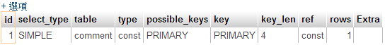
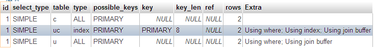

# MySQL

# MySQL

在這裡會介紹一些在 MySQL 提高存取效率的一些技巧及方法

# 資料類型

# 資料類型

## 越小越好

要使用能夠用來正確儲存資料的最小類型的資料型態，要確保不會低估要儲存的資料大小，因為當資料可以確定用比較少的資料去儲存的時候，所`使用的空間`也會更少，所`需要的索引空間`也會越少，取得資料所需要的`計算時間`也會越短。

> 在可以用`CHAR(20)`去儲存資料時，就不要用`CHAR(200)`
> 
> 在可以用`VARCHAR(20)`去儲存資料時，就不要用`VARCHAR(200)`
> 
> 在可以用`TINYINT`去儲存資料時，就不要用`INT`
> 
> 在可以用`TEXT`去儲存資料時，就不要用`LONGTEXT`
> 
> 在可以用`BLOB`去儲存資料時，就不要用`LONGBLOB`

## 越簡單越好

> 整數（INT）> 固定字串（CHAR）> 變動字串（VARCHAR）> 文字（TEXT）

越簡單的資料類型，資料庫所需要用來建立索引的效率越好，因為資料類型越複雜代表資料的排列組合越多，所以需要更大的索引及計算去取得資料

> 在可以用整數（INT）去儲存資料時，就不要用固定字串（CHAR）
> 
> 在可以用固定字串（CHAR）去儲存資料時，就不要用變動字串（VARCHAR）
> 
> 在可以用變動字串（VARCHAR）去儲存資料時，就不要用文字（TEXT）

## 盡量不使用 NULL

若非必要儲存 NULL 的資料，否則要盡可能的把資料欄位設定為 NOT NULL，資料庫很難最佳化有 NULL 資料欄位的查詢，可以 NULL 的資料欄位需要更多的儲存空間，資料庫還需要對其進行特殊處理，而當有 NULL 資料欄位使用`索引（INDEX）`的時候，每一條的索引紀錄必需要額外紀錄資料，導致查詢時索引的效率降低。

若真的要儲存 NULL，在`不影響原有的資料`的情況下，可以考慮用`0`、`特殊值`...等等之類的值去代替，可以用來區別是否為 NULL

## 結論

一切的資料類型都只能看自己應用的需求去決定，如果沒辦法還是要用比較複雜的資料類型，那還是必須要用，資料的完整性比任何的東西都重要多了，效率就想辦法用`增加機器`或者是`優化資料表結構`...等等的其他方式去達成，不要為了效率增加而強迫使用特定的資料類型，這樣反而是因噎廢食。

## 參考資料

*   [KeJyun 學習日誌: 提高存取 MySQL 效率小技巧](http://blog.kejyun.com/2012/12/Tips-For-Use-MySQL-With-High-Performance.html)

# 程式語法

# 程式語法

## 指定使用索引

```
SELECT id
FROM data USE INDEX(type)
WHERE type=12345 AND level > 3
ORDER BY id 
```

在下 SQL 語法的時候，有時某些語法使用某些索引執行效率會比較好，可是有時候 MySQL 沒辦法替我們選擇一個最適合的索引，導致執行的效率很慢（slow query），所以我們必須使用 USE INDEX 去指定執行效率好的索引，以提升效率。

## 少用 JOIN，多用幾次 SELECT 撈取大量資料

```
SELECT user.id , user.name , post.id , post.content
FROM user , post
WHERE user.id = post.user_id ...... 
```

我們在撈取使用者的文章資訊的時候，我們可能會用 JOIN 去撈取我們要的資料，這樣很直覺，只是當使用者資料有`10000`筆，而文章有`99999`筆，像這種有大量資料時候的話，使用 JOIN 對於資料存取真的是惡夢，因為 JOIN 過後表示會有 `10000x99999=999990000` 筆資料，然後再從這麼大量的資料中去撈取 WHERE 判斷式中指定的資料，在資料庫伺服器記憶體不夠的時候鐵定會炸掉。

解決方式是我們可以分批撈取使用者的資料，以及文章的資料

```
SELECT user.id , user.name
FROM user 
```

```
SELECT id , content , user_id
FROM post 
```

在使用者資料資料撈取出來之後，使用迴圈將使用者存成陣列，但是「陣列的索引」是使用可以識別的「使用者編號（user.id）」當作索引值。

```
<?php
$user['user.id'] = array(); 
```

在撈取文章資料後，必須將撈取的文章指定給該文章的作者（使用者），而我們撈取的使用有撈取「使用者編號（user.id）」，所以可以透過這個資料，將文章存到使用者資料下的文章陣列。

```
<?php
$user[$post['user_id']]['post'] = $post_array; 
```

透過分次撈取，本來的 `10000x99999=999990000` 筆資料，就會變成 `10000+99999=109999` 筆資料，記憶體消耗降低極大下，也可以達到同樣的效果

### 後記

JOIN 在資料庫幾乎是必學的語法，讓資料表的正規化，避免資料冗余，在查詢的時候也可以透過 JOIN 組合出想要的資料，所以 JOIN 對於資料庫正規化有它的用途，但資料庫的發展的初期中，還沒有像現在有用到巨量的資料（Google、Facebook、Twitter ... etc），所以在流量&資料量小的時候，資料庫在 JOIN 時的查詢回應速度通常差沒幾毫秒 （0.01~0.05 毫秒），所以都在可接受的範圍，但現在大型網站一天都好幾千萬的存取量，假如每天有 1000 萬的存取次數，而每個地方都慢了 0.05 毫秒，總共就會慢了 `10,000,000 x 0.05 = 500,000 毫秒 = 500 秒`，在我們要求每次回應時間最差都要在 1 ~ 2 秒內回應，若是像 Google、Facebook 這樣的大型服務，要求可能都要在 0.1 秒以內，這樣慢的時間可能會讓使用者等到不耐煩，若 $$ 多多加機器僅能簡單應付巨量級的查詢，沒辦法解決 JOIN 所造成的查詢瓶頸，所以在巨量級資料的情況下，幾乎很少會使用 JOIN 的方式去查詢所有的資料出來，天下武功，無堅不摧，唯快不破。

## 更新或刪除大量範圍的資料，請用主鍵去更新

我們可能會想要一次異動大範圍的資料，若以社群網站的`通知（Notification）`來說，我們希望在使用者點選通知列表後，將所有的通知從未讀狀態變更為已讀，我們可以很容易地想到用這樣的 SQL 語法去進行更新：

```
UPDATE `notification` SET status="已讀" WHERE created_at < '現在時間'; 
```

若我們要刪除大量的資料時，我們也可能用這樣的 SQL 語法去刪除資料：

```
DELETE FROM `backup` WHERE created_at < '現在時間'; 
```

但是在這樣的條件為範圍的語法，資料庫會需要一筆一筆的去比對資料是否為設定條件的範圍，若為`交易`的資料，資料庫會將資料進行鎖定禁止讀取，有可能鎖定一些非我們要處理的資料，若處理時間過久，可能會導致撈取資料的反應時間過久。

所以通常為了避免`鎖定不必要資料`的情況發生，我們可以試著先把資料撈取出來，再透過`明確的主鍵`去指定哪些異動的資料需要被鎖定，而不影響其他的資料。

### 更新資料（較佳作法）

```
-- 先撈取資料
SELECT `notification` WHERE status="未讀" AND created_at < '現在時間';

-- 指定要更新資料的主鍵
UPDATE `notification` SET status="已讀" WHERE  id IN (1, 2, 3); 
```

### 刪除資料（較佳作法）

```
-- 先撈取資料
SELECT `backup` WHERE created_at < '現在時間';

-- 指定要刪除資料的主鍵
DELETE FROM `backup` WHERE id IN (1, 2, 3); 
```

在服務會有大量的人撈取資料的時候，這樣可以避免不必要的資料鎖定，也可以讓存取速度加快喔～

## 參考資料

*   [KeJyun 學習日誌: 提高存取 MySQL 效率小技巧](http://blog.kejyun.com/2012/12/Tips-For-Use-MySQL-With-High-Performance.html)

# 索引

# 索引

## 索引順序

在所有的資料庫內，建立索引是提昇資料庫資料存取效率的很重要的方式，但是錯誤的`索引順序`或是 `SQL 語法` 都可能讓查詢語法變成了 slow query。

假設我們有一個部落格文章的資料表，裡頭存放所有使用者的部落格文章，資料表資料如下：

### posts

| post_id | post_status | author | content |
| --- | --- | --- | --- |
| 1 | 正常 | kejyun | 文章 1 |
| 2 | 刪除 | kejyun | 文章 2 |
| 3 | 正常 | kejyun | 文章 3 |
| 4 | 正常 | jimmy | 文章 4 |
| 5 | 刪除 | jimmy | 文章 5 |

如果我們要撈取 `作者為 kejyun` 且 `狀態正常` 的文章，我們可能會用下列語法去撈取

### SQL 語法 1

```
SELECT *
FROM posts
WHERE post_status = '正常'
AND author = 'kejyun' 
```

或者用這個語法撈取

### SQL 語法 2

```
SELECT *
FROM posts
WHERE author = 'kejyun'
AND post_status = '正常' 
```

這兩句 SQL 語法都可以撈出我們想要的結果，但是對於不同的索引執行的效率卻是差異很多

如果我們的索引是 `post_status`、`author` 的順序，`SQL 語法 1` 則會正確的使用索引來做查詢，執行的效率會很快。

但是對於`SQL 語法 2`，會因為找不到適合該語法的索引去做查詢，所以會變成不使用索引，而對整個資料表作完整的檢索，去查找出資料來。

#### 主要原因是

> 在 SQL 語法 WHERE 的順序會影響查詢索引的順序
> 
> 同樣的索引資料在不同的順序，表示為不同的索引，所以 `post_status、author` 與 `author、post_status` 這兩個索引雖然是使用相同的資料欄位，但因為順序不同所帶來的查詢效果也不同
> 
> 同一句 SQL 語法只能使用單一個索引，所以不同的索引沒辦法共用

資料庫沒有這麼人工智慧，會去判斷兩個 SQL 語法可以使用相同的索引去查找出相同的資料，他會依照程式設計師給的語法，依序去查找是否有可用的索引。

#### 分析 SQL 語法 1

在 `SQL 語法 1` 中，我們 WHERE 的第 1 個條件是 `post_status = '正常'`，所以資料庫會去查找有沒有索引開頭是使用 `post_status` 的索引。

若有該索引，則再判斷 WHERE 的第 2 個條件 `author = 'kejyun'`，所以資料庫會去查找有沒有索引開頭是使用 `post_status` 的索引，且該索引的第 2 個索引是使用 `author` 的索引。

資料庫會一直判斷比較 SQL 語法 WHERE 條件與索引之間的順序關係，直到沒辦法匹配後，後面的沒辦法匹配索引則使用完整比對的方式去進行查詢

#### 分析 SQL 語法 2

在 `SQL 語法 2` 中，我們 WHERE 的第 1 個條件是 `author = 'kejyun'` 但我們資料庫沒有建立索引開頭是使用 `author` 的索引，所以只能對資料庫使用完整比對。

### 原理

索引就像是書籍的目錄一樣，若以童話故事書為例，我們書中會收錄世界各國的故事，且每個故事有他自己的類型，像是奇幻、驚悚、傳說、神話。

如果我們以國家當做大標題（e.g. 第 1 索引），以故事類型當作小標題（e.g. 第 2 索引），那麼書籍目錄會像：

*   台灣
    *   奇幻
    *   驚悚
    *   傳說
    *   神話
*   日本
    *   奇幻
    *   驚悚
    *   傳說
    *   神話
*   歐美
    *   奇幻
    *   驚悚
    *   傳說
    *   神話
*   印度
    *   奇幻
    *   驚悚
    *   傳說
    *   神話
*   etc...

如果我們要找`台灣`且類型為`傳說`的童話故事，我們的目光會先移動到台灣的區段，然後在這個區塊下找到類型為`傳說`的故事

*   台灣
    *   奇幻
    *   驚悚
    *   ***傳說***
    *   神話

但是如果我們要找所有類型為`傳說`的故事中，發生在`台灣`的故事，依照步驟我們會希望先把所有`傳說`的故事先列出來，再從這個目錄下去找屬於`台灣`的故事，所以我們希望會看到像這樣的目錄（索引）：

*   傳說
    *   ***台灣***
    *   日本
    *   歐美
    *   印度

但是在這本故事書的目錄（索引）中，我們沒有看到這樣的目錄結構，所以我們沒辦法透過目錄快速的找到我們要看的所有類型為`傳說`的章節資料，只好從頭到尾的去翻閱整本書，直到找到全部我們`傳說`章節的故事，然後再從這些找出來的`傳說`故事中，再去區別出哪些為`台灣`的故事。

所以目錄（索引）的規則就是希望看故事書的人要怎麼快速找到他想要的東西，當沒有我們可以參考的目錄的話，就像資料庫沒有可參考的索引一樣，就會找得比較慢（但還是找得出來）。

### 結論

因為索引順序的不同，以及 SQL WHERE 條件順序的不同，會使得資料庫在使用索引進行查詢有不同的效率，所以要謹慎的使用索引及 SQL 語法，才能達到高效率的查詢結果。

## 控制索引更新

### 關閉索引更新：

```
ALTER TABLE table_name DISABLE KEYS; 
```

### 開啟索引更新：

```
ALTER TABLE table_name ENABLE KEYS; 
```

MySQL 在新增（INSERT）、刪除（DELETE）、更新（UPDATE）的時候會去更新現有的索引表，而更新索引表也需要花費一些時間，當異動一筆資料的時候，索引表也做一次的異動，但當在做大量資料異動的時候，例如異動 1000 筆資料，索引表也需要異動 1000 次，而其實我們只需要最後一次（最新）的異動就好了，前面的 999 次都是不需要做的索引表異動更新，所以在異動大量資料前，可以使用指令 `ALTER TABLE table_name DISABLE KEYS;` 關閉索引更新，等異動完成後，再使用指令 `ALTER TABLE table_name ENABLE KEYS;` 開啟索引更新。

```
ALTER TABLE users DISABLE KEYS;
異動（INSERT、DELETE、UPDATE）大量資料 SQL 語法
ALTER TABLE users ENABLE KEYS; 
```

## 自定義 Hash Index 做字串完整比對

我們知道在對`字串（CHAR 或 VARCHAR）`去做查找的時候效率會遠比對`整數（INT）`查找還慢，因 CRC32 對字串做校驗後會回傳`整數的校驗碼`，我們在資料表增加一個整數型態欄位，儲存要比對字串的校驗碼。

### crc32

> 建立 str 的 32 位迴圈冗余校驗碼多項式。這通常用於檢查傳輸的資料是否完整。
> 
> 由於 PHP 的整數是帶符號的，許多 crc32 校驗碼將返回負整數，因此你需要使用 sprintf() 或 printf() 的「%u」格式符來取得表示無符號 crc32 校驗碼的字串。 在原本實作 email 登入時會對 email 欄位做索引，所以會先去查找 email 字串欄位的資料，之後再去比對密碼是否正確，但若資料過多字串比對的效率會降低很多

```
SELECT id,name,email
FROM user
WHERE email = "kejyun@gmail.com"
AND password = "xxx" 
```

我們加入了 `emailcrc` 的欄位去儲存對 email 字串的校驗碼，再查找 email 字串欄位的資料前，先透過 crc 整數校驗碼快速過濾掉不可能的資料，之後再從少數的資料中做 email 字串欄位字串比對，如果資料量很大，這樣的效率會提升很多。

```
SELECT id,name,email
FROM user
WHERE emailcrc = CRC32("kejyun@gmail.com")
AND email="kejyun@gmail.com"
AND password="xxx" 
```

這邊要注意的是沒辦法只使用 crc 校驗碼去當作唯一的條件，`不同的字串可能會出現相同的校驗碼`，所以最後還是要對你要比對的字串做比對，避免查詢發生錯誤。

| email | emailcrc |
| --- | --- |
| kejyun1@gmail.com | 1234567890 |
| kejyun2@gmail.com | 1234567890 |

## 參考資料

*   [KeJyun 學習日誌: 提高存取 MySQL 效率小技巧](http://blog.kejyun.com/2012/12/Tips-For-Use-MySQL-With-High-Performance.html)
*   [KeJyun 學習日誌: MySQL 效率調校](http://blog.kejyun.com/2012/12/MySQL-Efficiency-Adjustment.html)
*   [MySQL Indexing: Best Practices Slide PDF](http://www.percona.com/files/presentations/WEBINAR-MySQL-Indexing-Best-Practices.pdf)
*   [Tools and Techniques for Index Design PDF Slide](http://www.percona.com/files/presentations/WEBINAR-tools-and-techniques-for-index-design.pdf)
*   [EXPLAIN Demystified PDF slide](http://www.percona.com/files/presentations/WEBINAR2012-02-Explain-Demystified.pdf)
*   [Optimizing MySQL Configuration PDF Slide](http://www.percona.com/files/presentations/percona-live/london-2012/PLUK2012-optimizing-mysql-configuration.pdf)
*   [PHP 手冊 - crc32](http://por.tw/Website_Design/PHP5/function.crc32.html)

# 鎖表

# 鎖表 (Lock Table)

## 定義

在要更新資料表的資料時，`MySQL`會將表資料鎖定無法讀取，直到資料異動完畢，`MyISAM` 預設支援 `Table-level lock`，而 `InnoDB` 預設支援 `Row-level lock`

### Table-level lock

資料表資料異動時，將「`整個資料表（Table）`」都鎖定住無法讀取

### Row-level lock

資料表資料異動時，將「`要更新的資料列（row）`」都鎖定住無法讀取

## 注意事項

在使用 `Row-level lock` 時必需要 `明確指定要異動資料的主鍵（Primary Key）`，否則將會改用 `Table-level lock` 去做資料表的異動

## 範例

假設有 user 資料表，裡面有 id 與 name 的欄位，id 是主鍵

| SQL | Table lock | Row lock | No lock | 備註 |
| --- | --- | --- | --- | --- |
| SELECT * FROM user WHERE id='1' FOR UPDATE; | - | v | - | 明確指定主鍵，並且有此筆資料，row lock |
| SELECT * FROM user WHERE id='-1' FOR UPDATE; | - | - | v | 明確指定主鍵，若查無此筆資料，無 lock |
| SELECT * FROM user WHERE name='KeJyun' FOR UPDATE; | v | - | - | 無主鍵，table lock |
| SELECT * FROM user WHERE id<>'1' FOR UPDATE; | v | - | - | 主鍵不明確，table lock |
| SELECT * FROM user WHERE id LIKE '3' FOR UPDATE; | v | - | - | 主鍵不明確，table lock |

## 備註

FOR UPDATE 僅適用於 InnoDB，且必須在交易區塊(BEGIN/COMMIT)中才能生效。

## 參考資料

*   [KeJyun 學習日誌: MySQL 鎖表(Lock Table)Table-level 與 Row-level 比較](http://blog.kejyun.com/2012/12/Compare-Tabel-And-Row-Level-Lock-On-MySQL.html)

# 交易

# 交易

## 控制 InnoDB Transaction

### 關閉自動提交：

```
SET autocommit=0; 
```

### 開啟自動提交：

```
SET autocommit=1; 
```

在 MySQL InnoDB 預設所有的資料異動都是 `Transaction（交易）`，當與資料庫做連線的時候，InnoDB 會採用`自動提交（autocommit）`的方式，所以除非使用 `BEGIN;` 及 `COMMIT;` 將異動語法包覆起來***設定為同一個 Transaction，否則任何一個資料異動的語法（INSERT、DELETE、UPDATE）會認為是一個獨立的 Transaction***。

所以資料表每次做資料異動的時候會一直`提交 (COMMIT)` 去更新日誌，若有 1000 筆 獨立的 SQL 要執行就會被 COMMIT 1000 次，所以在下異動語法之前，可以使用指令 `SET autocommit=0;` 關閉自動提交，等異動完成後，再使用指令 `SET autocommit=1;` 開啟自動提交。

```
SET autocommit=0;
異動（INSERT、DELETE、UPDATE）大量資料 SQL 語法
SET autocommit=1; 
```

## 參考資料

*   [KeJyun 學習日誌: MySQL 效率調校](http://blog.kejyun.com/2012/12/MySQL-Efficiency-Adjustment.html)

# 伺服器

# 伺服器

## 設定

### max_allowed_packet：允許最大封包

在 INSERT 或 UPDATE 的時候，因為封包資料過大，導致錯誤發生

### max_connect_errors：最大連線錯誤

設 4294967295，可以避免當 client (像是 php) 發生太多錯誤時被 block 住。

> default 0，請設定一個最大的值即可，32 位元的系統 最大是 4bytes 4294967295、64 位元的系統最大是 18446744073709547520

## 參考資料

*   [note: mysql 跟效能有關的設定 @ mini box 迷你小盒子 :: nidBox 親子盒子](http://mini.nidbox.com/diary/read/7451092)

# SELECT 語法效能測試

# Explain 做 SQL SELECT 語法效能測試

在 MySQL 我們在使用 SELECT 做撈取資料的時候，有時候常常會效能低落，撈取資料需要很長的時間，有時候是 SQL 語法下得不好導致沒有使用到正確的索引去撈資料，我們這個時候就必須要檢查我們下的 SQL 語法到底有哪些地方需要改善，我建立的 comment 的資料表並新增幾筆假資料去做示範

```
-- 建立資料表

-- 留言
CREATE TABLE IF NOT EXISTS `comment` (
  `id` int(10) unsigned NOT NULL AUTO_INCREMENT COMMENT '編號',
  `content` varchar(50) COLLATE utf8_unicode_ci NOT NULL COMMENT '留言',
  PRIMARY KEY (`id`)
) ENGINE=InnoDB  DEFAULT CHARSET=utf8 COLLATE=utf8_unicode_ci AUTO_INCREMENT=1 ;

-- 使用者
CREATE TABLE IF NOT EXISTS `user` (
  `id` int(10) unsigned NOT NULL AUTO_INCREMENT COMMENT '編號',
  `name` varchar(30) COLLATE utf8_unicode_ci NOT NULL COMMENT '姓名',
  PRIMARY KEY (`id`)
) ENGINE=InnoDB  DEFAULT CHARSET=utf8 COLLATE=utf8_unicode_ci AUTO_INCREMENT=3 ;

-- 使用者的留言
CREATE TABLE IF NOT EXISTS `user_comment` (
  `user_id` int(10) unsigned NOT NULL COMMENT '使用者編號',
  `comment_id` int(10) unsigned NOT NULL COMMENT '評論編號',
  PRIMARY KEY (`user_id`,`comment_id`)
) ENGINE=InnoDB DEFAULT CHARSET=utf8 COLLATE=utf8_unicode_ci;

-- 新增資料

-- 留言
INSERT INTO `comment` (`id`, `content`) VALUES
(1, '留言 1'),
(2, '留言 2');

-- 使用者
INSERT INTO `user` (`id`, `name`) VALUES
(1, '使用者 1'),
(2, '使用者 2');

-- 使用者的留言
INSERT INTO `user_comment` (`user_id`, `comment_id`) VALUES
(1, 1),
(1, 2);

-- 解釋 MySQL 語法效能

-- 撈取留言資料
EXPLAIN SELECT * FROM  `comment` WHERE  id` =2;

-- 撈取使用者的留言資料
EXPLAIN SELECT *
FROM  `comment` c,  `user` u,  `user_comment` uc
WHERE u.`id` = uc.`user_id`
AND uc.`comment_id` = c.`id` 
```

## 解釋 MySQL 語法效能：撈取留言資料



## 解釋 MySQL 語法效能：撈取留言資料



而 EXPLAIN 後的資料有下面這些欄位

### select_type

### table

關連到的資料表

### type

使用關聯查詢的類型(效率由好至壞排序)

*   System
*   const
*   eq_ref
*   ref
*   fulltext
*   ref_or_null
*   index_merge
*   unique_subquery
*   index_subquery
*   range
*   index
*   ALL

### possible_keys

可能使用到的索引，從 WHERE 語法選擇出一個適合的欄位

### key

實際使用到的索引，如果為 NULL，則是沒有使用索引

### key_len

使用索引的長度，長度越短 準確性越高

### ref

顯示那一列的索引被使用，一般是一個常數(const)

### rows

MySQL 用來返回資料的筆數，可以簡單的把 rows 視為執行效能，越少越好

### Extra

MySQL 用來解析額外的查詢訊息

*   Distinct

當 MySQL 找到相關連的資料時，就不再搜尋。

*   Not exists

MySQL 優化 LEFT JOIN，一旦找到符合的 LEFT JOIN 資料後，就不再搜尋。

*   Range checked for each Record(index map:#)

無法找到理想的索引。此為最慢的使用索引。

*   Using filesort

當出現這個值時，表示此 SELECT 語法需要優化。因為 MySQL 必須進行額外的步驟來進行查詢。

*   Using index

返回的資料是從索引中資料，而不是從實際的資料中返回，當返回的資料都出現在索引中的資料時就會發生此情況。

*   Using temporary

同 Using filesort，表示此 SELECT 語法需要進行優化。此為 MySQL 必須建立一個暫時的資料表(Table)來儲存結果，此情況會發生在針對不同的資料進行 ORDER BY，而不是 GROUP BY。

*   Using where

使用 WHERE 語法中的欄位來返回結果。

*   System

system 資料表，此為 const 連接類型的特殊情況。

*   Const

資料表中的一個記錄的最大值能夠符合這個查詢。因為只有一行，這個值就是常數，因為 MySQL 會先讀這個值然後把它當做常數。

*   eq_ref

MySQL 在連接查詢時，會從最前面的資料表，對每一個記錄的聯合，從資料表中讀取一個記錄，在查詢時會使用索引為主鍵或唯一鍵的全部。

*   ref

只有在查詢使用了非唯一鍵或主鍵時才會發生。

*   range

使用索引返回一個範圍的結果。例如：使用大於>或小於<查詢時發生。

*   index

此為針對索引中的資料進行查詢。

*   ALL

針對每一筆記錄進行完全掃描，此為最壞的情況，應該盡量避免。

## 結論

MySQL 的 Explain 可以分析大部份的 SQL 語法效能，但有些語法像是 WHERE IN 則會被歸類為 range 的語法，但實際上則是 Using Where，所以確切的語法分析要再看看文件真正的用法去決定

## 參考資料

*   [KeJyun 學習日誌: 在 MySQL 使用 Explain 做 SQL SELECT 語法效能測試](http://blog.kejyun.com/2012/12/Using-EXPLAIN-SQL-To-Analysis-Efficient-On-MySQL.html)