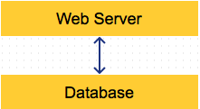

# Web 與 Database 分手

# Web 與 Database 分手

當服務越來越多人需要去同時存取時，原本的 `Web` 與 `Database 在一起` 的架構會變得不敷使用了，網站的 `反應時間` 會變得越來越慢，伺服器的 `CPU` 及 `記憶體` 的消耗也會變得越來越高。

而且服務彼此還會互相搶機器的資源，若機器發生問題導致資料庫的資料也出現問題，會造成的麻煩會變得更大，於是我們就會想要把 Web 與 Database 的機器相互分離。

當用這樣的架構之後，你會發現效率會比之前提高很多，服務彼此不會搶資源了，但是就是要付出 $ 去添購機器摟（當可以用 $ 解決的問題都是小問題）

***架構圖：***

## 使用時機

### 同時上線人數約 20 ~ 40 人左右

***人數為 KeJyun 過去經驗大概估算的人數，沒有經過實際測試僅參考用***

當我們的服務能夠尤多台機器去分攤時，機器彼此的處理效率當然就會提高許多，可以乘載的人數也會提高

以飲料店來當例子，1 個服務生可以同時服務 3 位客人（主機同時有 3 個人發出請求），但是若有 2 位服務生就可以同時服務 6 位客人（主機同時有 6 個人發出請求）， 將替客人做點餐結帳、做飲料的工作做分工處理，一為服務生同時可以替 6 位客人做點餐結帳的工作，另一位則可以同時替 6 為客人做飲料，整個服務可以乘載的量就會提高很多， 讓每個人專心做一件事情，效率也會提高很多

> 同時上線非每日上限，同日上線指的是同一時先有多個人同時跟伺服器要資源

### 需要維持一定的服務可用度

當服務需要提供比較多人去做存取時，我們就必須要提供一定水準的服務可用度，將反應時間保持在 1 ~ 2 秒內的範圍。

### 資料定期備份

雖然服務還在剛起步的階段，但是資料還是非常重要的公司資產，若只有一台 Database，我們還是需要定期的將資料備份出來（最少 1 天備援一次），避免機器掛掉的機會。

## 參考資料

*   [一步步構建大型網站架構- 架構設計- | 九街| 白開水的博客](http://www.9streets.cn/art-php-489.html)