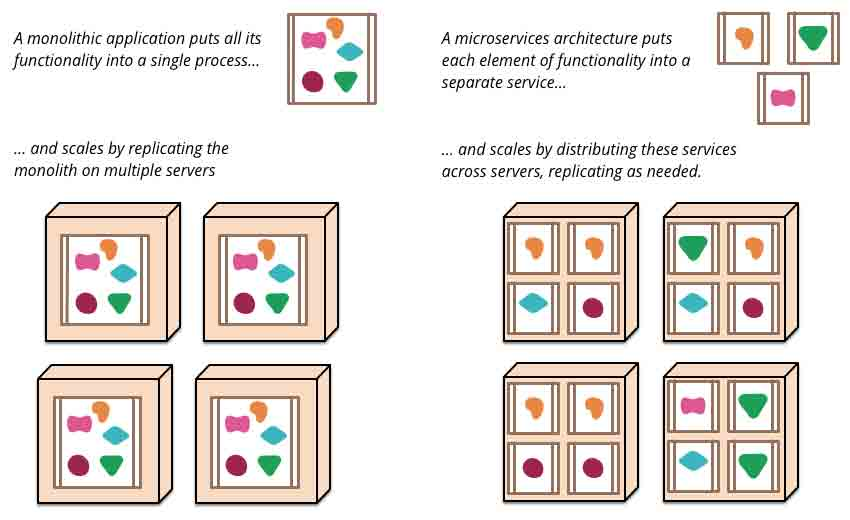
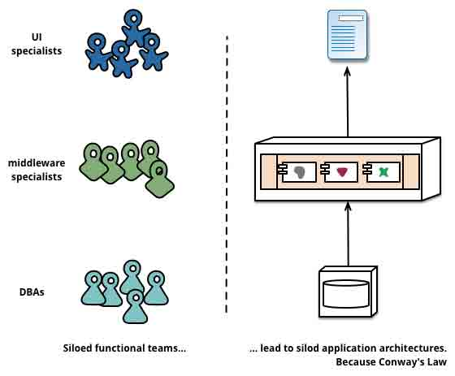
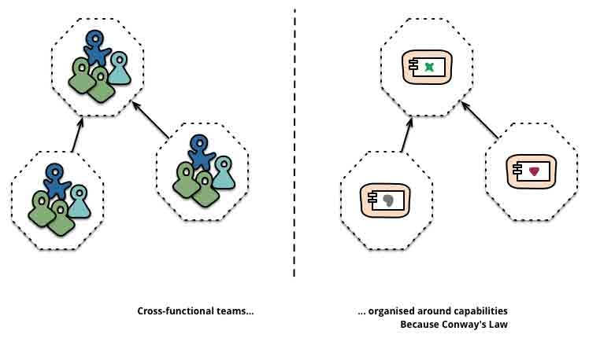
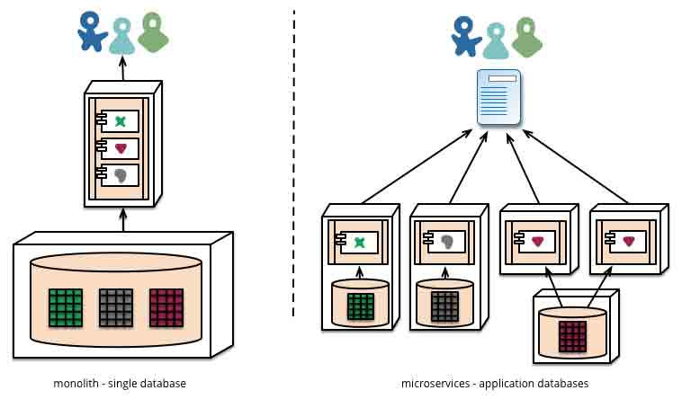
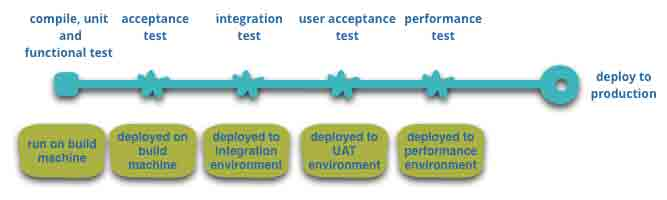
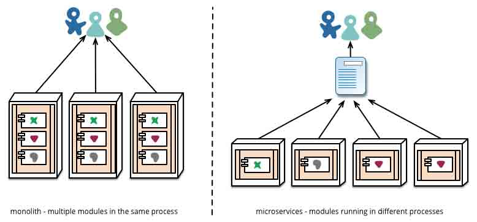

# 微服务(Microservices)

> [`blog.csdn.net/wurenhai/article/details/37659335/`](http://blog.csdn.net/wurenhai/article/details/37659335/)

## 说在前面

好久没写博文了，心里痒痒（也许是换工作后，有点时间了吧）。最近好像谈论微服务的人比较多，也开始学习一下，但是都有 E 文，看起来半懂不懂的。

Martinfowler 的《[微服务](http://martinfowler.com/articles/microservices.html)》，也算是入门必读了。有人[翻译](http://www.jdon.com/46204)过，但是只有一半。还是自己练练手吧。

## 微服务

“微服务架构”一词在过去几年里广泛的传播，它用于描述一种独立部署的软件应用设计方式。这种架构方式并没有非常准确的定义，但是在业务能力、自动部署、端对端的整合、对语言及数据的分散控制上，却有着显著特征。

“微服务”----只不过在满大街充斥的软件架构中的一新名词而已。尽管我们非常鄙视这样的东西，但是这玩意所描述的软件风格，越来越引起我们的注意。在过去几年里，我们发现越来越多的项目开始使用这种风格，以至于我们身边的同事在构建企业应用时，把它理所当然的认为这是一种默认开发形式。然而，很不幸，微服务风格是什么，应该怎么开发，关于这样的理论描述却很难找到。

简而言之，微服务架构风格，就像是把小的服务开发成单一应用的形式，每个应用运行在单一的进程中，并使用如 HTTP 这样子的轻量级的 API。这些服务满足某需求，并使用自动化部署工具进行独立发布。这些服务可以使用不同的开发语言以及不同数据存储技术，并保持最低限制的集中式管理。

开始介微服务风格前，先介绍整体风格：即把一个完整的应用当成一开发单元。企业应用通常包含三个部分：客户端界面（由 HTML、Javascript 组成，使用浏览器进行访问）、数据库（由许多的表组件构成一个通用的、相互关联的数据管理系统）、服务端应用。服务端应用处理 HTTP 请求、执行领域逻辑、检索并更新数据库中的数据、使用适当的 HTML 视图发送给客户端。服务端应用是完整的 ---- 由单一的逻辑层次执行。系统中任务变更都会导到服务端的应用重新编辑并发布一个新的版本。

这样的整体服务是这样的构建系统的很自然的方式。虽然利用开发语基础特性会把应用封装成类、函数、命名空间，但是业务中所有逻辑都要在单一的进程中处理完成。在某些场景中，开发者可能在的笔计本中开发、测试应用，然后利用部署通道来保证经过正常测试、发布的修改内容正确的发布的产品中。也可以使用横向扩展，通过负载均横系统将事个应用部署到多台服务器上。

整体风格的应用也是相当成功的，但是越来越多的人感觉到有点不妥，特别是在云中进行应用的发布时。变更发布周期被绑定了 ---- 原来可以划分成小的应用、小的需要的变更，需要统一的进行编译和发布。随着时间的推移，人们通常难于维护一种优美的模块化的结构，使得一个模块的变更很难不会影响到其它的模块。进行扩展，也需要进行整体的扩展，而不能根据进行部分的扩展。



图 1：整理架构与微服务架构

   这些原因导致了微服务架构风格的出现：以服务构建应用。因为服务可以独立部署、独立扩展，服务也可以提供模块化的边界，并且不同的使用也可以使用不同的开发语言。服还可以以不同的周期进行管理。

微服务风格关不是我们发明的，也不是一个新的东西，它至少起源于 Unix 时代的设计原则。之所以这样，我们认为只是当时很少人考虑过这种风格，并认识到把软件使用这种的风格可以带来更多的好处。

## 微服务风格的特性

我们没有办法对微服务风格进行准确的定义，但是我们可以偿试着描述一下微服务风格所应该具有的觉特性，这样就可以对它打上相应的标签了。正如其它定义中对特性的描述一新，并不是所有的微服务风格都要所有的特性，但是我们认为常见的微服务都应该有这些特性。尽管我们是相当松散的社区核心成员，但是我们也计划偿试描述我们工作中或者在其它我们了解的组件中所理解的微服务。当然，我们并不依赖于那些已经明确过的定义。

## 组件与服务

自从我们从事软件行业以来，一直希望能够构建由组件组成的系统，就像我们所看到的实现世界由物件构成的一样。在过去的几十年里，我们已经看到了大部分语言平台的公共库的进行了精简，并取得可观的进展。

当我们谈论组件的时候，有可能会因为组件的不同定义引起混乱。因此我们申明，这里谈到的**组件**是指软件中独立的单元，它能独立替代和独立更新。

微服务架构也使用组件库，但是它把软件拆分成服务，并认为这是主要的组织形式。我们把**组件库**定义为程序中相互关系、并使用内存中调用的组件，把**服务**定义为进程间使用如 Web 请求服务或者远程调用来相互通信的组件。（这种定义的方式与其它面向对象程序中服务对象的概念是不一样的。）

把服务当成组件（而不是组件库）一个主要的原因是服务可以独立的部署。如果你的应用由多个组件库组成并跑在一个进程中，那么任何组件的变更都将导致整体应用的重新发布。但是如果由许多服务构成的应用，你可以想像的到每个服务的变更仅需要发布相应的服务。当然，这也不是绝对的，比如导致服务接口的变更的更新就需要相应服务的变化，但优秀微服务构架，会尽量避免这种服务间的耦合并完善服务的交互接口。

把服务当成组件的另一个考虑是这将拥有更新清晰的接口。许多开发语言并没有良好的定义公共接口的机制。通常只有文档和规范说明，让用户避免组件间会导致组件耦合的过度的依赖。不过服务由是是通过明确的远程接口调用，这个问题就很容易解决了。

使用服务也有它的不足之处。远程调用比进制内部调用更消耗性能，而且远程的 API 比较粗糙，难以使用。如果由于对组件的职责进行变更，影响到跨进程间的交互，那么这操作起来也比较困难。

第一个可能的特性，我们看到每个服务是运行在独立的进程上的。注意，这只是第一个可能的特性。服务也可以由多个进程组成，它们是同时开发和部署的，例如服务可能用到一个应用进制和一种数据禀。

## 围绕业务功能进行组织

当寻找把一个大的应用拆分成小的部分时，主管通常注意在技术层面，拆分成 UI 组、服务逻辑组和数据库组。当使用这种标准对团队进行划分时，甚至小小的更变都将导致跨团队间项目协作，从而消耗时间和预算审批。一个高效的团队会针对这种情况进行改善，关注它们所涉及的应用逻辑，并从中做出较好的选择。换句话说，逻辑无处不在。Conway's Law 的实践就是一个例子。

```
任何组织设计一个系统（广义上的系统）都会产生一种设计，其结构为其组织通信结构的复本。
-- Melvyn Conway, 1967
```

    

图 2：Conway's Law 的实践

微服务更倾向于围绕**业务功能**对服务结构进行划分、拆解。这样的服务，是针对业务领域有着关完整实现的软件，它包含使用接口、持久存储、以及对旬的交互。因此团队应该是跨职能的，包含完整的开发技术：用户体验、数据库、以及项目管理。



图 3：通过团队边界强调服务边界

    www.comparethemarket.com 就采用这种组织形式。不同职能的团队同时为各自的产品构建和运营负责，同时每个产品又拆分成多个通过消息引擎通信的单独服务。

大型的整体型应用也可以按照业务功能进行模块化的，尽管这种例子不常见。当然，我们敦促一个大型的团队将一个构建成整体型的应用依照业务功能进行拆分。我们能看到主要问题在于，这种组件形式会导致很多的上下文依赖。如果在大量的模块边界上都存在这种大量的调用，对于团队的每个成员来说，短期内是很难记住的。此外，我们发现模块化方式需要大量的规范去强制执行，当然，大量明确的拆分也让服务组件在团队的边界中更加清晰。

## 产品不是项目 

大部分的软件开发者都使用这样的开发模式：至力于提供一些被认为是完整的软件。一旦开发完成，软件将移交给维护部门，然后，开发组就可以解散掉了。

微服务的支持者认为，这种做法是不可取的，并提议开发组应该负责产品的整个生命周期。一个常见的证明是：Amazon 的“你编译，你运维（you build, you run it）”的理念，它要求开发团队对软件产品的整个生命周期负责。这要求开发者每天都关注软件产品的运行情况，并与用户联系的更紧密，同时承担一些售后支持。

成熟的产品会与业务功能进行绑定。除了把软件看成既定功能的集合外，会进一步关心“软件如何帮助用户实现业务功能”这样的问题。

采用整体型的架构并不是没有原因的，但是越小的服务粒度越容易促进用户与服务提供商之前的关系。

## 强化终端及弱化通道

当构建不同的进程间通信机制的时候，我们发现有许多的产品和方法能够把更加有效方法强加入的通信机制中。比如企业服务总线（ESB），这样的产品提供更有效的方式改进通信过程中的路由、编码、传输、以及业务处理规则。

微服务倾向于做如下的选择：强化终端及弱化通道。微服务的应用致力松耦合和高内聚：采用单独的业务逻辑，表现的更像经典 Unix 意义上的过滤器一样，接受请求、处理业务逻辑、返回响应。它们更喜欢简单的 REST 风格，而不是复杂的协议，如 WS 或者 BPEL 或者集中式框架。

   有两种协议最经常被使用到：包含资源 API 的 HTTP 的请求-响应和轻量级消息通信协议。最为重要的建议为：

```
Be of the web, not behind the web(善于利用网络，而不是限制使用网络。)
---- Ian Robinson
```

微服务团队采用这样的原则和规范：基于互联网（广义上，包含 Unix 系统）构建系统。这样经常使用的资源几乎不用什么的代价就可以被开发者或者运行商缓存。

第二种做法是通过轻量级消息总线来发布消息。这种的通信协议非常的单一（单一到只负责消息路由），像 RabbitMQ 或者 ZeroMQ 这样的简单的实现甚至像可靠的异步机制都没提供，以至于需要依赖产生或者消费消息的终端或者服务来处理这类问题。

在整体工风格中，组件在进程内执行，进程间的消息通信通常通过调用方法或者回调函数。从整体式风格到微服务框架最大的问题在于通信方式的变更。从内存内部原始的调用变成远程调用，产生的大量的不可靠通信。因此，你需要把粗粒度的方法成更加细粒度的通信。

## 分散治理

集中治理的一种好处是在单一平台上进行标准化。经验表明这种趋势的好处在缩小，因为并不是所有的问题都相同，而且解决方案并不是万能的。我们更加倾向于采用适当的工具解决适当的问题，整体式的应用在一定程度上比多语言环境更有优势，但也适合所有的情况。

把整体式框架中的组件，拆分成不同的服务，我们在构建它们时有更多的选择。你想用 Node.js 去开发报表页面吗？做吧。用 C++来构建时时性要求高的组件？很好。你想以在不同类型的数据库中切换，来提高组件的读取性能？我们现在有技术手段来实现它了。

当然，你是可以做更多的选择，但也不意味的你就可以这样做，因为你的系统使用这种方式进行侵害意味着你已经有的决定。

采用微服务的团队更喜欢不同的标准。他们不会把这些标准写在纸上，而是喜欢这样的思想：开发有用的工具来解决开发者遇到的相似的问题。这些工具通常从实现中成长起来，并进行的广泛范围内分享，当然，它们有时，并不一定，会采用开源模式。现在开源的做法也变得越来越普遍，git 或者 github 成为了它们事实上的版本控制系统。

Netfix 就是这样的一个组织，它是非常好的一个例子。分享有用的、尤其是经过实践的代码库激励着其它的开发着也使用相似的方式来解决相似的问题，当然，也保留着根据需要使用不同的方法的权力。共享库更关注于数据存储、进程内通信以及我们接下来做讨论到的自动化等这些问题上。

微服务社区中，开销问题特别引人注意。这并不是说，社区不认为服务交互的价值。相反，正是因为发现到它的价值。这使得他们在寻找各种方法来解决它们。如[Tolearant Reader](http://martinfowler.com/bliki/TolerantReader.html)和[Consumer-Driven Contracts](http://martinfowler.com/articles/consumerDrivenContracts.html)这样的设计模式就经常被微服务使用。这些模式解决了独立服务在交互过程中的消耗问题。使用 Consumer-Driven Contracts 增加了你的信心，并实现了快速的反馈机制。事实上，我们知道澳大利亚的一个团队致力使用 Consumer-Drvien Contracts 开发新的服务。他们使用简单的工程，帮助他们定义服务的接口。使得在新服务的代码开始编写之前，这些接口就成为自动化构建的一个部分。构建出来的服务，只需要指出这些接口适用的范围，一个优雅的方法避免了新软件中的'YAGNI '困境。这些技术和工具在使用过程中完善，通过减少服务间的耦合，限制了集中式管理的需求。

也许分散治理普及于亚马逊“编译它，运维它”的理念。团队为他们开发的软件负全部责任，也包含 7*24 小时的运行。全责任的方式并不常见，但是我们确实发现越来越多的公司在他们的团队中所推广。Netfix 是另外一个接受这种理念的组件。每天凌晨 3 点被闹钟吵醒，因为你非常的关注写的代码质量。这在传统的集中式治理中这是一样多么不思议的事情呀。

## 分散数据管理

对数据的分散管理有多种不同的表现形式。最为抽象层次，它意味着不同系统中的通用概念是不同的。这带来的觉问题是大型的跨系统整合时，用户使用不同的售后支持将得到不同的促销信息。这种情况叫做并没有给用户显示所有的促销手段。不同的语法确实存在相同的词义或者（更差）相同的词义。

应用之间这个问题很普遍，但应用内部这个问题也存在，特别是当应用拆分成不同的组件时。对待这个问题非常有用的方式为[Bounded Context](http://martinfowler.com/bliki/BoundedContext.html)的领域驱动设计。DDD 把复杂的领域拆分成不同上下文边界以及它们之间的关系。这样的过程对于整体架构和微服务框架都很有用，但是服务间存在着明显的关系，帮助我们对上下文边界进行区分，同时也像我们在业务功能中谈到的，强行拆分。

当对概念模式下决心进行分散管理时，微服务也决定着分散数据管理。当整体式的应用使用单一逻辑数据库对数据持久化时，企业通常选择在应用的范围内使用一个数据库，这些决定也受厂商的商业权限模式驱动。微服务让每个服务管理自己的数据库：无论是相同数据库的不同实例，或者是不同的数据库系统。这种方法叫[Polyglot Persistence](http://martinfowler.com/bliki/PolyglotPersistence.html)。你可以把这种方法用在整体架构中，但是它更常见于微服务架构中。



图 4：Polyglot Persistence

   微服务音分散数据现任意味着管理数据更新。处理数据更新的常用方法是使用事务来保证不同的资源修改数据库的一致性。这种方法通常在整体架构中使用。

   使用事务是因为它能够帮助处理一至性问题，但对时间的消耗是严重的，这给跨服务操作带来难题。分布式事务非常难以实施，因此微服务架构[强调服务间事务的协调](http://www.eaipatterns.com/ramblings/18_starbucks.html)，并清楚的认识一致性只能是最终一致性以及通过补偿运算处理问题。

选择处理不一致问题对于开发团队来说是新的挑战，但是也是一个常见的业务实践模式。通常业务上允许一定的不一致以满足快速响应的需求，但同时也采用一些恢复的进程来处理这种错误。当业务上处理强一致性消耗比处理错误的消耗少时，这种付出是值的的。

## 基础设施自动化

基础设施自动化技术在过去几年中得到了长足的发展：云计算，特别是 AWS 的发展，减少了构建、发布、运维微服务的复杂性。

许多使用微服务架构的产品或者系统，它们的团队拥有丰富的[持集部署](http://martinfowler.com/bliki/ContinuousDelivery.html)以及它的前任[持续集成](http://martinfowler.com/articles/continuousIntegration.html)的经验。团队使用这种方式构建软件致使更广泛的依赖基础设施自动化技术。下图说明这种构建的流程：



图 5：基本的构建流程

尽管这不是介绍自动部署的文章，但我们也打算介绍一下它的主要特征。我们希望我们的软件应该这样方便的工作，因此我们需要更多的自动化测试。流程中工作的软件改进意味着我们能自动的部署到各种新的环境中。

整体风格的应用相当开心的在各种环境中构建、测试、发布。事实证明，一旦你打算投资一条整体架构应用自动化的的生产线，那么你会发现发布更多的应用似乎非不那么的可怕。记住，CD（持续部署）的一个目标在于让发布变得无趣，因此无论是一个还是三个应用，它都一样的无趣。

另一个方面，我们发现使用微服务的团队更加依赖于基础设施的自动化。相比之下，在整体架构也微服务架构中，尽管发布的场景不同，但发布工作的无趣并没有多大的区别。



图 6：模块化部署的区别

## 容错性设计

使用服务作为组件的一个结果在于应用需要有能容忍服务的故障的设计。任务服务可能因为供应商的不可靠而故障，客户端需要尽可能的优化这种场景的响应。跟整体构架相比，这是一个缺点，因为它带来的额外的复杂性。这将让微服务团队时刻的想到服务故障的情况下用户的体验。Netflix 的[Simian Army](https://github.com/Netflix/SimianArmy)可以为每个应用的服务及数据中心提供日常故障检测和恢复。

这种产品中的自动化测试可以让大部分的运维团队正常的上下班。这并不意味着整体构架的应用没有这么精巧的监控配置，只是在我们的经验中它并不常见。

由于服务可以随时故障，快速故障检测，乃至，自动恢复变更非常重要。微服务应用把实时的监控放在应用的各个阶段中，检测构架元素（每秒数据库的接收的请求数）和业务相关的指标（把分钟接收的定单数）。监控系统可以提供一种早期故障告警系统，让开发团队跟进并调查。

对于微服务框架来说，这相当重要，因为微服务相互的通信可能导致紧急意外行为。许多专家车称赞这种紧急事件的价值，但事实是这种紧急行为有时是灾难。监控是至关重要的，它能快速发现这种紧急不良行为，让我们迅速修复它。

整体架构，跟微服务一样，在构建时是通明的，实情上，它们就是这样子的。它们不同之处在于，你需要清楚的认识到不同进程间运行的服务是不相关的。库对于同一进程是透明的，也因此不那么重要了。

微服务团队期望清楚的监控和记录每个服务的配置，比如使用仪表盘显示上/下线状态、各种运维和业务相关的指标。对断路器（circuit breaker）状态、目前的吞吐量和时延细节，我们也会经常遇到。

## 设计改进

微服务实践者，通常有不断改进设计的背景，他们把服务分解成进一步的工具。这些工具可以让应用开发者在不改变速度情况下，控制都他们的应用的需求变更。变更控制不意味首减少变更，而是使用适当的方式和工具，让它更加频繁，至少，很好让它变得可控。

不论如何，当你试图软件系统拆分成组件时，你将面临着如何拆分的问题。那么我们的决定拆分我们应用的原则是什么呢？首要的因素，组件可以被独立替换和更新的，这意味着我们寻找的关键在于，我们要想象着重写一个组件而不影响它们之前的协作关系。事实上，许多的微服务小组给它进一步的预期：服务应该能够报废的，而不是要长久的发展的。

Guardian 网站就是这方面的一个优秀的例子，它初期被设计和构建成一个整体架构，但它已经向微服务的发展了。整体构架仍然是它网站的核心，但是他们使用微服务来增加那些使用整体架构 API 的新特性。这种方法增加这些临时的特性非常方便，比如运动新闻的特稿。这样站点的一个部分可以使用快速的开发语言迅速整合起来，当它过时后可以一次性移除。我们发现一家金融机构用相似的方法增加新的市场营销活动，数周或者几个月后把它撤销。

可代替是模块化开发中的一个特例，它是用模块来应对需要变更的。你希望让变更是相同模块，相同周期中进行变化而已。系统的某些很小做变更部分，也应该放在不同的服务中，这样它们更容易让它们消亡。如果你发现两个服务一直重复的变更时，这就是一个要合并它们的信号了。

把组件改成服务，增加了细化发布计划的一个机会。整体构架的任务变更需要整个应用的完整的构建和发布。然而，使用微服务，你只需要发布你要修改的服务就可以了。这将简化和加速你的发布周期。缺点是你需要为一个变更服务发布可能中断用户的体验而担心。传统的集成方法是使用版本来处理这些问题，但是微服务[版本仅是最后的通告手段](http://martinfowler.com/articles/enterpriseREST.html#versioning)。我们需要在设计服务时尽可能的容忍供应商的变更，以避免提供多个版本。

## 其它

### 微服务系统多大？

尽管“微服务”一词在架构风格中越来越流行，它的名字很不辛让人关注它的服务大小，以及对“微”这个组成的争议。在我们与微服务实践者的谈话中，我们发现了服务的大小范围。被报道的最大团队遵循亚马逊 Tow Pizaa 团队理念（比如，一个团队吃两个比萨就可以了。），这意味着不超过 20 号（一打）人。我们发现最小配置是半打的团队支撑起一打的服务。

这也引发这样的考虑：规模为一个服务一打人到一个服务一个人的团队打上微服务的标签。此刻我们认为，它们是一样的，但是随着对这种风格的深入研究，也存在我们改变我们的想法的可能。

### 微服务与 SOA

当前我们谈到微服务时，通常会问，这是不是我们 20 年前讨论的面向服务架构（SOA）。这是一个很好的观点，因为微服务风格也 SOA 所提倡的一些优势非常相似。尽管如此，问题在于 SOA 意味的[太多不同的东西](http://martinfowler.com/bliki/ServiceOrientedAmbiguity.html)了，因此通常时候我们谈的所谓“SOA”时，它与我们谈论的风格不一至，因为它通常是指在整体风格应用中的 ESB。

此外，我们发现面向服务的风格是这么的拙劣：从试图使用 ESB 隐藏复杂性， 到使用多年才认识到发费数百美元却没产生任务价值这样的失败，到集中治理模式抑制变更。而且这些问题往往很难发现。

可以肯定的时，微服务社区中使用的许多的技术都开发者是从大型机构的整合服务经验中发展来的。[Tolerant Reader](http://martinfowler.com/bliki/TolerantReader.html)模式就是这样的一个例子。由于互联网的发展，利用简单的协议这种方法，让它从这些经验传达的出来。这是从已经很复杂的集中式标准中的一种反模式，坦白的说，真让人惊叹。（无论何时，当你需要用一个服务来管理你的所有的服务，你就知道这很麻烦。）

SOA 的这种常见行为让微服务的提倡者拒绝打上 SOA 的标签，尽管有人认为微服务是从 SOA 中发展而来的，或许面向服务是对的。无论如何，事实上 SOA 表达这么多的含义，它给一个团队清醒的认识到这种构架风格就已经值的了。

### 多语言，多选择

JVM 做为一个平台，它的增长就是一个平台中运行多语言的最大的例子。过去二十年中，它通常做为更高层次语言的壳，以达到更高层次的抽象。比如，研究它的内部结构，、使用低级的语言写更高效的代码。尽管如此，许多整体风格并不需要这种层次的性能优化或者在语法及高层次上的抽象，这很常见（让我们很失望）。此外整体构架通常意味着使用单一的语言，这也限制着使用技术的数量。

### 实践标准和强制标准

它有点尴尬，微服务团队倾向于避免这种通常由企业架构队伍定制的僵硬的强制标准，但是它们却非常乐于甚至推广这些开放的标准，如 HTTP、ATOM、其它微规范。

关键的不同在这些标准是怎么开发出来的，以及它们是怎么被推广的。标准被一些组件管理，如 IETF 认证标准，仅当它们在互联网上有几个在用的实现，通常源自于开源工程的成功应用。

这些标准单独分离出来，与那种在企业中通常有没有什么编码经验的或者没有什么影响力的厂商标准进行区别。

### 让做对事更容易

一方面，我们发现在持续发布、部署越来越多的使用自动化，是很多有用的工具开发出来帮助开发者和运营商的努力结果。为打包、代码管理、支撑服务的工具，或者增加标准监控的记录的工具，现在都非常常见了。网络中最好的，可能就是[Netflix's 的开源工具](http://netflix.github.io/)，但是包含[Dropwizard](http://dropwizard.codahale.com/)在内的其它工具也被广泛的使用着。

### 断路器(circuit breaker)和产品中现有的代码

[断路器](http://martinfowler.com/bliki/CircuitBreaker.html)(circuit breaker)出现在《[Realease It!](http://www.amazon.com/gp/product/B00A32NXZO?ie=UTF8&tag=martinfowlerc-20&linkCode=as2&camp=1789&creative=9325&creativeASIN=B00A32NXZO)》一书中，与 Bulkhead 和 Timeout 这样的模式放在一起。实施起来，这些模式用于构建通信应用时相当的重要。[Netflix 的博客](http://techblog.netflix.com/2012/02/fault-tolerance-in-high-volume.html)在解释它们的应用时，做了大量的工作。

### 同步是有害的

任务时候，你在服务间的调用使用同步的方法，都会遇到宕机时间的乘积效应。简单的说，你的系统宕机时间是你系统的单独组件的宕机时间的乘积。你面临的选择使用异步或者管理宕机时间。在 www.guardian.co.uk 中，它们在新平台中使用一种简单的规则来实现它：在 Netflix 中每次用户请求的同步调用，他们重新设计的平台 API 都会把它构建成异步的 API 来执行。

## 微服务是未来吗？

我们写这篇文章的主要目的在于解释微服务的主要思想和原则。但是发时间做这事的时候，我们清醒的认识到微服务构架风格是一个非常重要的想法：一个值得企业应用中认真考虑的东西。我们最近使用这种风格构建了几个系统，认识那些也使用和喜欢这种方法的爱好者。

我们认识的使用这种方式的先行者，包含亚马逊、Netflix、The Guardian、The UK Government Digital Service、realestate.com.au、Forward 和 comparethemarket.com。2013 看的巡回会议充满了向正在想成为微服务一分子的公司，包含 Travis CI。此外，大量的组件正在从事我们认为是微服务的事，只是没有使用微服务的名字而已。（通常，它们被打上 SOA 的标签，尽管，我们认为 SOA 有许多不同的地方。）

尽管有这些积极的经验，然后，我们也不急于确认微服务是未来软件架构方向。至今为止，我们的经验与整体风格的应该中相比出来的是有优势的，但是我们意识知这样的事实，我们并没有足够的时间来证明我们的论证。

你所使用的架构通常是你开发出来后，使用的几年的实际成果。我们看到这些工程是在一个优秀的团队，带着对模块化的强烈追求，使用在过去几年中已经衰退的整体架构构建出来的。许多人相信，这种衰退不太可能与微服务有关，因为服务边界是清晰的并且很难再完善的。然而，当我们还没看到足够多的系统运行足够长时间时，我们不能肯定微服务构架是成熟的。

当然，还有原因就是，有人期望微服务构架不够成熟。在组件化方面的任何努力，其成功都依赖于软件如何拆分成适合的组件。指出组件化的准确边界应该在那，这是非常困难的。改良设计要承认边界的权益困境和因此带来的易于重构的重要性。但是当你的组件是被远程通信的服务时，重构比进程内的库又要困难的多。服务边界上的代码迁移是困难的，任务接口的变更需要参与者的共同协作，向后兼容的层次需要被增加，测试也变更更加复杂。

另一个问题在于，如果组件并没有清晰的划分，你的工作的复杂性将从组件内部转向组件间的关系。做这事不仅要围绕着复杂，它也要面对着不清晰和更难控制的地方。很容易想到，当你在一个小的、简单的组件内找东西，总比在没有关系的混乱的服务间要容易。

最后，团队技能也是重要的因素。新的技术倾向于被掌握更多的技能的团队使用。但是掌握多技能的团队中使用的技巧在较少技能的团队中并不是必需的。我们发现大量的少技能的团队构建混乱的整合构架，但是它要发时间去证明使用微服务在这种情况下会发生什么。一个糟糕的团队通常开发糟糕的系统：很难说，微服务在这种情况下是否能帮助它们，还是破坏它们。

一个理性的争议在于，我们听说，你不应该从微服务构架开始做。最好从整体构架开发，做模块化开发，然后当整体构架出现问题是再把模块化拆分成服务。（尽管这种建议不是好主意，因为一个好的进程内接口并不是一个好的服务接口。）

因此我们持这种谨慎的乐观。到目前为止，我们还没有足够认识，关于微构架能否被大范围的推广。我们不能肯定的说，我们要终结什么，但是软件开发的挑战在于你只能在不完整的信息中决定你目前要处理的问题。