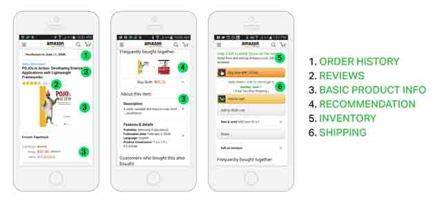
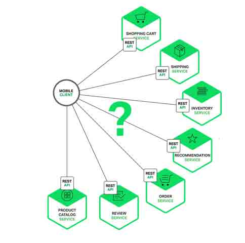
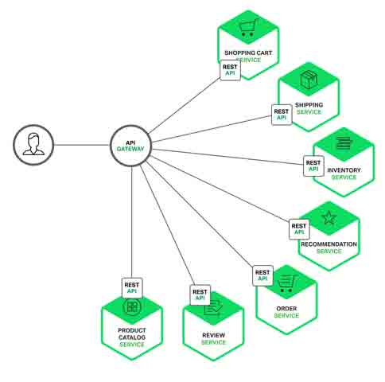

# 微服务实战（二）：使用 API Gateway

> [`dockone.io/article/482`](http://dockone.io/article/482)

【编者的话】本系列的第一篇介绍了微服务架构模式。它讨论了采用微服务的优点和缺点，除了一些复杂的微服务，这种模式还是复杂应用的理想选择。

当你决定将应用作为一组微服务时，需要决定应用客户端如何与微服务交互。在单体式程序中，通常只有一组冗余的或者负载均衡的服务提供点。在微服务架构中，每一个微服务暴露一组细粒度的服务提供点。在本篇文章中，我们来看它如何影响客户端到服务端通信，同时提出一种 API Gateway 的方法。

### 介绍

假定你正在为在线购物应用开发一个原生手机客户端。你需要实现一个产品最终页来展示商品信息。

例如，下面的图展示了你在亚马逊 Android 客户端上滑动产品最终页时看到的信息。

虽然这是一个智能手机应用，这个产品最终页展示了非常多的信息。例如，不仅这里有产品基本信息（名字、描述和价格），还有以下内容：

*   购物车中的物品数
*   下单历史
*   用户评论
*   低库存警告
*   快递选项
*   各式各样的推荐，包括经常跟这个物品一起被购买的产品、购买该物品的其他顾客购买的产品以及购买该产品的顾客还浏览了哪些产品。
*   可选的购物选项

当采用一个单体式应用架构，一个移动客户端将会通过一个 REST 请求（GET api.company.com/productdetails/productId）来获取这些数据。一个负载均衡将请求分发到多个应用实例之一。应用将查询各种数据库并返回请求给客户端。

相对的，若是采用微服务架构，最终页上的数据会分布在不同的微服务上。下面列举了可能与产品最终页数据有关的一些微服务：

*   购物车服务 -- 购物车中的物品数
*   下单服务 -- 下单历史
*   分类服务 -- 基本产品信息，如名字、图片和价格
*   评论服务 -- 用户评论
*   库存服务 -- 低库存警告
*   快递服务 -- 快递选项、截止时间、来自不同快递 API 的成本计算
*   推荐服务 -- 推荐产品

我们需要决定移动客户端如何访问这些服务。请看下面这几种方式

### 客户端到微服务直接通信

理论上说，一个客户端可以直接给多个微服务中的任何一个发起请求。每一个微服务都会有一个对外服务端([`serviceName.api.company.nam`](https://serviceName.api.company.nam)e)。这个 URL 可能会映射到微服务的负载均衡上，它再转发请求到具体节点上。为了搜索产品细节，移动端需要向上述微服务逐个发请求。

不幸的是，这个方案有很多困难和限制。其中一个问题是客户端的需求量与每个微服务暴露的细粒度 API 数量的不匹配。如图中，客户端需要 7 次单独请求。在更复杂的场景中，可能会需要更多次请求。例如，亚马逊的产品最终页要请求数百个微服务。虽然一个客户端可以通过 LAN 发起很多个请求，但是在公网上这样会很没有效率，这个问题在移动互联网上尤为突出。这个方案同时会导致客户端代码非常复杂。

另一个存在的问题是客户端直接请求微服务的协议可能并不是 web 友好型。一个服务可能是用 Thrift 的 RPC 协议，而另一个服务可能是用 AMQP 消息协议。它们都不是浏览或防火墙友好的，并且最好是内部使用。应用应该在防火墙外采用类似 HTTP 或者 WEBSocket 协议。

这个方案的另一个缺点是它很难重构微服务。随着时间的推移，我们可能需要改变系统微服务目前的切分方案。例如，我们可能需要将两个服务合并或者将一个服务拆分为多个。但是，如果客户端直接与微服务交互，那么这种重构就很难实施。

由于上述三种问题的原因，客户端直接与服务器端通信的方式很少在实际中使用。

### 采用一个 API Gateway

通常来说，一个更好的解决办法是采用 API Gateway 的方式。API Gateway 是一个服务器，也可以说是进入系统的唯一节点。这跟面向对象设计模式中的 Facade 模式很像。API Gateway 封装内部系统的架构，并且提供 API 给各个客户端。它还可能有其他功能，如授权、监控、负载均衡、缓存、请求分片和管理、静态响应处理等。下图展示了一个适应当前架构的 API Gateway。

API Gateway 负责请求转发、合成和协议转换。所有来自客户端的请求都要先经过 API Gateway，然后路由这些请求到对应的微服务。API Gateway 将经常通过调用多个微服务来处理一个请求以及聚合多个服务的结果。它可以在 web 协议与内部使用的非 Web 友好型协议间进行转换，如 HTTP 协议、WebSocket 协议。

API Gateway 可以提供给客户端一个定制化的 API。它暴露一个粗粒度 API 给移动客户端。以产品最终页这个使用场景为例。API Gateway 提供一个服务提供点（/productdetails?productid=xxx）使得移动客户端可以在一个请求中检索到产品最终页的全部数据。API Gateway 通过调用多个服务来处理这一个请求并返回结果，涉及产品信息、推荐、评论等。

一个很好的 API Gateway 例子是[Netfix API Gateway](http://techblog.netflix.com/2013/02/rxjava-netflix-api.html)。Netflix 流服务提供数百个不同的微服务，包括电视、机顶盒、智能手机、游戏系统、平板电脑等。起初，Netflix 视图提供一个[适用全场景](http://www.programmableweb.com/news/why-rest-keeps-me-night/2012/05/15)的 API。但是，他们发现这种形式不好用，因为涉及到各式各样的设备以及它们独特的需求。现在，他们采用一个 API Gateway 来提供容错性高的 API，针对不同类型设备有相应代码。事实上，一个适配器处理一个请求平均要调用 6 到 8 个后端服务。Netflix API Gateway 每天处理数十亿的请求。

### API Gateway 的优点和缺点

如你所料，采用 API Gateway 也是优缺点并存的。API Gateway 的一个最大好处是封装应用内部结构。相比起来调用指定的服务，客户端直接跟 gatway 交互更简单点。API Gateway 提供给每一个客户端一个特定 API，这样减少了客户端与服务器端的通信次数，也简化了客户端代码。

API Gateway 也有一些缺点。它是一个高可用的组件，必须要开发、部署和管理。还有一个问题，它可能成为开发的一个瓶颈。开发者必须更新 API Gateway 来提供新服务提供点来支持新暴露的微服务。更新 API Gateway 时必须越轻量级越好。否则，开发者将因为更新 Gateway 而排队列。但是，除了这些缺点，对于大部分的应用，采用 API Gateway 的方式都是有效的。

### 实现一个 API Gateway

既然我们已经知道了采用 API Gateway 的动机和优缺点，下面来看在设计它时需要考虑哪些事情。

#### 性能和可扩展性

只有少数公司需要处理像 Netflix 那样的规模，每天需要处理数十亿的请求。但是，对于大多数应用，API Gateway 的性能和可扩展性也是非常重要的。因此，创建一个支持同步、非阻塞 I/O 的 API Gateway 是有意义的。已经有不同的技术可以用来实现一个可扩展的 API Gateway。在 JVM 上，采用基于 NIO 技术的框架，如 Netty，Vertx，Spring Reactor 或者 JBoss Undertow。Node.js 是一个非 JVM 的流行平台，它是一个在 Chrome 的 JavaScript 引擎基础上建立的平台。一个可选的方案是[NGINX Plus](http://nginx.com/solutions/get-apis/)。NGINX Plus 提供一个成熟的、可扩展的、高性能 web 服务器和反向代理，它们均容易部署、配置和二次开发。NGINX Plus 可以管理授权、权限控制、负载均衡、缓存并提供应用健康检查和监控。

#### 采用反应性编程模型

对于有些请求，API Gateway 可以通过直接路由请求到对应的后端服务上的方式来处理。对于另外一些请求，它需要调用多个后端服务并合并结果来处理。对于一些请求，例如产品最终页面请求，发给后端服务的请求是相互独立的。为了最小化响应时间，API Gateway 应该并发的处理相互独立的请求。但是，有时候请求之间是有依赖的。API Gateway 可能需要先通过授权服务来验证请求，然后在路由到后端服务。类似的，为了获得客户的产品愿望清单，需要先获取该用户的资料，然后返回清单上产品的信息。这样的一个 API 组件是[Netflix Video Grid](http://techblog.netflix.com/2013/02/rxjava-netflix-api.html)。

利用传统的同步回调方法来实现 API 合并的代码会使得你进入回调函数的噩梦中。这种代码将非常难度且难以维护。一个优雅的解决方案是采用反应性编程模式来实现。类似的反应抽象实现有 Scala 的[Future](http://docs.scala-lang.org/overviews/core/futures.html)，Java8 的[CompletableFuture](https://docs.oracle.com/javase/8/docs/api/java/util/concurrent/CompletableFuture.html)和 JavaScript 的[Promise](https://developer.mozilla.org/en-US/docs/Web/JavaScript/Reference/Global_Objects/Promise)。基于微软.Net 平台的有[Reactive Extensions(Rx)](http://reactivex.io/)。Netflix 为 JVM 环境创建了 RxJava 来使用他们的 API Gateway。同样地，JavaScript 平台有 RxJS，可以在浏览器和 Node.js 平台上运行。采用反应编程方法可以帮助快速实现一个高效的 API Gateway 代码。

#### 服务调用

一个基于微服务的应用是一个分布式系统，并且必须采用线程间通信的机制。有两种线程间通信的方法。一种是采用异步机制，基于消息的方法。这类的实现方法有 JMS 和 AMQP。另外的，例如 Zeromq 属于服务间直接通信。还有一种线程间通信采用同步机制，例如 Thrift 和 HTTP。事实上一个系统会同时采用同步和异步两种机制。由于它的实现方式有很多种，因此 API Gateway 就需要支持多种通信方式。

#### 服务发现

API Gateway 需要知道每一个微服务的 IP 和端口。在传统应用中，你可能会硬编码这些地址，但是在现在云基础的微服务应用中，这将是个简单的问题。基础服务通常会采用静态地址，可以采用操作系统环境变量来指定。但是，探测应用服务的地址就没那么容易了。应用服务通常动态分配地址和端口。同样的，由于扩展或者升级，服务的实例也会动态的改变。因此，API Gateway 需要采用系统的服务发现机制，要么采用[服务端发现](http://microservices.io/patterns/server-side-discovery.html)，要么是[客户端发现](http://microservices.io/patterns/client-side-discovery.html)。后续的一篇文章将会更详细的介绍这部分。如果采用客户端发现服务，API Gateway 必须要去查询[服务注册处](http://microservices.io/patterns/service-registry.html)，也就是微服务实例地址的数据库。

#### 处理部分失败

在实现 API Gateway 过程中，另外一个需要考虑的问题就是部分失败。这个问题发生在分布式系统中当一个服务调用另外一个服务超时或者不可用的情况。API Gateway 不应该被阻断并处于无限期等待下游服务的状态。但是，如何处理这种失败依赖于特定的场景和具体服务。例如，如果是在产品详情页的推荐服务模块无响应，那么 API Gateway 应该返回剩下的其他信息给用户，因为这些信息也是有用的。推荐部分可以返回空，也可以返回固定的顶部 10 个给用户。但是，如果是产品信息服务无响应，那么 API Gateway 就应该给客户端返回一个错误。

在缓存有效的时候，API Gateway 应该能够返回缓存。例如，由于产品价格变化并不频繁，API Gateway 在价格服务不可用时应该返回缓存中的数值。这类数据可以由 API Gateway 自身来缓存，也可以由 Redis 或 Memcached 这类外部缓存实现。通过返回缓存数据或者默认数据，API Gateway 来确保系统错误不影响到用户体验。

[Netflix Hystrix](https://github.com/Netflix/Hystrix)对于实现远程服务调用代码来说是一个非常好用的库。Hystrix 记录那些超过预设定的极限值的调用。它实现了*circuit break*模式，使得可以将客户端从无响应服务的无尽等待中停止。如果一个服务的错误率超过预设值，Hystrix 将中断服务，并且在一段时间内所有请求立刻失效。Hystrix 可以为请求失败定义一个 fallback 操作，例如读取缓存或者返回默认值。如果你在用 JVM，就应该考虑使用 Hystrix。如果你采用的非 JVM 环境，那么应该考虑采用类似功能的库。

### 总结

对于大多数微服务基础的应用，实现一个 API Gateway 都是有意义的，它就像是进入系统的一个服务提供点。API Gateway 负责请求转发、请求合成和协议转换。它提供给应用客户端一个自定义的 API。API Gateway 可以通过返回缓存或者默认值的方式来掩盖后端服务的错误。在本系列的下一篇文章中，我们将讨论服务间的通信问题。

**原文链接：[Building Microservices: Using an API Gateway](http://nginx.com/blog/building-microservices-using-an-api-gateway/) (翻译：陈杰；审校：杨峰)**

===============================================
**译者介绍**
**陈杰**，北京理工大学计算机学院在读博士，研究方向是自然语言处理在企业网络信誉评价方面的应用，平时也乐于去实现一些突发的想法。在疲于配置系统环境时发现了 Docker，跟大家一起学习、使用和研究 Docker。