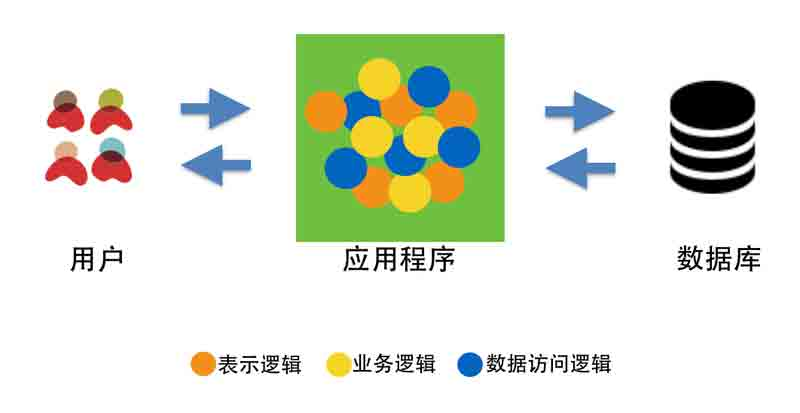
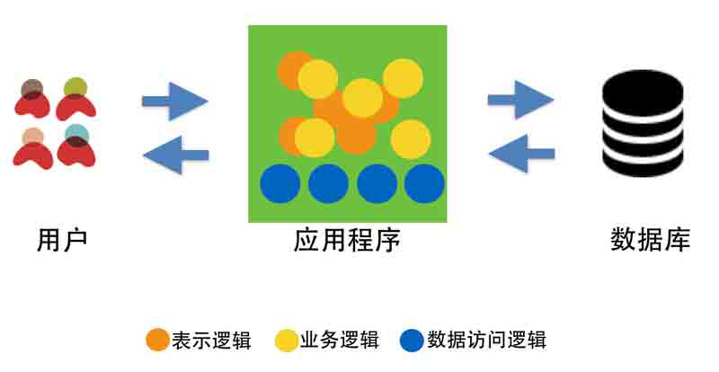
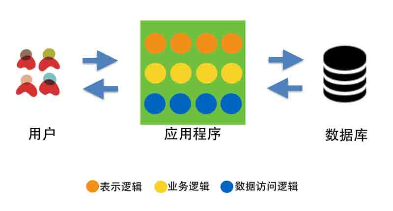
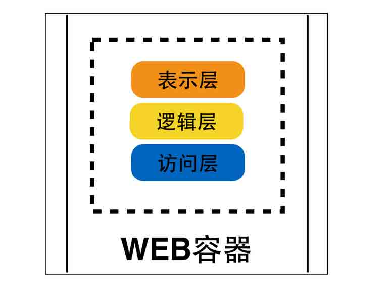
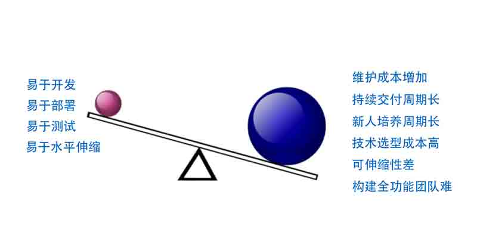
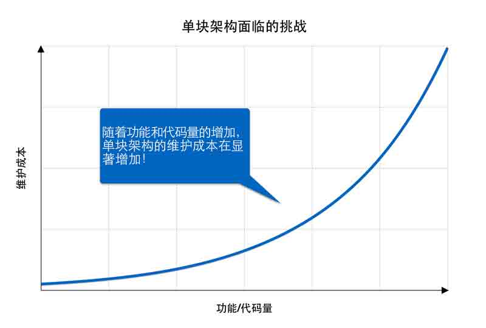
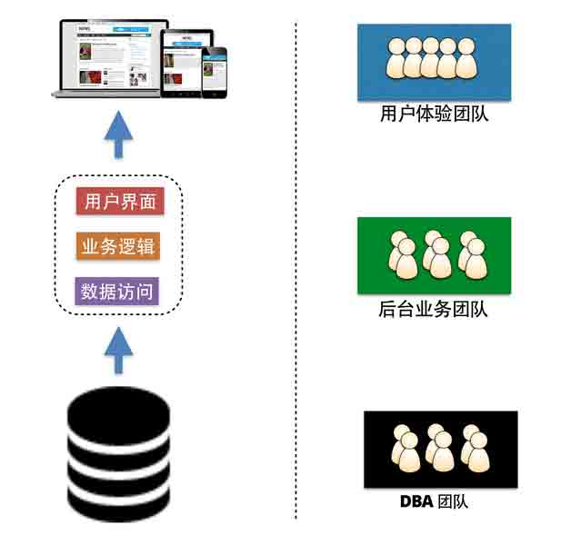

# 解析微服务架构（一）单块架构系统以及其面临的挑战

> [`www.infoq.com/cn/articles/analysis-the-architecture-of-microservice-part-01/`](http://www.infoq.com/cn/articles/analysis-the-architecture-of-microservice-part-01/)

## 　　概述

　　多年来，我们一直在技术的浪潮中乘风破浪，扬帆奋进，寻找更优秀的方法来构建 IT 系统，也一直在积极的学习并观察先进的公司如何以不同的架构方式构建或者优化其 IT 系统，来积极应对市场的变化，迅速做出响应，从而为客户提供更多的价值。

　　微服务架构模式（Microservice Architect Pattern）是近两年在软件架构模式领域里出现的一个新名词。虽然其诞生的时间不长，但其在各种演讲、文章、书籍上所出现的频率已经让很多人意识到它对软件领域所带来的影响。那到底什么是微服务，当我们谈论微服务时，它代表着一种什么样的含义？微服务适合应用在什么场景下，以及它有什么样的优缺点？微服务和 SOA 到底有没有区别？在接下来的几部分里，我将为大家揭开微服务的神秘面纱。

　　不过，在我们开始探讨微服务架构之前，让我们先回顾一下三层应用架构的发展历程并认识一下什么是单块架构应用。

## 　　三层应用架构的发展

　　对于任何一个软件应用系统而言，其构建目标都是为了满足某类用户的需求，即为用户传递价值。一直以来，软件的架构设计是决定应用系统是否能够被正确、有效实现的关键要素之一。架构设计描述了在应用系统的内部，如何根据业务、技术、组织，以及灵活性、可扩展性、可维护性等多种因素，将应用系统划分成不同的部分，并使这些部分彼此之间相互分工、相互协作，从而为用户提供某种特定价值的方式。

## 　　应用的三层架构

　　现实生活中，“层”这个字的含义，对大家一点都不陌生。我们经常说楼房高多少层，蛋糕有几层等。通常来说，层有好几种定义，但其中最耳熟能详的，莫过于“层”能帮助我们划分出构成某整体事物的，上下相互支撑的的不同部分。譬如说，我们喜欢吃的蛋糕，一般是由三层组成：第一层的蛋糕体、第二层的奶油，和第三层的水果。从顶部至底部，每一层依赖于下一层，从底部到顶部，每一层又支撑着上一层。

　　在软件架构模式的领域，经过多年的发展，也有了层的概念：

*   层能够被单独构造；
*   层具有区别于其他层的显著特点；
*   层与层之间能够互相连接、互相支撑、互相作用，相互协作构成一个整体。
*   层的内部，可以被替换成其他可工作的部分，但对整体的影响不大。

　　以 WEB 应用程序为例，在 WEB 应用程序开发的早期，由于受到面向过程的思维及设计方式的影响，所有的逻辑代码并没有明显的区分，因此代码之间的调用相互交错，错综复杂。譬如，我们早期使用的 ASP、JSP 以及 PHP，都是将所有的页面逻辑、业务逻辑以及数据库访问逻辑放在一起，这是我们通常提到的一层架构。

　　随着 JAVA，.NET 等高级语言的快速发展，这些语言为开发者提供了越来越方便的的数据访问机制，如 Java 语言的 JDBC、IO 流，或者.NET 的 ADO.NET 等。这时候，数据访问部分的代码逐渐有了清晰的结构，但表示逻辑和业务逻辑依然交织在一起，我们称这个阶段为二层架构阶段。

　　随着面向对象分析、面向对象设计、面向对象原则、设计模式、企业架构模式等理念以及方法论的不断发展，从为用户提供功能、以及有效组织软件结构的角度考虑，WEB 应用中不同职责的部分逐渐被定义在了不同的层次，每一层负责的部分更趋向于具体化，细致化，于是软件的三层架构逐渐出现了。三层架构通常包括表示层、业务逻辑层以及数据访问层。

*   表示层

    表示层部分通常指当用户使用应用程序时，看见的、听见的、输入的或者交互的部分。譬如，有可能是信息的显示，音乐的的播放或者可以输入的文本框，单选按钮以及可点击的按钮等。通过这些元素，用户同软件进行交互并获取期望的价值。目前的用户接口大部分情况下为 WEB 方式，当然也可以是桌面软件的形式，例如. NET 的 WINFORM 或者 Java 的 SWING。

*   业务逻辑层

    业务逻辑部分是根据用户输入的信息，进行逻辑计算或者业务处理的部分。业务逻辑层则主要聚焦应用程序对业务问题的逻辑处理，以及业务流程的操作，它是大部分软件系统区别与其他系统的核心。譬如，当用户点击一个按钮后，它可能会触发业务逻辑部分的代码进行运算，生成用户期望的结果。举例来说，在一个电子商务平台中，作为用户，当我们下单购买某个商品后，应用程序的业务逻辑层会对订单如何进行处理，如何计算折扣、如何配送等进行处理。

*   数据访问层

    在用户同应用程序交互的过程中，会产生数据。这类数据需要通过某种机制被有效的保存，并在将来能够被重复使用，或者提供给其他系统。这种机制或者方法就是数据访问层最关注的部分。也就是说，它关注的是应用程序是如何有效的将数据存储到数据库、文件系统或者其他存储介质中。有一点要注意的是，它关心的是对原始数据的操作（数据库或者文本文件等存放数据的形式），而非原始数据的存储介质本身。譬如，在一个电子商务平台中，商品的信息是如何存储，图片的信息是如何获取的等。

　　三层架构的出现，一方面是为了解决应用程序中代码间调用复杂、代码职责不清的问题。其通过在各层间定义接口，并将接口与实现分离，可以很容易的用不同的实现来替换原有层次的实现，从而有效降低层与层之间的依赖。这种方式不仅有利于帮助团队理解整个应用架构，降低后期维护成本，同时也有利于制定整个应用程序架构的标准。

　　另一方面，三层结构的出现从某种程度上也解决了企业内部如何有效的根据技能调配人员，提高生产效率的问题。在大环境下，有效的分层能使不同职责的人员各司其职，更聚焦与个人专业技能的发展和培养。三层结构的出现不仅标准化了复杂系统的逻辑划分，更帮助企业解决了如何有效形成技术人员组织结构的问题，因此在很长的一段时间里，它一直是软件架构的经典模式之一。

## 　　非三层架构

　　有些人认为，对于一个 WEB 应用程序，其被自动地分成了三层架构，因为它有三个分离的部件，如图所示：

　　这三个部分看起来虽然满足“层”的概念，但它并不是我们所说的软件架构的层。就像我们所说的奶油蛋糕，我们可以在蛋糕的底部加上稳固的底座，在蛋糕的外部加上漂亮的包装盒，但仔细想想，底座可以用不同品牌的底座，可以用纸质材料的，也可以用树脂材料的；包装盒可以用红色的一次性纸袋，也可以用蓝色的带着花纹的铁盒，它们并不是我们蛋糕组成的必须一部分。

　　浏览器可以独立存在与 WEB 应用程序之外，WEB 应用程序也可以被不同的浏览器访问，因此浏览器不是 WEB 应用程序的部分。虽然最近几年，在浏览器端，我们可以使用很多 JavaScript 库或者框架独立开发前端应用，但它的范畴超出了我们目前讨论的三层架构，更多的属于富客户端以及前后端分离的应用。

　　类似的，数据库服务器也可以独立存在于应用程序之外，因此它也不是应用程序的一部分。虽然有些应用程序的逻辑代码，被设计成必须是在数据库中运行，例如存储过程或者触发器，但这种用法并不推荐，原因是将业务逻辑放在了数据库本身，大大增加了后期维护的复杂度和数据迁移的成本。

## 　　单块架构应用

### 　　什么是单块架构应用

　　虽然软件的三层架构帮助我们将应用在逻辑上分成了三层，但它并不是物理上的分层。这也就意味着，即便我们将应用架构分成了 所谓的三层，经过开发团队对不同层的代码实现，经历过编译（如果非静态语言，可以跳过编译阶段）、打包、部署后，不考虑负载均衡以及水平扩展的情况，最终还是运行在同一个机器的同一个进程中。对于这种功能集中、代码和数据中心化、一个发布包、部署后运行在同一进程的应用程序，我们通常称之为单块架构应用。典型的单块架构应用，莫过于传统的 J2EE 项目所构建的产品或者项目，它们存在的形态一般是 WAR 包或者 EAR 包。当部署这类应用时，通常是将整个一块都作为一个整体，部署在同一个 WEB 容器，如 Tomcat 或者 Jetty 中。当这类应用运行起来后，所有的功能也都运行在同一个进程中。

　　类似的，基于 Ruby On Rails 的单块架构应用，一般逻辑上分为控制器层、模型层以及视图层，同时代码存放在遵循一定层级结构 的目录中。当部署这类应用的时候，通常是使用 SSH 或者其他一些工具，如[Capistrano](https://github.com/capistrano/capistrano)将整个目录部署在[Passenger](https://www.phusionpassenger.com/)或者其他 WEB 容器中。当这类应用运行起来后，所有的功能也都运行在同一个进程中。

　　因此，对于单块架构应用的定义，其实是基于分层软件架构设计的系统基础之上，从部署模式、运行模式角度去考虑的一种定义方式。

## 　　单块架构应用的优势

*   易于开发

    对单块架构的应用程序而言，开发方式相对较简单。首先从概念上，现有的大部分工具、应用服务器、框架都是这类单块架构应用程序，容易理解而且为人所熟知。如果从实践角度出发，现有的集成开发工具比较适合单块架构的应用程序，像 NetBeans、Eclipse、IDEA 等，它们都能够有效加载并配置整个应用程序的依赖，方便开发人员开发、运行、调试等。

*   易于测试

    单块架构应用程序也非常容易被测试，因为所有的功能都运行在一个进程中，启动集成开发环境或者将发布包部署到某一环境，一旦启动该进程，就可以立即开始系统测试或者功能测试。

*   易于部署

    对单块架构的应用程序而言，部署也比较容易。实际上，由于所有的功能最终都会打成一个包，因此只需复制该软件包到服务器相应的位置即可。当然，部署的方式可以有很多种，最简单的可以使用 SCP 远程拷贝到指定的目录下，当然也可以使用某些自动化的工具来完成。

*   易于水平伸缩

    对单块架构的应用程序而言，水平伸缩也比较容易。实际上，由于所有的功能最终都会打成一个包，且只能运行在一个进程中，因此单块架构的水平伸缩，更确切的理解其实是克隆，即新建一个服务器节点，配置好该节点的运行环境，复制软件包到相应的位置，运行改应用程序。当然，必须要确保负载均衡器能采取某种分发策略，有效的将请求分发到新创建的节点。

## 　　单块架构面临的挑战

　　随着最近几年互联网行业的迅猛发展，随着公司或者组织业务的不断扩张，需求不断的增加以及用户量的不断增加，单块架构的优势已逐渐无法适应互联网时代的快速变化，面临着越来越多的挑战。譬如说，一方面，随着业务的扩大，如何为用户提供可靠的服务，如何有效处理用户增多后导致并发请求数增多，导致的响应慢的问题，以及如何有效解决用户增多后带来的大数据量的问题等。另外一方面，随着公司或者组织业务的不断扩张，需求不断的增加，越来越多的人加入开发团队，代码库也在急剧膨胀。在这种情况下，单块架构的可维护性、灵活性在降低，而测试成本、构建成本以及维护成本却在显著增加。

### 　　1.维护成本增加

　　随着应用程序的功能越来越多，团队越来越大，相应的沟通成本、管理成本、人员协调成本必然会显著增加。譬如说，对于使用 Java 编写的中型应用而言，当代码量为几万行时，可能只需要几人左右的团队维护。当代码量上升到几十万行级别时，可能需要几十人甚至是上百人的团队。

　　另外，随着应用程序功能的增多，当出现缺陷时，有可能引起缺陷的原因组合就会比较多，这也会导致分析缺陷、定位缺陷、修复缺陷的成本相应增高，也就意味着缺陷的平均修复周期可能会花费更长时间。

　　另外，随着代码量的增大，在开发人员对全局功能缺乏深度理解的情况下，修复一个缺陷，还有可能引入其他的缺陷，在自动化测试机制不完善的情况下，很可能导致该过程陷入“修复越多，缺陷越多”的恶性循环。

### 　　2.持续交付周期长

　　随着应用程序的功能越来越多，代码越来越复杂，构建和部署时间也会相应的增长。在现有部署流水线稳定工作的情况下，对单块架构应用程序做任何细微的修改以及代码提交，都会触发部署流水线，对整个应用程序进行代码编译、运行单元测试、代码检查、构建并生成部署包、验证功能等，这也就意味着流水线的反馈周期变长，单位时间内构建的效率变低了。

　　另一方面，团队人员的增多，部署流水线运行的时间增加，开发人员能够提交代码的时间窗口就相应减少，（因为流水线运行的过程中，是禁止提交代码的），可能出现长时间等待代码提交，却无法提交的情况，极大破坏了团队的灵活性并降低了团队工作效率。几年前，我曾经工作在一个 50 万代码行的单块架构应用上，整个应用由一个 50 人左右的分布式团队负责。通常情况下，从开发人员提交代码到运行单元测试、构建发布包、运行功能测试、标记为可发布状态大概需要 40 分钟，时间稍微有点长，但团还能忍受。关键的问题是开发人员通常都是集中在下午 3 点左右，完成一定功能的情况下提交代码，结果就导致 3 点至 5 点那个时间段，成了代码提交的瓶颈，极大影响了该应用的持续集成和构建的效率。

### 　　3.新人培养周期长

　　随着应用程序的功能越来越多，代码变得越来越复杂的同时，对于新加入团队的成员而言，了解行业背景、熟悉应用程序业务、配置本地开发环境，这些看似简单的任务，将会花费更长的时间。我曾经有个朋友，在加入一家世界 500 强的知名 IT 公司后，被安排到了一个百万级代码的产品组里。他花了将近 1 个月的时间来熟悉产品文档、配置开发环境后，才在本地成功的运行起了这个应用。在他从事这份新工作的头一个月里，我们好几次聊到他的新工作，得到的答案都是一样，“看文档，装环境”。对个人而言，花一个月时间来配置本地开发环境，其中的滋味和感受大家可想而知，我估计人世间比这更痛苦的事情也没几件了。而对公司或者部门而言，本期望员工花费数天就能配置好的环境，却花了一个月才能完成，这更是极大的浪费。更有甚者，在第一次配置完开发环境后，好几年都不愿意再升级或者重装系统，真是一招被蛇咬，十年怕井绳。

### 　　4.技术选型成本高

　　传统的单块架构系统倾向采用统一的技术平台或方案来解决所有问题。通常，技术栈的决策是在团队开发之前经过架构师、技术经理慎重评估后选定的，每个团队成员都必须使用相同的开发语言、持久化存储及消息系统，而且要使用类似的工具。随着应用程序的复杂性逐渐增加以及功能越来越多，如果团队希望尝试引入新的框架、技术，或者对现有技术栈升级，通常会面临不小的风险。

　　另一方面，互联网行业不仅市场变化快，而且技术变化也快。譬如，短短几年几年时间，光前端 JavaScript 的框架，就出现了好几十个，从早一点的[Backbone](http://backbonejs.org/)、[Ember](http://emberjs.com/)到[AngularJS](https://angularjs.org/)、[Ractive](http://www.ractivejs.org/)等等。类似的，后端的框架、工具等也是层出不穷，有兴趣的朋友可以参考下[ThoughtWorks 的技术雷达](http://www.thoughtworks.com/radar)(该技术雷达是 ThoughtWorks 对业界技术、工具、语言等发展趋势的分析以及预测报告)。因此，对单块架构的应用而言，初始的技术选型严重限制了其将来采用不同语言或框架的能力。如果想尝试新的编程语言或者框架，没有完备的功能测试集，很难平滑的完成替换，而且系统规模越大，风险越高。

### 　　5.可伸缩性差

　　如果应用程序的所有功能代码都运行在同一个服务器上，将会导致应用程序的扩展非常困难。如果迫切的需要扩展，那么垂直扩展可能是最容易的（钱不是问题）。在大多数情况下，如果舍得砸钱上 IBM 的服务器、Oracle 的数据库或者来自 EMC 的存储设备，不用改变一行代码，整个世界都变好了。不幸的是，伴随着业务的增长，数据的增长，垂直扩展会变得越来越吃力，成本越来越高。这也是为什么在业很多公司开始尝试使用开源，放弃这些昂贵的 IOE 产品的原因。这下明白为什么近几年去 IOE 的呼声越来越高了吧。

　　当考虑水平扩展时，通常的做法是建立一个集群，通过在集群中不断的添加新节点，然后借助前端的负载均衡器，将用户的请求按照某种算法，譬如轮转法、散列法或者最小连接法等合理的将请求分配到不同的节点上。但是，由于所有程序代码都运行在服务器上的同一个进程中，会导致应用程序的水平扩展成本非常高。譬如说，如果应用程序某部分的功能是内存密集型的，如需要缓存大量数据，而另外一部分功能是 CPU 密集型的，如需要进行大量的运算，那么每次实施水平扩展，运行该应用的服务器都必须有足够的内存和强劲的 CPU 来满足需求。因此，鉴于每个服务器都要提供该应用系统所需要的各种资源，基础设施的整体花费可能会非常高。当然，如果某些节点保持状态，如用户登陆后的会话信息等，更增加了水平扩展的难度。

### 　　6.构建全功能团队难

　　最后，非常微妙的是，随着应用程序的功能越来越多，代码变得越来越复杂，其应用程序的复杂结构也会逐渐映射到研发团队的结构上。康威定律指出：一个组织的设计成果，其结构往往对应于这个组织中的沟通结构。单块架构的开发模式在分工时往往以技能为单位，比如 UX 团队、服务端团队和数据库团队，这样的分工可能会导致任何功能上的改变都需要跨团队沟通和协调。譬如说，用户体验工程师（UX）更专注负责用户接口部分，业务层开发者则负责建立服务器后端的业务逻辑，数据库工程师和 DBA 们更关注数据访问组件和数据库。鉴于这些问题，随着时间的推移，不仅代码越来越难以管理，其对团队结构的影响也越来越明显。

　　综上所述，随着业务的不断扩大，需求功能的持续增加，单块架构已经很难满足业务快速变化的需要。一方面，代码的可维护性、扩展性、灵活性在降低；而另一方面，系统的测试成本、构建成本以及维护成本却在显著增加。因此，随着项目或者产品规模的不断扩大，单块架构应用的改造与重构势在必行。

## 　　总结

　　互联网时代的产品通常有几类特点：创新成本低、需求变化快，用户群体庞大，它和几年前我们熟悉的单块架构应用有着本质的不同。随着市场变化快、用户需求变化快、用户访问量增加的同时，单块架构应用的维护成本、人员的培养成本、缺陷修复成本、技术架构演进的成本、系统扩展成本等都在增加，因此单块架构曾经的优势已逐渐无法适应互联网时代的快速变化，面临着越来越多的挑战。

## 　　作者简介

**　　王磊**，ThoughtWorks 公司首席咨询师。开源软件的爱好者和贡献者，社区活动的参与者，Practical RubyGems 的译者， GDCR 西安的组织者。于 2012 年加入 ThoughtWorks,为国内外诸多客户提供项目交付和咨询服务；在加入 ThoughtWorks 之前，曾就职过多家知名外企，具有丰富的敏捷项目实战经验。目前致力于微服务架构、虚拟化容器、持续交付、以及 Devops 的研究与实践。