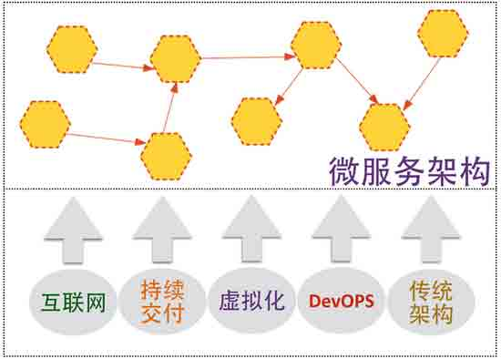
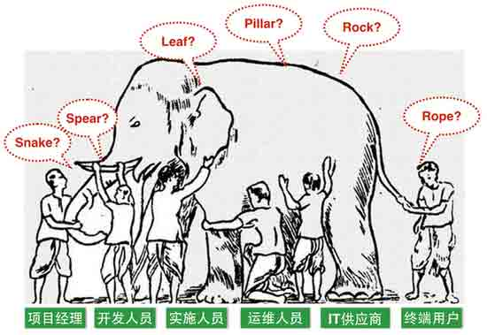
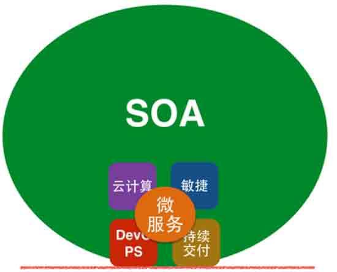

# 解析微服务架构（二）微服务架构综述

> [`www.infoq.com/cn/articles/analysis-the-architecture-of-microservice-part-02/`](http://www.infoq.com/cn/articles/analysis-the-architecture-of-microservice-part-02/)

在 [解析微服务架构(一) 单块架构系统以及其面临的挑战](http://www.infoq.com/cn/articles/analysis-the-architecture-of-microservice-part-01) 中，我们谈到了随着市场的快速发展，业务的不断扩大，单块架构应用面临着越来越多的挑战，其改造与重构势在必行。

## 微服务的诞生

微服务架构（Microservice Architect）是一种架构模式，它提倡将单块架构的应用划分成一组小的服务，服务之间互相协调、互相配合，为用户提供最终价值。每个服务运行在其独立的进程中，服务与服务间采用轻量级的通信机制互相沟通。每个服务都围绕着具体业务进行构建，并且能够被独立的部署到生产环境、类生产环境等。

微服务架构虽然诞生的时间并不长，但其在各种演讲、文章、书籍上所出现的频率已经让很多人意识到它对软件架构领域所带来的影响。

### 背景

其实，微服务的诞生并非偶然。它是互联网高速发展，敏捷、精益、持续交付方法论的深入人心，虚拟化技术与 DevOPS 文化的快速发展以及传统单块架构无法适应快速变化等多重因素的推动下所诞生的产物：

#### 1\. 互联网行业的快速发展

过去的十年中，互联网对我们的生活产生了翻天覆地的变化。购物、打车、订餐、支付，甚至美甲、洗车等，想到的，想不到的活动都可以通过互联网完成，越来越多的传统行业公司也开始依赖互联网技术打造其核心竞争优势。互联网时代的产品通常有两类特点：需求变化快和用户群体庞大。在这种情况下，如何从系统架构的角度出发，构建灵活、易扩展的系统，快速应对需求的变化；同时，随着用户量的增加，如何保证系统的可伸缩性、高可用性，成为系统架构面临的挑战。

#### 2\. 敏捷、精益方法论的深入人心

纵观 IT 行业过去的十年，敏捷、精益、持续交付等价值观、方法论的提出以及实践，让很多组织意识到应变市场变化、提高响应力的重要性。精益创业（Lean Startup）帮助组织分析并建立最小可实行产品（Minimum Viable Product），通过迭代持续改进；敏捷方法帮助组织消除浪费，通过反馈不断找到正确的方向；持续交付帮助组织构建更快、更可靠、可频繁发布的交付机制。经过这些方法论以及实践的推行和尝试后，从宏观上而言，大部分组织已经基本上形成了一套可遵循、可参考、可实施的交付体系。这时候，逐渐完善并改进各个细节的需求就会更加强烈。所谓细节，就是类似如何找到灵活性高、扩展性好的架构方式、如何用更有效的技术、工具解决业务问题等。

#### 3\. 虚拟化技术与 DevOPS 文化的快速发展

虚拟化技术和基础设施自动化(Infrastructure As Code)的快速发展极大的简化了基础设施的创建、配置以及系统的安装和部署。譬如云平台的成熟以及像 [Chef](https://www.chef.io/) 、 [Puppet](https://puppetlabs.com/) 、 [Ansible](http://www.ansible.com/) 等工具的使用，让更多的基础设施能够通过自动化的方式动态创建。同时，容器化技术的发展以及 [Docker](https://www.docker.com/) 的出现，更是将虚拟化技术推向了一个史无前例的高潮。另外，DevOPS 文化的推行打破了传统开发与运维之间的壁垒，帮助组织形成更高效的、开发与运维高度协作的交付团队。这些技术与文化的快速发展，极大程度上解决了传统环境创建难、配置难以及‘最后一公里’的部署难、交付难等问题，成为推动微服务诞生、发展的重要因素之一。

#### 4\. 单块架构系统面临的挑战

几年前我们熟悉的传统 IT 系统，也可以称之为单块架构系统，是以技术分层，譬如逻辑层、数据层等。但随着用户需求个性化、产品生命周期变短、市场需求不稳定等因素的出现，单块架构系统面临着越来越多的挑战。因此，如何找到一种更有效的、更灵活、更适应当前互联网时代需求的系统架构方式，成为大家关注的焦点。

所以说，微服务的诞生决不是偶然，是多重因素推动下的必然产物。

## 微服务与 SOA

### SOA 简述

早在 1996 年，Gartner 就提出面向服务架构（SOA）。SOA 阐述了“对于复杂的企业 IT 系统，应按照不同的、可重用的粒度划分，将功能相关的一组功能提供者组织在一起为消费者提供服务”，其目的是为了解决企业内部不同 IT 资源之间无法互联而导致的信息孤岛问题。

2002 年，SOA 被称作"现代应用开发领域最重要的课题之一"，其正在帮助企业从资源利用的角度出发，将 IT 资源整合成可操作的、基于标准的服务，使其能被重新组合和应用。

但是，由于 SOA 本身的广义性以及抽象性，在其诞生的相当长一段时间内，人们对 SOA 存在着不同的认知和理解。

直到 2000 年左右， [ESB(Enterprise Service Bus)](https://en.wikipedia.org/wiki/Enterprise_service_bus) 、 [WebService](https://en.wikipedia.org/wiki/Web_service) 、 [SOAP](https://en.wikipedia.org/wiki/Soap) 等这类技术的出现，才使得 SOA 渐渐落地。同时，更多的厂商像 IBM、Oracle 等也分别提出基于 SOA 的解决方案或者产品。

### 微服务与 SOA

实际上，微服务架构并不是一个全新的概念。仔细分析 SOA 的概念，就会发现，其和我们今天所谈到的微服务思想几乎一致。那在 SOA 诞生这么多年后，为什么又提出了微服务架构呢？

鉴于过去十几年互联网行业的高速发展，以及敏捷、持续集成、持续交付、DevOPS，云技术等的深入人心，服务架构的开发、测试、部署以及监控等，相比我们提到的传统的 SOA 实现，已经大相径庭，主要区别如下表所示：

SOA 实现 | 微服务架构实现 | ----|----------| 企业级，自顶向下开展实施|团队级，自底向上开展实施| 服务由多个子系统组成，粒度大|一个系统被拆分成多个服务，粒度细| 企业服务总线，集中式的服务架构|无集中式总线，松散的服务架构| 集成方式复杂（ESB/WS/SOAP）|集成方式简单（HTTP/REST/JSON）| 单块架构系统，相互依赖，部署复杂|服务都能独立部署|

相比传统 SOA 的服务实现方式，微服务更具有灵活性、可实施性以及可扩展性，其强调的是一种独立测试、独立部署、独立运行的软件架构模式。

### 微服务架构的定义

其实，即便了解了上面的介绍，也很难对微服务下一个准确的定义。就像 NoSQL，我们谈论了好几年的 NoSQL，知道 NoSQL 代表着什么样的含义，也可以根据不同的应用场景选择不同的 NoSQL 数据库，但是我们还是很难对它下一个准确的定义。类似的，关于什么是‘函数式编程’，也或多或少存在同样的窘境。我们可以轻松的选择不同的函数式编程语言，可以轻松的写出函数式编程风格的代码，但很难对什么是函数式编程下一个准确的定义。

实际上，从业界的讨论来看,微服务本身并没有一个严格的定义。不过，ThoughtWorks 的首席科学家，马丁 -福勒先生对微服务的这段描述，似乎更加具体、贴切，通俗易懂：

Microservice

The microservice architectural style is an approach to developing a single application as a suite of small services, each running in its own process and communicating with lightweight mechanisms, often an HTTP resource API. These services are built around business capabilities and independently deployable by fully automated deployment machinery. There is a bare minimum of centralized management of these services, which may be written in different programming languages and use different data storage technologies.

微服务架构

微服务架构是一种架构模式，它提倡将单一应用程序划分成一组小的服务，服务之间互相协调、互相配合，为用户提供最终价值。每个服务运行在其独立的进程中，服务与服务间采用轻量级的通信机制互相沟通（通常是基于 HTTP 协议的 RESTful API）。每个服务都围绕着具体业务进行构建，并且能够被独立的部署到生产环境、类生产环境等。另外，应当尽量避免统一的、集中式的服务管理机制，对具体的一个服务而言，应根据业务上下文，选择合适的语言、工具对其进行构建。

总结下来，微服务架构中的核心部分包括以下几点：

*   小, 且专注于做⼀件事情
*   独立的进程中
*   轻量级的通信机制
*   松耦合、独立部署

## 总结

随着市场的快速发展，业务的不断扩大，单块架构应用面临着越来越多的挑战，其改造与重构势在必行。而微服务架构的诞生，是互联网高速发展，虚拟化技术应用以及持续交付、DevOPS 深入人心的综合产物。随着用户需求个性化、产品生命周期变短，微服务架构是未来软件软件架构朝着灵活性、扩展性、伸缩性以及高可用性发展的必然方向。同时，以 Docker 为代表的容器虚拟化技术的盛行，将大大降低微服务实施的成本，为微服务落地以及大规模使用提供了坚实的基础和保障。

## 参考文献

http://microservices.io/ htto://martinfowler.com/articles/microservices.html

感谢郭蕾对本文的策划和审校。

给 InfoQ 中文站投稿或者参与内容翻译工作，请邮件至 editors@cn.infoq.com。也欢迎大家通过新浪微博（@InfoQ，@丁晓昀），微信（微信号： [InfoQChina](http://weixin.sogou.com/gzh?openid=oIWsFt0HnZ93MfLi3pW2ggVJFRxY) ）关注我们，并与我们的编辑和其他读者朋友交流（欢迎加入 InfoQ 读者交流群  ）。