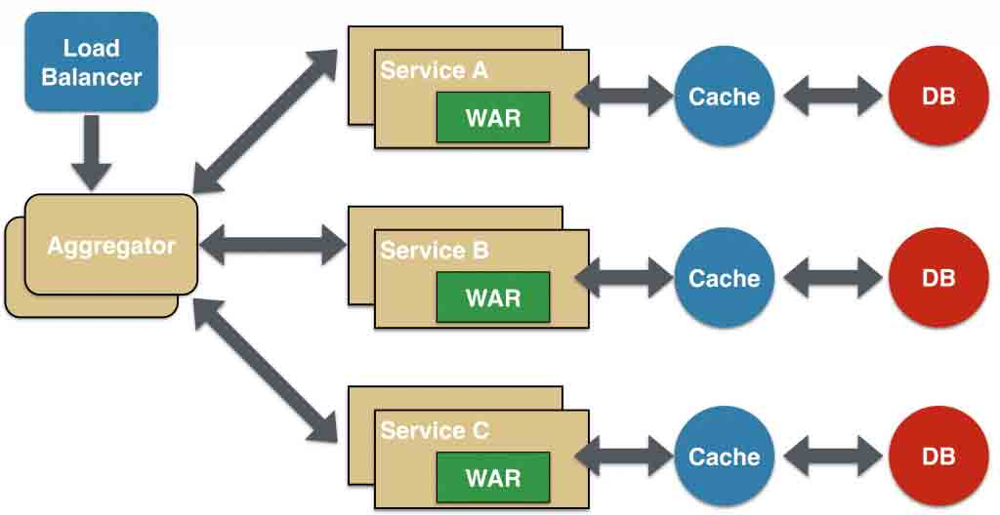
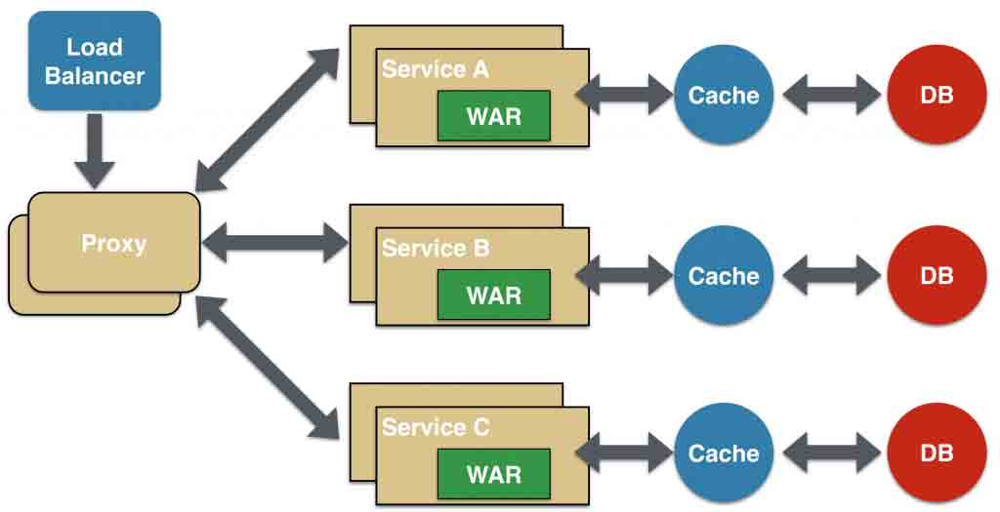
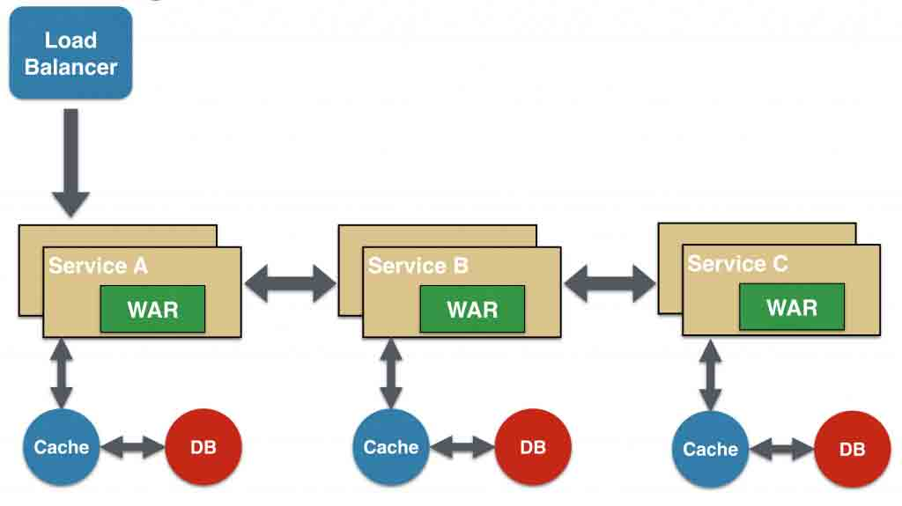
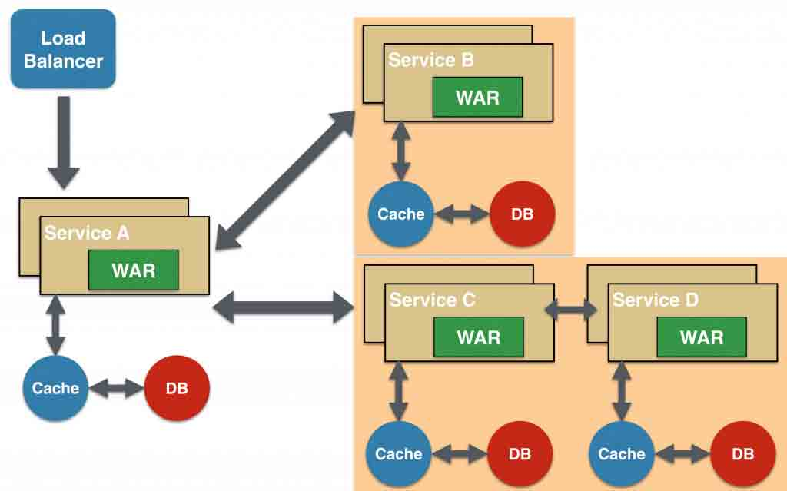
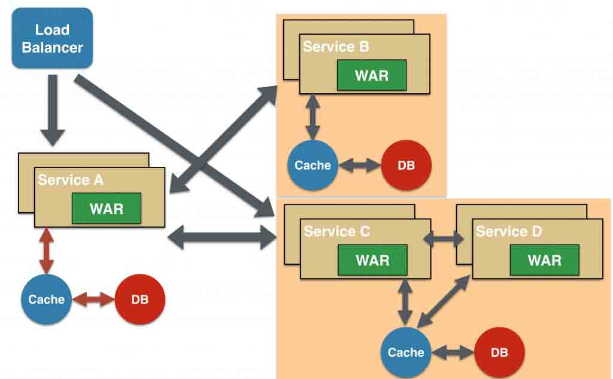
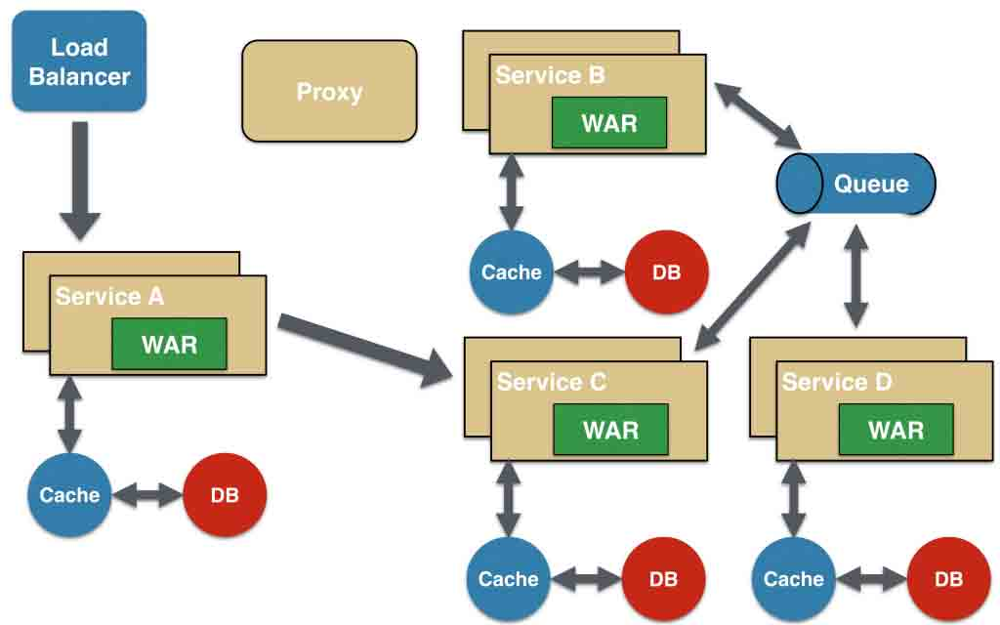

# 微服务架构的设计模式

> 原文出处：[`www.infoq.com/cn/news/2015/04/micro-service-architecture`](http://www.infoq.com/cn/news/2015/04/micro-service-architecture) 作者：谢丽

前不久，Java Code Geeks 发表了一篇[文章](http://www.javacodegeeks.com/2015/04/microservices-monoliths-and-noops.html)，分析[单体应用与微服务的优缺点](http://www.infoq.com/cn/news/2015/04/single-app-micro-service)。近日，该网站又发表了一篇[文章](http://www.javacodegeeks.com/2015/04/microservice-design-patterns.html)，提供了六种微服务架构的设计模式。

*   *   聚合器微服务设计模式
    *   代理微服务设计模式
    *   链式微服务设计模式
    *   分支微服务设计模式
    *   数据共享微服务设计模式
    *   异步消息传递微服务设计模式

## 聚合器微服务设计模式

这是一种最常用也最简单的设计模式，如下图所示：

聚合器调用多个服务实现应用程序所需的功能。它可以是一个简单的 Web 页面，将检索到的数据进行处理展示。它也可以是一个更高层次的组合微服务，对检索到的数据增加业务逻辑后进一步发布成一个新的微服务，这符合 DRY 原则。另外，每个服务都有自己的缓存和数据库。如果聚合器是一个组合服务，那么它也有自己的缓存和数据库。聚合器可以沿 X 轴和 Z 轴独立扩展。

## 代理微服务设计模式

这是聚合器模式的一个变种，如下图所示：

在这种情况下，客户端并不聚合数据，但会根据业务需求的差别调用不同的微服务。代理可以仅仅委派请求，也可以进行数据转换工作。

## 链式微服务设计模式

这种模式在接收到请求后会产生一个经过合并的响应，如下图所示：

在这种情况下，服务 A 接收到请求后会与服务 B 进行通信，类似地，服务 B 会同服务 C 进行通信。所有服务都使用同步消息传递。在整个链式调用完成之前，客户端会一直阻塞。因此，服务调用链不宜过长，以免客户端长时间等待。

## 分支微服务设计模式

这种模式是聚合器模式的扩展，允许同时调用两个微服务链，如下图所示：

## 数据共享微服务设计模式

自治是微服务的设计原则之一，就是说微服务是全栈式服务。但在重构现有的“单体应用（monolithic application）”时，SQL 数据库反规范化可能会导致数据重复和不一致。因此，在单体应用到微服务架构的过渡阶段，可以使用这种设计模式，如下图所示：

在这种情况下，部分微服务可能会共享缓存和数据库存储。不过，这只有在两个服务之间存在强耦合关系时才可以。对于基于微服务的新建应用程序而言，这是一种反模式。

## 异步消息传递微服务设计模式

虽然 REST 设计模式非常流行，但它是同步的，会造成阻塞。因此部分基于微服务的架构可能会选择使用消息队列代替 REST 请求/响应，如下图所示：

感兴趣的读者可以参考《[微服务中的耦合与自治](https://www.voxxed.com/blog/2015/04/coupling-versus-autonomy-in-microservices/)》一文为自己的微服务选择合适的消息传递模式。