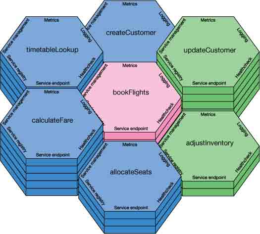
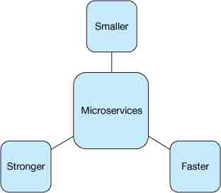
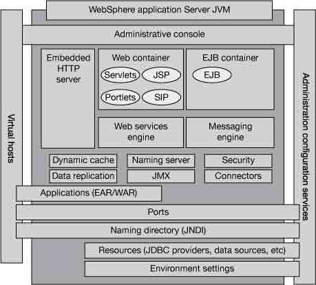
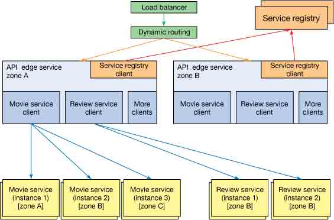
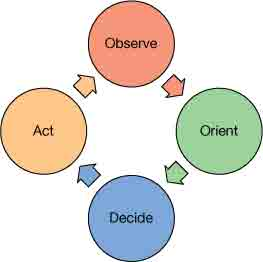
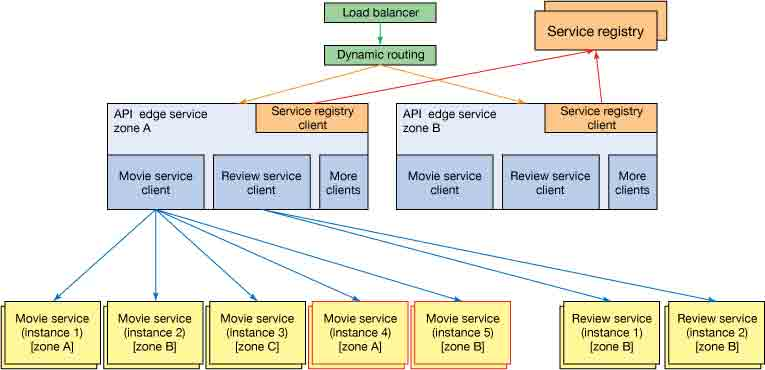

# 微服务实战，第 1 部分: 微服务介绍

> [`www.ibm.com/developerworks/cn/cloud/library/cl-microservices-in-action-part-1/`](http://www.ibm.com/developerworks/cn/cloud/library/cl-microservices-in-action-part-1/)

更小、更快、更强：从头构建更优秀的云应用程序

在这个由多个部分组成的系列中，我们将了解微服务如何让云应用程序变得更可管理、可扩展和可靠。第 1 部分将从总体上介绍微服务在云架构中的作用，并对比基于微服务的系统与旧的单体模型。

从 2014 年初到 2015 年，*微服务* 已变成新的流行词，快速取代了*云*。本文是由多个部分组成的文章系列中的第 1 部分，将介绍如何实现微服务。在这一期文章中，我将介绍微服务的历史和构建于微服务架构之上的含义，为后续几期文章中构建和检查实际的微服务应用程序奠定牢固的基础。我将介绍您将在本系列后面会读到的一些主题，包括在今年下半年和下一年将会引入到 [IBM Bluemix](https://developer.ibm.com/sso/bmregistration?lang=zh_CN&ca=dwchina-_-bluemix-_-cl-microservices-in-action-part-1-_-article) 中的微服务功能。

## Netflix 流：大众化的微服务诞生

无论您是否听说过微服务，我敢肯定您听说过 Netflix。我甚至敢打赌您听说过 Netflix 开源软件 (NOSS)，这得益于 Netflix 在创建和发布管理云基础架构的软件上取得的成功，它是为 Netflix 数字-娱乐-流媒体帝国提供强力支持的软件。

从大约 2009 年开始（完全由 API 推动且乘着我们所称的微服务的第一波浪潮），Netflix 完全重新定义了它的应用程序开发和操作模型。在那时，该公司被一些行业旁观者嘲笑 “你们疯了！” 或 “这可能适合 Netflix，但没有其他任何公司能这么做。”很快来到看 2013 年，大部分人的态度已转变为 “我们正在努力使用微服务”。525,000 多条的 Google *微服务* 搜索结果，暗示该概念无疑既有效又强大。

但什么是*微服务*？什么是*基于微服务的架构*？图 1 给出了一个旅游预定服务的微服务概念视图。图中 7 个磁贴中的每个磁贴都表示一个单独的微服务。它们用来显示哪些微服务可与其他微服务交互，向面向内部和外部的应用程序提供必要的功能。这些服务不同的垂直高度代表着它们被使用的相对数量。在本文中，我将介绍微服务的基础知识，以便您可以了解如何表示您自己的基于微服务的架构。

##### 图 1\. 概念化的微服务

有关微服务的初衷的深入解释，请查阅 [Martin Fowler 的不错的博客文章](http://martinfowler.com/articles/microservices.html)。我在这里将尝试提取这篇博客的精髓，微服务对您如今的环境的适用性，以及如何应用它。

## 跟进阅读

如果您不熟悉 SOA，但又希望熟悉它，可以查阅一篇有关 SOA 起源和它在实现级别上与微服务的技术区别的 [详细解释](http://blog.codefresh.io/soa-microservices/)。

在一次大会演讲上，Adrian Cockcroft（Netflix 的前身）将微服务定义为 “细粒度的 SOA（面向服务的架构）”。您不需要非常熟悉 SOA（一种十几年前创造的架构风格），只需熟悉一些术语缩略语。理想情况下，从一开始就使用服务来构建整个架构。在微服务中，每个服务拥有单一用途，没有副作用，使您能够让更少的专门工程师处理更大量的工作。

为了定义微服务和关联的架构，我调整并修改了用于描述现代运动员的 “更大、更快、更强” 短语：**更小、更快、更强**（参见图 2）。实质上，微服务是许多更小的架构组件，它们快速构建和交付，在单独和整体上变得越来越强大。

##### 图 2\. 微服务：更小、更快、更强

* * *

回页首

## 更小

微服务意味着不再有单体模型。单体模型很大、僵硬、缓慢且低效，就像图 3 中的 Grim Monolith。我们正在远离 2GB WAR 文件的世界（是的，只是 WAR 文件。不是应用服务器或操作系统组件。这是一个真实的故事！），朝着一个充满许多 500MB 大小的服务的世界发展，这个世界包含完整的应用程序、服务器和必要的操作系统组件。

##### 图 3\. Grim Monolith

从大型机向客户端/服务器架构的迁移是重要的一步，这一步也是许多公司和开发人员都难以迈出的一步。最近从基于 Web 的核心应用服务器向 SOA 的迁移也是一个类似的难题。过去几年应用服务器中包含的许多组件本身有利于采用微服务；但是，它们仍被包装在数 GB 的安装二进制文件中。举例而言，图 4 给出了一种使用 WebSphere® Application Server 和 Java™ Enterprise Edition 组件部署的传统 Web 应用程序架构。

##### 图 4\. 标准 WebSphere Application Server 应用程序架构

微服务是集成所有非常松散地耦合的交互组件的一种实践。微服务的整体理念是变得*即插即用*。我将在 更强 小节中详细介绍此主题，基本上讲，基于微服务的系统大规模地采用*猎枪方法*，维护和保护更小的组件，而不是更少的大型组件。您消除了单点故障，将这些故障点分散在各处。

容错式构建只有通过更小的组件来完成。如果构建一个单体模型来容错，则需要花多得多的时间来处理每个边缘案例的低效性。如果构建单个服务实例来容错，其他服务实例会在用户发出请求时接管工作。

图 5 给出了一个使用微服务的实现示例。

##### 图 5\. 流视频应用程序的概念路由示例

在图 5 中，每个框自行维护，自行扩展，知道它位于何处，而且知道在何处获取它需要的信息。不是每种微服务架构都需要此图中的每个组件，但它们确实有所帮助！

对比图 4 和图 5，就可以看到部署一个类似的应用程序有何区别。在 图 4 中，所有组件都部署在一个可垂直扩展的系统的单个进程中。需要更多吞吐量时，整个服务器堆栈会反复扩大。每个服务器在自己的进程内运行。在图 4 的 *Web 服务引擎*或 *EJB 容器* 中获取更多吞吐量的惟一方法是，将整个*服务器 JVM* 扩展到集群化的环境内的一个新实例。但是，这也会创建另一个 *Web 容器*、另一个*嵌入式 HTTP 服务器*，另一个*消息引擎*等，无论这些组件是否需要扩展。

与图 4 中的扩展类型相比，图 5 拥有可独立扩展的组件。我将在 更快 小节中介绍各个组件和它们如何扩展，但现在仅关注每个组件和服务的分布式性质。不同于图 4 中的示例应用程序（它需要高度可用的 Web 应用服务器堆栈来提供可用性），这些组件具有分布式性质，仅提供单个专一的功能，通常使用与其他组件不同的技术。此结构使应用程序架构能够**快得多**地演变，而且与其他组件独立地包含更新的技术和更新的版本。

总之，越小越容易开发、操作、维护和交互。

* * *

回页首

## 更快

另一个伴随*云* 而出现的流行词是 *DevOps*。DevOps 运动使开发人员能够在交付管道中控制更多代码，持续集成，实现更高的可视性。DevOps 的主要原理（如图 6 中所示，沿顺时针方向）为*observe*、*orient*、*decide* 和 *act*。

##### 图 6\. DevOps 的原理

还有比更快地交付更小的组件更好的方法吗？您无法每两周向一个庞大的应用服务器实例交付一次更新，但在同样的时间范围内，您肯定能向其他许多服务所使用的单个服务交付更新。构建新的暂存环境，在管道中移动各个组件，并将它们交付到生产环境时，更小的组件可实现更低的开销。

别误会我的意思。持续交付和集成仍可通过单体模型完成。我已看到它发生过。但是，您需要艰难地应对巨石，而不是弹珠。丢弃一颗弹珠，比丢弃一块巨石更容易实现。

与 DevOps 关联的开发周期本身非常适合微服务。您想要的是持续添加功能的更短的开发周期，而不是一次实现整个愿景的更长开发周期。此开发方法称为敏捷开发，是决定 DevOps 的成功的基本实践。无论选择迭代式还是增量式开发，微服务、DevOps 文化和敏捷计划的组合都使您能够快速构建一个完整的基础架构，而几年前，在同样的时间内，仅能计划您的第一个瀑布周期。

*更快* 的另一方面与执行相关。微服务基于的概念是，如果您想要更快，则需要提供更多资源。*经理的梦想！*通过将每个服务构建为可独立扩展，可在组件之间实现交互，以充分利用资源池而不是单一的组件接口。

返回到上一个示例，在 图 5 中，您看到了服务注册表服务器和客户端。此功能在基于微服务的应用程序中至关重要。在此示例中，边缘服务包含 Movie Service 和 Review Service 引用。基于负载，这些服务以不同的速率扩展；因此您无法再在相同的规模上以相同方式管理它们。

Movie Services 扩展时，Service Registry 会自动获知创建的新服务实例。当一个边缘服务尝试处理一个请求时，它会调用服务注册表，并获取它依赖的所有服务的客户端引用。Movie Service 客户端引用更可能是最近创建的一个新服务，但是可以返回以前使用的 Review Service 的一个旧实例。这个服务注册表功能使您的微服务能够真正成为 “许多服务中的一个”，在组件之间具有松散耦合的依赖关系，但有一个高度可靠的功能在需要时获取组件的更多副本。

图 7 显示了 图 5 中的流视频应用程序的同样的概念架构，但增加了针对 Movie Service 的已扩展的微服务。

##### 图 7\. 流视频应用程序的概念扩展示例

根据需要高速扩展，拥有能自行感知新实例的系统。不是，这不是[天网](https://en.wikipedia.org/wiki/Skynet_%28Terminator%29)。它使构建于微服务架构之上的应用程序更加强大。

* * *

回页首

## 更强

不是所有系统都打算持续存在。它们在需要时创建，在不再适合某个用途时就会被删除。正如我之前提到的，这会消除单点故障，将这些点分散在整个系统中，并知道您需要机制来处理不可用或性能糟糕的服务和实例。

### 是家畜，不是宠物

对于微服务，部署的系统的概念成为了*家畜，而不是宠物*：

*   宠物有名称；而家畜只有编号。
*   宠物是独一无二的；而家畜通常是相同的。
*   宠物的健康会得到照料，而家畜在生病时就会被取代。

—*改编自 Gavin McCance 的 [CERN 数据中心演变](http://www.slideshare.net/gmccance/cern-data-centre-evolution) 演示。*

此概念可帮助创建许多个同一种服务以及许多服务中的一个。我们不再单方面地依靠服务实例，或者管理长期实例，担忧状态的维护、存储、系统修改等问题。不要误解我的意思，我们仍然对性能调优和配置很感兴趣，但这些过程现在发生在开发周期中的更早阶段，而不是发生在暂存或生产环境中。此方法为我们提供了许多服务，以及每个服务的许多实例。

为了证明这方面的优势，Netflix 在其发展过程开始利用混沌概念，确切地说，是 Chaos Monkey（参见图 8）。Chaos Monkey 是一个云应用程序组件，Netflix 使用它来向应用程序操作中引入系统性的混沌。

##### 图 8\. Chaos Monkey

此功能将经由基础架构，特意关闭对生产至关重要的服务和服务实例。为什么 Netflix 会这么做？它如何在这么做时还能幸存下来？

首先看看为什么。这是一种轻松识别您需要在何处快速失败的方式。新服务是否太慢了？它们是否需要更高效地扩展？当外部服务提供程序（而不是内部服务）发生故障时会发生什么？所有这些问题都需要在微服务架构中考虑。

然后看看如何做。Netflix 之所以能够幸存，得益于我之前提到的*猎枪方法*。想法很简单：配备足够多的服务实例，使 99.9999% 的请求都能成功完成。任何失败的请求都会在重试后成功。一个服务实例突然中断，而且另一个本地实例将会接管它的工作。整个服务突然中断，而且您的系统应补偿或将用户重新路由到其他包含该特定服务的可用性专区或区域。如果没有其他服务可用，用户或请求应快速失败，而不是等待超时。

Netflix 扩展了 Chaos Monkey 概念并将该功能发布为 [Simian Army](https://github.com/Netflix/SimianArmy)（参见图 9），以包含 Chaos Monkey、Janitor Monkey、Conformity Monkey 和 Latency Monkeys — 向操作中引入了特定的混沌的云应用程序组件，包括延迟和合规性问题

##### 图 9\. 一个 Simian Army

可以看到，Netflix（和其他采用微服务的公司）同意您应用程序会在挫折中变得更强大的理念。

* * *

回页首

## 结束语

我介绍的微服务的主要优势包括：

*   它们较小的大小使开发人员能够保持最高效率。
*   容易理解和测试每个服务。
*   您可以正确地处理任何依赖的服务的故障。
*   它们减少了关联故障的影响。

但是，在微服务的采用上还存在一些我没有提及的问题。本系列未来的一期将深入介绍如何大规模地管理和监视复杂性，强调细粒度的指标报告和时间线的重要性。

更多服务意味着团队之间的契约更多，因为维护接口和 API 版本的需求会变得更普遍。这通常会在一个 DevOps 模型中得到充分处理，无论您是否提供了基于微服务的架构。

您可能已经注意到，我没有提及用于实现微服务应用程序的具体技术。我是有意这么做的，因为后面的几期文章将介绍 IBM 如何在微服务架构上开发和部署自己的服务，为如今的 Watson（参见图 10）和 Bluemix 上的 IBM Containers 提供支持。这包括丰富的功能，从 Docker 到 Node.js，再到 Netflix OSS，再到 IBM 自产不可或缺的功能。

##### 图 10\. 由微服务支持的 IBM Watson 云服务

敬请期待 [本系列](http://www.ibm.com/developerworks/cn/views/cloud/libraryview.jsp?search_by=微服务实战&sort_by=Date&sort_order=2) 中的后续文章，了解 IBM Cloud 内外的微服务的更深入介绍和案例分析。您可以直接在 Twitter 上通过 [@rosowski](https://twitter.com/rosowski "@rosowski on Twitter") 进行关注，或者在下面发表评论来继续讨论。

### 致谢

感谢 Jonathan Bond 的演示，这使我能够获取灵感并确立自己的思考方向，另外还获得了一些可借用一些图像（图 1、图 5、图 6 和图 7）。

借用的外部图像：[图 3](http://gatherer.wizards.com/Handlers/Image.ashx?multiverseid=12626&type=card) 、[图 4](https://www.safaribooksonline.com/library/view/ibm-websphere-application/9781849683982/graphics/3982_01_05.jpg)、[图 8](https://raw.githubusercontent.com/Netflix/SimianArmy/master/assets/netflix-chaos-monkey.jpg)、[图 9](https://raw.githubusercontent.com/Netflix/SimianArmy/master/assets/SimianArmy.png)。