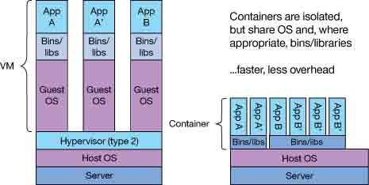
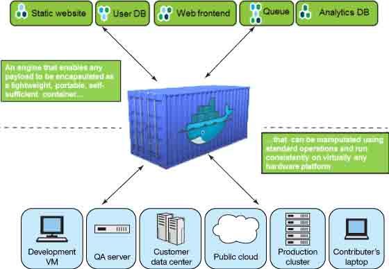
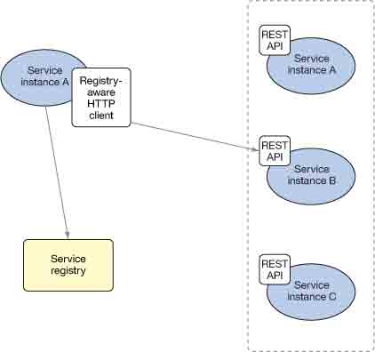
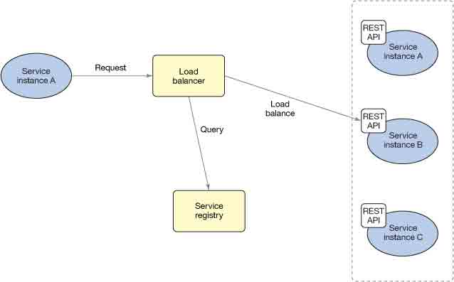

# 微服务实战，第 2 部分: 容器和微服务 — 完美的一对

> [`www.ibm.com/developerworks/cn/cloud/library/cl-bluemix-microservices-in-action-part-2-trs/index.html`](http://www.ibm.com/developerworks/cn/cloud/library/cl-bluemix-microservices-in-action-part-2-trs/index.html)

为什么可以比以往更容易地交付更小、更快的应用程序组件

探索 Linux 容器如何让软件开发产生革命性的变化并推动微服务转变整个行业。了解对成功采用微服务非常重要的一些需求，以及基于容器的基础架构如何使得满足这些需求变得更容易。

在本 [系列](http://www.ibm.com/developerworks/cn/views/cloud/libraryview.jsp?search_by=%E5%BE%AE%E5%9E%8B%E6%9C%8D%E5%8A%A1%E5%AE%9E%E6%88%98&sort_by=Date&sort_order=2) 的 [第 1 部分](http://www.ibm.com/developerworks/cn/cloud/library/cl-bluemix-microservices-in-action-part-1-trs/index.html) 中，我介绍了微服务的概念，以及它们与采用传统方式构建的系统（单体系统）有何不同。第二期将介绍 Linux 容器的强大功能 — 它们让软件开发产生革命性的变化并推动微服务转变整个行业。我将介绍在对基于微服务的应用程序采用基于容器的基础架构时，需要关注的三个关键概念：

*   记录和监视
*   零宕机时间持续交付
*   动态服务注册表

我将首先概述容器、容器管理器和容器与微服务的关系。

## 容器和微服务：完美的一对

除非您完全不了解云技术和云本机应用程序开发，否则您或许听说过 Linux 容器和在过去两年来迅猛发展的 Linux 容器和基于容器的项目。如果您没有听说过它们，那么您可以将 Linux 容器视为轻量型的虚拟机，从而可以更灵活地使用、更快速地继承和更容易地分发它们。Docker 是在这方面走在前沿的项目之一。自 2012 年启动以来，Docker 团队（现在已是公司）提供了一种通过 Linux 容器构建、打包和分发云本机应用程序的非常简单的方法。

容器与虚拟机有何不同？每个虚拟机（如下图中的左侧所示）运行自己的来宾操作系统实例，并提供它自己的库和二进制文件。容器（如右侧所示）是隔离的，它们共享底层的主机 OS 和库，只打包必要的应用程序二进制文件。

> *“许多行业领导都转而使用基于云的基础架构（包括在云中和内部）来获得极大收获。”*

容器作为 Linux 系统上一个极小的资源集来运行，打包的应用程序常常不超过几百 MB。基于虚拟机的应用程序通常比它大 3 到 4 个数量级（数十 GB）。您很容易看到容器如何融入到微服务模式中，它们**更小**且**更快**—[第 1 部分](http://www.ibm.com/developerworks/cn/cloud/library/cl-bluemix-microservices-in-action-part-1-trs/index.html) 中介绍的微服务的两个特征。

许多行业领导者都在转而使用基于云的基础架构（包括在云中和内部）来获得极大收获。一个重要的收获是，Docker 和其他类似的 Linux 容器技术很容易集成到持续继承和持续交付管道中：依据 Docker 最近自行资助的一项研究，Docker 用户发布软件的频率平均快了 7 倍。Gilt Groupe 等公司已开始采用微服务和容器化的基础架构，他们有时发布软件的频率高达一天 100 次。快速推送代码更改，自动重新构建极小的 Docker 映像，以及从一个通用代码库管理大量已部署映像的能力，使公司的交付管道能够非常快地完成。

Docker 容器的其他好处之一是这些打包的应用程序（称为 *Docker 映像*）的可移植性。Docker 映像可在环境之间和在构建管道中无缝地移动。例如，BBC News（英国广播公司的一个分部）表明它的持续集成工作在基于 Docker 的基础架构中的运行速度快 60%。与以往相比，在整个交互管道中移动相同的代码的能力加速了应用程序的开发、测试和生产周期，该能力最小化了在每个阶段配置软件的需求，而且在移动过程中拥有可预测的硬件资源需求。公司能够看到这些效率优势，因为他们的系统组件在每个 Docker 映像中是模块化的。您不需要在每次需要软件时配置它。只需启动一个容器实例，就可以使用它。

Docker 是一个代码运输集装箱系统，它使得通过 Linux 的软件开发和交付变得很容易。Docker 充当着一个引擎，使任何有效工作负载都可封装为轻量型、可移植、自给自足的容器。这些容器可使用标准操作来处理，并在几乎任何硬件平台上一致地运行。

如果您不熟悉容器和 Docker，请参阅 参考资料，获取一些有关 Docker 和 Linux 容器的优秀的一般性介绍资料的链接。如果您拥有使用 Docker 的经验并希望在云中动手使用 Docker，[IBM Containers for Bluemix](http://www.ibm.com/cloud-computing/bluemix/solutions/open-architecture/#containers) 是一个您可立即免费开始使用的企业级容器服务。您将获得自己的私有注册表来存储所有映像，能够访问包含支持的中间件的 IBM 公共注册表，获得托管的交付管道集成功能，还能够访问 150 多个 Bluemix™ 服务。您可让您的应用程序在 Docker 容器中更快地运行。

* * *

回页首

## 更快且更小：容器就像软件开发的纳米机器人

在开始了解为什么容器对微服务如此重要的同时，作为该架构风格的关键支持技术之一，您还会看到容器的管理也同样重要。您在 [第 1 部分](http://www.ibm.com/developerworks/cn/cloud/library/cl-bluemix-microservices-in-action-part-1-trs/index.html) 中已经知道，我们在微服务中没有纵向扩展，而执行横向扩展。我们没有向微服务运行时添加更多 RAM，我们只是获得另一个相同种类的微服务运行时。需要更多 RAM？获取第三个实例。此方法仅适合一两个分别拥有一个容器实例的服务，但任何拥有计算机技能和大量服务器的人都知道，在您远程管理数十个服务器时，事态很快就会失控。

想想您需要多快地管理超过 100 个单独的实例。如果您的应用程序最初仅由少量微服务组成（假设五六个），每个微服务都应拥有至少 3 个容器实例来支持它。所以您立刻拥有了 18 个容器实例。假设您添加另一个微服务，或者您的应用程序非常成功，某些服务需要扩展到 5 到 10 个容器实例。您很容易就会拥有 100 多个需要管理的容器实例— 在情况好的时候。

幸运的是，许多开源项目可以处理此需求。例如，[Kubernetes](http://kubernetes.io/)、[Apache Mesos](http://mesos.apache.org/) 和 [fleet](https://coreos.com/using-coreos/clustering/) 使用了一种基于基础架构的特定于域的语言，使得从单个控制台或命令行管理数千个容器实例变得很容易。

这个管理概念严格执行了 [第 1 部分](http://www.ibm.com/developerworks/cn/cloud/library/cl-bluemix-microservices-in-action-part-1-trs/index.html/#cattlepets) 中的 “是家畜而不是宠物” 的概念。它的理念是，我们通过持续集成/持续交付流程部署的所有容器都不可变。在部署它们后，就无法更改它们。如果需要更改或更新，可以建立另一个应用了正确的更新的新的容器集群，并销毁旧的容器集群。管理 1,000 头家畜比管理 1,000 只宠物容易得多。不要误解我的意思：我们都爱自己的宠物，但是，如果您想快速创新，为客户带来价值，给您的业务带来收入，那么您可能无法承受对每只宠物进行细心呵护所需的时间。Kubernetes、Apache Mesos 和 fleet 等项目（和 IBM Containers 等托管容器服务）使得集成交付管道和映像注册表来快速轻松地管理基础架构的所有阶段成为可能，就像非常高效的家畜管理一样。

顺便说一下，应该注意的是，尽管某些容器服务仍在使用虚拟机作为 Docker 主机，但仍应将这些服务视为家畜。这些 VM 具有更健全的资源和集成管理功能，但它们通常仍被视为家畜，因为它们是根据基于容器的工作负载的需求来动态管理的。

* * *

回页首

## 一种微服务结构：您拒绝玩打地鼠游戏的最佳借口

目前为止，我谈论了为什么容器越多越好，以及如何大规模地处理通用的基础架构。在熟悉开发容器的概念并告别宠物后，需要开始考虑开发您的应用程序并将它们部署到生产中。

这涉及到 3 个

*   记录和监视
*   零宕机时间持续交付
*   动态服务注册表

您希望从一开始就考虑所有这些功能，但没有必要立即解决它们。

在我讨论这些功能的过程中，您还会看到为什么一种集成的微服务结构（比如 Bluemix 和它的相关服务）使得微服务架构的管理变得更容易。

### 记录和监视

如果为应用程序和服务提供生产级支持，您的第一个问题始终应该是 “我在遇到故障时该怎么办？”请注意，这个问题中甚至没有暗示 “如果”。组件将会出错，版本将会改变，第三方服务将会中断。您如何保持清醒的头脑，为您的用户提供他想要的正常运行时间？这是第一个问题。

正如我之前说过的，您希望您的容器不可变。出于这个原因，大多数 IT 组织都没有提供系统级的容器实例访问权限 — 没有 SSH，没有控制台，什么都没有。那么您如何能够知道一个无法更改的黑盒中发生了什么？这是第二个问题。

幸运的是，这个问题已被 *ELK 堆栈* 的概念解决—[Elasticsearch](https://www.elastic.co/products/elasticsearch)、[LogStash](https://www.elastic.co/products/logstash) 和 [Kibana](https://www.elastic.co/products/kibana)。

点击查看大图

[关闭 [x]](#close)

这 3 个不同的组件提供了聚合日志，在聚合的日志中自由搜索，以及基于日志和所监视的活动在整个平台上创建和共享仪表板的功能。这是一种非常好的功能 — 比登录到各个计算机来运行一个包含 `sed`、`grep` 和 `awk` 的系统管理工具箱好得多。您拥有访问某个包含所有日志的中央存储库的完整权限。您可以跨系统和微服务来关联事件，因为您通常会看到事件和 ID 在您的系统中流动并遇到类似的问题。

您可以通过许多方式来集成 ELK 堆栈，无论是在云中还是在内部运行：通过托管服务、开源变体，以及常常内置于平台即服务产品中的选项（比如 [IBM Containers](https://developer.ibm.com/bluemix/2015/06/22/ibm-containers-on-bluemix/)）。在 Bluemix 上的容器运行时的内部，您能够访问一个功能健全的、多租户的 ELK 堆栈，该堆栈自动从基于 Eocker 容器的运行时接收日志，为您提供了这些运行时事件的可视化和可搜索性，同时还为您提供了一个预先配置的、开箱即用的、基于 Kibana 的仪表板。如果您正在考虑开始使用容器，这是一项使 IBM Containers 成为基于容器的微服务的优秀选择的关键能力。

### 零宕机时间持续交付

确信您知道在出现故障时（当然您希望这绝不会发生）该怎么做之后，即可快速地部署您的所有引入注目的应用程序更新。想想那些一周部署应用程序数十、数百或数千次的大型公司，您必须了解宕机时间。当然，这些公司不会每次推送新版本时都会发生应用程序中断 — 如果是这样，他们绝不会发展壮大。

这些公司已逐渐掌握*零宕机时间部署*。零宕机时间部署可能具有许多名称，而且常常具有包含颜色的不同叫法，从红黑到蓝绿等，但它们都遵循相同的原则：您的应用程序始终可用，无论通过何种方式，甚至通过冗余的更新，因为计划性宕机时间导致的网站中断对您或您的用户都没有好处。

## IBM Cloud Services：Active Deploy

通过一个新的 IBM Cloud 服务 Active Deploy 的演示，进一步了解零宕机时间部署。IBM 研究员 Jason McGee 与 IBM 杰出工程师 Daniel Berg 谈论了 Cloud Foundation Services 和 DevOps，讨论了在下一次滚动部署或升级时实现零宕机时间需要执行的操作的详细细节。Active Deploy 现在可在 Bluemix 上获得。

     

现在使用 [第 1 部分](http://www.ibm.com/developerworks/cn/cloud/library/cl-bluemix-microservices-in-action-part-1-trs/index.html) 中描述的单体系统，避免计划性宕机时间很危险、非常耗时、非常昂贵，而且会让每个参与者筋疲力尽。需要庞大的资源集的多个镜像映像的情况非常难以管理，而且会导致员工在本应 “休息的时间” 挥汗如雨，忙于上线新版本和关闭旧版本 — 更别提确定如果需要回滚或某个不在直接负责团队控制范围内的东西出错，需要如何处理旧版本。

借助微服务和基于容器的应用程序，这些担忧被最大限度减少（如果未完全消除），尤其是借助 Bluemix 上如今提供的一些关键服务。通过将您的组件分解为小得多的部分，您可以在部署它们时将对整体系统的影响降到最低，同时在某些时段保持更多部分正常运行来预防中断。Bluemix 上提供的新服务 [Active Deploy](https://console.ng.bluemix.net/catalog/active-deploy/) 提供了此功能，而且已预先集成到交付管道中。较小的团队可以更高效地管理更多的应用程序，因为每个部署的版本都拥有自动监督功能来保持其正常运行，所以对人类关注和计算资源的需求更少。

### 动态服务注册表

本期的最后一个主题是动态服务注册表的概念。本主题包含以下概念：您可能已知道的称为*服务发现* 或*服务代理*。这两个概念绝不相同，但它们非常接近，以至于可包含在这类方法中。

创建数千个为您的所有应用程序中的微服务提供支持的容器实例后，您的应用程序中的其他组件如何了解工作的进展？它们如何知道它们可对其他哪些微服务执行服务调用？它们如何响应对它们的服务调用？

服务发现与服务代理之间的区别可归纳为，您希望自行执行搜索还是让其他人为您处理。打个比方，假设您需要一个运输服务。您希望寻找来自单个提供商（例如 US Postal Service (USPS)）还是来自一个多服务集散中心（比如 Staples）的服务。

例如，如果我想寄送一个包裹，我可以访问 USPS 网站，输入两个针对我寻找的快递公司种类的参数，获得一个选项列表，挑选一个，然后进入其中寄送我的包裹。这是服务发现的概念：我使用了一个著名的可用服务端点注册表，在服务上线和下线时它都会更新。通过 REST API，调用应用程序可以查询服务发现服务来确定哪种和多少类型的服务可用于一次特定的服务调用，下钻到请求的服务的一个特定版本。

如果我不想选择我想将包裹寄往何处 — 我只想 “将这个包裹发往地址标签上显示的地址” — 我可将它交给 Staples。Staples 然后基于我提供的所有信息，为我的包裹选择最富有成本效益的运输选项。我将包裹交给了一个著名的服务提供商，让它为我处理包裹的运输路线。这是服务代理的概念：您调用一个已知的端点，该调用会基于预先建立的规则或元数据而自动转发到对服务请求提供实际响应的支持服务。

对于更喜欢服务发现还是服务代理，有一些不错的观点，但归根结底取决于偏好或实现体验/需求。一些开源服务发现产品（比如 [etcd](https://coreos.com/etcd/) 和 [Consul](https://www.consul.io/)）提供了分布式服务注册表，您可以使用它们来注册、标记和检测您的所有可用的服务实例。甚至还有一些不错的项目（比如 [Registrator](http://gliderlabs.com/registrator/latest/)）会在创建 Docker 容器后，自动将您的服务向其中一个端点注册。

一些更流行的服务代理项目支持一个重要的观点，那就是从长远来看，服务代理方法找到最终的支持服务所需要的网络跃点更少。一个最大型和最流行的服务代理项目是 Netflix [Hystrix](https://github.com/Netflix/Hystrix/wiki) 项目。Hystrix 是一个基于 Java™ 技术的库，它超越了简单的服务代理，而在一个服务代理库中提供了大量服务质量改进。

显然，这两种模式对自动管理服务实例和将它们融入到可用的微服务基础架构中都很重要。Bluemix 很快将拥有自己的多租户服务发现产品（如果在您阅读本文时还没有该产品） — 消除您管理服务发现服务（这可能是一件棘手的事）的需求。想象自动注册您的所有容器实例，无论您是手动建立它们，通过 Bluemix Delivery Pipeline 推送它们，还是与一个内部部署的管道（比如 [IBM UrbanCode Deploy](https://developer.ibm.com/urbancode/products/urbancode-deploy/) 或 [Jenkins](https://jenkins-ci.org/)）集成。

* * *

回页首

## 结束语

在本文中，您了解了容器如何加速推进云本机应用程序的开发。可以比以往更快更轻松地交付更小更快的应用程序组件，而且它们具有比以往更多的内置管理功能。将容器部署在托管服务（比如 IBM Containers）上以及所有受支持的微服务功能（包括日志记录和监视、Active Deploy 和服务发现），使得在从现有的单体系统向云发展的过程中更进一步变得很容易。

我们正在朝智慧、模块化的系统发展，这些系统更加自动化，而且从整体上讲更加集成化。它们将按照自己的节奏发展，了解基础架构中哪些资源可用，哪些资源不可用，以及某个资源何时需要更改。所有这些功能和其他功能将在本系列中即将推出的几期文章中介绍。