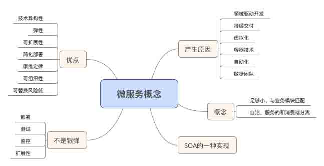

# 微服务设计－读书笔记

> [`www.jianshu.com/p/36dc398ae1c5`](http://www.jianshu.com/p/36dc398ae1c5)

一：微服务概念

1、微服务的产生

随着领域驱动开发、持续交付、按需虚拟化、基础设施自动化、容器技术、小型自治团队、大型集群系统等等实践的过程中，发现细粒度的服务架构可用提交交付速度，并且有更多的机会尝试新技术。微服务在技术决策上给予更大的自由度，更快递响应未知或者不可避免的变化。

2、微服务的概念

微服务是小而自治的服务。小是只专注做好一件事，粒度和业务边界匹配。自治是自我治理，服务方和消费方解耦。修改一个微服务并且对其进行部署，并不影响其他的服务。

3、微服务的优点

1）技术的异构性：一个公司系统可能用不同的技术栈解决不同的应用场景，服务提供的 API 的支持不同的技术调用就很重要

2）弹性：服务边界就是舱壁。单块系统中，如果服务不可用，那么所有功能都不可用。微服务中一个组件不可用，并不导致级连故障。微服务善于处理不可用和功能降级问题。

3）扩展：单块系统只能一个整体进行扩展，一小部分存在性能问题，也需要整体惊醒扩张。微服务因为是细粒度的，所以容易扩展。

4）简化部署：单块系统修改小部分代码、也需要整体应用程序发布变更，导致风险很高。微服务架构中，各个服务部署都是独立的。

5）与组织结构相匹配：微服务架构可以的与组织结构匹配，从而提高团队的生产力。

6）可组合性：单纯的 PC 时代已过去，微服务架构中，提供接口给各个端使用，可组合成各个服务想要的功能。

7）可替代性风险低：在单体遗留系统中，需要替换工作量大，风险很高。微服务因为小而自治，可以简单并且小风险的替换或重写。

4、微服务与 SOA 的关系

微服务架架构师面向服务架构（SOA）的一种特定实现

5、微服务不是银弹

微服务需要面对所有分布式系统所面对复杂性，比如面对部署、测试、监控和扩展等工作。微服务是否适合你，需与公司的组织、系统等很多因素有关。如果组织是中心化、集中化管理的可能不适合使用微服务。

二：微服务建模

1、什么样的服务是好服务

1）低耦合：一个修改不影响另一个服务，一个服务尽可能少的知道与之协作的相关服务的信息 2）高内聚：相关的行为聚集在一起，找到问题域的边界确保相关行为聚集。

2、限界上下文

限界上下文包括两部分内容，一部分需要与外部通讯，另一部分不需要和外部通讯。上下文必须都要有明确的接口，接口决定暴露哪些模型给其他的上下文。想要从一个限界上下文中获取信息，需使用模型和他的对外通讯的边界进行通讯。

1）共享的隐藏模型

同一个名字在不同的上下文中有完全不同的含义。比如退货，在客户上下文中，意味着寄送包裹，退款等、在仓库上下文中，退货是一个即将到来的包裹，重新入库等。所以库存是共享的模型，不能完全暴露或者盲目的暴露出去。

2）模块和服务
模块：同一进程内可以使用模块减少彼此之间的耦合。发现领域内部的限界上下文，一定要对模块对其进行建模，同时使用共享和隐藏模型。服务：模块成为转为微服务的候选。模块上下文越清晰，转为微服务成了可能，最终服务边界和领域上下文保持一致。

3）过早的划分
过早的进行服务划分，发展一段时间后，服务的边界上下文可能和之前有所不同，导致很多跨服务的修改代价高，导致合并成单块系统的风险。面度新的领域时，很多时候将一个已有的系统划分成微服务，要比从头开始构建微服务简单的多。

4、业务建模

1）方法：当你在思考业务的上下文时，不应该从数据共享的角度考虑，而应该从这些上下文提供的功能来考虑。这些功能操作提供给其他业务。
2）沟通：在组织内，不仅仅共享上下文的概念，还应该统一和共享术语和想法。

5、划分上下文

1）划分方法：一开始识别粗粒度的限界上下文、这些粗粒度的上下文可能包括一些套嵌的限界上下文，这些套嵌的上下文不直接对外可见。
2）暴露原则：使用粗粒度上下文还是套嵌上下文暴露服务，哪个更合理，应该有组织结构来决定的。

6）技术边界

技术边界有显示层、业务层和数据层，微服务可以按照技术边界搭建技术架构。搭建这个架构之前需按照业务进行垂直划分。

三、微服务集成

微服务的集成做到好，可以保持自治性、可以独立发布修改和发布。

1、集成原则

1）避免破坏性修改
服务的一些修改不能导致该服务的消费方发生改变。
2）保证 API 与技术的无关性
3）保证 API 的易用性
4）隐藏内部实现细节

2、同步与异步

同步：调用方发起远程服务调用后，调用方阻塞自己并且等待服务方的返回。
异步：调用方不需要等待服务方返回，甚至可能不关心这个操作完成与否。

3、编排与协同

编排：同步调用一组服务，等待各个服务的返回结果。优点知道业务流程中每一步跨服务调用结果，缺点容易承担太多的调用，太耗时，导致调用方的不稳定性。
协同：异步调用一组服务或服务调用加入队列中，降低服务之间的耦合度，带来的额外工作业务流程跨服务的监控，不过可通过消费方处理完成后，回调服务方告知处理结果。

4、版本管理

1）尽可能推迟破坏性修改
宽进严出的原则
2）尽早发现破坏性的修改
按照契约，通过测试及早发现是服务方还是消费方破坏性的修改
3）不同的接口版本共存
最好共存两个版本

四、微服务规模化

1、故障无所不在
网络是不可靠，只能尽力限制引起故障的因数，达到一定规模后，故障不可避免。

2、跨功能需求
服务吞吐量、可用性和数据持久性等这些需求需要持续测量，并保证服务满足可接受的目标。

3、功能降级
构建弹性系统，因微服务功能分散，在有可能 down 机的微服务上，能够安全的降级以保证弹性

4、反服务脆弱
为了不会引起严重级联影响，需要正确的设置超时、实现舱壁隔离或断路层等以避免在第一时间调用一个不健康的服务。

1）超时
设置超时时间对于调用下游服务十分重要，超时时间设置太长有可能把下游系统拖慢，设置太短可能下游服务未处理完成。最好设置一个默认的超时时间，当超时发生时后，记录到日志里看看发生了什么，并且做响应的调整。
2）断路器
使用断路器，当请求下游服务发生一定数量的失败后，短路器打开，接下来的请求快速失败。一断时间后，查看下游服务是否已服务，重置断路器。
3）舱壁
未每个下游服务建立单独的连接池。超时和断路器资源受限时释放资源，舱壁第一时间确保它不成为限制。还有一个拒绝请求的舱壁，用以避免资源饱和，称之为减载。
4）隔离
当下游服务离线，上游服务不受影响。设置成为服务间隔离。

5、幂等

幂等操作，多次执行所产生的影响，均与一次执行影响相同。可以把某些特定业务操作设计成幂等的，比如客户下单送积分。

6、扩展

增加负载、减少延迟。

1）更强大的主机：垂直扩展，更好的机器。
2）拆分负载：按业务拆分成不同的微服务
3）分散风险：数据跨机房，异地备份等
4）负载均衡：避免服务单点故障
5）作业分离：Job 独立服务执行
6）重新设计：一般设计系统需要考虑 10 倍容量增长。重新设计系统应对规模化，是成功的标志。

7、扩展数据库

1）服务的可用性
2）服务的持久性：多副本
3）读取数据扩展：读写分离
4）写操作扩展：分表分库
5）共享数据库设施：容易形成单点故障
6）CQRS：命令查询职责分离

8、缓存

通过存储之前的操作结果，以便后续请求使用这个结果，而无需花重新计算或查询。
1）客户端缓存
客户端缓存获取的结果，客户端决定何时获取新副本。一般是有下游服务提供缓冲的过期时间。客户端缓存可以减少网络调用次数，并且减少下游服务负载的最快方法之一，客户端缓存数据，让数据失效需要做额外的工作。
2）服务端缓存
服务端来负责处理缓存，容易跟踪和优化缓存的命中率。
3）代理服务器缓存
缓存在服务的和客户端之间，比如方向代理或 CDN 等。对一切客户端和服务端不透明
4）HTTP 缓存
5）为写使用缓存
先写入本地缓存，之后某个时刻将数据写入下游的，可能更规范化的数据源中。
6）为弹性使用缓存
下游服务不可用，客户端可以缓存可能失效的数据。
7）隐藏源服务
保护源服务，不直接暴露源服务。如果缓存不命中，立即失败，异步重建缓存。
8）保持简单
避免太多地方使用缓存，缓存越多，数据越可能失效，就越难保证数据的新鲜程度。

9、自动伸缩

响应型伸缩、预测型伸缩

10、CAP 定理

在分布式系统中有三方面需要彼此权衡：一致性、可用性和分区容忍性。这个定理告之我们最多只能能保证三个中的两个。CA 系统在分布式系统中根本不存在。

11、服务发现

1）DNS
2）动态服务注册：zookeeper、redis、consul

12、文档

接口文档的重要性

五、微服务总结

什么时候你不应该使用微服务
越不了解一个领域，为服务找到合适的限界上下文就越难，边界清晰稳定后，再进行拆分。

