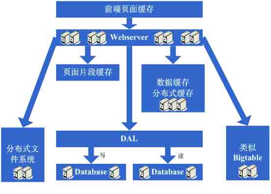

# 一步步构建大型网站架构

> [`kb.cnblogs.com/page/99549/`](http://kb.cnblogs.com/page/99549/)

之前我简单向大家介绍了各个知名大型网站的架构，[MySpace 的五个里程碑](http://www.itivy.com/ivy/archive/2011/3/7/634351257301504864.html)、[Flickr 的架构](http://www.itivy.com/ivy/archive/2011/3/7/634351294385186067.html)、[YouTube 的架构](http://www.itivy.com/ivy/archive/2011/3/6/634350416046298451.html)、[PlentyOfFish 的架构](http://www.itivy.com/ivy/archive/2011/3/5/634349627089221280.html)、[WikiPedia 的架构](http://www.itivy.com/ivy/archive/2011/3/7/634351127072679482.html)。这几个都很典型，我们可以从中获取很多有关网站架构方面的知识，看了之后你会发现你原来的想法很可能是狭隘的。

　　今天我们来谈谈一个网站一般是如何一步步来构建起系统架构的，虽然我们希望网站一开始就能有一个很好的架构，但马克思告诉我们事物是在发展中不 断前进的，网站架构也是随着业务的扩大、用户的需求不断完善的，下面是一个网站架构逐步发展的基本过程，读完后，请思考，你现在在哪个阶段。

**　　架构演变第一步：物理分离 WebServer 和数据库**

　　最开始，由于某些想法，于是在互联网上搭建了一个网站，这个时候甚至有可能主机都是租借的，但由于这篇文章我们只关注架构的演变历程，因此就假 设这个时候已经是托管了一台主机，并且有一定的带宽了。这个时候由于网站具备了一定的特色，吸引了部分人访问，逐渐你发现系统的压力越来越高，响应速度越 来越慢，而这个时候比较明显的是数据库和应用互相影响，应用出问题了，数据库也很容易出现问题，而数据库出问题的时候，应用也容易出问题。于是进入了第一 步演变阶段：将应用和数据库从物理上分离，变成了两台机器，这个时候技术上没有什么新的要求，但你发现确实起到效果了，系统又恢复到以前的响应速度了，并 且支撑住了更高的流量，并且不会因为数据库和应用形成互相的影响。

　　看看这一步完成后系统的图示：

**　　架构演变第二步：增加页面缓存**

　　好景不长，随着访问的人越来越多，你发现响应速度又开始变慢了，查找原因，发现是访问数据库的操作太多，导致数据连接竞争激烈，所以响应变慢。 但数据库连接又不能开太多，否则数据库机器压力会很高，因此考虑采用缓存机制来减少数据库连接资源的竞争和对数据库读的压力。这个时候首先也许会选择采用 squid 等类似的机制来将系统中相对静态的页面（例如一两天才会有更新的页面）进行缓存（当然，也可以采用将页面静态化的方案），这样程序上可以不做修 改，就能够很好的减少对 WebServer 的压力以及减少数据库连接资源的竞争，OK，于是开始采用 squid 来做相对静态的页面的缓存。

　　看看这一步完成后系统的图示：

　　这一步涉及到了这些知识体系：

　　前端页面缓存技术，例如 squid，如想用好的话还得深入掌握下 squid 的实现方式以及缓存的失效算法等。

**　　架构演变第三步：增加页面片段缓存**

　　增加了 squid 做缓存后，整体系统的速度确实是提升了，WebServer 的压力也开始下降了，但随着访问量的增加，发现系统又开始变的有些 慢了。在尝到了 squid 之类的动态缓存带来的好处后，开始想能不能让现在那些动态页面里相对静态的部分也缓存起来呢，因此考虑采用类似 ESI 之类的页面 片段缓存策略，OK，于是开始采用 ESI 来做动态页面中相对静态的片段部分的缓存。

　　看看这一步完成后系统的图示：

　　这一步涉及到了这些知识体系：

　　页面片段缓存技术，例如 ESI 等，想用好的话同样需要掌握 ESI 的实现方式等；

**　　架构演变第四步：数据缓存**

　　在采用 ESI 之类的技术再次提高了系统的缓存效果后，系统的压力确实进一步降低了，但同样，随着访问量的增加，系统还是开始变慢。经过查找，可 能会发现系统中存在一些重复获取数据信息的地方，像获取用户信息等，这个时候开始考虑是不是可以将这些数据信息也缓存起来呢，于是将这些数据缓存到本地内 存，改变完毕后，完全符合预期，系统的响应速度又恢复了，数据库的压力也再度降低了不少。

　　看看这一步完成后系统的图示：

　　这一步涉及到了这些知识体系：

　　缓存技术，包括像 Map 数据结构、缓存算法、所选用的框架本身的实现机制等。

**　　架构演变第五步： 增加 WebServer**

　　好景不长，发现随着系统访问量的再度增加，webserver 机器的压力在高峰期会上升到比较高，这个时候开始考虑增加一台 webserver，这也是为了同时解决可用性的问题，避免单台的 webserver down 机的话就没法使用了，在做了这些考虑后，决定增加一台 webserver，增加一台 webserver 时，会碰到一些问题，典型的有：
1、如何让访问分配到这两台机器上，这个时候通常会考虑的方案是 Apache 自带的负载均衡方案，或 LVS 这类的软件负载均衡方案；
2、如何保持状态信息的同步，例如用户 session 等，这个时候会考虑的方案有写入数据库、写入存储、cookie 或同步 session 信息等机制等；
3、如何保持数据缓存信息的同步，例如之前缓存的用户数据等，这个时候通常会考虑的机制有缓存同步或分布式缓存；
4、如何让上传文件这些类似的功能继续正常，这个时候通常会考虑的机制是使用共享文件系统或存储等；
在解决了这些问题后，终于是把 webserver 增加为了两台，系统终于是又恢复到了以往的速度。

　　看看这一步完成后系统的图示：

　　这一步涉及到了这些知识体系：

　　负载均衡技术（包括但不限于硬件负载均衡、软件负载均衡、负载算法、linux 转发协议、所选用的技术的实现细节等）、主备技术（包括但不限于 ARP 欺骗、linuxheart-beat 等）、状态信息或缓存同步技术（包括但不限于 Cookie 技术、UDP 协议、状态信息广播、所选用的缓存同步 技术的实现细节等）、共享文件技术（包括但不限于 NFS 等）、存储技术（包括但不限于存储设备等）。

**　　架构演变第六步：分库**

　　享受了一段时间的系统访问量高速增长的幸福后，发现系统又开始变慢了，这次又是什么状况呢，经过查找，发现数据库写入、更新的这些操作的部分数 据库连接的资源竞争非常激烈，导致了系统变慢，这下怎么办呢？此时可选的方案有数据库集群和分库策略，集群方面像有些数据库支持的并不是很好，因此分库会 成为比较普遍的策略，分库也就意味着要对原有程序进行修改，一通修改实现分库后，不错，目标达到了，系统恢复甚至速度比以前还快了。

　　看看这一步完成后系统的图示：

　　这一步涉及到了这些知识体系：

　　这一步更多的是需要从业务上做合理的划分，以实现分库，具体技术细节上没有其他的要求；

　　但同时随着数据量的增大和分库的进行，在数据库的设计、调优以及维护上需要做的更好，因此对这些方面的技术还是提出了很高的要求的。

**　　架构演变第七步：分表、DAL 和分布式缓存**

　　随着系统的不断运行，数据量开始大幅度增长，这个时候发现分库后查询仍然会有些慢，于是按照分库的思想开始 做分表的工作。当然，这不可避免的会需要对程序进行一些修改，也许在这个时候就会发现应用自己要关心分库分表的规则等，还是有些复杂的。于是萌生能否增加 一个通用的框架来实现分库分表的数据访问，这个在 ebay 的架构中对应的就是 DAL，这个演变的过程相对而言需要花费较长的时间。当然，也有可能这个通用 的框架会等到分表做完后才开始做。同时，在这个阶段可能会发现之前的缓存同步方案出现问题，因为数据量太大，导致现在不太可能将缓存存在本地，然后同步的 方式，需要采用分布式缓存方案了。于是，又是一通考察和折磨，终于是将大量的数据缓存转移到分布式缓存上了。

　　看看这一步完成后系统的图示：

　　这一步涉及到了这些知识体系：

　　分表更多的同样是业务上的划分，技术上涉及到的会有动态 hash 算法、consistenthash 算法等；

　　DAL 涉及到比较多的复杂技术，例如数据库连接的管理（超时、异常）、数据库操作的控制（超时、异常）、分库分表规则的封装等；

**　　架构演变第八步：增加更多的 WebServer**

　　在做完分库分表这些工作后，数据库上的压力已经降到比较低了，又开始过着每天看着访问量暴增的幸福生活了。突然有一天，发现系统的访问又开始有 变慢的趋势 了，这个时候首先查看数据库，压力一切正常，之后查看 webserver，发现 apache 阻塞了很多的请求，而应用服务器对每个请求也是比较快的，看来 是请求数太高导致需要排队等待，响应速度变慢。这还好办，一般来说，这个时候也会有些钱了，于是添加一些 webserver 服务器，在这个添加 webserver 服务器的过程，有可能会出现几种挑战：

　　1、Apache 的软负载或 LVS 软负载等无法承担巨大的 web 访问量（请求连接数、网络流量等）的调度了，这个时候如果经费允许的话，会采取 的方案是购买硬件负载平衡设备，例如 F5、Netsclar、Athelon 之类的，如经费不允许的话，会采取的方案是将应用从逻辑上做一定的分类，然后 分散到不同的软负载集群中；

　　2、原有的一些状态信息同步、文件共享等方案可能会出现瓶颈，需要进行改进，也许这个时候会根据情况编写符合网站业务需求的分布式文件系统等；

　　在做完这些工作后，开始进入一个看似完美的无限伸缩的时代，当网站流量增加时，应对的解决方案就是不断的添加 webserver。

　　看看这一步完成后系统的图示：

　　这一步涉及到了这些知识体系：

　　到了这一步，随着机器数的不断增长、数据量的不断增长和对系统可用性的要求越来越高，这个时候要求对所采用的技术都要有更为深入的理解，并需要根据网站的需求来做更加定制性质的产品。

**　　架构演变第九步：数据读写分离和廉价存储方案**

　　突然有一天，发现这个完美的时代也要结束了，数据库的噩梦又一次出现在眼前了。由于添加的 webserver 太多了，导致数据库连接的资源还是 不够用，而这个时候又已经分库分表了，开始分析数据库的压力状况，可能会发现数据库的读写比很高，这个时候通常会想到数据读写分离的方案。当然，这个方案 要实现并不容易，另外，可能会发现一些数据存储在数据库上有些浪费，或者说过于占用数据库资源，因此在这个阶段可能会形成的架构演变是实现数据读写分离， 同时编写一些更为廉价的存储方案，例如 BigTable 这种。

　　看看这一步完成后系统的图示：

　　这一步涉及到了这些知识体系：

　　数据读写分离要求对数据库的复制、standby 等策略有深入的掌握和理解，同时会要求具备自行实现的技术；

　　廉价存储方案要求对 OS 的文件存储有深入的掌握和理解，同时要求对采用的语言在文件这块的实现有深入的掌握。

**　　架构演变第十步：进入大型分布式应用时代和廉价服务器群梦想时代**

　　经过上面这个漫长而痛苦的过程，终于是再度迎来了完美的时代，不断的增加 webserver 就可以支撑越来越高的访问量了。对于大型网站而言， 人气的重要毋庸置疑，随着人气的越来越高，各种各样的功能需求也开始爆发性的增长。这个时候突然发现，原来部署在 webserver 上的那个 web 应用已 经非常庞大 了，当多个团队都开始对其进行改动时，可真是相当的不方便，复用性也相当糟糕，基本是每个团队都做了或多或少重复的事情，而且部署和维护也是相当的麻烦。 因为庞大的应用包在 N 台机器上复制、启动都需要耗费不少的时间，出问题的时候也不是很好查，另外一个更糟糕的状况是很有可能会出现某个应用上的 bug 就导 致了全站都不可用，还有其他的像调优不好操作（因为机器上部署的应用什么都要做，根本就无法进行针对性的调优）等因素，根据这样的分析，开始痛下决心，将 系统根据职责进行拆分，于是一个大型的分布式应用就诞生了，通常，这个步骤需要耗费相当长的时间，因为会碰到很多的挑战：

　　1、拆成分布式后需要提供一个高性能、稳定的通信框架，并且需要支持多种不同的通信和远程调用方式；
2、将一个庞大的应用拆分需要耗费很长的时间，需要进行业务的整理和系统依赖关系的控制等；
3、如何运维（依赖管理、运行状况管理、错误追踪、调优、监控和报警等）好这个庞大的分布式应用。
经过这一步，差不多系统的架构进入相对稳定的阶段，同时也能开始采用大量的廉价机器来支撑着巨大的访问量和数据量，结合这套架构以及这么多次演变过程吸取的经验来采用其他各种各样的方法来支撑着越来越高的访问量。

　　看看这一步完成后系统的图示：

　　这一步涉及到了这些知识体系：

　　这一步涉及的知识体系非常的多，要求对通信、远程调用、消息机制等有深入的理解和掌握，要求的都是从理论、硬件级、操作系统级以及所采用的语言的实现都有清楚的理解。

　　最后，附上一张大型网站的架构图：

