# 《大型网站技术架构》读书笔记一：大型网站架构演化

> [`www.cnblogs.com/edisonchou/p/3773891.html`](http://www.cnblogs.com/edisonchou/p/3773891.html)

**此篇已收录至[《大型网站技术架构》读书笔记系列目录](http://www.cnblogs.com/edisonchou/p/3773828.html)贴，点击访问该目录可获取更多内容。**

## 一、大型网站系统特点

　　（1）高并发、大流量：PV 量巨大

　　（2）高可用：7*24 小时不间断服务

　　（3）海量数据：文件数目分分钟 xxTB

　　（4）用户分布广泛，网络情况复杂：网络运营商

　　（5）安全环境恶劣：黑客的攻击

　　（6）需求快速变更，发布频繁：快速适应市场，满足用户需求

　　（7）渐进式发展：慢慢地运营出大型网站

## 二、大型网站架构演化过程

　　（1）初始阶段网站架构：**一台 Server 就刚需—**应用程序、数据库、文件等所有资源都集中在一台 Server 上，典型案例：基于**LAMP**架构的 PHP 网站

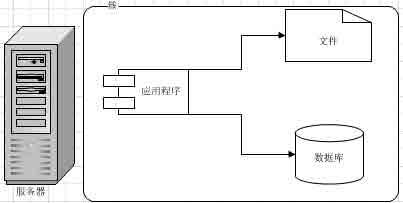

（2）应用和数据服务分离：**三台 Server 平天下**—业务发展，单台不再适应业务的发展，将应用和数据分离后成三台 Sever（应用服务器、文件服务器与数据库服务器）。分离后三台 Server 对硬件资源的需求各不相同：应用服务器需要更快更强大的 CPU，而数据库服务器需要更快的硬盘和更大的内存，文件服务器则需要更大的硬盘；

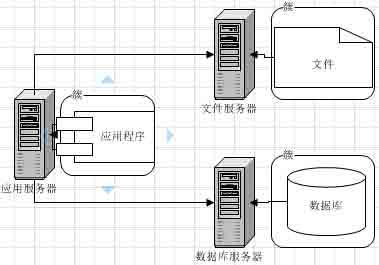

　　（3）使用缓存改善网站性能：**3+X 的 Server 模式**—**减少数据库访问压力，提高网站的数据访问速度**。缓存又可以分为：本地缓存和远程缓存（可以是分布式的），本地缓存访问速度快，但数据量有限；远程分布式缓存可以集群，因此容量不受限制；

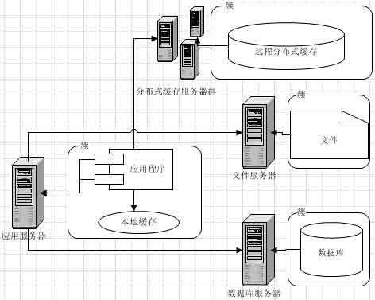

　　（4）使用应用服务器集群改善网站并发处理能力：**集群**—解决高并发、海量数据问题的常用手段，实现系统的可伸缩性。通过负载均衡调度器，可将用户访问分发到集群中的某台 Server 上，**应用服务器的负载压力不再成为整个网站的瓶颈**。

　　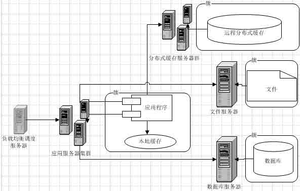

　　（5）数据库读写分离：使用缓存后绝大部分都可以不通过 DB 就能完成，但仍有一部分（缓存访问不命中、缓存过期）和全部的写操作需要访问 DB，在网站的用户达到一定规模后，DB 因为负载压力过高成为网站的瓶颈。大部分主流 DB 都提供主从热备功能，利用这一功能就可以配置两台 DB 主从关系，一台数据更新同步到另一台 Server 上。**网站利用 DB 的这一功能，实现 DB 读写分离，从而改善 DB 负载压力**。

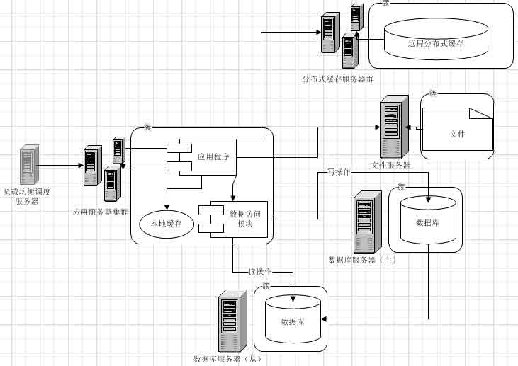

　　（6）使用反向代理和 CDN 加速网站响应：CDN 和反向代理的基本原理都是**缓存**，区别在于 CDN 部署在网络提供商的机房，而反向代理则部署在网站的中心机房。使用 CDN 和反向代理的目的都是**尽早返回数据给用户**，一方面加快用户访问速度，另一方面也减轻后端服务器的负载压力。

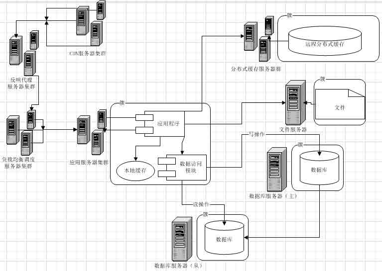

　　（7）使用分布式文件系统和分布式数据库系统：随着网站业务的发展，两台 DB 服务器依然不能满足需求，文件系统也一样。

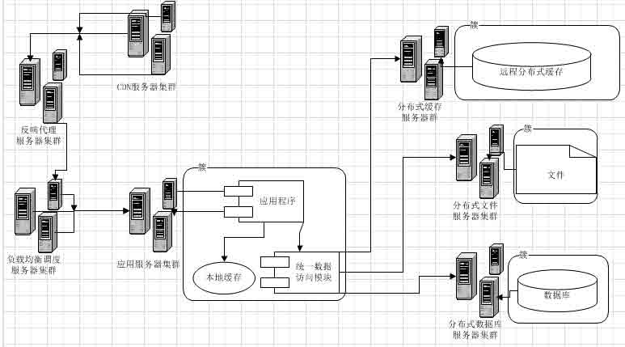

　　（8）使用 NoSQL 和搜索引擎：NoSQL 和搜索引擎都是源自互联网的技术手段，对可伸缩的分布式特性具有更好的支持。应用服务器则通过一个统一数据访问模块访问各种数据，减轻应用程序管理诸多数据源的麻烦。

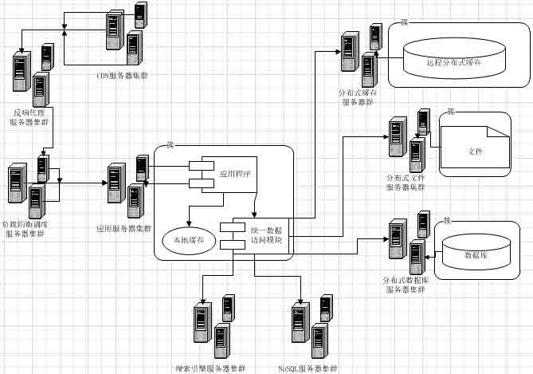

　　（9）业务拆分：通过分而治之的手段将整个网站业务分成不同的产品线，如淘宝将首页、商铺、订单、卖家、买家等拆分成不同的产品线，分归不同的业务团队负责。各个应用之间可以通过建立一个超链接建立关系，也可以通过消息队列进行数据分发。

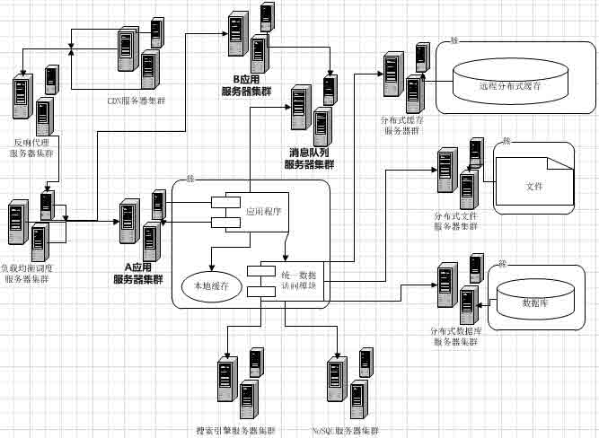

　　（10）分布式服务：既然每一个应用系统都需要执行许多相通的业务操作，比如用户管理、商品管理等，那么可以将这些共用的业务提取出来，独立部署。

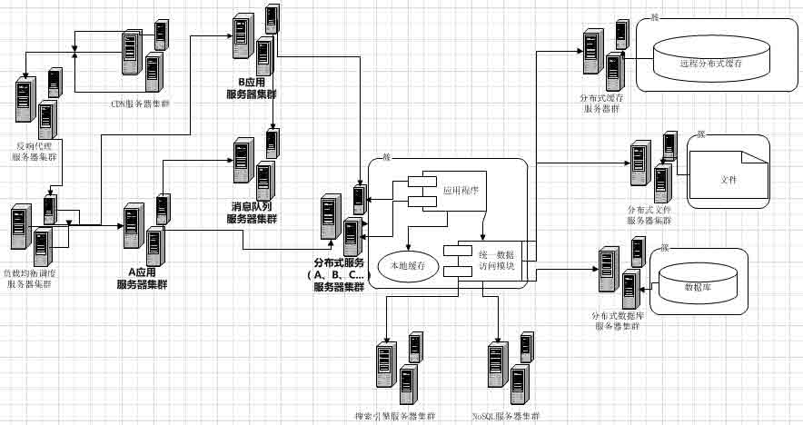

## 三、大型网站架构演化价值观

　　（1）核心价值：**随网站所需灵活应对**

**　　大型网站不是从无到有一步就搭建好一个大型网站，而是能够伴随小型网站业务的渐进发展，慢慢地演化成一个大型网站。**

（2）驱动力量：**网站的业务发展—业务成就了技术，事业成就了人，而不是相反**

## 四、大型网站架构设计的误区

　　（1）一味追随大公司的解决方案

　　（2）为了技术而技术->常见问题

　　（3）企图用技术解决所有问题：**技术是用来解决业务问题的，而业务的问题，也可以通过业务的手段去解决**；

## 本章思维导图

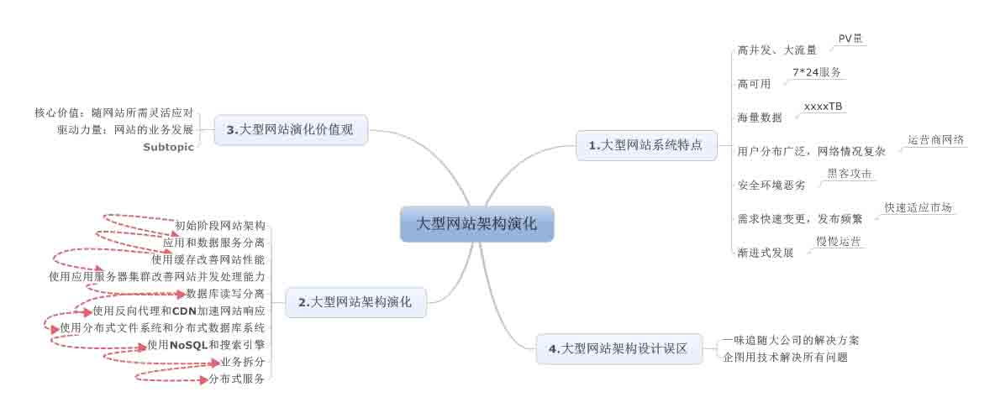

作者：[周旭龙](http://www.cnblogs.com/edisonchou/)

出处：[`www.cnblogs.com/edisonchou/`](http://www.cnblogs.com/edisonchou/)

本文版权归作者和博客园共有，欢迎转载，但未经作者同意必须保留此段声明，且在文章页面明显位置给出原文链接。