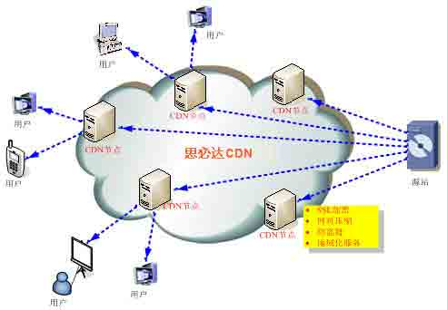
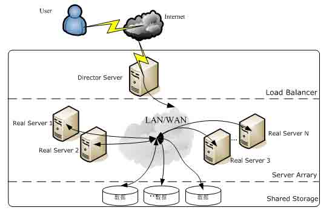
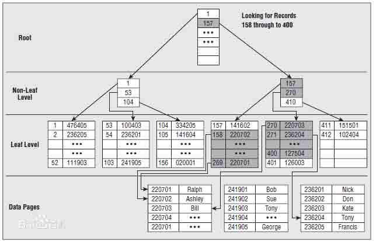
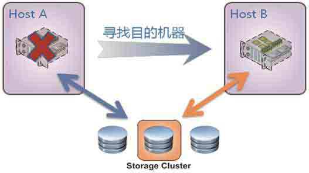
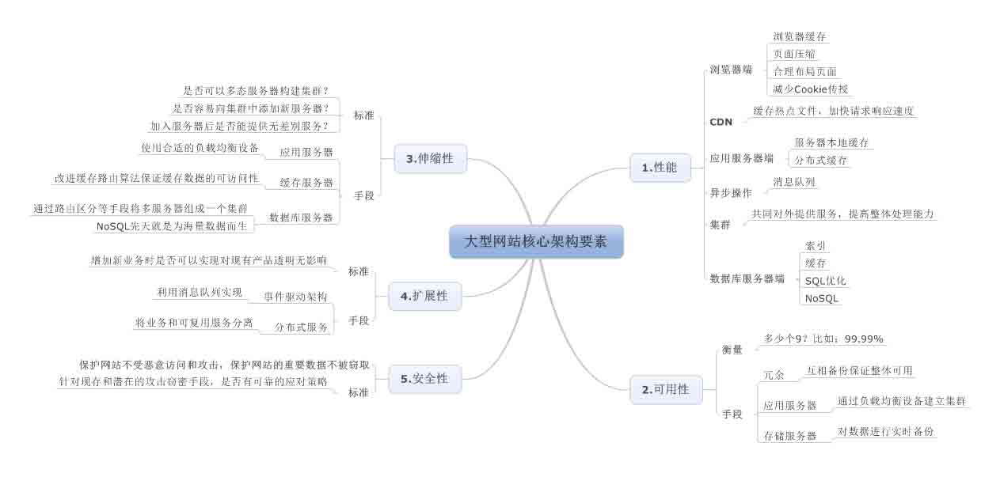

# 《大型网站技术架构》读书笔记三：大型网站核心架构要素

> [`www.cnblogs.com/edisonchou/p/3806348.html`](http://www.cnblogs.com/edisonchou/p/3806348.html)

**此篇已收录至[《大型网站技术架构》读书笔记系列目录](http://www.cnblogs.com/edisonchou/p/3773828.html)贴，点击访问该目录可获取更多内容。**

## 一、性能—响应时间决定用户

（1）浏览器端：

　　①浏览器缓存；

　　②使用页面压缩；

> PS：Gzip 压缩效率非常高，通常可以达到**70%**的压缩率，也就是说，如果你的网页有 30K，压缩之后就变成了 9K 左右。想要启用 Gzip 压缩，提高浏览速度，可以浏览这篇文章：[`www.chinaz.com/web/2012/1017/278682.shtml`](http://www.chinaz.com/web/2012/1017/278682.shtml)

　　③合理布局页面；

　　CSS：**把样式表置于顶部**；**避免使用 CSS 表达式（expression_r）**；使用外部 JavaScript 和 CSS；削减 JavaScript 和 CSS；用<link>代替@import；避免使用滤镜；

JavaScript：**把脚本置于页面底部**；使用外部 JavaScript 和 CSS；削减 JavaScript 和 CSS；**剔除重复脚本；减少 DOM 访问**；开发智能事件处理程序；

　　④减少 Cookie 传输；

（2）CDN：内容分发网络（Content Delivery Network，简称 CDN）将加速内容分发至离用户最近的节点，缩短用户查看对象的延迟，提高用户访问网站的响应速度与网站的可用性，解决网络带宽小、用户访问量大、网点分布不均等问题。详情请见百度百科：[`baike.baidu.com/view/8689800.htm?from_id=420951&type=search&fromtitle=CDN&fr=aladdin`](http://baike.baidu.com/view/8689800.htm?from_id=420951&type=search&fromtitle=CDN&fr=aladdin)

（3）应用服务器端：服务器本地缓存和分布式缓存；

　　Memcached 简介：[`baike.baidu.com/view/794242.htm`](http://baike.baidu.com/view/794242.htm)

　　Redis 简介：[`baike.baidu.com/view/4595959.htm`](http://baike.baidu.com/view/4595959.htm)

（4）服务器集群技术：Web 服务器集群、数据库服务器集群、分布式缓存服务器集群等等，通过部署多台服务器共同对外提供同类服务，提高整体处理能力。

（5）数据库服务器端：

　　①索引：索引（index）是对数据库表中一个或多个列（例如，employee 表的姓氏 (name) 列）的值进行排序的结构。如果想按特定职员的姓来查找他或她，则与在表中搜索所有的行相比，索引有助于更快地获取信息。

> PS：要注意的是，建立太多的索引将会影响更新和插入的速度，因为它需要同样更新每个索引文件。

　　②缓存：数据库缓存是介于应用程序和物理数据源之间，其作用是为了降低应用程序对数据库的物理数据源访问的频次，从而提高了应用的运行性能。

　　③SQL 优化：当一个基于数据库的应用程序运行起来很慢时，90%的可能都是由于数据访问程序的问题，要么是没有优化，要么是没有按最佳方法编写代码，因此你需要审查和优化你的数据访问/处理程序。具体可以浏览这篇文章：[`www.cnblogs.com/Shaina/archive/2012/04/22/2464576.html`](http://www.cnblogs.com/Shaina/archive/2012/04/22/2464576.html)

　　④NoSQL：方兴未艾的 NoSQL 数据库通过优化数据模型、存储结构、伸缩性等手段在性能方面的优势日趋明显。

## 二、可用性—你能保证几个 9？

（1）如何衡量可用性？全靠 9 来撑腰：几乎所有网站都承诺 7*24 小时可用，但事实上都不可能完全实现，总会有一些故障时间。那么，去除这些故障时间就是网站的总可用时间。换算成网站的可用性指标，以此衡量网站的可用性，例如某些知名网站可用性达到**99.99%**。

（2）哪些手段提高可用性？

　　①核心：**冗余**-各服务器互相备份保证整体可用；

　　②应用服务器端：通过负载均衡设备建立集群，其中一台宕机立即切换到其他服务器继续提供服务，这就保证了高可用性。

　　③存储服务器端：需要对数据进行实时备份，当某台宕机立即将数据访问请求转换到其他服务器上，并进行数据恢复以保证数据高可用。

## 三、伸缩性—能屈能伸方为大丈夫

（1）衡量标准：

　　①是否可以多态服务器构建集群？

　　②是否容易向集群中添加新服务器？

　　③加入服务器后是否能提供无差别服务？

（2）主要手段：

　　①应用服务器：使用合适的负载均衡设备（硬件还是软件？F5 还是 LVS+KeepAlived）；

　　②缓存服务器：改进缓存路由算法保证缓存数据的可访问性；

　　③数据库服务器：通过路由区分等手段将多服务器组成一个集群；

## 四、扩展性—不痛不痒之间新业务就上线了

（1）衡量标准：增加新业务时是否可以实现对现有产品透明无影响（是否需要对现有业务进行修改匹配？）；

（2）主要手段：

　　①事件驱动架构：利用消息队列实现；

　　②分布式服务：将业务和可复用服务分离；

## 五、安全性—妈妈再也不用担心的我的照片了

（1）何为安全性？保护网站不受恶意访问和攻击，保护网站的重要数据不被窃取；

（2）衡量标准：针对现存和潜在的攻击窃密手段，是否有可靠的应对策略；

## 本章思维导图

作者：[周旭龙](http://www.cnblogs.com/edisonchou/)

出处：[`www.cnblogs.com/edisonchou/`](http://www.cnblogs.com/edisonchou/)

本文版权归作者和博客园共有，欢迎转载，但未经作者同意必须保留此段声明，且在文章页面明显位置给出原文链接。