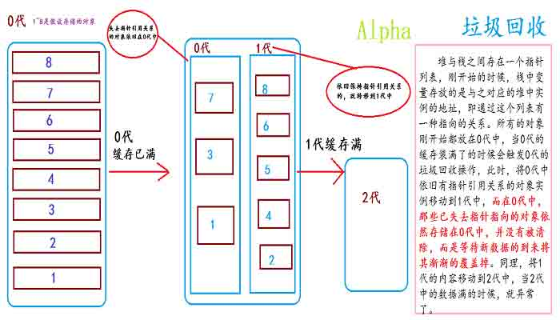

# 《大型网站技术架构》读书笔记四：瞬时响应之网站的高性能架构

> [`www.cnblogs.com/edisonchou/p/3809839.html`](http://www.cnblogs.com/edisonchou/p/3809839.html)

**此篇已收录至[《大型网站技术架构》读书笔记系列目录](http://www.cnblogs.com/edisonchou/p/3773828.html)贴，点击访问该目录可获取更多内容。**

## 一、网站性能测试

（1）性能测试指标：①响应时间；②并发数；③吞吐量；④性能计数器；

（2）性能测试方法：①性能测试；②负载测试；③压力测试；④稳定性测试；

（3）性能优化策略：

　　①性能分析：检查请求处理各个环节的日志，分析哪个环节响应时间不合理，检查监控数据分析影响性能的因素；

　　②性能优化：Web 前端优化，应用服务器优化，存储服务器优化；

## 二、Web 前端性能优化

（1）浏览器访问优化：

　　①减少 http 请求：**因为 http 是无状态的，每次请求的开销都比较昂贵**（需要建立通信链路、进行数据传输，而服务器端对于每个 http 请求都需要启动独立的线程去处理）；减少 http 的主要手段是合并 CSS、合并 JS、合并图片（CSS 精灵，利用偏移定位 image）；

　　②使用浏览器缓存：设置 http 头中 Cache-Control 和 Expires 属性；

　　③启用压缩：可以对 html、css、js 文件启用 Gzip 压缩，可以达到较高的压缩效率，但是压缩会对服务器及浏览器产生一定的压力；

　　④CSS 放页面最上面，JS 放页面最下面：**浏览器会在下载完全部 CSS 之后才开始对整个页面进行渲染**，因此最好将 CSS 放在页面最上面；而**浏览器在加载 JS 后会立即执行，有可能会阻塞整个页面，造成页面显示缓慢**，因此最好将 JS 放在页面最下面；

　　⑤减少 Cookie 传输：一方面，太大的 Cookie 会严重影响数据传输；另一方面，对于某些静态资源的访问（如 CSS、JS 等）发送 Cookie 没有意义；

（2）CDN 加速：

　　CDN（内容分发网络）仍然是一个**缓存**，它**将数据缓存在离用户最近的地方**，便于用户以最快速度获取数据。即所谓的“**网络访问第一跳**”，如下图所示：

　　**CDN 只将访问频度很高的热点内容（例如：图片、视频、CSS、JS 脚本等访问频度很高的内容）进行缓存**，可以极大地加快用户访问速度，减少数据中心负载。

（3）反向代理：

　　反向代理服务器位于网站机房，代理网站 Web 服务器接收 Http 请求，对请求进行转发，如下图所示：

　　反向代理服务器具有以下功能：

　　①保护网站安全：任何来自 Internet 的请求都必须先经过代理服务器；

　　②通过配置缓存功能加速 Web 请求：减轻真实 Web 服务器的负载压力；

　　③实现负载均衡：均衡地分发请求，平衡集群中各个服务器的负载压力；

## 三、应用服务器性能优化

（1）分布式缓存：

> ***PS：***网站性能优化第一定律：**优先考虑使用缓存优化性能**。缓存是指将数据存储在相对较高访问速度的存储介质中（如内存），以供系统进行快速处理响应用户请求。

　　①缓存本质是一个**内存 Hash 表**，数据以(Key,Value)形式存储在内存中。

　　②缓存主要用来**存放那些读写比很高、很少变化的数据**，如商品的类目信息、热门商品信息等。这样，应用程序读取数据时，先到缓存中取，如缓存中没有或失效，再到数据库中取出，重新写入缓存以供下一次访问。因此，可以**很好地改善系统性能，提高数据读取速度，降低存储访问压力**。

　　③分布式缓存架构：一方面是以以 JBoss Cache 为代表的**互相通信**派；另一方面是以 Memcached 为代表的**互不通信**派；

　　JBoss Cache 需要将缓存信息同步到集群中的所有机器，代价比较大；而 Memcached 采用一种集中式的缓存集群管理，缓存与应用分离部署，应用程序通过**一致性 Hash 算法**选择缓存服务器远程访问缓存数据，缓存服务器之间互不通信，因而集群规模可以轻易地扩容，具有良好的伸缩性。

　　Memcached 由两个核心组件组成：服务端（ms）和客户端（mc），在一个 memcached 的查询中，mc 先通过计算 key 的 hash 值来确定 kv 对所处在的 ms 位置。当 ms 确定后，客户端就会发送一个查询请求给对应的 ms，让它来查找确切的数据。因为这之间没有交互以及多播协议，所以 memcached 交互带给网络的影响是最小化的。

（2）异步操作：

　　①使用**消息队列**将调用异步化，可改善网站的扩展性，还可改善网站性能；

　　②消息队列具有**削峰**的作用->将短时间高并发产生的事务消息存储在消息队列中，从而削平高峰期的并发事务；

> ***PS：*****任何可以晚点做的事情都应该晚点再做**。前提是：这个事儿确实可以晚点再做。

（3）使用集群：

　　①在高并发场景下，使用**负载均衡**技术为一个应用构建多台服务器组成的服务器集群；

　　②可以避免单一服务器因负载压力过大而响应缓慢，使用户请求具有**更好的响应延迟特性**；

　　③负载均衡可以采用硬件设备，也可以采用软件负载。商用硬件负载设备（例如出名的 F5）成本通常较高（一台几十万上百万很正常），所以在条件允许的情况下我们会采用软负载，软负载解决的两个核心问题是：选谁、转发，其中最著名的是**LVS**（Linux Virtual Server）。

> ***PS：***LVS 是四层负载均衡，也就是说建立在 OSI 模型的第四层——传输层之上，传输层上有我们熟悉的 TCP/UDP，LVS 支持 TCP/UDP 的负载均衡。
> 
> LVS 的转发主要通过修改 IP 地址（NAT 模式，分为源地址修改 SNAT 和目标地址修改 DNAT）、修改目标 MAC（DR 模式）来实现。有关 LVS 的详情请参考：[`www.importnew.com/11229.html`](http://www.importnew.com/11229.html)

（4）代码优化：

　　①多线程：使用多线程的原因：一是 IO 阻塞，二是多 CPU，都是为了最大限度地利用 CPU 资源，提高系统吞吐能力，改善系统性能；

　　②资源复用：目的是**减少开销很大的系统资源的创建和销毁**，主要采用两种模式实现：单例（Singleton）和对象池（Object Pool）。例如，在.NET 开发中，经常使用到的线程池，数据库连接池等，本质上都是对象池。

　　③数据结构：在不同场合合理使用恰当的数据结构，可以极大优化程序的性能。

　　④垃圾回收：理解垃圾回收机制有助于程序优化和参数调优，以及编写内存安安全的代码。这里主要针对 Java（JVM）和 C#（CLR）一类的具有 GC（垃圾回收机制）的语言。

## 四、存储性能优化

（1）机械硬盘 还是 固态硬盘？

　　①机械硬盘：**通过马达驱动磁头臂，带动磁头到指定的磁盘位置访问数据**。它能够实现**快速顺序读写，慢速随机读写**。

　　②固态硬盘（又称 SSD）：无机械装置，**数据存储在可持久记忆的硅晶体上**，因此可以像内存一样**快速随机访问**。

　　在目前的网站应用中，大部分应用访问数据都是随机的，这种情况下 SSD 具有更好的性能表现，但是性价比有待提升（蛮贵的，么么嗒）。

（2）B+树 vs LSM 树

　　①传统关系型数据库广泛采用 B+树，B+树是对数据排好序后再存储，加快数据检索速度。

> ***PS：***目前大多数 DB 多采用两级索引的 B+树，树的层次最多三层。因此可能需要**5 次磁盘访问**才能更新一条记录（三次磁盘访问获得数据索引及行 ID，一次数据文件读操作，一次数据文件写操作，终于知道数据库操作有多麻烦多耗时了）

　　②NoSQL（例如：HBase）产品广泛采用 LSM 树：

　　具体思想是：**将对数据的修改增量保持在内存中，达到指定的大小限制后将这些修改操作批量写入磁盘。**不过读取的时候稍微麻烦，需要合并磁盘中历史数据和内存中最近的修改操作，所以写入性能大大提升，读取时可能需要先看是否命中内存，否则需要访问较多的磁盘文件。

　　LSM 树的原理是：把一棵大树拆分成 N 棵小树，它首先写入内存中，随着小树越来越大，内存中的小树会被清除并写入到磁盘中，磁盘中的树定期可以做合并操作，合并成一棵大树，以优化读性能。

　　LSM 树的优势在于：在 LSM 树上进行一次数据更新不需要磁盘访问，在内存即可完成，速度远快于 B+树。

## 五、学习总结

　　对于网站的高性能架构这一章的阅读，通过大牛的书籍我们学到了从三个主要方面的性能优化策略，虽然都是理论，而且还只是浅显地说明，但是对于我们这些广大的开发菜鸟来说，扩展知识面，了解一点优化策略不是一件坏事，我们可以从中注意到日常的代码规范，如何写出高效的代码也是一件值得研究的事儿。在书中，看到了作者写了这样一句话，贴出来与各位正在学习途中的菜鸟们共享：**“归根结底，技术是为业务服务的，技术选型和架构决策依赖业务规划乃至企业战略规划，离开业务发展的支撑和驱动，技术走不远，甚至还会迷路”**。出来实习了一年多，对这句话感慨颇多，也吃了很多的亏，在和客户的沟通交流上也有了自己的一点感悟，所以贴出来与各位园友共勉。最后，希望作为菜鸟的我们，在技术这条路上能够走得远一些，迷路不重要，重要的是能够迷途知返，么么嗒！再过一个多月，就要开始找工作了，希望在此期间能够认真阅读完自己的计划书单，加油！

## 参考文献

（1）李智慧，《大型网站技术架构-核心原理与案例分析》，http://item.jd.com/11322972.html

（2）周言之，《Memcached 详解》，http://blog.csdn.net/zlb824/article/details/7466943

（3）百度百科，CDN，http://baike.baidu.com/view/8689800.htm

（4）王晨纯，《Web 基础架构：负载均衡和 LVS》，http://www.importnew.com/11229.html

（5）辉之光，《B 树、B-树、B+树》，http://www.cnblogs.com/oldhorse/archive/2009/11/16/1604009.html

（6）yanghuahui's blog，《LSM 树由来、设计思想以及应用到 HBase 的索引》，http://www.cnblogs.com/yanghuahui/p/3483754.html

## 本章思维导图

作者：[周旭龙](http://www.cnblogs.com/edisonchou/)

出处：[`www.cnblogs.com/edisonchou/`](http://www.cnblogs.com/edisonchou/)

本文版权归作者和博客园共有，欢迎转载，但未经作者同意必须保留此段声明，且在文章页面明显位置给出原文链接。