# 《大型网站技术架构》读书笔记之六：永无止境之网站的伸缩性架构

> [`www.cnblogs.com/edisonchou/p/3851333.html`](http://www.cnblogs.com/edisonchou/p/3851333.html)

**此篇已收录至[《大型网站技术架构》读书笔记系列目录](http://www.cnblogs.com/edisonchou/p/3773828.html)贴，点击访问该目录可获取更多内容。**

> **首先，所谓网站的伸缩性，指不需要改变网站的软硬件设计，仅仅通过改变部署的服务器数量就可以扩大或者缩小网站的服务处理能力。在整个互联网行业的发展渐进演化中，最重要的技术就是服务器集群，通过不断地向集群中添加服务器来增强整个集群的处理能力。**

## 一、网站架构的伸缩性设计

## 1.1 不同功能进行物理分离实现伸缩

　　（1）纵向分离：将业务处理流程上得不同部分分离部署，实现系统的伸缩性；

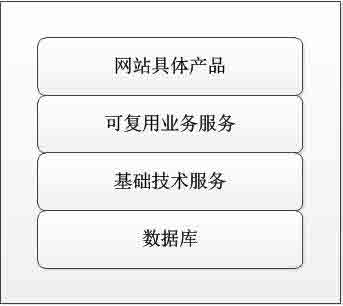

　　（2）横向分离：将不同的业务模块分离部署，实现系统的伸缩性；

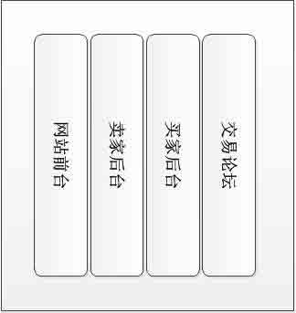

## 1.2 单一功通过集群规模实现伸缩

　　使用服务器集群，即将相同服务部署在多台服务器上构成一个集群整体对外提供服务。具体来说，集群伸缩性又分为应用服务器集群伸缩性和数据服务器集群伸缩性。这两种集群对于数据状态管理的不同，技术实现也有很大的区别。

> It is said that **当一头牛拉不动车的时候，不要去寻找一头更强壮的牛，而是用两头牛来拉车**。

## 二、应用服务器集群的伸缩性设计

## 2.1 应用服务器那点必须知道的事儿

　　（1）应用服务器应该被设计成**无状态**的，即应用服务器不存储请求上下文信息；构建集群后，每次用户的请求都可以发到集群中任意一台服务器上处理，任何一台服务器的处理结果都是相同的；

　　（2）HTTP 本身是一个无状态的连接协议，为了支持客户端与服务器之间的交互，我们就需要通过不同的技术为交互存储状态，而这些不同的技术就是 Cookie 和 Session 了。

　　（3）HTTP 请求的分发是应用服务器集群实现伸缩性的核心问题，而负载均衡服务器就是 HTTP 请求的分发装置，它是网站必不可少的基础手段，也被称为网站的**杀手锏**之一。

## 2.2 负载均衡技术—网站必不可少的基础技术手段

　　负载均衡的实现方式多种多样，从硬件到软件，从商业产品到开源产品，应有尽有。但是，实现负载均衡的基础技术不外乎以下几种：

　　（1）**HTTP 重定向负载均衡**　　评价：★★

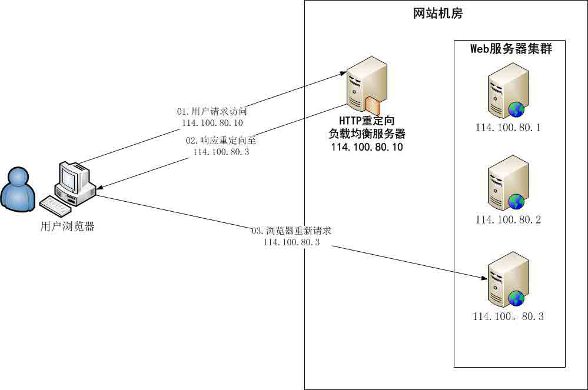

　　此方案的优点是**简单易行**，缺点是：

　　①浏览器需要两次请求才能完成一次访问，**性能较差**；

　　②重定向服务器自身的处理能力有可能成为瓶颈，整个集群的**伸缩性规模有限**；

　　③使用 HTTP 302 重定向有可能使搜索引擎判断为**SEO 作弊**，降低搜索排名；

　　（2）**DNS 域名解析负载均衡**　　评价：★★★

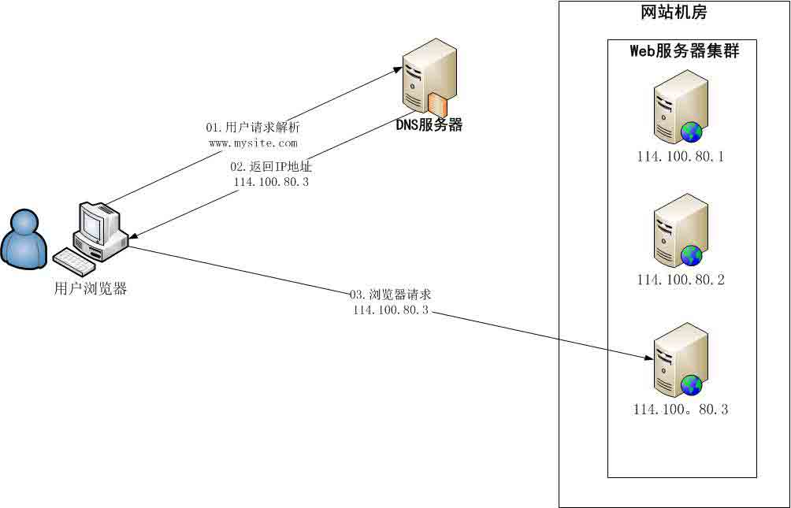

　　此方案要求在 DNS 服务器中配置多个 A 记录，例如：

| www.mysite.com IN A | 114.100.80.1 |
| www.mysite.com IN A | 114.100.80.2 |
| www.mysite.com IN A | 114.100.80.3 |

　　此方案的优点是将负载均衡的工作转交给了 DNS，省掉了网站管理维护负载均衡服务器的麻烦。而缺点是：

　　①目前的 DNS 是**多级解析**，每一级 DNS 都可能缓存 A 记录，当某台服务器下线后，即使修改了 DNS 的 A 记录，要使其生效仍然需要较长时间。这段期间，会导致用户访问已经下线的服务器造成访问失败。

　　②DNS 负载均衡的控制权在域名服务商那里，网站无法对其做更多改善和管理；

> **TIPS：**事实上，大型网站总是部分使用 DNS 域名解析，利用域名解析作为第一级负载均很手段，即域名解析得到的一组服务器不是实际的 Web 服务器，而是同样提供负载均衡的内部服务器，这组内部服务器再进行负载均衡，请求分发到真实的 Web 服务器上。

　　（3）**反向代理负载均衡**　　评价：★★★★

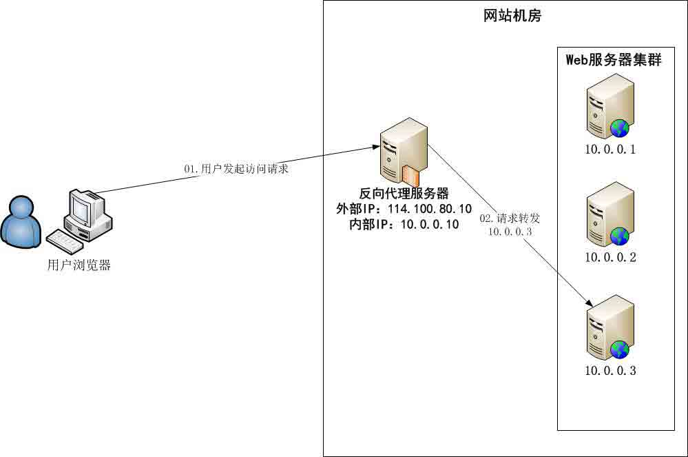

　　Web 服务器不需要使用外部 IP 地址，而反向代理服务器则需要配置双网卡和内外部两套 IP 地址。

　　此方案的优点是**和反向代理服务器功能集成在一起，部署简单**。缺点是**反向代理服务器是所有请求和响应的中转站，其性能可能会成为瓶颈**。

　　（4）**IP 负载均衡**　　评价：★★★★

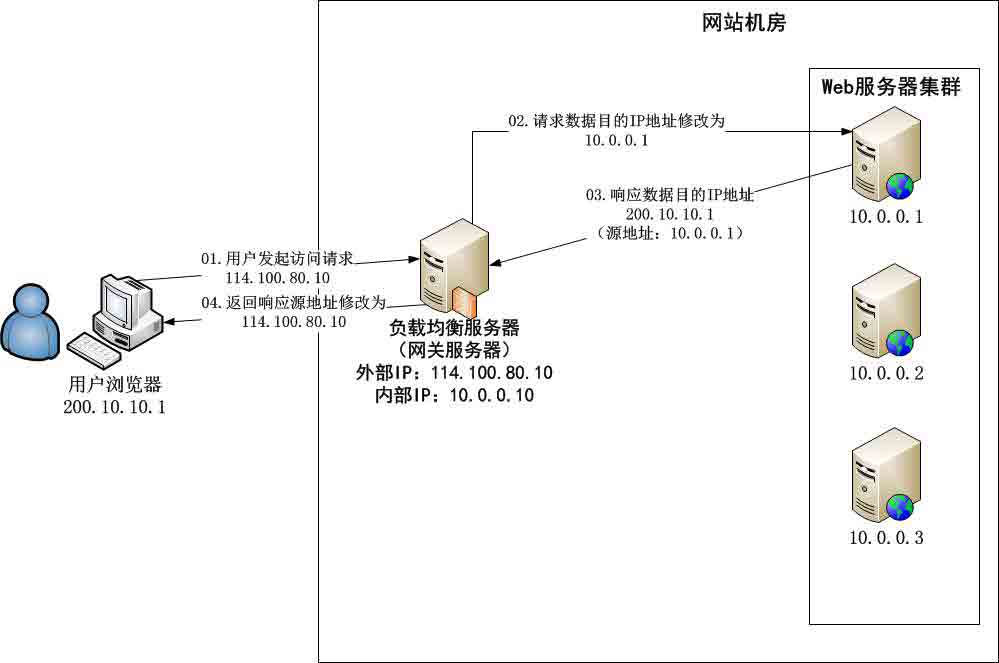

　　此方案优点在于在**内核进程**完成数据分发，较反向代理负载均衡（在应用程序中分发数据）有更好的处理性能。缺点是由于所有请求响应都需要经过负载均衡服务器，集群的最大响应数据吞吐量不得不**受制于负载均衡服务器网卡带宽**。

　　（5）**数据链路层负载均衡**　　评价：★★★★★

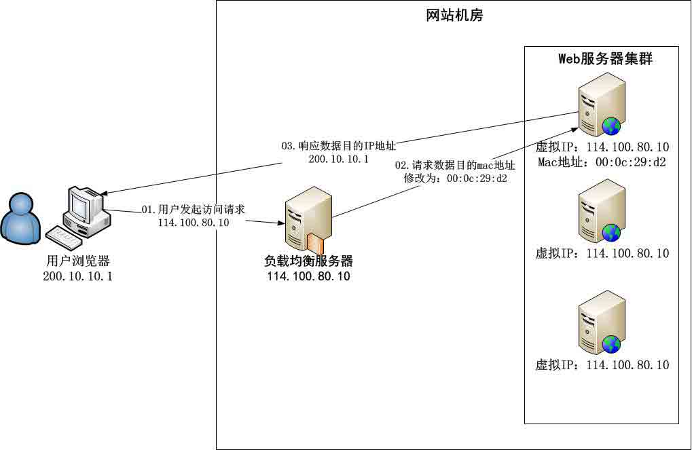

　　此种方式又称作**三角传输模式**，负载均衡数据分发过程中不修改 IP 地址，只修改 mac 地址，由于实际处理请求的真实物理 IP 地址和数据请求目的 IP 地址一致，所以不需要通过负载均衡服务器进行地址转换，可将响应数据包直接返回给用户浏览器，避免负载均衡服务器网卡带宽成为瓶颈。这种负载均衡方式又称作**直接路由方式（DR）**。

　　**使用三角传输模式的链路层负载均衡是目前大型网站使用最广泛的一种负载均衡手段**。在 Linux 平台上最好的链路层负载均衡开源产品是 LVS（Linux Virutal Server）。

## 2.3 负载均衡算法—负载均衡技术赖以生存的核心

　　前面的方法解决了负载均衡通过何种方式实现，而更为重要的则是如何从 Web 服务器列表中计算得到一台 Web 服务器的地址，而这正是负载均衡的核心—算法。这里简单介绍一下通常的集中负载均衡计算的算法，如果需要深入了解请自行百度。

　　（1）轮询

　　所有请求被以此分发到每台应用服务器上，即每台服务器需要处理的请求数目都相同，适合于所有服务器硬件都相同的场景。

　　（2）加权轮询

　　根据应用服务器的配置性能的情况，在轮询的基础上，按照配置的权重将请求分发到每个服务器，高性能的服务器能分配更多的请求。

　　（3）随机

　　此算法比较简单实用，请求被随机分配到各个应用服务器，因为好的随机数本身就很均衡。

　　（4）最少连接

　　记录每个应用服务器正在处理的连接数（请求数），将新到的请求分发到最少连接的服务器上，应该说，这是最符合负载均衡定义的算法。

　　（5）**源地址散列**

　　根据请求来源的 IP 地址进行 Hash 计算得到应用服务器，这样**来自同一个 IP 地址的请求总在同一个服务器上处理**，该请求的上下文信息可以存储在这台服务器上，在一个会话周期内重复使用，从而实现会话粘滞。

## 三、分布式缓存集群的伸缩性设计

　　不同于应用服务器集群的伸缩性设计，分布式缓存集群的伸缩性不能使用简单的负载均衡手段来实现。因为：**分布式缓存服务器集群中缓存的数据各不相同，缓存访问请求不可以在缓存服务器集群中的任意一台处理，必须先找到缓存有需要的数据的服务器，然后才能访问**。

　　分布式缓存集群伸缩性设计的目标：**让新上线的缓存服务器对整个分布式缓存集群影响最小，也就是说新加入缓存服务器后应使整个缓存服务器集群中已经缓存的数据尽可能还被访问到。**

（1）以 Memcached 为代表的分布式缓存集群的访问模型

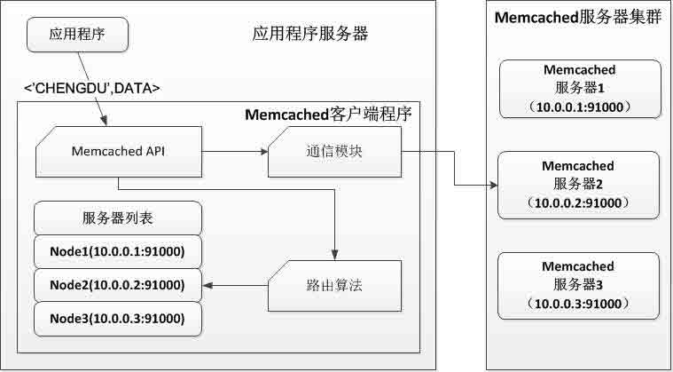

　　以上图片展示了一个典型的缓存写操作，应用程序需要写缓存数据<'CHENGDU',DATA>，API 将 KEY（'CHENGDU'）输入路由算法模块，路由算法根据 KEY 和 Memcached 服务器集群列表计算得到一台服务器编号（如 Node1），进而得到该机器的 IP 地址和端口（10.0.0.1:91000）。然后，API 调用通信模块和编号为 Node1 的 Memcached 服务器进行通信，将数据<'CHENGDU',DATA>写入该服务器，至此便完成了一次分布式缓存的写操作。

　　而读操作和写操作一样，使用同样的路由算法和服务器列表，只要提供相同的 KEY（如上面提到的'CHENGDU'），Memcached 客户端总是访问相通的服务器（如上面计算得到的 Node1）去读取数据。

　　（2）以 Memcached 为代表的分布式缓存集群的伸缩性挑战

　　简单的路由算法（通过使用余数 Hash）无法满足业务发展时服务器扩容的需要：**缓存命中率下降**。例如：当 3 台服务器扩容至 4 台时，采用普通的余数 Hash 算法会导致大约 75%（3/4）被缓存了的数据无法正确命中，随着服务器集群规模的增大，这个比例会线性地上升。那么，可以想象，当 100 台服务器的急群众加入一台服务器，不能命中的概率大概是 99%（N/N+1），这个结果显然是无法接受的。

　　那么，能否通过改进路由算法，使得新加入的服务器不影响大部分缓存数据的正确性呢？请看下面的一致性 Hash 算法。

　　（3）**分布式缓存的*一致性 Hash*算法**

> **说明：**一致性 Hash 算法是分布式缓存的核心理论，这里只是简单介绍一下，后续有空我会单独写一篇文章来详细介绍一致性 Hash 算法，以及用 C#实现一致性 Hash 算法。

　　一致性 Hash 算法通过一个叫做一致性 Hash 还的数据结构实现 KEY 到缓存服务器的 Hash 映射，如下图所示：

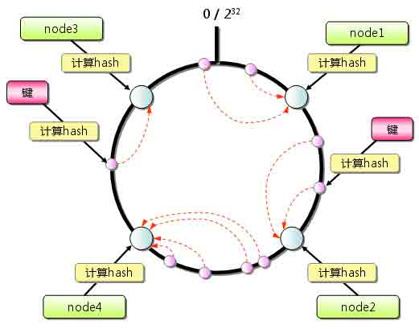

　　具体算法过程是：

　　①先构造一个长度为 0~2³²（2 的 32 次幂）个的整数环（又称：一致性 Hash 环），根据节点名称的 Hash 值将缓存服务器节点防置在这个 Hash 环中，如上图中的 node1，node2 等；

　　②根据需要缓存的数据的 KEY 值计算得到其 Hash 值，如上图中右半部分的“键”，计算其 Hash 值后离 node2 很近；

　　③在 Hash 环上顺时针查找距离这个 KEY 的 Hash 值最近的缓存服务器节点，完成 KEY 到服务器的 Hash 映射查找，如上图中离右边这个键的 Hash 值最近的顺时针方向的服务器节点是 node2，因此这个 KEY 会到 node2 中读取数据；

　　当缓存服务器集群需要扩容的时候，只需要将新加入的节点名称（如 node5）的 Hash 值放入一致性 Hash 环中，**由于 KEY 总是顺时针查找距离其最近的节点，因此新加入的节点只影响整个环中的一部分**。如下图中所示，添加 node5 后，只影响右边逆时针方向的三个 Key/Value 对数据，只占整个 Hash 环中的一小部分。

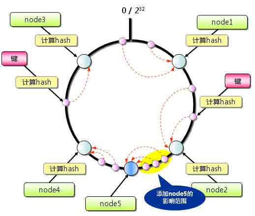

　　因此，我们可以与之前的普通余数 Hash 作对比：采用一直性 Hash 算法时，当 3 台服务器扩容到 4 台时，可以继续命中原有缓存数据的概率为 75%，远高于普通余数 Hash 的 25%，而且随着集群规模越大，继续命中原有缓存数据的概率也会随之增大。当 100 台服务器增加 1 台时，继续命中的概率是 99%。**虽然，仍有小部分数据缓存在服务器中无法被读取到，但是这个比例足够小，通过访问数据库也不会对数据库造成致命的负载压力**。

## 四、数据存储服务器集群的伸缩性设计

　　首先，**数据存储服务器必须保证数据的可靠存储，任何情况下都必须保证数据的可用性和正确性**。因此，缓存服务器集群的伸缩性架构方案不能直接适用于数据库等存储服务器。

　　（1）关系数据库集群的伸缩性设计

　　①市场上主要的关系数据库都支持数据复制功能，使用这个功能可以对数据库进行简单伸缩。下图显示了使用数据复制的 MySQL 集群伸缩性方案：多台 MySQL 的角色有主从之分，写操作都在主服务器上，由主服务器将数据同步到集群中其他从服务器。而读操作及数据分析等离线操作都会在从服务器上完成。

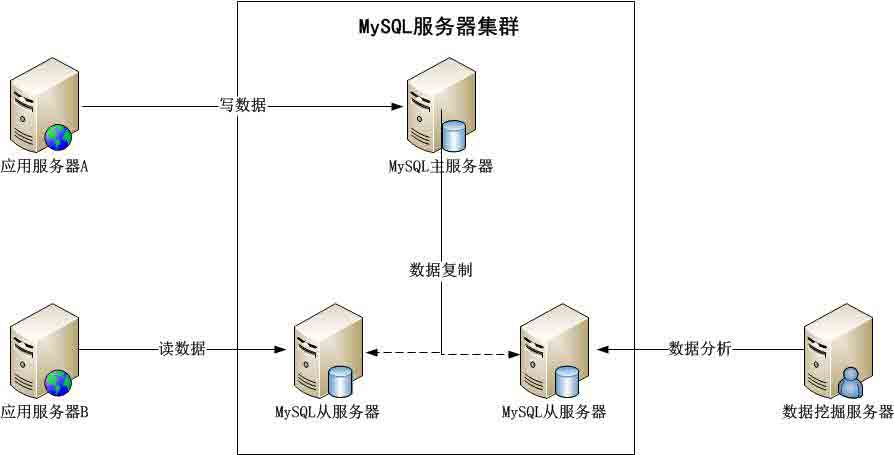

　　②前面提到的业务分割模式也可以用在数据库，不同业务数据表部署在不同的数据库集群上，这就是所谓的“**数据分库**”；但是其有一个制约条件：跨库的表无法进行 Join 操作；

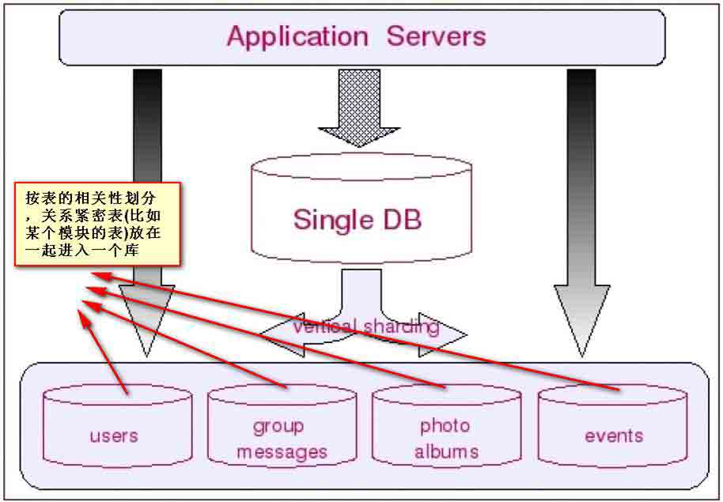

　　③在实际运维中，对一些单表数据仍然很大的表，例如 Facebook 的用户数据库、淘宝的商品数据库等，还需要进行分片，将一张表拆分开分别存储在多个数据库中，这就是所谓的“**数据分片**”；

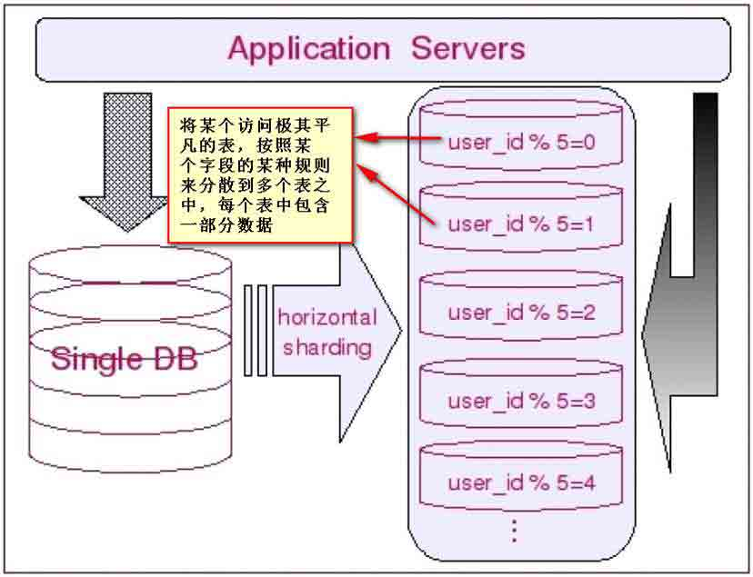

　　（2）NoSQL 数据库的伸缩性设计

　　首先，NoSQL 主要指非关系的、分布式的数据库设计模式。也有许多专家将 NoSQL 解读为**Not Only SQL**，表示 NoSQL 是关系数据库的补充，而不是替代方案。一般而言，NoSQL 数据库产品都放弃了关系数据库的两大重要基础：①以关系代数为基础的结构化查询语言（SQL）②事务的一致性保证（ACID）；与之对应的是强化一些大型网站更关注的特性：**高可用性和可伸缩性**；

　　开源社区的 NoSQL 产品不尽其数，其支持的数据结构和伸缩性特性也各不相同。目前看来，应用最广泛的是 Apache HBase。HBase 的伸缩性主要依赖于其**可分裂的 HRegion**及**可伸缩的分布式文件系统 HDFS**（如果您不知道 HDFS 又对 HDFS 有兴趣，可以阅读我的另一篇博文《[不怕故障的海量存储—HDFS 基础入门](http://www.cnblogs.com/edisonchou/p/3538524.html)》）实现。

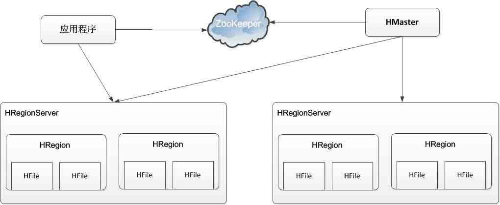

　　上图是 HBase 的整体架构图：

　　①HBase 中数据**以 HRegion 为单位**进行管理，也就是说应用程序如果想要访问一个数据，必须先找到 HRegion，然后将数据读写操作提交给 HRegion，由 HRegion 完成存储层面的数据操作。

　　②每个 HRegion 中存储一段 Key 区间（例如：Key1,Key2)）的数据，HRegionServer 是物理服务器，每个 HRegionServer 上可以启动多个 HRegion 实例。**当一个 HRegion 中写入的数据太多，达到配置的阀值时，HRegion 会分裂成两个 HRegion**，并将 HRegion 在整个集群中进行迁移，以使 HRegionServer 的负载均衡。

　　③所有的**HRegion 的信息都**（例如：存储的 Key 值区间、所在 HRegionServer 的 IP 地址和端口号等）**记录在 HMaster 服务器**上。同时为了保证高可用，HBase 启动了多个 HMaster，并通过 ZooKeeper（一个支持分布式一致性的数据管理服务）选举出一个主服务器，通过这个主 HMaster 服务器获得 Key 值所在的 HRegionServer，最后请求该 HRegionServer 上的 HRegion 实例，获得需要的数据。其具体的数据寻址访问流程如下图所示：

![## 五、学习小结　　在本章的学习中，我们了解到要实现网站的可伸缩性，关键技术就在于如何构建“良好”的服务器集群。要达到良好的目标，就要求每次扩容和减少服务器时，对整个网站的影响是最小的，甚至无影响的。伸缩性是复杂的，没有通用的、完美的解决方案和产品。一个具有良好伸缩性的网站，其设计总是走在业务发展的前面，在业务需要处理更多访问和处理之前，就已经做好了充分的准备，当业务需要时，只需要增加服务器并简单部署就可以了，技术团队便可轻松应对了。　　在本篇的介绍中，有些核心的内容比如一致性 Hash 算法只是进行了简单的介绍，并没有深入的分析，这个源于我目前对其的理解还只是皮毛。等待我深入学习之后，我会抽空写一篇单独介绍一致性 Hash 算法的博文，并使用 C#进行一个粗略的实现，有兴趣的朋友敬请期待吧。　　另外，前面几篇博文中有些园友提出介绍一些实践性质的东西，我在这里表示**抱歉**，因为本书只是单纯地讲解理论，而且也没有深入地去讲解这些理论，只是单纯地扩展知识面，管中窥豹，一览大型网站的技术体系。而我本人也还是一个即将求职和毕业的学生，在理论和实践上都缺乏相应的经验，但我会在精读完本书后去做一些相应场景的具体实践，比如使用 Memcached 或 Redis 构建分布式缓存集群，使用 Mono 在 Linux 下搭建 ASP.NET MVC 应用环境，使用高性能的 Nginx 或 Jexus 服务器构建反向代理负载均衡服务器环境，使用发布订阅模式实现 MS SQL 的读写分离实践等等，如果园友有兴趣的话，也可以自行找资料去做相关实践。如果觉得喜欢我的博文，那我只能说**敬请期待**了（现在时间宝贵啊，马上要找工作了，还得复习复习，再过段时间毕业论文的鸭梨又要来了，我勒个去），么么嗒。## 参考文献　　（1）李智慧，《大型网站技术架构-核心原理与案例分析》，http://item.jd.com/11322972.html　　（2）老徐的私房菜，《HTTP 无状态协议和 Session 原理》，http://laoxu.blog.51cto.com/4120547/1219699　　（3）百度百科，《一致性 Hash 算法》，http://baike.baidu.com/view/1588037.htm　　（4）charlee，《Memcached 完全剖析》，http://kb.cnblogs.com/page/42731/　　（5）bluishglc，《数据库 Sharding 的基本思想和切分策略》，http://blog.csdn.net/bluishglc/article/details/6161475## 本章思维导图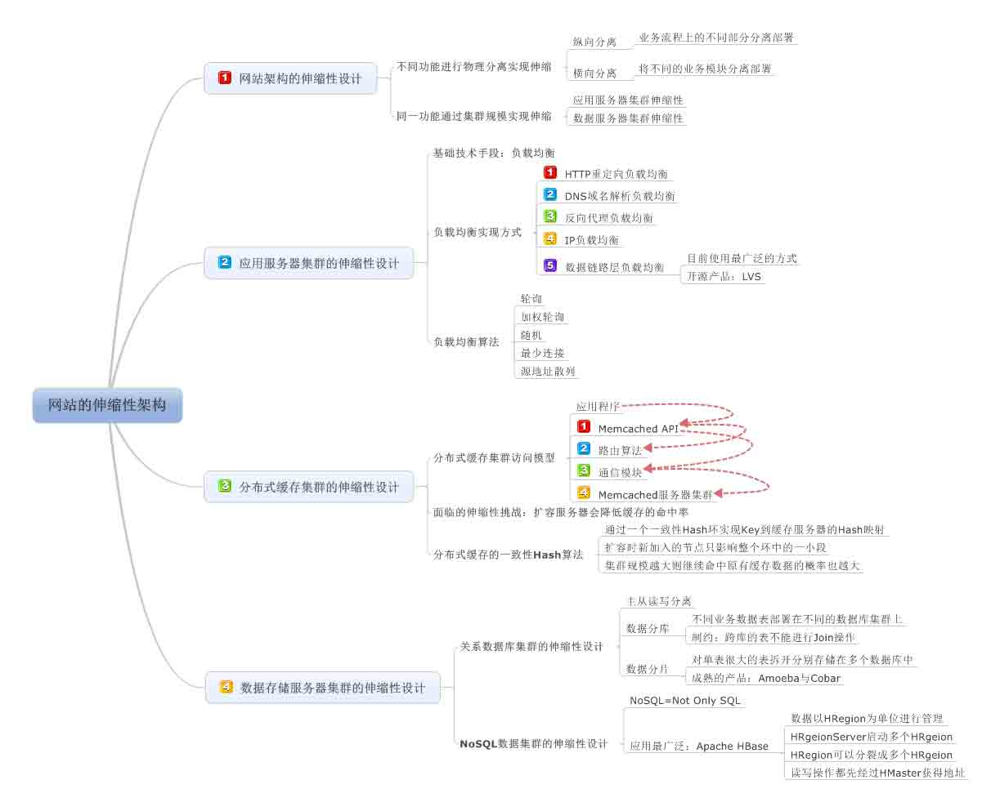

作者：[周旭龙](http://www.cnblogs.com/edisonchou/)

出处：[`www.cnblogs.com/edisonchou/`](http://www.cnblogs.com/edisonchou/)

本文版权归作者和博客园共有，欢迎转载，但未经作者同意必须保留此段声明，且在文章页面明显位置给出原文链接。