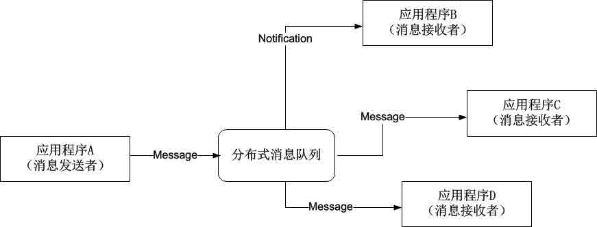
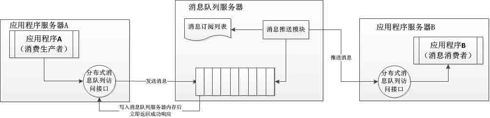
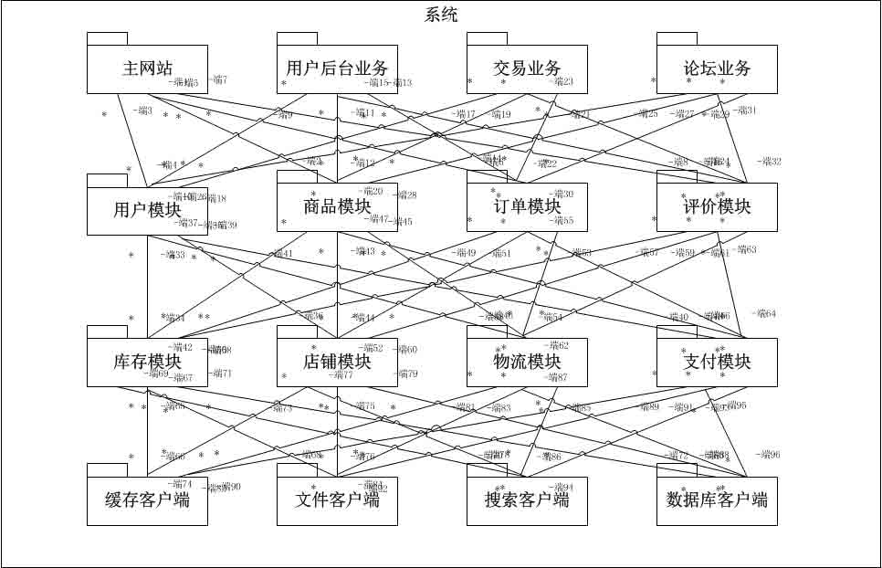
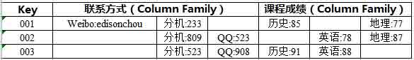
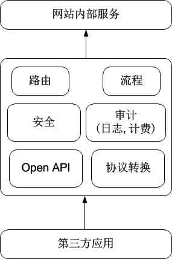
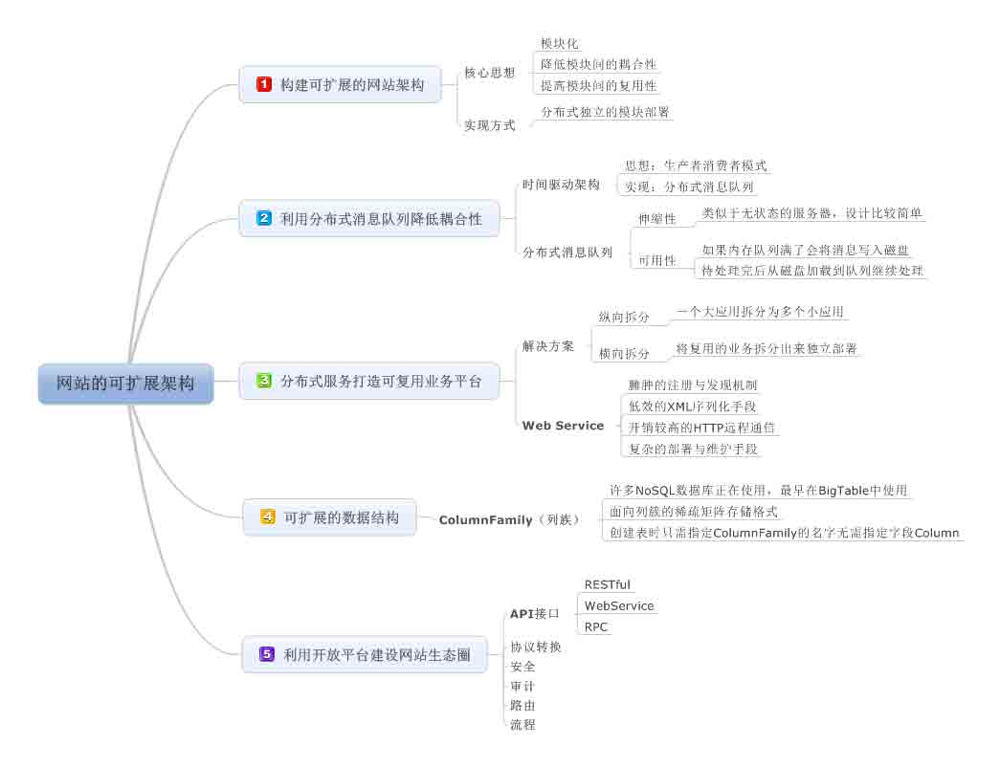

# 《大型网站技术架构》读书笔记之七：随需应变之网站的可扩展架构

> [`www.cnblogs.com/edisonchou/p/3862389.html`](http://www.cnblogs.com/edisonchou/p/3862389.html)

**此篇已收录至[《大型网站技术架构》读书笔记系列目录](http://www.cnblogs.com/edisonchou/p/3773828.html)贴，点击访问该目录可获取更多内容。**

## 一、可伸缩与可扩展—傻傻分不清楚

　　上篇笔记我们学习了可伸缩架构，但在实际场合中，包括许多架构师也常常混淆可伸缩和可扩展，用可扩展表示伸缩性。那么在此，跟随作者我们来理清这两个概念，避免我们以后对其傻傻分不清楚。

　　（1）**扩展性**（**Extensibiltiy**）

　　**指对现有系统影响最小的情况下，系统功能可持续扩展或提升的能力**。我们不禁想到了面向对象中一大原则：开闭原则，对扩展开放，对修改封闭。也就说，当系统新增一个功能时，不需要对现有系统的结构和代码进行修改。

　　（2）**伸缩**性（**Scalability**）

　　**指系统能够通过增加（或减少）自身资源规模的方式增强（或减少）自己计算事务的能力**。在网站架构中，通常是指利用集群的方式增加服务器数量，从而提高系统的整体事务吞吐能力。

　　设计网站可扩展架构的核心思想是：**模块化**，并在此基础之上降低模块间的耦合，提高模块的复用性。在大型网站中，这些模块通过**分布式部署**的方式，独立的模块部署在独立的服务器（集群）上，从物理上分离模块之间的耦合关系，进一步降低耦合性从而提高复用性。

## 二、利用分布式消息队列降低系统耦合性

　　上面我们提到说要分离模块之间的耦合，如果模块之间不存在直接调用，那么新增模块或者修改模块就对其他模块的影响最小，这样系统的可扩展性无疑会更好一些。那么，有没有一种架构是基于如此考虑而设计的呢？于是，我们将眼光转向一个名叫“**事件驱动**”的架构。

## 2.1 事件驱动架构

　　根据事件驱动架构（Event Driven Architecture）的定义：**通过在低耦合的模块之间传输消息，以保持模块的松散耦合，并借助事件消息的通信完成模块间合作**。典型的 EDA 架构就是操作系统中常见的**生产者消费者模式**。在大型网站架构中，具体实现手段有很多，但是最常见的是**分布式消息队列**。

　　如上图所示，消息队列利用发布—订阅模式工作，消息发送者发布消息，一个或多个消息接受者订阅消息。消息发送者是消息源，在对消息进行处理后发送至分布式消息队列，消息接收者从分布式消息队列获取该消息后继续进行处理。可以明显看出，发送者与接受者之间没有直接耦合，消息发送者只需将消息发送给分布式消息队列即操作结束，而消息接受者也只需要从分布式消息队列获取消息后进行处理，不需要知道该消息从何而来。因此，**对于新增业务，只要对该类消息感兴趣，即可订阅该消息，对原有系统和业务没有任何影响，从而实现网站业务的可扩展设计**。

## 2.2 分布式消息队列

　　队列是一种先进先出的数据结构，分布式消息队列则看以看作是**将这种数据结构部署到独立服务器上**，应用程序看以通过远程访问接口使用分布式消息队列，进行消息存取操作，进而实现分布式的异步调用。

　　如上图所示，我们可以明确三个步凑：

　　①消息生产者应用程序通过远程访问接口将消息推送给消息队列服务器，消息队列服务器将消息写入本地内存队列后马上返回成功响应给消息生产者。

　　②消息队列服务器根据消息订阅列表查找订阅该消息的消费者应用程序，将消息队列中的消息按照先进先出的原则将消息通过远程通信接口发送给消费者应用程序；

　　③消费者应用程序接收到推送过来的消息之后进行相关的一系列处理，过程终止；

> **PS：**那么，有没有这样一种情况：**消息队列服务器宕机后导致消息丢失**。事实上，这种情况的确存在于实际的运维过程中。那么，我们如何来避免呢？这时，作者给出了一个方案：如果消息队列服务器宕机造成消息丢失，会将消息成功发送到消息队列的消息存储在消息生产者服务器，**等消息真正被消息消费者服务器处理后才删除消息**。在消息队列服务器宕机后，生产者服务器会选择分布式消息队列服务器集群中其他的服务器发布消息。
> 
> 另外，有关于分布式消息队列的实践可以采用 NoSQL 产品来构建，例如 Redis 就提供了队列数据类型，可以方便地构建分布式消息队列，如果你有兴趣，也可以参阅我的另一篇博文：《[使用 Redis 作为消息队列服务应用场景案例](http://www.cnblogs.com/edisonchou/p/3825682.html)》

## 三、利用分布式服务打造可复用的业务平台　　

　　如果说分布式消息队列通过**消息对象分解**系统耦合性，不同子系统处理同一个消息；那么分布式服务则通过**接口分解**系统耦合性，不同子系统通过相同的接口描述进行服务调用。

## 3.1 巨无霸的应用系统带来的问题

　　网站由小到大的演化过程中，表现为整个网站是由单一系统逐步膨胀发展变化而来的，随着网站功能的日益复杂，网站应用系统会逐渐成为一个巨无霸，如下图所示。可以看出，一个应用中聚合了大量的应用和服务组件，这个巨无霸给整个网站的开发（编译麻烦、代码分支管理困难）、维护（新增业务困难）和部署（部署困难）都带来了巨大的麻烦。

## 3.2 拆分，拆分还是拆分

　　解决方案还是我们多次提到的拆分，将模块独立部署，降低系统耦合性。拆分又分为：横向拆分和纵向拆分。这里我们再次回顾一下这两种方式：

　　（1）纵向拆分：将一个大应用拆分为多个小应用，如果新增的业务较为独立，那么就直接将其设计部署为一个独立的 Web 应用系统；

　　（2）横向拆分：将可以**复用**的业务拆分出来，独立部署为分布式服务，新增业务只需要调用这些分布式服务即可，不需要依赖于具体的模块代码。如果模块内业务逻辑发生变化时，只要接口保持一致就不会影响业务程序和其他模块。

## 四、可扩展的数据结构

　　传统的关系数据库为了保证关系运算（通过 SQL 语句）的正确性，在设计表结构的时候就需要制定表的 Schema—字段名称、数据类型等，还要遵循制定的设计范式（例如：1NF、2NF、3NF 等等）。这些规范带来的一个问题就是**僵硬的数据结构难以面对需求变更带来的挑战**，有些系统设计者通过预先设计一些冗余字段来应付（在我所实习的一年里，我见过很多次这种设计，虽然可以解决问题，但从设计学来说，真的好 Shit），但这显然是一种糟糕的数据库设计。

　　那么，有木有办法能够做到可扩展的数据结构设计呢？是否可以不需要修改表结构就可以新增字段呢？答案是肯定的，目前许多 NoSQL 数据库使用的**ColumnFamily**（**列族**）设计就是一个解决方案。ColumnFamily 最早在 Google 的 BigTable 中使用，这是一种面向列族的稀疏矩阵存储格式。或许这么说大家还是不明白，但可以通过下图来理解：

　　这是一个学生基本信息表，不同学生的联系方式不同，选修的课程也不同，而且在将来会有更多的联系方式和课程加入这张表，如果按照传统的数据库设计，无论提前预设多少冗余字段都不够用，捉襟见肘，疲于应付。而是用 ColumnFamily 结构的 NoSQL 数据库，创建表的时候，**只需要指定 ColumnFamily 的名字，无需指定字段（Column），可以在数据写入时再指定**，通过这种方式，数据表可以包含数百万的字段，**使应用程序的数据结构可以随意扩展**。

## 五、利用开放平台建设网站生态圈

　　网站的价值在于为他的用户创造价值，大型网站为了更好地服务自己的用户，会开发更多的增值服务，会把网站内部的服务封装一些调用接口开放出去，供外部的第三方开发者使用，这个提供开放接口的平台被称作开放平台。第三方开发者利用这些开放的接口开发应用程序（APP）或者网站，为更多的用户提供价值。这样一来，**网站、用户、第三方开发者相互依赖，形成一个网站的生态圈**，即为用户提供更多的价值，也提高了网站和第三方开发者的竞争能力和盈利能力。

　　目前 BAT 等国内互联网巨头都建设有自己的开放平台，力图利用自己庞大的用户群吸引第三方开发者，打造一个更加庞大的航母战斗群，在市场竞争中呼风唤雨，立于不败之地。

## 六、学习小结

　　网站不停上新产品是其生存的本能，谁能更快更好地退出更多的新产品，谁就活得更滋润。马克思的劳动价值理论在 IT 业得到了印证：**产品的内在价值在于劳动的时间，而劳动的时间不在于个体付出的劳动时间，而在于行业一般劳动时间**，资本家只会为行业一般劳动时间买单，如果你的效率低于行业一般时间，对不起，请你资源加班。

　　我又想起我在 CDEIC 实习的这一年里，加了好多个班，现在看来，如果我们当时的系统有一个更具扩展性的系统架构，可以更快速地快发新产品，也许我们就就能够按时下班，有女朋友的多陪陪女朋友吃饭看电影之类的，没女朋友的就去发展发展女朋友之类的（貌似我还单身就是加班加太多了，没时间找女朋友？），或者读读书，听听歌，散散步，对月当歌，诉说人生几何了。

## 本章思维导图

作者：[周旭龙](http://www.cnblogs.com/edisonchou/)

出处：[`www.cnblogs.com/edisonchou/`](http://www.cnblogs.com/edisonchou/)

本文版权归作者和博客园共有，欢迎转载，但未经作者同意必须保留此段声明，且在文章页面明显位置给出原文链接。