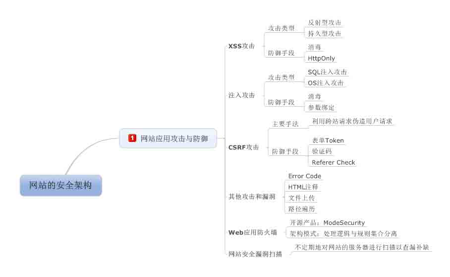
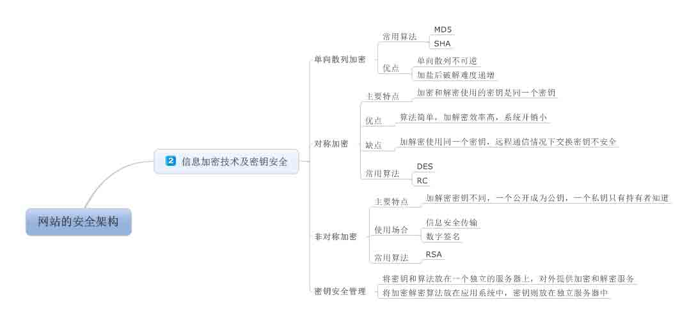
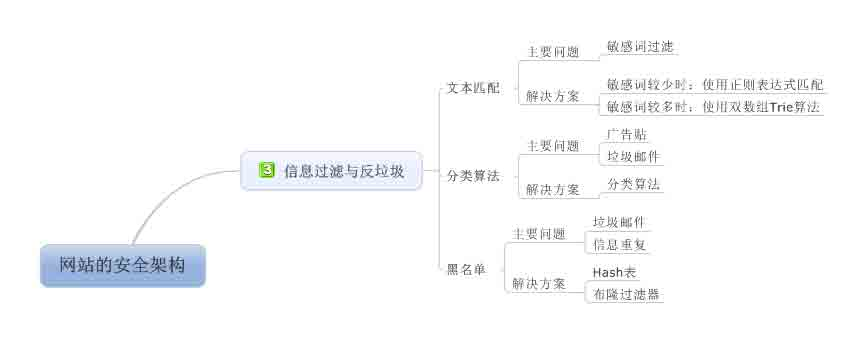
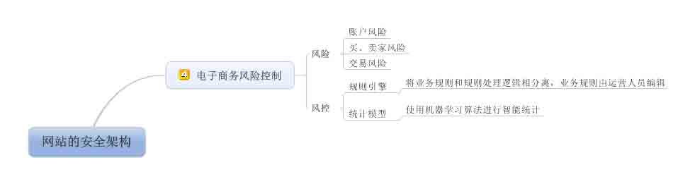

# 《大型网站技术架构》读书笔记之八：固若金汤之网站的安全性架构

> [`www.cnblogs.com/edisonchou/p/3874334.html`](http://www.cnblogs.com/edisonchou/p/3874334.html)

**此篇已收录至[《大型网站技术架构》读书笔记系列目录](http://www.cnblogs.com/edisonchou/p/3773828.html)贴，点击访问该目录可获取更多内容。**

## 一、网站应用攻击与防御

## 二、信息加密技术与密钥安全

## 三、信息过滤与反垃圾

## 四、电子商务风险控制

## 五、学习总结

　　转眼之间，《大型网站技术架构》的读书笔记到此就结束了。最近时间非常紧，因此本篇没有详细对笔记进行介绍（本篇涉及太多内容，而且都是安全相关的）。通过本书的学习，我们从**高性能、高可用、伸缩性、可扩展性、安全性**五个方面的架构学习了每个方面经典的技术方案，虽然以理论偏多，但还是可以从中管中窥豹，一览大型网站技术的面貌。后面，等我找完工作，拿到 offer 后，也许会抽出时间去实践下大型网站所使用的一些技术方案，比如使用 Mono 在 Linux 上部署 ASP.Net MVC 项目，借助 Nginx/Jexus 构建负载均衡服务器，MSSQL 数据库读写分离等，到时也会抽空将所学写成一篇篇博客发到博客园，与各位园友分享。

　　最后，谢谢各位园友的关注，由于本篇我的偷懒导致此篇比较粗糙烂制，因此就不发到博客园首页了影响整体水平了，大家一笑而过吧。

作者：[周旭龙](http://www.cnblogs.com/edisonchou/)

出处：[`www.cnblogs.com/edisonchou/`](http://www.cnblogs.com/edisonchou/)

本文版权归作者和博客园共有，欢迎转载，但未经作者同意必须保留此段声明，且在文章页面明显位置给出原文链接。