# 【大型网站技术实践】初级篇：借助 Nginx 搭建反向代理服务器

> [`www.cnblogs.com/edisonchou/p/4126742.html`](http://www.cnblogs.com/edisonchou/p/4126742.html)

## 一、反向代理：Web 服务器的“经纪人”

## 1.1 反向代理初印象

　　反向代理（Reverse Proxy）方式是指以**代理服务器来**接受 internet 上的连接请求，然后将**请求转发**给内部网络上的服务器，并将从服务器上得到的结果返回给 internet 上请求连接的客户端，此时代理服务器对外就表现为***一个服务器***。

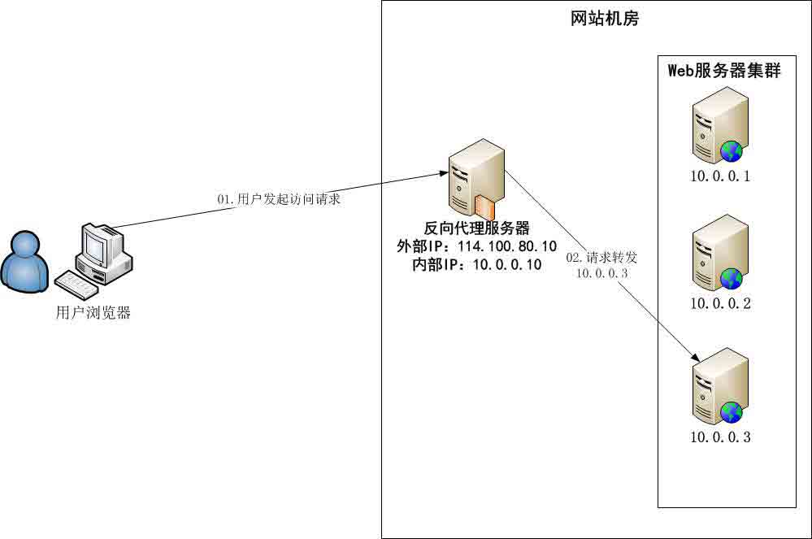

　　从上图可以看出：反向代理服务器位于**网站机房**，代理网站 Web 服务器接收 Http 请求，对请求进行转发。

## 1.2 反向代理的作用

　　①**保护网站安全：**任何来自 Internet 的请求都必须先经过代理服务器；

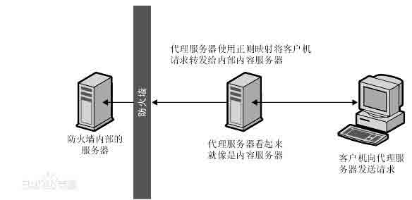

　　②**通过配置缓存功能加速 Web 请求：**可以缓存真实 Web 服务器上的某些静态资源，减轻真实 Web 服务器的负载压力；

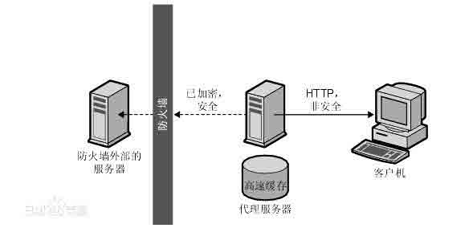

　　③**实现负载均衡：**充当负载均衡服务器均衡地分发请求，平衡集群中各个服务器的负载压力；

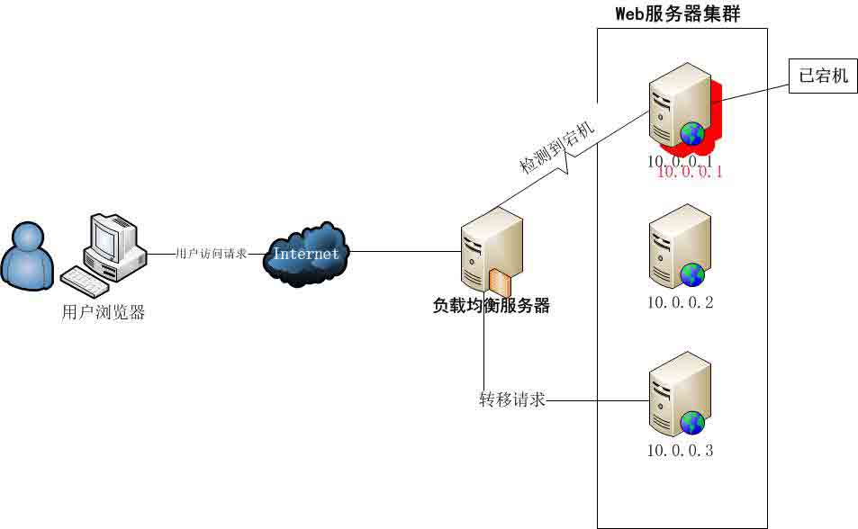

## 二、初识 Nginx：简单却不平凡

## 2.1 Nginx 是神马？


　　Nginx 是一款**轻量级**的网页服务器、反向代理器以及电子邮件代理服务器。其将源代码以类 BSD 许可证的形式发布，因它的稳定性、丰富的功能集、示例配置文件和低系统资源的消耗而闻名。

> **Source：**Nginx（发音同 engine x），它是由俄罗斯程序员**Igor Sysoev**所开发的。起初是供俄国大型的门户网站及搜索引擎**Rambler**（俄语：Рамблер）使用。此软件 BSD-like 协议下发行，可以在 UNIX、GNU/Linux、BSD、Mac OS X、Solaris，以及 Microsoft Windows 等操作系统中运行。

　　说到 Web 服务器，Apache 服务器和 IIS 服务器是两大巨头；但是运行速度更快、更灵活的对手：**Nginx **正在迎头赶上。

## 2.2 Nginx 的应用现状

　　Nginx 已经在俄罗斯最大的门户网站── **Rambler Media**（[www.rambler.ru](http://www.rambler.ru/)）上运行了 3 年时间，同时俄罗斯超过 20%的虚拟主机平台采用 Nginx 作为反向代理服务器。


　　在国内，已经有 淘宝、新浪博客、新浪播客、网易新闻、六间房、56.com、Discuz!、水木社区、豆瓣、YUPOO、海内、迅雷在线 等多家网站使用 Nginx 作为 Web 服务器或反向代理服务器。

## 2.3 Nginx 的核心特点

　　（1）**跨平台：**Nginx 可以在大多数 Unix like OS 编译运行，而且也有 Windows 的移植版本；

　　（2）**配置异常简单：**非常容易上手。配置风格跟程序开发一样，神一般的配置；

　　（3）**非阻塞、高并发连接：**数据复制时，磁盘 I/O 的第一阶段是非阻塞的。官方测试能够支撑**5 万**并发连接，在实际生产环境中跑到**2～3**万并发连接数。（这得益于 Nginx 使用了最新的 epoll 模型）；

> **PS：**对于一个 Web 服务器来说，首先看一个请求的基本过程：建立连接---接收数据---发送数据，在系统底层看来 ：上述过程（建立连接---接收数据---发送数据）在系统底层就是**读写事件**。
> 
> ①如果采用**阻塞调用**的方式，当读写事件没有准备好时，必然不能够进行读写事件，那么久只好等待，等事件准备好了，才能进行读写事件，那么请求就会被耽搁 。
> 
> ②既然没有准备好阻塞调用不行，那么采用**非阻塞调用**方式。非阻塞就是：事件马上返回，告诉你事件还没准备好呢，你慌什么，过会再来吧。好吧，你过一会，再来检查一下事件，直到事件准备好了为止，在这期间，你就可以先去做其它事情，然后再来看看事件好了没。虽然不阻塞了，但你得**不时地过来检查**一下事件的状态，你可以做更多的事情了，但带来的**开销**也是不小的。

　　（4）**事件驱动：**通信机制采用**epoll**模型，支持更大的并发连接。

> ①非阻塞通过不断检查事件的状态来判断是否进行读写操作，这样带来的开销很大，因此就有了**异步非阻塞的事件处理机制**。这种机制让你可以同时监控多个事件，调用他们是阻塞的，但可以设置超时时间，在超时时间之内，如果有事件准备好了，就返回。这种机制解决了上面阻塞调用与非阻塞调用的两个问题。
> 
> ②以**epoll 模型**为例：当事件没有准备好时，就放入 epoll(队列)里面。如果有事件准备好了，那么就去处理；如果事件返回的是 EAGAIN，那么继续将其放入 epoll 里面。从而，只要有事件准备好了，我们就去处理它，只有当所有事件都没有准备好时，才在 epoll 里面等着。这样，我们就可以并发处理大量的并发了，当然，这里的并发请求，是指未处理完的请求，线程只有一个，所以同时能处理的请求当然只有一个了，只是在请求间进行不断地切换而已，切换也是因为异步事件未准备好，而主动让出的。这里的切换是没有任何代价，你可以理解为循环处理多个准备好的事件，事实上就是这样的。
> 
> ③与多线程方式相比，这种事件处理方式是有很大的优势的，**不需要创建线程**，每个请求占用的内存也很少，**没有上下文切换**，事件处理非常的轻量级，并发数再多也不会导致无谓的资源浪费（上下文切换）。对于 IIS 服务器，每个请求会独占一个工作线程，当并发数上到几千时，就同时有几千的线程在处理请求了。这对操作系统来说，是个不小的挑战：因为线程带来的内存占用非常大，线程的上下文切换带来的 cpu 开销很大，自然性能就上不去，从而导致在高并发场景下性能下降严重。
> 
> **总结：*通过异步非阻塞的事件处理机制，Nginx 实现由进程循环处理多个准备好的事件，从而实现高并发和轻量级***。

　　（5）**Master/Worker 结构**：一个 master 进程，生成一个或多个 worker 进程。

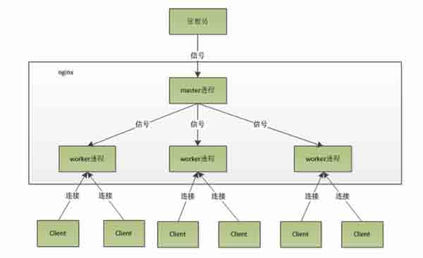

> **PS：**Master-Worker 设计模式核心思想是**将原来串行的逻辑并行化**，并将逻辑拆分成很多独立模块并行执行。其中主要包含两个主要组件 Master 和 Worker，Master 主要将逻辑进行拆分，拆分为互相独立的部分，同时维护了 Worker 队列，将每个独立部分下发到多个 Worker 并行执行，Worker 主要进行实际逻辑计算，并将结果返回给 Master。
> 
> **问：**nginx 采用这种进程模型有什么好处？
> 
> **答：**采用独立的进程，可以让互相之间不会影响，一个进程退出后，其它进程还在工作，服务不会中断，Master 进程则很快重新启动新的 Worker 进程。当然，Worker 进程的异常退出，肯定是程序有 bug 了，异常退出，会导致当前 Worker 上的所有请求失败，不过不会影响到所有请求，所以降低了风险。

　　（6）**内存消耗小：**处理大并发的请求内存消耗非常小。在 3 万并发连接下，开启的 10 个 Nginx 进程才消耗 150M 内存（15M*10=150M）。

　　（7）**内置的健康检查功能：**如果 Nginx 代理的后端的某台 Web 服务器宕机了，不会影响前端访问。

　　（8）**节省带宽：**支持 GZIP 压缩，可以添加浏览器本地缓存的 Header 头。

　　（9）**稳定性高：**用于反向代理，宕机的概率微乎其微。

## 三、构建实战：Nginx+IIS 构筑 Web 服务器集群的负载均衡

　　这里我们主要在 Windows 环境下，通过将同一个 Web 网站部署到不同服务器的 IIS 上，再通过一个统一的 Nginx 反响代理服务器对外提供统一访问接入，实现一个最简化的反向代理和负载均衡服务。但是，**受限于实验条件**，我们这里主要在一台计算机上进行反向代理、IIS 集群的模拟，具体的实验环境如下图所示：我们将 nginx 服务和 web 网站都部署在一台计算机上，nginx 监听 http80 端口，而 web 网站分别以不同的端口号（这里是 8050 及 8060）部署在同一个 IIS 服务器上，用户访问 localhost 时，nginx 作为反向代理将请求均衡地转发给两个 IIS 中不同端口的 Web 应用程序进行处理。虽然实验环境很简单而且有限，但是对于一个简单的负载均衡效果而言，本文是可以达到并且展示的。

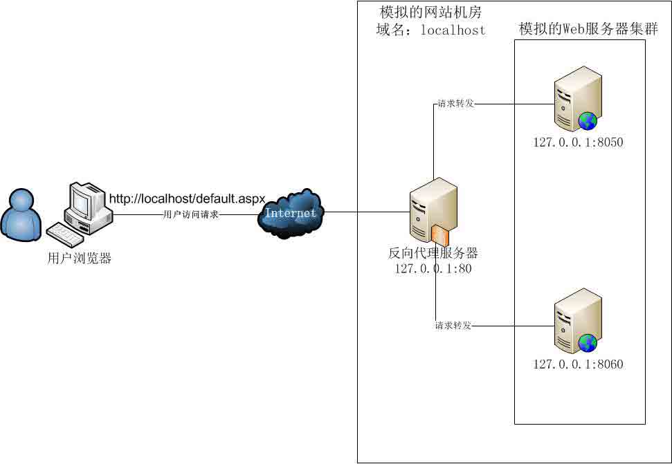

## 3.1 准备一个 ASP.NET 网站部署到 IIS 服务器集群中

　　（1）在 VS 中新建一个 ASP.NET Web 应用程序，但是为了在一台计算机上展示效果，我们将这个 Web 程序复制一份，并修改两个 Web 程序的 Default.aspx，让其的首页显示不同的一点信息。这里 Web1 展示的是“The First Web：”，而 Web2 展示的则是“The Second Web”。


　　（2）调试运行，看看两个网站的效果如何？

　　①Web1 的展示效果：

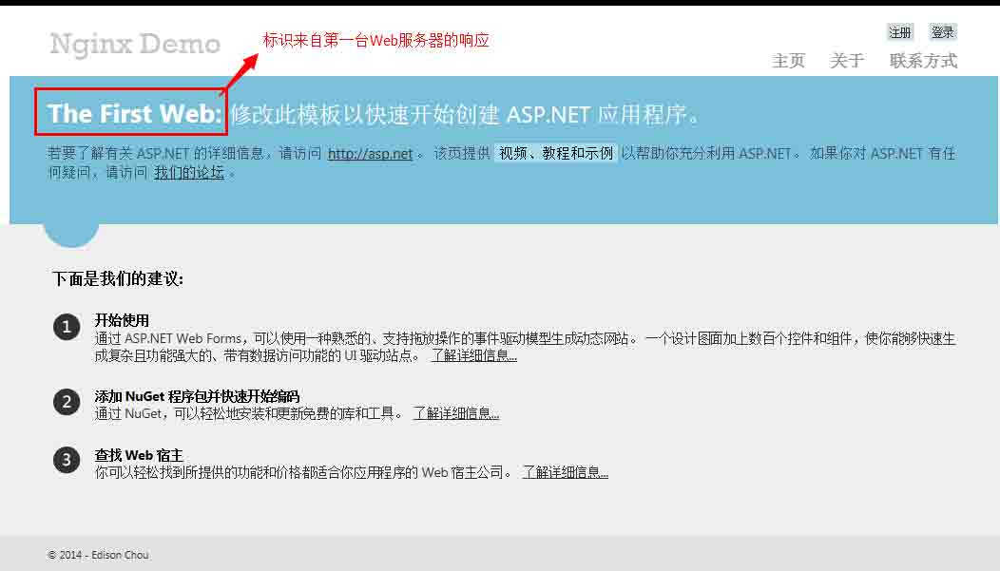

　　②Web2 的展示效果：

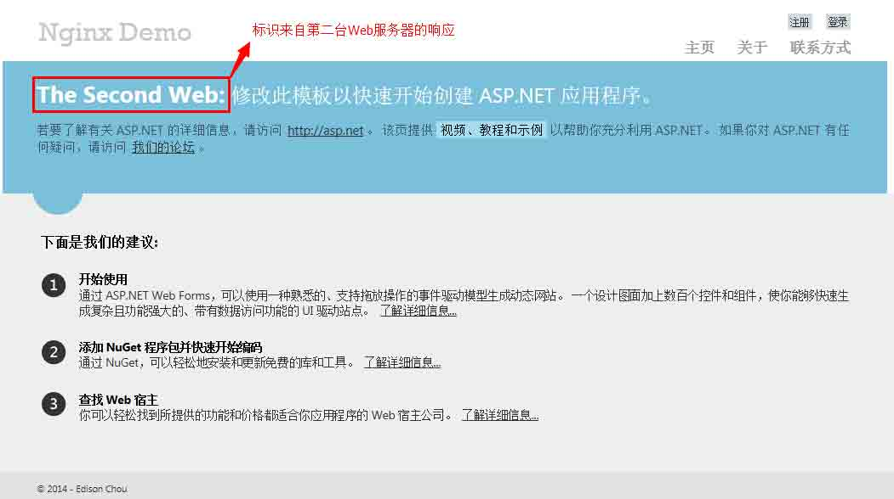

　　③部署到 IIS 中，分配不同的端口号：这里我选择了 Web1:8050，Web2:8060

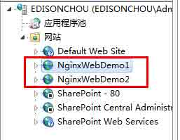

　　（3）**总结：*在真实环境中，构建 Web 应用服务器集群的实现是将同一个 Web 应用程序部署到 Web 服务器集群中的多个 Web 服务器上***。

## 3.2 下载 Nginx 并部署到服务器中作为自启动的 Windows 服务

　　（1）到 Nginx 官网下载 Nginx 的 Windows 版本：[`nginx.org/en/download.html`](http://nginx.org/en/download.html)（这里我们使用 nginx/Windows-1.4.7 版本进行实验，本文底部有下载地址）

　　（2）解压到磁盘任意目录，例如这里我解压到了：D:\Servers\nginx-1.4.7

　　（3）启动、停止和重新加载服务：通过 cmd 以守护进程方式启动 nginx.exe：**start nginx.exe**，停止服务：**nginx -s stop**，重新加载配置：**nginx -s  reload**；


　　（4）每次以 cmd 方式启动 Nginx 服务不符合实际要求，于是我们想到将其注册为 Windows 服务，并设置为自动启动模式。这里，我们使用一个不错的小程序：“Windows Service Wrapper”，将 nginx.exe 注册为 Windows 服务，具体的步凑如下：

　　①下载最新版的 Windows Service Wrapper 程序，比如我下载的名称是 "winsw-1.8-bin.exe"（本文底部有下载地址），然后把它命名成你想要的名字（比如: "nginx-service.exe"，当然，你也可以不改名）

　　②将重命名后的 nginx-service.exe 复制到 nginx 的安装目录（比如，我这里是 "D:\Servers\nginx-1.4.7"）

　　③在同一个目录下创建一个 Windows Service Wrapper 的 XML 配置文件，名称必须与第一步重命名时使用的名称一致（比如我这里是 "nginx-service.xml",  如果，你没有重命名，则应该是 "winsw-1.8-bin.xml"），这个 XML 的内容如下：

```
<?xml version="1.0" encoding="UTF-8" ?>
<service>
<id>nginx</id>
<name>Nginx Service</name>
<description>High Performance Nginx Service</description>
<executable>D:\Servers\nginx-1.4.7\nginx.exe</executable>
<logpath>D:\Servers\nginx-1.4.7\</logpath>
<logmode>roll</logmode>
<depend></depend>
<startargument>-p D:\Servers\nginx-1.4.7</startargument>
<stopargument>-p D:\Servers\nginx-1.4.7 -s stop</stopargument>
</service>
```

　　④在命令行下执行以下命令，以便将其注册成 Windows 服务：**nginx-service.exe install**

****

　　⑤接下来就可以在 Windows 服务列表看到 Nginx 服务了，这里我们可以将其设置为自动启动了：

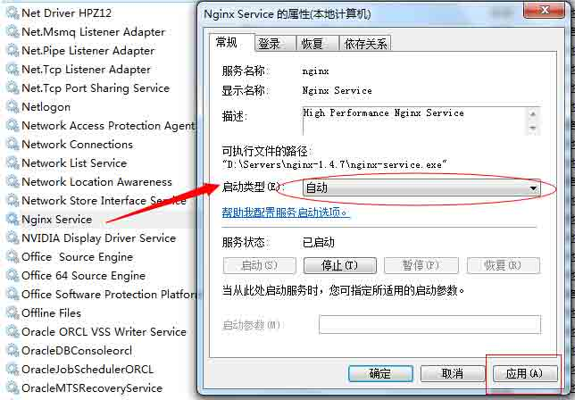

　　（5）**总结：*在 Windows 环境中，要对外提供的 Windows 服务一般都要将其启动类型设置为自动***。

## 3.3 修改 Nginx 核心配置文件 nginx.conf

　　（1）进程数与每个进程的最大连接数：

　　　　•nginx 进程数，建议设置为等于 CPU 总核心数　　　　　　　　•单个进程最大连接数，那么该服务器的最大连接数=连接数*进程数

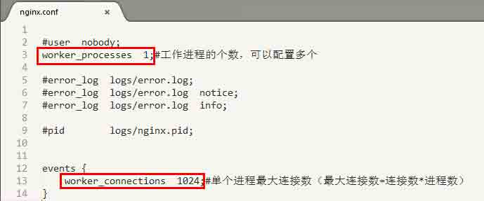

　　（2）Nginx 的基本配置：

　　　　•监听端口一般都为 http 端口：80;　　　　•域名可以有多个，用空格隔开：例如 server_name www.ha97.com ha97.com;

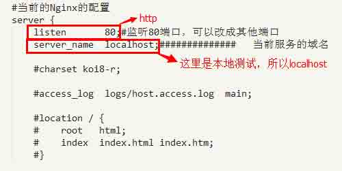

　　（3）负载均衡列表基本配置：

　　　　•location / {}：对 aspx 后缀的进行负载均衡请求，假如我们要对所有的 aspx 后缀的文件进行负载均衡时，可以这样写：location ~ .*\.aspx$ {}

　　　　•proxy_pass：请求转向自定义的服务器列表，这里我们将请求都转向标识为 http://cuitccol.com 的负载均衡服务器列表；

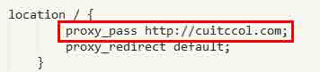

　　　　•在负载均衡服务器列表的配置中，weight 是权重，可以根据机器配置定义权重（如果某台服务器的硬件配置十分好，可以处理更多的请求，那么可以为其设置一个比较高的 weight；而有一台的服务器的硬件配置比较差，那么可以将前一台的 weight 配置为 weight=2，后一台差的配置为 weight=1）。weigth 参数表示权值，权值越高被分配到的几率越大；

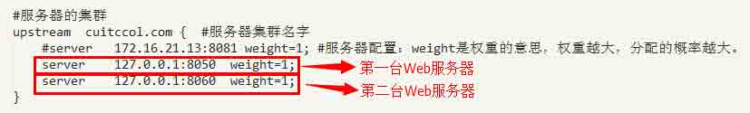

　　（4）**总结：*最基本的 Nginx 配置差不多就是上面这些内容，当然仅仅是最基础的配置**。***（详细的配置内容请下载底部的 nginx-1.4.7 详细查看）

## 3.4 添加 Nginx 对于静态文件的缓存配置

　　为了提高响应速度，减轻真实服务器的负载，对于静态资源我们可以在反向代理服务器中进行缓存，这也是反向代理服务器的一个重要的作用。

　　（1）缓存静态资源之图片文件

　　root /nginx-1.4.7/staticresources/image：对于配置中提到的 jpg/png 等文件均定为到/nginx-1.4.7/staticresources/image 文件夹中进行寻找匹配并将文件返回；

　　expires 7d：过期时效为 7 天，静态文件不怎么更新，过期时效可以设大一点，如果频繁更新，则可以设置得小一点；

　　TIPS：下面的样式、脚本缓存配置同这里一样，只是定位的文件夹不一样而已，不再赘述。

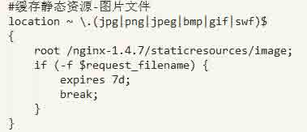

　　（2）缓存静态资源之样式文件

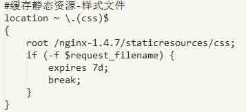

　　（3）缓存静态资源之脚本文件

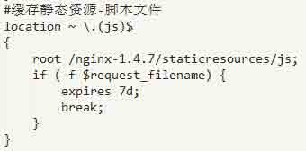

　　（4）在 nginx 服务文件夹中创建静态资源文件夹，并要缓存的静态文件拷贝进去：这里我主要将 Web 程序中用到的 image、css 以及 js 文件拷贝了进去；

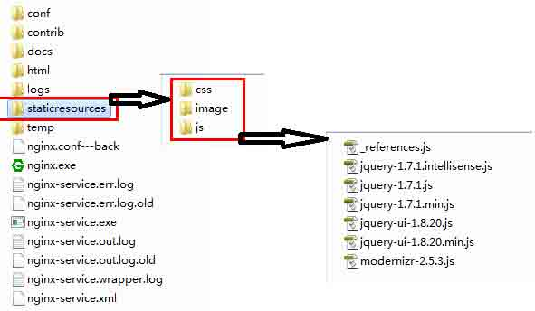

　　（5）**总结：*通过配置静态文件的缓存设置，对于这些静态文件的请求可以直接从反向代理服务器中直接返回，而无需再将这些静态资源请求转发到具体的 Web 服务器进行处理了，可以提高响应速度，减轻真实 Web 服务器的负载压力***。

## 3.5 简单测试 Nginx 反向代理实现负载均衡效果

　　（1）第一次访问 http://localhost/Default.aspx 时从 127.0.0.1:8050 处理响应返回结果

　　（2）第二次访问 http://localhost/Default.aspx 时从 127.0.0.1:8060 处理响应返回结果

　　（3）多次访问 http://localhost/Default.aspx 时的截屏：


## 学习小结

　　在本文中，借助了 Nginx 这个神器简单地在 Windows 环境下搭建了一个反向代理服务，并模拟了一个 IIS 服务器集群的负载均衡效果。从这个 DEMO 中，我们可以简单地感受到反向代理为我们所做的事情，并体会负载均衡是怎么一回事。但是，在目前大多数的应用中，都会将 Nginx 部署在 Linux 服务器中，并且会做一些针对负载均衡的优化配置，这里我们所做的仅仅就是一个小小的使用而已（just 修改一下配置文件）。不过，万丈高楼平地起，前期的小小体会，也会帮助我们向后期的深入学习奠定一点点的基础。

　　突然在 QQ 空间里看到了朋友送的礼物，猛然发现今天居然是我的阳历生日，好吧，我祝我自己生日快乐，希望自己在未来的日子中能够做更多的实践，分享更多的内容。当然，如果你觉得本文还可以，那也麻烦点个赞，不要吝啬你的鼠标左键哟。

## 参考资料

（1）丁胖胖，《图解正向代理、反向代理与透明代理》：[`z00w00.blog.51cto.com/515114/1031287`](http://z00w00.blog.51cto.com/515114/1031287)

（2）特种兵-AK47，《正向代理与反向代理的区别》：[`blog.csdn.net/m13666368773/article/details/8060481`](http://blog.csdn.net/m13666368773/article/details/8060481)

（3）百度百科，Nginx：[`baike.baidu.com/view/926025.htm?fr=aladdin`](http://baike.baidu.com/view/926025.htm?fr=aladdin)

（4）51CTO，《Nginx 安装配置与服务搭建专题》：[`os.51cto.com/art/201111/304611.htm`](http://os.51cto.com/art/201111/304611.htm)

（5）红黑联盟，《Nginx 配置文件 nginx.conf 中文详解总结》：[`www.2cto.com/os/201212/176520.html`](http://www.2cto.com/os/201212/176520.html)

（6）360doc，《Linux 下同步模式、异步模式、阻塞调用与非阻塞调用总结》：[`www.360doc.com/content/13/0117/12/5073814_260691714.shtml`](http://www.360doc.com/content/13/0117/12/5073814_260691714.shtml) （**好文一篇，值得阅读**）

（7）e 路相扶，《同步、异步、阻塞与非阻塞》：[`www.cnblogs.com/zhangjun516/archive/2013/04/17/3025902.html`](http://www.cnblogs.com/zhangjun516/archive/2013/04/17/3025902.html)

（8）feitianxuxue，《处理大并发之对异步非阻塞的理解》：[`blog.csdn.net/feitianxuxue/article/details/8936802`](http://blog.csdn.net/feitianxuxue/article/details/8936802)

## 附件下载

（1）nginx-1.4.7：[`pan.baidu.com/s/1dD2C2zB`](http://pan.baidu.com/s/1dD2C2zB)

（2）winsw-1.8-bin.exe：[`pan.baidu.com/s/1kTihzk7`](http://pan.baidu.com/s/1kTihzk7)

（3）SimpleNginxDemo：[`pan.baidu.com/s/1bnq5oYz`](http://pan.baidu.com/s/1bnq5oYz)

作者：[周旭龙](http://www.cnblogs.com/edisonchou/)

出处：[`edisonchou.cnblogs.com/`](http://www.cnblogs.com/edisonchou/)

本文版权归作者和博客园共有，欢迎转载，但未经作者同意必须保留此段声明，且在文章页面明显位置给出原文链接。