# 【大型网站技术实践】初级篇：搭建 MySQL 主从复制经典架构

> [`www.cnblogs.com/edisonchou/p/4133148.html`](http://www.cnblogs.com/edisonchou/p/4133148.html)

## 一、业务发展驱动数据发展

　　随着网站业务的不断发展，用户量的不断增加，数据量成倍地增长，数据库的访问量也呈线性地增长。特别是在用户访问高峰期间，并发访问量突然增大，数据库的负载压力也会增大，如果架构方案不够健壮，那么数据库服务器很有可能在高并发访问负载压力下宕机，造成数据访问服务的失效，从而导致网站的业务中断，给公司和用户造成双重损失。那么，有木有一种方案能够解决此问题，使得数据库不再因为负载压力过高而成为网站的瓶颈呢？答案肯定是有的。

　　目前，大部分的主流关系型数据库都提供了主从热备功能，通过配置两台（或多台）数据库的主从关系，可以将一台数据库服务器的数据更新同步到另一台服务器上。网站可以利用数据库的这一功能，**实现数据库的读写分离，从而改善数据库的负载压力**。

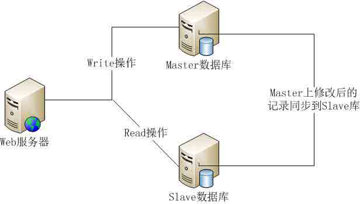

　　利用数据库的读写分离，Web 服务器在写数据的时候，访问主数据库（Master），主数据库通过**主从复制机制**将数据更新同步到从数据库（Slave），这样当 Web 服务器读数据的时候，就可以通过从数据库获得数据。这一方案使得在大量读操作的 Web 应用可以轻松地读取数据，而主数据库也只会承受少量的写入操作，还可以实现数据热备份，可谓是***一举两得***的方案。

## 二、MySQL 数据复制原理

　　刚刚我们了解了关系型数据库的读写分离能够实现数据库的主从架构，那么主从架构中最重要的数据复制又是怎么一回事呢？MySQL 作为最流行的关系型数据库之一，通过了解 MySQL 的数据复制流程，会使得我们对主从复制的认知会有一定的帮助。

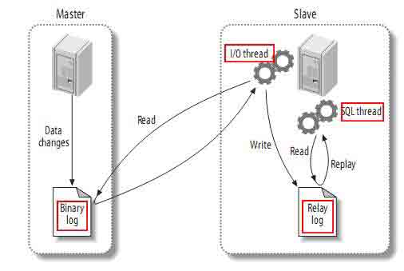

　　从上图来看，整体上有如下三个步凑：

　　（1）Master 将改变记录到二进制日志(binary log)中（这些记录叫做二进制日志事件，binary log events）；

　　（2）Slave 将 Master 的二进制日志事件(binary log events)拷贝到它的中继日志(relay log)；

> **PS：**从图中可以看出，Slave 服务器中有一个 I/O 线程(I/O Thread)在不停地监听 Master 的二进制日志(Binary Log)是否有更新：如果没有它会睡眠等待 Master 产生新的日志事件；如果有新的日志事件(Log Events)，则会将其拷贝至 Slave 服务器中的中继日志(Relay Log)。

　　（3）Slave 重做中继日志(Relay Log)中的事件，将 Master 上的改变反映到它自己的数据库中。

> **PS：**从图中可以看出，Slave 服务器中有一个 SQL 线程(SQL Thread)从中继日志读取事件，并重做其中的事件从而更新 Slave 的数据，使其与 Master 中的数据一致。只要该线程与 I/O 线程保持一致，中继日志通常会位于 OS 的缓存中，所以中继日志的开销很小。

## 三、MySQL 主从复制实战

## 3.1 实验环境总览与准备工作

　　（1）实验环境

　　①服务器环境：本次我们主要借助 VMware Workstation 搭建一个三台 Windows Server 2003 组成的 MySQL 服务器集群，其中一台作为 Master 服务器（IP：192.168.80.10），其余两台均作为 Slave 服务器（IP：192.168.80.11,192.168.80.12）。

　　②客户机环境：本次我们在 Windows 7 宿主机（IP：192.168.80.1）编写一个 C#控制台程序，对 MySQL 服务器进行基本的 CRUD 访问测试。

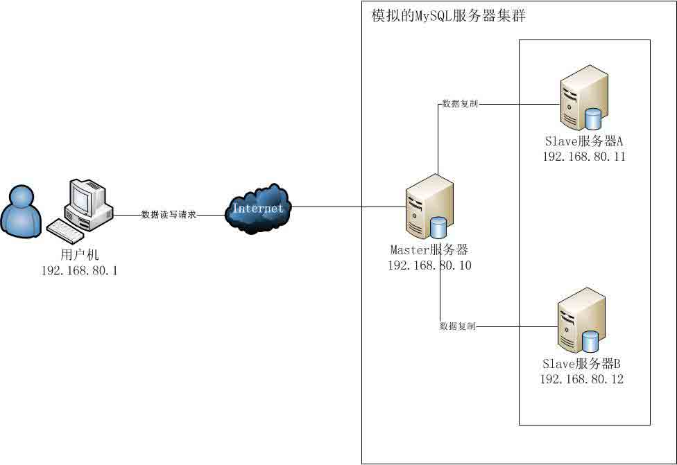

　　（2）准备工作

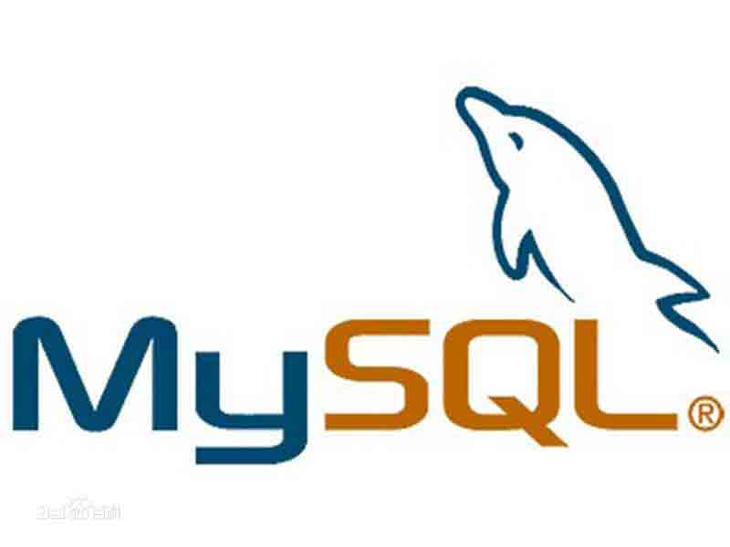

　　　　下载 MySQL 文件：[`dev.mysql.com/downloads/mysql/5.5.html#downloads`](http://dev.mysql.com/downloads/mysql/5.5.html#downloads)

　　　　这里我们选择 5.5 版本，为了节省时间，直接选择了 Archive 免安装版本。又由于虚拟机中的 Windows Server 2003 是 32 位，所以选择了 32-bit 的 Archive 版本进行使用。

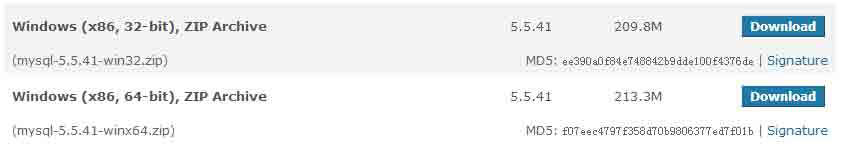

　　　　下载完成后，将三个压缩包分别拷贝至 Master（IP：192.168.80.10）、Slave1（IP：192.168.80.11）及 Slave2（IP：192.168.80.12）中。

## 3.2 配置 MySQL 主服务器

　　（1）将 MySQL 文件拷贝到 Master 服务器，并解压到一个指定文件夹。这里我放在了：C:\MySQLServer\mysql-5.5.40-win32

　　（2）新建一个配置文件，取名为：my-master.ini，添加以下内容：

```
 1 [client]
 2 port=3306
 3 default-character-set=utf8
 4 
 5 [mysqld]
 6 port=3306
 7 
 8 #character_set_server=utf8 一定要这样写;
 9 character_set_server=utf8 10 
11 #解压目录 12 basedir=C:\MySQLServer\mysql-5.5.40-win32 13 
14 #解压目录下 data 目录,必须为 data 目录 15 datadir=C:\MySQLServer\mysql-5.5.40-win32\data 16 
17 #sql_mode=NO_ENGINE_SUBSTITUTION,STRICT_TRANS_TABLES 这个有问题，在创建完新用户登录时报错 18 sql_mode=NO_AUTO_CREATE_USER,NO_ENGINE_SUBSTITUTION 19 
20 #主服务器的配置 21 #01.开启二进制日志 22 log-bin=master-bin 23 #02.使用二进制日志的索引文件 24 log-bin-index=master.bin.index 25 #03.为服务器添加唯一的编号 26 server-id=1
```

　　（3）将 my-master.ini 传送到 Master 服务器中 mysql 所在的文件夹中，并在命令行中将其注册为 Windows 服务：（这里要转到 mysql 的 bin 文件夹中进行操作，因为没有设置环境变量）

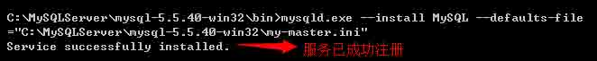

　　（4）启动 mysql 服务，并设为自启动类型；

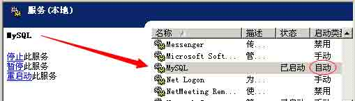

　　（5）使用 root 账号登陆 mysql，创建一个具有**复制权限**的用户；（此时 root 是没有密码的，直接回车即可）

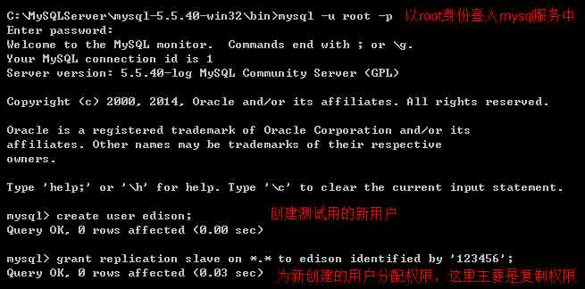

　　（6）在 Slave1 或 Slave2 上通过远程登录 Master 上的 mysql 测试新建用户是否可以登录；

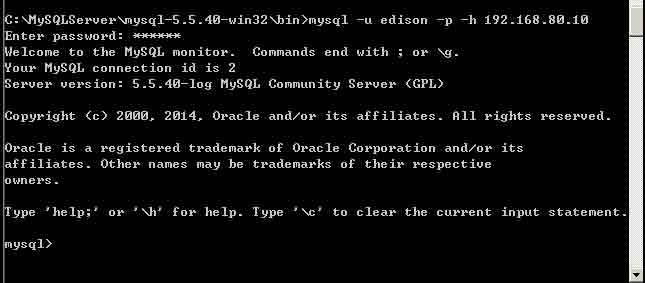

## 3.3 配置 MySQL 从服务器

　　（1）同 Master 服务器，将 MySQL 文件拷贝解压到指定文件夹下；

　　（2）新建一个配置文件，取名为：my-slave.ini，添加以下内容：

```
[client] port=3306 default-character-set=utf8 [mysqld] port=3306 #character_set_server=utf8 一定要这样写; character_set_server=utf8

#解压目录
basedir=C:\MySQLServer\mysql-5.5.40-win32

#解压目录下 data 目录,必须为 data 目录
datadir=C:\MySQLServer\mysql-5.5.40-win32\data

#sql_mode=NO_ENGINE_SUBSTITUTION,STRICT_TRANS_TABLES 这个有问题，在创建完新用户登录时报错
sql_mode=NO_AUTO_CREATE_USER,NO_ENGINE_SUBSTITUTION

#从服务器的配置
#01.为服务器添加唯一的编号
server-id=2 #02.开启中继日志
relay-log=slave-relay-log-bin
#03.使用中继日志的索引文件
relay-log-index=slave-relay-log-bin.index
```

> **PS：**这里 server-id 要确保唯一，我们这里 Master（192.168.80.10）的 server-id=1，那么 Slave1（192.168.80.11）就设置其 server-id=2，Slave2（192.168.80.12）则设置其 server-id=3。

　　（3）将 my-slave.ini 传送到 Slave1 和 Slave2 服务器中 mysql 所在的文件夹中，并在命令行中将其注册为 Windows 服务：（这里要转到 mysql 的 bin 文件夹中进行操作，因为没有设置环境变量）

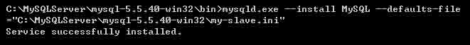

　　（4）分别启动两台 Slave 的 mysql 服务，步凑同 master 所述；当然，也可以在 cmd 中输入命令：net start MySQL


　　（5）分别使用两台 Slave 的 root 账号登陆 mysql，通过指定的语句配置主从关系设置；

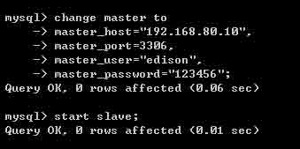

　　（6） 为了方便后面的测试，这里我们在 Master 上通过 root 进入 mysql，创建一个测试用的数据库和数据表；


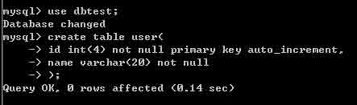

　　（7）还要创建一个用户，这个用户具有对所有数据库的增删查改的权限，以便用来进行测试；

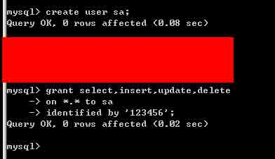

## 3.4 编写 C#程序测试主从复制结构

　　（1）下载 mysql for .net 开发包，添加对 mysql.data.dll 的引用

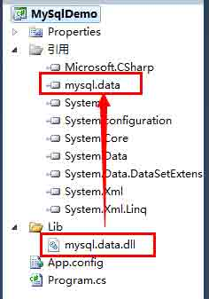

　　（2）在控制台程序中写代码访问 Master 服务器，并查看程序运行结果；

　　①数据库连接部分：

```
<?xml version="1.0" encoding="utf-8" ?>
<configuration>
    <connectionStrings>
        <add name="mysqlmaster" connectionString="server=192.168.80.10;database=dbtest;uid=sa;password=123456"/>
    </connectionStrings>
</configuration>
```

　　②程序代码部分：在程序中首先显示 user 表内容（这时表是空的），然后会添加 5 条 user 信息，其中会修改第 3 条 user 信息的 name 为 Edison Chou，最后会删除第 5 条 user 信息；

```
        static void Main(string[] args)
        { string connStr = ConfigurationManager.ConnectionStrings["mysqlmaster"]
                .ConnectionString; // 01.Query
 ShowUserData(connStr); // 02.Add a user to table
            for (int i = 0; i < 5; i++)
            {
                AddUserData(connStr, "TestUser" + (i + 1).ToString());
            }
            ShowUserData(connStr); // 03.Update a user on table
            UpdateUserData(connStr, 3, "EdisonChou");
            ShowUserData(connStr); // 04.Delete a user from table
            DeleteUserData(connStr, 5);
            ShowUserData(connStr);

            Console.ReadKey();
        } #region 01.Func:ShowUserData
        private static void ShowUserData(string connStr)
        { using (MySqlConnection con = new MySqlConnection(connStr))
            {
                con.Open(); using (MySqlCommand cmd = con.CreateCommand())
                {
                    cmd.CommandText = "select * from user"; using (MySqlDataReader reader = cmd.ExecuteReader())
                    { if (reader.HasRows)
                        {
                            Console.WriteLine("------------table:user------------"); while (reader.Read())
                            {
                                Console.WriteLine(reader[0] + "-" + reader[1]);
                            }
                            Console.WriteLine("------------table:user------------");
                        }
                    }
                }
            }
        } #endregion

        #region 02.Func:AddUserData
        private static void AddUserData(string connStr, string userName)
        { using (MySqlConnection con = new MySqlConnection(connStr))
            {
                con.Open(); using (MySqlCommand cmd = con.CreateCommand())
                {
                    cmd.CommandText = "insert into user(name) values('" + userName + "')"; int result = cmd.ExecuteNonQuery(); if (result > 0)
                    {
                        Console.WriteLine("Add User Successfully.");
                    }
                }
            }
        } #endregion

        #region 03.Func:UpdateUserData
        private static void UpdateUserData(string connStr, int userId, string userName)
        { using (MySqlConnection con = new MySqlConnection(connStr))
            {
                con.Open(); using (MySqlCommand cmd = con.CreateCommand())
                {
                    cmd.CommandText = "update user set name='" + userName + "' where id=" + userId; int result = cmd.ExecuteNonQuery(); if (result > 0)
                    {
                        Console.WriteLine("Update User Successfully.");
                    }
                }
            }
        } #endregion

        #region 04.Func:DeleteUserData
        private static void DeleteUserData(string connStr, int userId)
        { using (MySqlConnection con = new MySqlConnection(connStr))
            {
                con.Open(); using (MySqlCommand cmd = con.CreateCommand())
                {
                    cmd.CommandText = "delete from user where id=" + userId; int result = cmd.ExecuteNonQuery(); if (result > 0)
                    {
                        Console.WriteLine("Delete User Successfully.");
                    }
                }
            }
        } #endregion
```

　　③程序运行结果：

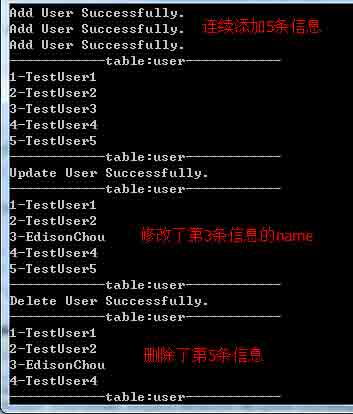

　　（3）在 Slave1（192.168.80.11）和 Slave2（192.168.80.12）上查看 user 表是否自动进行了数据同步；

　　①首先在 Master 上查看 user 表还剩哪些信息？

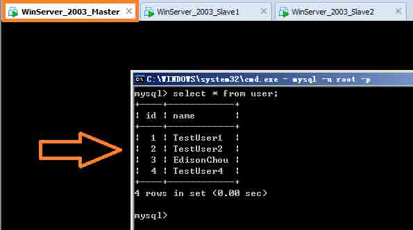

　　②其次在 Slave1 上查看 user 表是否进行了同步：

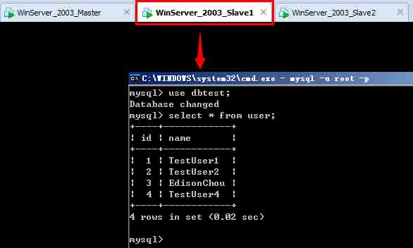

　　③最后在 Slave2 上查看 user 表是否进行了同步：

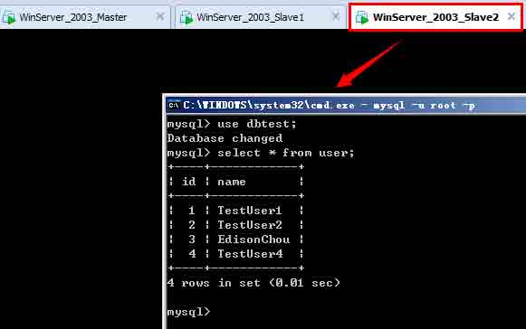

　　（4）初步尝试读写分离：**一主一从**模式的一个最简单的实现方式

　　①在 Slave1 上新建一个只具有读（select）权限的用户，这里取名为 reader：

　　　　create user reader;

　　　　grant select on *.* to reader identified by '123456';

　　②新增一个 mysqlslave 的数据库连接字符串：

```
    <connectionStrings>
        <add name="mysqlmaster" connectionString="server=192.168.80.10;database=dbtest;uid=sa;password=123456"/>
        <add name="mysqlslave" connectionString="server=192.168.80.11;database=dbtest;uid=reader;password=123456"/>
    </connectionStrings>
```

　　③新增一个枚举 DbCommandType 来记录读操作和写操作：

```
    public enum DbCommandType
    {
        Read,
        Write
    }
```

　　④修改读取数据表的代码判断是读操作还是写操作：

```
     private static void ShowUserData(DbCommandType commandType)
        { string connStr = null; if (commandType == DbCommandType.Write)
            {
                connStr = ConfigurationManager.ConnectionStrings["mysqlmaster"]
                    .ConnectionString;
            } else {
                connStr = ConfigurationManager.ConnectionStrings["mysqlslave"]
                    .ConnectionString;
            } using (MySqlConnection con = new MySqlConnection(connStr))
            {
                con.Open(); using (MySqlCommand cmd = con.CreateCommand())
                {
                    cmd.CommandText = "select * from user"; using (MySqlDataReader reader = cmd.ExecuteReader())
                    { if (reader.HasRows)
                        {
                            Console.WriteLine("------------table:user------------"); while (reader.Read())
                            {
                                Console.WriteLine(reader[0] + "-" + reader[1]);
                            }
                            Console.WriteLine("------------table:user------------");
                        }
                    }
                }
            }
        }
```

> **PS：**关于 MySQL 的读写分离实现，主要有以下几种方式：
> 
> 一种是基于 MySQL-Proxy 做调度服务器模式，另一种是借助阿里巴巴开源项目**Amoeba**(变形虫)项目实现（这种方式貌似用的比较多），另外呢就是自己写一个类似于哈希算法的程序库来选择目标数据库；

## 学习小结

　　此次我们主要简单地学习了主从复制的一些相关概念，了解了 MySQL 在 Windows 下搭建主从复制架构的过程，最后通过改变程序方式使得一主一从模式下实现读写分离（虽然是很简单很粗陋的实现）。后续有空时，我会尝试在 Linux 下借助阿里巴巴开源项目 Amoeba 搭建真正的 MySQL 读写分离模式，到时也会将搭建的过程分享出来。虽然，我没有相关的真实实践经验，也有很多人跟我说“你这是在纸上谈兵”，我也知道“纸上得来终觉浅，绝知此事要躬行”，但在没毕业之前，我还是会做一些相关的初步了解性质的实践学习，也许以后到了公司，就会有真正的战场在等着我了。当然，如果你觉得我写这篇博客花了点心思，那就麻烦点个赞，谢谢啦！

## 参考资料

　　（1）李智慧，《大型网站技术架构-核心原理与案例分析》：[`item.jd.com/11322972.html`](http://item.jd.com/11322972.html)

　　（2）guisu，《高性能 Mysql 主从架构的复制原理及配置详解》：[`blog.csdn.net/hguisu/article/details/7325124`](http://blog.csdn.net/hguisu/article/details/7325124)

　　（3）Ghost，《高性能的 MySQL 主从复制架构》：[`www.uml.org.cn/sjjm/201211061.asp`](http://www.uml.org.cn/sjjm/201211061.asp)

　　（4）飞鸿无痕，《Amoeba 搞定 MySQL 读写分离》：[`blog.chinaunix.net/uid-20639775-id-154600.html`](http://blog.chinaunix.net/uid-20639775-id-154600.html) （**此文讲解了如何借助 Amoeba 构建 MySQL 主从复制读写分离，值得阅读**）

## 附件下载

　　（1）mysql-5.5.40（Archive 版本）：[`pan.baidu.com/s/1c0u6X80`](http://pan.baidu.com/s/1c0u6X80)

　　（2）相关配置文件（master 与 slave）：[`pan.baidu.com/s/1dDENI73`](http://pan.baidu.com/s/1dDENI73)

　　（3）C#测试程序 DEMO：[`pan.baidu.com/s/1kT42gAz`](http://pan.baidu.com/s/1kT42gAz)

作者：[周旭龙](http://www.cnblogs.com/edisonchou/)

出处：[`edisonchou.cnblogs.com`](http://edisonchou.cnblogs.com)

本文版权归作者和博客园共有，欢迎转载，但未经作者同意必须保留此段声明，且在文章页面明显位置给出原文链接。