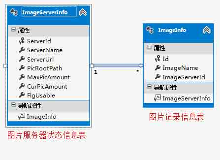
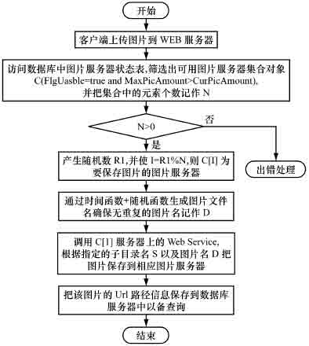
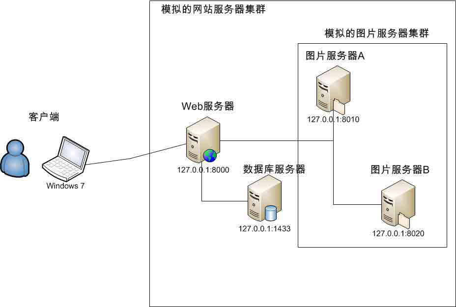

# 【大型网站技术实践】初级篇：海量图片的分布式存储设计与实现

> [`www.cnblogs.com/edisonchou/p/4137134.html`](http://www.cnblogs.com/edisonchou/p/4137134.html)

**说明：本文是我阅读计算机工程期刊《海量图片的分布式存储及负载均衡研究》一文的学习笔记和具体实践，原文地址在本文底部。**

## 一、研究背景：性能与资金，二者可兼得乎？

## 1.1 那么问题来了？

　　随着互联网的发展，许多大中型的网站都保存了大量的图片资源，用户在访问这些图片资源异常丰富的网站（如淘宝、京东等电子商务网站）时，网页中的图片信息占据了页面数据流量的很大部分，那么问题也来了：

　　（1）由于**受客户端浏览器限制**，无法从一台服务器上同时下载页面中所有图片信息；

> **PS：**当一个网页被浏览时，Web 服务器与浏览器建立连接，每个连接表示一个并发。当页面包含多个图片时，Web 服务器与浏览器会产生多个连接,同时发送文字和图片以提高浏览速度。因此，页面中图片越多 Web 服务器受到的压力也就越大。同时由于受到浏览器本身的并发连接数限制(**2 个～6 个并发**)，意味着页面上有多于并发连接数限制的图片时，也不能并行地把所有图片同时下载和显示。

　　（2）由于图片保存在物理服务器上，访问图片需要频繁进行**I/O 操作**：因此当并发用户数越来越多时，I/O 操作就会成为整个系统的**性能瓶颈**；

　　（3）由于受操作系统的限制,一个**目录**中能存放的图片文件数量也是**有限**的：随着图片资源不断增加，如何有效管理和维护图片也是一个难题；

## 1.2 山东济南找蓝翔？

　　（1）对于少数大型网站系统，由于自身具有雄厚的资金和人力资源，可采用 NFS、CDN、Lighttpd、反向代理、负载均衡等技术提高用户访问速度；但是，这些技术需要庞大的资金来支持。

　　（2）对于多数中小型网站系统，有木有一种方案适用于中等规模商务网站的海量图片数据分布式动态存储及负载均衡的解决方案？该方案可否只需增加很少的硬件成本，即可提升网站的访问速度，并且可以根据需要动态调整图片服务器的数量及图片的存储目录，确保系统具有可扩展性和伸缩性。

> **SUMMARY：**需求永远是那么美好，使用最少的 money 干尽量多的事情！正在我们决定放弃开发岗位去蓝翔学挖掘机技术的时候，我们突然发现有那么多的技术先驱已经给我们指明了道路。

## 二、架构设计：构建图片服务器集群

　　对于小型网站，由于数据规模小，可以把网站所有页面和图片统一存放在一个主目录下，这样的网站对系统架构、性能要求都很简单。但大中型网站都保存有海量级的图片文件，所采用的技术更是涉及广泛，从硬件到软件、编程语言、数据库、Web 服务器、防火墙等各个领域都有较高要求。因此，有必要**设立单独的图片服务器**来专门存放图片，把图片数据的流量从 Web 服务器上分离开，这样的架构可以**有效缓解 Web 服务器的 I/O 性能瓶颈**，提升用户的访问速度。

## 2.1 系统设计目标　　

　　基于以上的考虑，我们希望的设计目标是：

　　（1）图片能进行**分布式存储**；　

　　（2）图片服务器能实现**负载均衡**；　　

　　（3）能根据用户访问量及网站图片数据量的增加能**动态添加图片服务器节点**；

　　（4）图片服务器节点的动态调整对网站用户而言是透明的，并且**不会中断系统的正常运行**；

　　其中，（1）和（2）是针对系统的高可用和伸缩性，而（3）和（4）则是针对系统的高可用和可扩展而言的。

## 2.2 系统架构设计


　　系统整体架构如上图所示：包括客户端、Web 服务器、数据库服务器、图片服务器集群 4 个部分。

　　（1）Web 服务器部署网站的 Web 页面，用于响应客户端用户的请求。当用户浏览网页时，Web 服务器响应请求并访问数据库服务器，获得网页中所有图片的 URL 路径，然后生成页面并返回给客户端；

　　（2）客户端接收该页面并根据页面中的图片 URL 路径自动从不同的图片服务器下载并显示相应图片。

（3）数据库服务器用于记录所有图片的编号以及图片的存放位置等信息，同时需要记录所有图片服务器的配置及当前状态信息。

　　（4）图片服务器集群用于存放网站的所有图片信息，该集群的服务器数量可以根据需要动态增加或删减。

## 三、系统实现：一种简单且价廉可用的方案

## 3.1 数据库设计与实现：两张简单的表

　　Web 服务器需要及时掌握所有图片服务器的状态和信息才能动态决定把图片保存到哪一台图片服务器。因此，需要把所有的图片服务器的状态信息全部纪录到数据库服务器中，记录图片服务器信息和状态的表格式如下图所示：可以清楚地看出，图片服务器信息表中记录了图片服务器的 ID、名称、URL、最大存储数量、当前已存数量以及服务器的状态（True：可用，False：不可用），每个图片服务器下会有多个图片信息记录，因此它们是一对多的关系。



　　（1）图片服务器状态信息表建表语句：

```
CREATE TABLE [dbo].ImageServerInfo NOT NULL, [ServerName] nvarchar NOT NULL, [ServerUrl] nvarchar NOT NULL, [PicRootPath] nvarchar NOT NULL, [MaxPicAmount] [int] NOT NULL, [CurPicAmount] [int] NOT NULL, [FlgUsable] [bit] NOT NULL, CONSTRAINT [PK_ImageServerInfo] PRIMARY KEY CLUSTERED ( [ServerId] ASC )WITH (PAD_INDEX  = OFF, STATISTICS_NORECOMPUTE  = OFF, IGNORE_DUP_KEY = OFF, ALLOW_ROW_LOCKS  = ON, ALLOW_PAGE_LOCKS  = ON) ON [PRIMARY] ) ON [PRIMARY]
```

　　（2）图片记录信息表建表语句：

```
CREATE TABLE [dbo].ImageInfo NOT NULL, [ImageName] nvarchar NOT NULL, [ImageServerId] [int] NOT NULL, CONSTRAINT [PK_ImageInfo] PRIMARY KEY CLUSTERED ( [Id] ASC )WITH (PAD_INDEX  = OFF, STATISTICS_NORECOMPUTE  = OFF, IGNORE_DUP_KEY = OFF, ALLOW_ROW_LOCKS  = ON, ALLOW_PAGE_LOCKS  = ON) ON [PRIMARY] ) ON [PRIMARY]

GO

ALTER TABLE [dbo].[ImageInfo]  WITH CHECK ADD  CONSTRAINT [FK_ImageInfo_ImageServerInfo] FOREIGN KEY([ImageServerId]) REFERENCES [dbo].[ImageServerInfo] ([ServerId]) GO

ALTER TABLE [dbo].[ImageInfo] CHECK CONSTRAINT [FK_ImageInfo_ImageServerInfo]
GO
```

## 3.2 文件上传与浏览系统实现：一个 ASP.Net MVC 应用程序

　　这里我们使用一个 ASP.NET MVC 应用程序部署在 Web 服务器上，这个应用程序作为 Web 网站向客户提供上传和浏览的服务。因此，它最重要的功能就是：

　　**一、**接收用户上传的文件，并转交给图片服务器的相关处理程序进行处理和保存；



　　**二、**取得所有图片服务器中保存的有效图片路径，返回给客户端浏览器，再由客户端浏览器对图片路径向图片服务器集群进行请求；


### 　　3.2.1 设计 Controller

```
    public class HomeController : Controller
    {
        IImageServerInfoRepsitory _imageServerInfoRepository; public HomeController()
        { // 这里可以借助 IoC 实现依赖注入
        this._imageServerInfoRepository = new ImageServerInfoRepository();
        } #region 01.Action：上传页面
      //
        // GET: /Home/
        public ActionResult Index()
        { return View();
        } #endregion

        #region 02.Action：上传图片
      public ActionResult Upload()
        {
            HttpPostedFileBase file = Request.Files["fileUpload"]; if (file.ContentLength == 0)
            { return Content("<script type=\"text/javascript\">alert(\"您还未选择要上传的图片！\");location.href=\"/Home/Index\";</script>");
            } // 获取上传的图片名称和扩展名称
        string fileFullName = Path.GetFileName(file.FileName); string fileExtName = Path.GetExtension(fileFullName); if (!CommonHelper.CheckImageFormat(fileExtName))
            { return Content("<script type=\"text/javascript\">alert(\"上传图片格式错误，请重新选择！\");location.href=\"/Home/Index\";</script>");
            } // 获取可用的图片服务器集合
        List<ImageServerInfo> serverList = this._imageServerInfoRepository
                .GetAllUseableServers(); if(serverList.Count == 0)
            { return Content("<script type=\"text/javascript\">alert(\"暂时没有可用的图片服务器，请稍后再上传！\");location.href=\"/Home/Index\";</script>");
            } // 获取要保存的图片服务器索引号
        int serverIndex = CommonHelper.GetServerIndex(serverList.Count); // 获取指定图片服务器的信息
        string serverUrl = serverList[serverIndex].ServerUrl; int serverID = serverList[serverIndex].ServerId; string serverFullUrl = string.Format("http://{0}/FileUploadHandler.ashx?serverId={1}&ext={2}",
            serverUrl, serverID, fileExtName); // 借助 WebClient 上传图片到指定服务器
        WebClient client = new WebClient();
            client.UploadData(serverFullUrl, CommonHelper.StearmToBytes(file.InputStream)); return Content("<script type=\"text/javascript\">alert(\"上传图片操作成功！\");location.href=\"/Home/Index\";</script>");
        } #endregion

        #region 03.Action：显示图片
      public ActionResult Show()
        { var imageServerList = this._imageServerInfoRepository.GetAllUseableServers();
            ViewData["ImageServers"] = imageServerList; return View();
        } #endregion }
```

　　（1）图片上传的过程比较复杂，首先 Web 服务器接收客户端的访问请求并访问数据库，在 Web 端需要取得所有可用的图片服务器的集合，这里使用到了一个 GetAllUseableServers 方法，它的实现如下：可以看出，我们需要判断 FlgUsable 标志为 true 以及 CurPicAmount 当前存储量小于 MaxPicAmount 最大存储量这两个条件。如果有宕机或不可用的情况，需要管理员将那一行的 FlgUsable 设置为 false。

```
        public List<ImageServerInfo> GetAllUseableServers()
        {
            List<ImageServerInfo> serverList = db.ImageServerInfo
                .Where<ImageServerInfo>(s => s.FlgUsable == true
                    && s.CurPicAmount < s.MaxPicAmount)
                .ToList(); return serverList;
        }
```

　　（2）这里用到了一个 GetServerIndex 的方法，它的实现如下：从图片服务器状态信息表筛选出可用的图片服务器集合记作 C，并获取集合的总记录数 N。然后用随机函数产生一个随机数 R1，用 R1 与 N 进行取余运算记作**I=R1%N**。则 C[I]即为要保存图片的图片服务器。这个方法基本保证了我们的图片服务器的负载是一个比较均衡的比例。（当然，我们可以设计一个更加高效的，类似于一致性哈希算法的哈希函数）

```
        #region 01.获取服务器索引号
        /// <summary>
        /// 01.获取服务器索引号 /// </summary>
        /// <param name="serverCount">服务器数量</param>
        /// <returns>索引号</returns>
        public static int GetServerIndex(int serverCount)
        {
            Random rand = new Random(); int randomNumber = rand.Next(); int serverIndex = randomNumber % serverCount; return serverIndex;
        } #endregion
```

　　（3）最后，Web 端程序借助了 WebClient 将服务器 ID、文件扩展名以及图片的字节流转交给了具体的图片服务器处理程序：Web 端程序的工作就到此结束，但是这里木有采用异步，因此需要等待图片服务器的工作结束。

```
　　WebClient client = new WebClient();
　　client.UploadData(serverFullUrl, CommonHelper.StearmToBytes(file.InputStream));
```

> **PS：**由于 B/S 架构本身技术限制，图片无法通过 Web 服务器直接上传到不同的图片服务器中。因此，这里需要借助类似于 WebClient、HttpWebRequest 等类向具体的图片服务器发送 Http 请求，或者是通过在图片服务器上部署 Web Service，以便 Web 服务器通过调用该服务执行图片的保存操作。

### 　　3.2.2 设计 View

　　（1）上传页面：

```
@{
    Layout = null;
} <!DOCTYPE html>

<html>
<head>
    <meta name="viewport" content="width=device-width" />
    <title>Index</title>
    <link href="~/Resources/css/mystyle.css" rel="stylesheet" />
    <script src="~/Resources/js/jquery-1.8.0.min.js"></script>
    <script type="text/javascript"> $(function () {
            $("#btnUpload").click(function () {
                $("#loading").show();
            });
        }); </script>
</head>
<body>
    <div id="mainarea">
        <fieldset>
            <legend id="title">图片上传系统</legend>
            <form method="post" action="/Home/Upload" enctype="multipart/form-data">
                <table>
                    <tr>
                        <td>
                            <input id="fileSelect" type="file" name="fileUpload" /></td>
                        <td>
                            <input id="btnUpload" type="submit" value="上传图片" /></td>
                    </tr>
                    <tr>
                        <td id="tiparea" colspan="2">
                            <div id="loading">
                                 正在上传中，请稍候... </div>
                        </td>
                    </tr>
                </table>
            </form>
        </fieldset>
        <p id="footer">Copyright &copy; 2014 Edison Chou</p>
    </div>
</body>
</html>
```

　　在 form 标签中不要忘了：enctype="multipart/form-data"

　　（2）浏览页面：

```
@{
    Layout = null;
}
@using MyImageDFS.Model; <!DOCTYPE html>

<html>
<head>
    <meta name="viewport" content="width=device-width" />
    <title>Show</title>
    <link href="~/Resources/css/mystyle.css" rel="stylesheet" />
    <script src="~/Resources/js/jquery-1.8.0.min.js"></script>
</head>
<body>
    <div id="mainarea">
        <fieldset>
            <legend id="title">图片浏览系统</legend>
            <table id="imageTable" cellspacing="1" cellpadding="1"> @foreach (ImageServerInfo server in (List<ImageServerInfo>)ViewData["ImageServers"])
                {
                    foreach (ImageInfo image in server.ImageInfo)
                    { <tr>
                        <td>
                            
                        </td>
                    </tr> }
                } </table>
        </fieldset>
    </div>
</body>
</html>
```

　　这里主要通过**对不同的图片服务器发送请求**获取图片，从而降低 Web 服务器的 I/O 性能瓶颈，加快整个系统的响应时间。

## 3.3 图片服务器文件接收系统实现：一个 ASP.Net 一般处理程序

```
        /// <summary>
        /// 接收 Web 服务器传递过来的文件信息并保存到指定目录文件下，最后将文件信息存入数据库中 /// </summary>
        /// <param name="context"></param>
        public void ProcessRequest(HttpContext context)
        {
            context.Response.ContentType = "text/plain"; // 接收文件的扩展名
            string fileExt = context.Request["ext"]; if (string.IsNullOrEmpty(fileExt) || 
                string.IsNullOrEmpty(context.Request["serverId"]))
            { return;
            } // 图片所在的服务器的编号
            int serverID = Convert.ToInt32(context.Request["serverId"]); // 图片要存放的物理路径
            string imageDir = "/Upload/" + DateTime.Now.Year + "/" + DateTime.Now.Month + "/" + DateTime.Now.Day + "/"; string serverPath = Path.GetDirectoryName(context.Request.MapPath(imageDir)); if(!Directory.Exists(serverPath))
            { // 如果目录不存在则新建目录
 Directory.CreateDirectory(serverPath);
            } // 取得 GUID 值作为图片名
            string newFileName = Guid.NewGuid().ToString(); // 取得完整的存储路径
            string fullSaveDir = imageDir + newFileName + fileExt; using (FileStream fileStream = File.OpenWrite(context.Request.MapPath(fullSaveDir)))
            { // 将文件数据写到磁盘上
 context.Request.InputStream.CopyTo(fileStream); // 将文件信息存入数据库
                ImageInfo imageInfo = new ImageInfo();
                imageInfo.ImageName = fullSaveDir; // 存储图片真实路径
                imageInfo.ImageServerId = serverID; // 存储服务器编号

                this._imageFacadeRepository.Add(imageInfo);
            }
        }
```

　　（1）这是一个简单的一般处理程序，它首先接收要保存的图片扩展名以及服务器 ID，根据规则生成具体的保存路径，然后通过 I/O 流将图片保存到该服务器的磁盘上；

　　（2）最后将更改数据库信息记录，由于要同时对两张表进行修改，这里我们需要对这个方法进行一个简单的封装，使之成为一个事务。现在我们来看看这个 Add 方法的实现：

```
        public ImageStatusEnum Add(ImageInfo imageEntity)
        { // 首先是图片信息表
 db.ImageInfo.Add(imageEntity); // 其次是图片服务器信息表
            ImageServerInfo serverEntity = db.ImageServerInfo.FirstOrDefault(
                s => s.ServerId == imageEntity.ImageServerId); if (serverEntity != null)
            { // 当前服务器存储数量+1
                serverEntity.CurPicAmount += 1;
            } // 一起提交到 SQL Server 数据库中
            int result = db.SaveChanges(); if (result > 0)
            { return ImageStatusEnum.Successful;
            } else { return ImageStatusEnum.Failure;
            }
        }
```

## 3.4 简单测试图片文件的上传与浏览

　　（1）测试前的准备工作

　　①由于我的电脑不支持 64 位的虚拟机，因此原本打算在 VMware 中部署三台 Windows Server 2008 R2 作为 Web 服务器和图片服务器的打算被撤销（**没法*任性*地做实践，我很不开心啊**）。于是，我采用了在一台电脑上部署多个应用，用端口号区分不同的服务程序来模拟效果。


　　②将 Web 应用程序和图片服务应用程序分别编译发布，并部署到 IIS 中，分配不同的端口号：图片上传与浏览程序 8000 端口，图片服务器的文件处理程序分别占用 8010 与 8020 端口；



　　（2）测试图片文件上传与存储


　　由于连续截屏所生成的 gif 图片太大，因此这里只选择了截取其中一次上传的过程作为展示。在我连续上传操作了 N 次之后，现在我们来看看两个文件服务器所在的文件夹中是否有我们上传的图片文件（这里主要是看部署的程序所在的文件目录，其中有一个专门保存图片的文件目录 Upload）

　　①图片服务器 A 所保存的文件：


　　②图片服务器 B 所保存的文件：


　　**总结：**从图中可以看出，我们一共上传了 13 张图片，其中图片服务器 A 保存了 6 张，图片服务器 B 保存了 7 张，两个服务器的负载并没有出现一头小一头大，而是一个相对比较均衡的数量，这得益于我们的随机函数。

　　（3）测试图片文件浏览请求

　　①是否显示了图片列表：


　　②是否从不同图片服务器获取：


　　**总结：设立单独的图片服务器来专门存放图片后，把图片数据的流量从 Web 服务器上分离开，这样可以缓解 Web 服务器的 I/O 性能瓶颈，提高响应速度。**

　　（4）在原文的性能测试中，在局域网环境下对采用图片服务器和不采用图片服务器 2 种情况进行了性能测试：测试数据有 300 万张图片均匀分布在 3 台图片服务器上，每台图片服务器建立 1 000 个子目录。在 5 台客户端上同时运行压力测试软件，分别模拟 200 个～1 000 个并发用户的请求。其测试结果如下图所示：


　　从图中可以看出，采用 3 台普通 PC 机作为图片服务器后，整个系统的响应时间大大减少，性能得到明显提升，而且并发访问量越大，性能的提升越明显，而对于整个系统而言增加的硬件成本却很有限。

## 参考资料

　　 朱晓辉、王杰华、石振国、陈苏蓉，《海量图片的分布式存储及负载均衡研究》：[`www.cqvip.com/QK/71135X/201107/36101649.html`](http://www.cqvip.com/QK/71135X/201107/36101649.html)

## 附件下载

　　（1）数据库：[MyImageServer.mdf](http://pan.baidu.com/s/1nt81Pqx)

　　（2）程序代码：[MyImageDFS](http://pan.baidu.com/s/1o65Iaym)

作者：[周旭龙](http://www.cnblogs.com/edisonchou/)

出处：[`edisonchou.cnblogs.com`](http://edisonchou.cnblogs.com)

本文版权归作者和博客园共有，欢迎转载，但未经作者同意必须保留此段声明，且在文章页面明显位置给出原文链接。