# 【大型网站技术实践】初级篇：借助 LVS+Keepalived 实现负载均衡

> [`www.cnblogs.com/edisonchou/p/4281978.html`](http://www.cnblogs.com/edisonchou/p/4281978.html)

## 一、负载均衡：必不可少的基础手段

## 1.1 找更多的牛来拉车吧

　　当前大多数的互联网系统都使用了服务器集群技术，集群即**将相同服务部署在多台服务器上构成一个集群整体对外提供服务**，这些集群可以是 Web 应用服务器集群，也可以是数据库服务器集群，还可以是分布式缓存服务器集群等等。


> 古人有云：**当一头牛拉不动车的时候，不要去寻找一头更强壮的牛，而是用两头牛来拉车**。

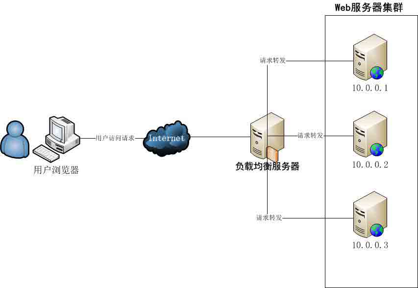

　　在实际应用中，在 Web 服务器集群之前总会有一台负载均衡服务器，负载均衡设备的任务就是作为 Web 服务器流量的入口，挑选最合适的一台 Web 服务器，将客户端的请求转发给它处理，实现客户端到真实服务端的透明转发。最近几年很火的「云计算」以及分布式架构，本质上也是将后端服务器作为计算资源、存储资源，由某台管理服务器封装成一个服务对外提供，客户端不需要关心真正提供服务的是哪台机器，在它看来，就好像它面对的是一台拥有近乎无限能力的服务器，而本质上，真正提供服务的，是后端的集群。

## 1.2 负载均衡的类型

　　负载均衡可以采用硬件设备（例如常常听见的 F5），也可以采用软件负载。

　　商用硬件负载设备成本通常较高（一台几十万上百万很正常），所以在条件允许的情况下我们会采用软件负载；

　　软件负载解决的两个核心问题是：选谁、转发，其中最著名的是**LVS**（Linux Virtual Server）。

> **传送门->**关于负载均衡的实现方式类型等介绍请浏览我的另一篇博文：[《大型网站技术架构》读书笔记之六：永无止境之网站的伸缩性架构](http://www.cnblogs.com/edisonchou/p/3851333.html "another blog")

## 二、初识 LVS：Linux Virtual Server

## 2.1 LVS 是神马东西

　　LVS 是 Linux Virtual Server 的简称，也就是 Linux 虚拟服务器, 是一个由章文嵩博士发起的自由软件项目，它的官方站点是[www.linuxvirtualserver.org](http://www.linuxvirtualserver.org/)。现在 LVS 已经是 Linux 标准内核的一部分，在 Linux2.4 内核以前，使用 LVS 时必须要重新编译内核以支持 LVS 功能模块，但是从 Linux2.4 内核以后，已经完全内置了 LVS 的各个功能模块，无需给内核打任何补丁，可以直接使用 LVS 提供的各种功能。

## 2.2 LVS 有神马作用

　　LVS 主要用于**服务器集群的负载均衡**。它工作在网络层，可以实现高性能，高可用的服务器集群技术。它廉价，可把许多低性能的服务器组合在一起形成一个超级服务器。它易用，配置非常简单，且有多种负载均衡的方法。它稳定可靠，即使在集群的服务器中某台服务器无法正常工作，也不影响整体效果。另外可扩展性也非常好。

　　LVS 自从 1998 年开始，发展到现在已经是一个比较成熟的技术项目了。可以利用 LVS 技术实现高可伸缩的、高可用的网络服务，例如 WWW 服务、Cache 服务、DNS 服务、FTP 服务、MAIL 服务、视频/音频点播服务等等，有许多比较著名网站和组织都在使用 LVS 架设的集群系统，例如：Linux 的门户网站（[www.linux.com](http://www.linux.com/)）、向 RealPlayer 提供音频视频服务而闻名的 Real 公司（[www.real.com](http://www.real.com/)）、全球最大的开源网站（sourceforge.net）等。

## 2.3 LVS 的体系结构

　　使用 LVS 架设的服务器集群系统有三个部分组成：

　　（1）最前端的负载均衡层，用 Load Balancer 表示；

　　（2）中间的服务器集群层，用 Server Array 表示；

　　（3）最底端的数据共享存储层，用 Shared Storage 表示；

　　在用户看来，所有的内部应用都是透明的，用户只是在使用一个虚拟服务器提供的高性能服务。

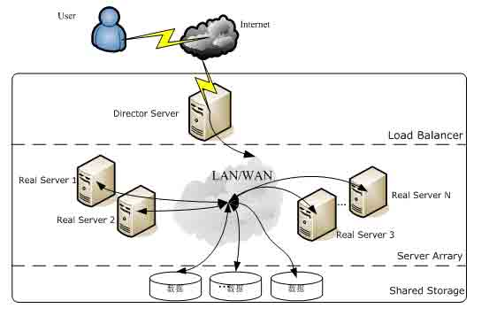

> **传送门->**关于体系结构的详细介绍，请浏览南飞蚂蚁的 blog：[`ixdba.blog.51cto.com/2895551/552947`](http://ixdba.blog.51cto.com/2895551/552947)

## 2.4 LVS 负载均衡机制

　　（1）LVS 是**四层**负载均衡，也就是说建立在 OSI 模型的第四层——传输层之上，传输层上有我们熟悉的 TCP/UDP，LVS 支持 TCP/UDP 的负载均衡。因为 LVS 是四层负载均衡，因此它相对于其它高层负载均衡的解决办法，比如 DNS 域名轮流解析、应用层负载的调度、客户端的调度等，它的效率是非常高的。

　　（2）LVS 的转发主要通过**修改 IP 地址**（NAT 模式，分为源地址修改 SNAT 和目标地址修改 DNAT）、**修改目标 MAC**（DR 模式）来实现。

　　①NAT 模式：网络地址转换

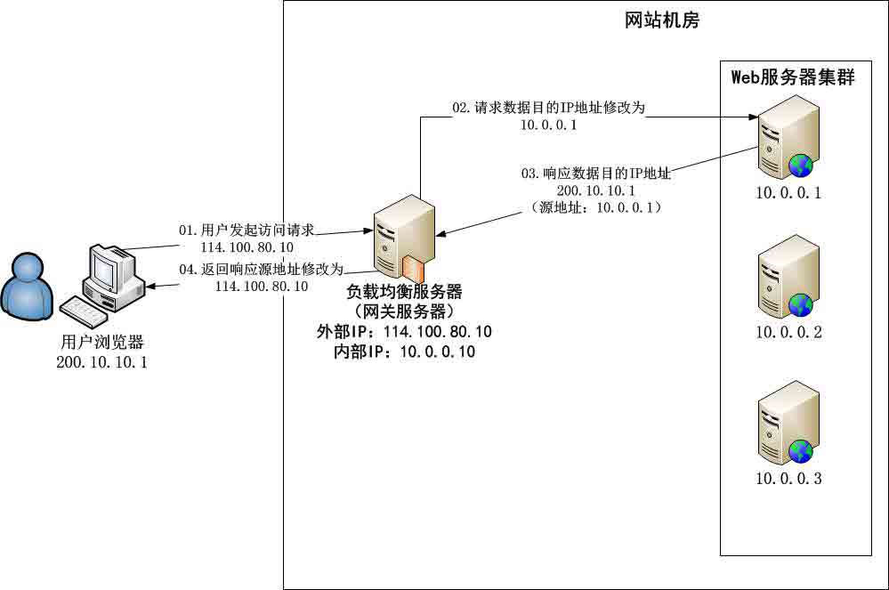

　　NAT（Network Address Translation）是一种**外网和内网地址映射**的技术。NAT 模式下，网络数据报的进出都要经过 LVS 的处理。LVS 需要作为 RS（真实服务器）的网关。当包到达 LVS 时，LVS 做目标地址转换（DNAT），将目标 IP 改为 RS 的 IP。RS 接收到包以后，仿佛是客户端直接发给它的一样。RS 处理完，返回响应时，源 IP 是 RS IP，目标 IP 是客户端的 IP。这时 RS 的包通过网关（LVS）中转，LVS 会做源地址转换（SNAT），将包的源地址改为 VIP，这样，这个包对客户端看起来就仿佛是 LVS 直接返回给它的。客户端无法感知到后端 RS 的存在。

　　②DR 模式：直接路由

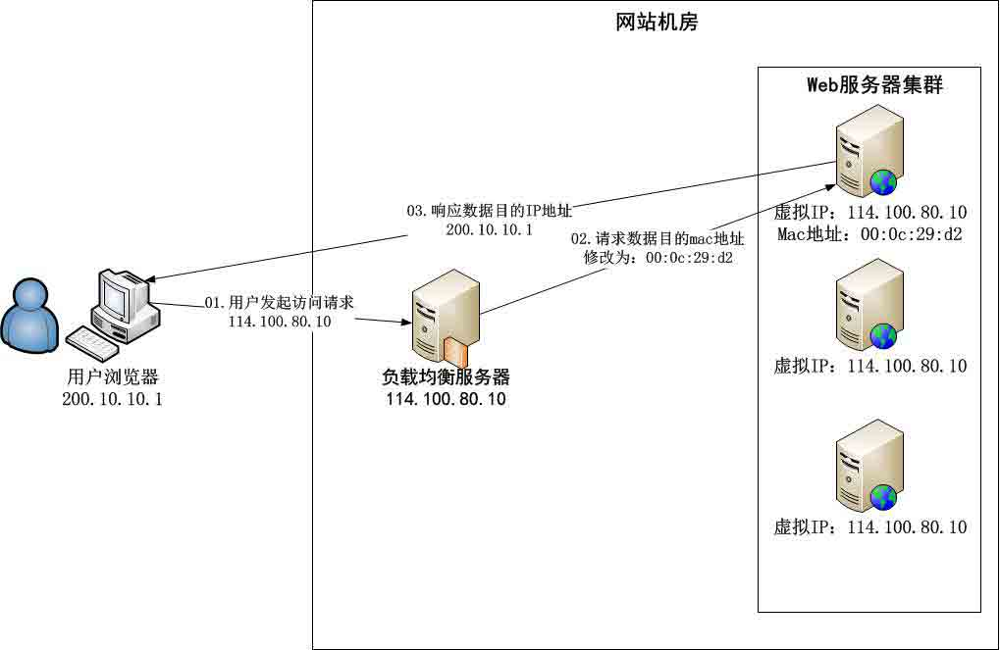

　　DR 模式下需要 LVS 和 RS 集群绑定同一个 VIP（RS 通过将 VIP 绑定在 loopback 实现），但与 NAT 的不同点在于：请求由 LVS 接受，由真实提供服务的服务器（RealServer, RS）直接返回给用户，返回的时候不经过 LVS。详细来看，一个请求过来时，LVS 只需要将网络帧的 MAC 地址修改为某一台 RS 的 MAC，该包就会被转发到相应的 RS 处理，注意此时的源 IP 和目标 IP 都没变，LVS 只是做了一下移花接木。RS 收到 LVS 转发来的包时，链路层发现 MAC 是自己的，到上面的网络层，发现 IP 也是自己的，于是这个包被合法地接受，RS 感知不到前面有 LVS 的存在。而当 RS 返回响应时，只要直接向源 IP（即用户的 IP）返回即可，不再经过 LVS。

　　（3）**DR**负载均衡模式数据分发过程中不修改 IP 地址，只修改 mac 地址，由于实际处理请求的真实物理 IP 地址和数据请求目的 IP 地址一致，所以不需要通过负载均衡服务器进行地址转换，可将响应数据包直接返回给用户浏览器，避免负载均衡服务器网卡带宽成为瓶颈。因此，DR 模式具有较好的性能，也是目前大型网站**使用最广泛**的一种负载均衡手段。

## 三、构建实战：LVS+Keepalived 实现负载均衡

## 3.1 实验结构总览

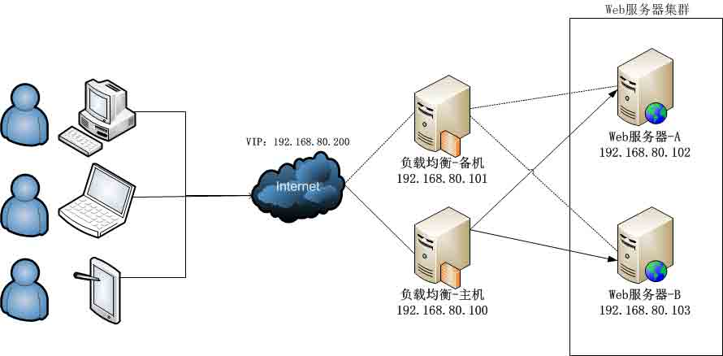

　　（1）本次基于 VMware Workstation 搭建一个四台 Linux（CentOS 6.4）系统所构成的一个服务器集群，其中两台负载均衡服务器（一台为主机，另一台为备机），另外两台作为真实的 Web 服务器（向外部提供 http 服务，这里仅仅使用了 CentOS 默认自带的 http 服务，没有安装其他的类似 Tomcat、Jexus 服务）。

　　（2）本次实验基于 DR 负载均衡模式，设置了一个 VIP（Virtual IP）为 192.168.80.200，用户只需要访问这个 IP 地址即可获得网页服务。其中，负载均衡主机为 192.168.80.100，备机为 192.168.80.101。Web 服务器 A 为 192.168.80.102，Web 服务器 B 为 192.168.80.103。

## 3.2 基础准备工作

　　以下工作针对所有服务器，也就是说要在四台服务器中都要进行配置：

　　（1）绑定静态 IP 地址

　　命令模式下可以执行 setup 命令进入设置界面配置静态 IP 地址；x-window 界面下可以右击网络图标配置；配置完成后执行 service network restart 重新启动网络服务；

　　验证：执行命令**ifconfig**

　　（2）设定主机名

　　①修改当前会话中的主机名，执行命令 hostname xxxx (这里 xxxx 为你想要改为的名字)

　　②修改配置文件中的主机名，执行命令 vi /etc/sysconfig/network (√一般需要进行此步凑才能永久更改主机名)

　　验证：重启系统**reboot**

　　（3）IP 地址与主机名的绑定

　　执行命令 vi /etc/hosts,增加一行内容，如下(下面的从节点以你自己的为主，本实验搭建了两个从节点)：

**　　192.168.80.100 lvs-master**

**　　192.168.80.101 lvs-slave**

**　　#****下面是本次试验的两个真实服务器节点**

**　　192.168.80.102 lvs-webserver1**

**　　192.168.80.103 lvs-webserver2**

　　保存后退出

　　验证：**ping lvs-master**

　　（4）关闭防火墙

　　①执行关闭防火墙命令：**service iptables stop**

      验证：**service iptables stauts**

　　②执行关闭防火墙自动运行命令：**chkconfig iptables off**

　　验证：**chkconfig --list | grep iptables**

## 3.3 配置两台 Web 服务器

　　以下操作需要在角色为 Web 服务器的两台中进行，不需要在负载均衡服务器中进行操作：

　　（1）开启 http 服务

　　命令：service httpd start

　　补充：chkconfig httpd on -->将 httpd 设为自启动服务

　　（2）在宿主机访问 Web 网页，并通过 FTP 工具上传自定义网页：这里上传一个静态网页，并通过更改其中的 html 来区别两台 Web 服务器，以下图所示为例，其中一台显示 from 192.168.80.102，而另一台显示 from 192.168.80.103；


　　（3）编辑 realserver 脚本文件

　　①进入指定文件夹：cd /etc/init.d/

　　②编辑脚本文件：vim realserver

```
SNS_VIP=192.168.80.200
/etc/rc.d/init.d/functions case "$1" in start) ifconfig lo:0 $SNS_VIP netmask 255.255.255.255 broadcast $SNS_VIP /sbin/route add -host $SNS_VIP dev lo:0
       echo "1" >/proc/sys/net/ipv4/conf/lo/arp_ignore echo "2" >/proc/sys/net/ipv4/conf/lo/arp_announce echo "1" >/proc/sys/net/ipv4/conf/all/arp_ignore echo "2" >/proc/sys/net/ipv4/conf/all/arp_announce
       sysctl -p >/dev/null 2>&1
       echo "RealServer Start OK" ;;
stop) ifconfig lo:0 down
       route del $SNS_VIP >/dev/null 2>&1
       echo "0" >/proc/sys/net/ipv4/conf/lo/arp_ignore echo "0" >/proc/sys/net/ipv4/conf/lo/arp_announce echo "0" >/proc/sys/net/ipv4/conf/all/arp_ignore echo "0" >/proc/sys/net/ipv4/conf/all/arp_announce echo "RealServer Stoped" ;; *) echo "Usage: $0 {start|stop}" exit 1
esac exit 0
```

　　这里我们设置虚拟 IP 为：192.168.80.200

　　③保存脚本文件后更改该文件权限：chmod 755 realserver

　　④开启 realserver 服务：service realserver start

## 3.4 配置主负载服务器

　　（1）安装 Keepalived 相关包

```
yum install -y keepalived
```

　　在 CentOS 下，通过 yum install 命令可以很方便地安装软件包，但是前提是你的虚拟机要联网；

　　（2）编辑 keepalived.conf 配置文件

　　①进入 keepalived.conf 所在目录：cd /etc/keepalived

　　②首先清除掉 keepalived 原有配置：> keepalived.conf

　　③重新编辑 keepalived 配置文件：vi keepalived.conf

```
global_defs {  
   notification_email {  
         edisonchou@hotmail.com  
   }  
   notification_email_from sns-lvs@gmail.com  
   smtp_server 192.168.80.1 smtp_connection_timeout 30 router_id LVS_DEVEL  # 设置 lvs 的 id，在一个网络内应该是唯一的
}  
vrrp_instance VI_1 {  
    state MASTER   #指定 Keepalived 的角色，MASTER 为主，BACKUP 为备          
    interface eth1  #指定 Keepalived 的角色，MASTER 为主，BACKUP 为备
    virtual_router_id 51 #虚拟路由编号，主备要一致
    priority 100 #定义优先级，数字越大，优先级越高，主 DR 必须大于备用 DR    
    advert_int 1 #检查间隔，默认为 1s
    authentication {  
        auth_type PASS  
        auth_pass 1111 }  
    virtual_ipaddress { 192.168.80.200  #定义虚拟 IP(VIP)为 192.168.2.33，可多设，每行一个
    }  
}  
# 定义对外提供服务的 LVS 的 VIP 以及 port
virtual_server 192.168.80.200 80 {  
    delay_loop 6 # 设置健康检查时间，单位是秒                    
    lb_algo wrr # 设置负载调度的算法为 wlc                   
    lb_kind DR # 设置 LVS 实现负载的机制，有 NAT、TUN、DR 三个模式   
    nat_mask 255.255.255.0 persistence_timeout 0 protocol TCP                  
    real_server 192.168.80.102 80 {  # 指定 real server1 的 IP 地址
        weight 3 # 配置节点权值，数字越大权重越高              
        TCP_CHECK {  
        connect_timeout 10 nb_get_retry 3 delay_before_retry 3 connect_port 80 }  
    }  
    real_server 192.168.80.103 80 {  # 指定 real server2 的 IP 地址
        weight 3 # 配置节点权值，数字越大权重越高  
        TCP_CHECK {  
        connect_timeout 10 nb_get_retry 3 delay_before_retry 3 connect_port 80 }  
     }  
} 
```

　　（3）开启 keepalived 服务

```
service keepalived start
```

## 3.5 配置从负载服务器

　　从负载服务器与主负载服务器大致相同，只是在 keepalived 的配置文件中需要改以下两处：

　　（1）将 state 由 MASTER 改为 BACKUP

　　（2）将 priority 由 100 改为 99

```
vrrp_instance VI_1 {  
    state BACKUP # 这里改为 BACKUP
    interface eth1  
    virtual_router_id 51 priority 99 # 这里改为 99，master 优先级是 100
    advert_int 1 authentication {  
        auth_type PASS  
        auth_pass 1111 }  
    virtual_ipaddress { 192.168.80.200 }  
} 
```

## 3.6 验证性测试

　　（1）指定请求的均衡转发：因为两个 Web 服务器的权重都一样，所以会依次转发给两个 Web 服务器；

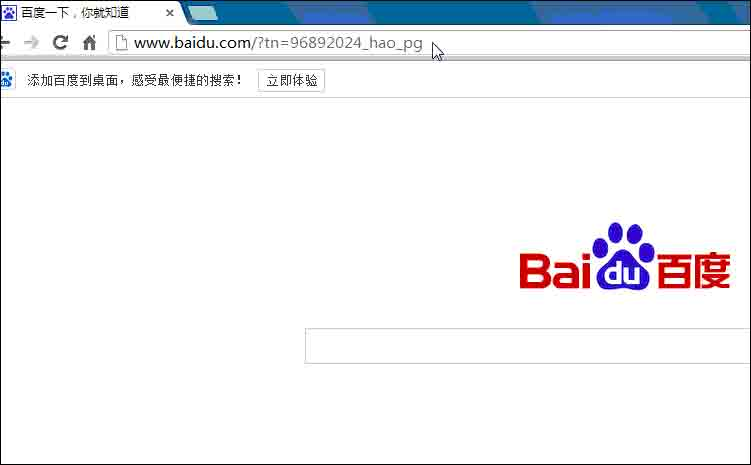

　　（2）Web 服务器发生故障时：

　　①A 发生故障后，只从 B 获取服务；

　　这里模拟 192.168.80.102 发生故障，暂停其 http 服务：service httpd stop

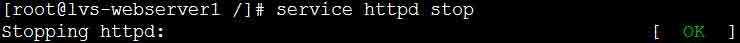

　　再来看看这时从外部访问 VIP 时，便会只从 192.168.80.103 获取网页：

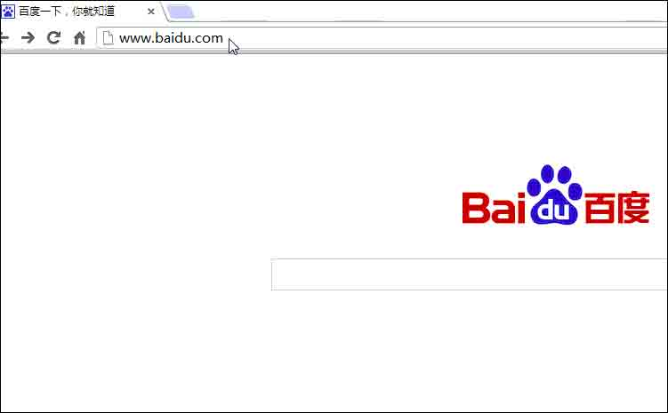

　　②A 故障修复后，又从 A 获取服务；

　　这里模拟 192.168.80.102 修复完成，重启其 http 服务：service httpd start

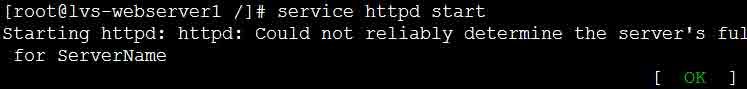

　　再来看看这时从外部访问 VIP，又可以从 192.168.80.102 获取网页：

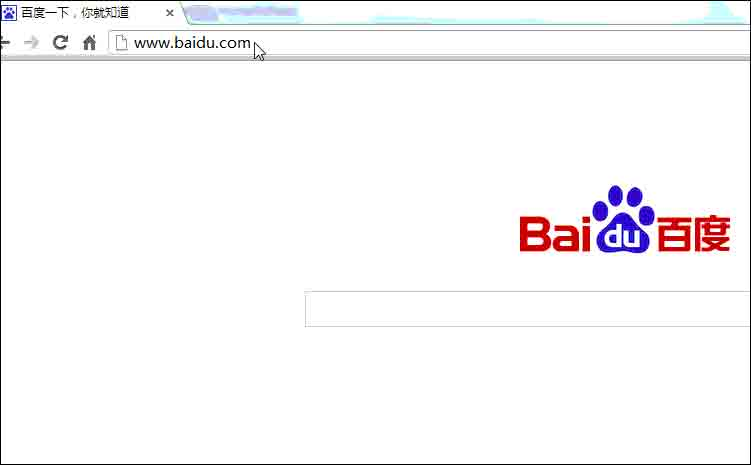

　　（3）主负载均衡服务器发生故障时，备机立即充当主机角色提供请求转发服务：

　　这里模拟 192.168.80.100 发生故障，暂停其 keepalived 服务：service keepalived stop


　　再来看看这时从外部访问 VIP，还是可以正常获取网页：

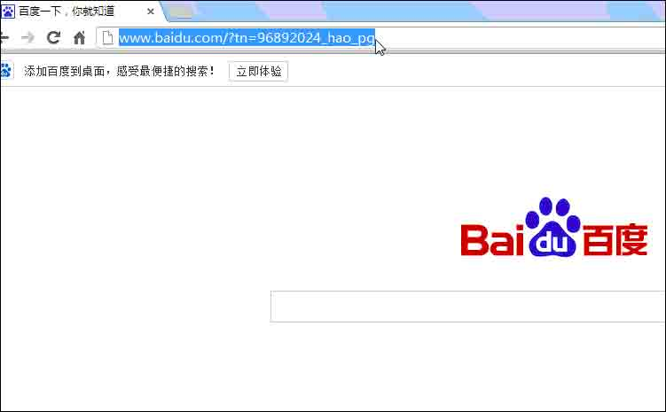

## 学习小结

　　LVS 是目前广为采用的软件负载均衡解决方案，在一些大型企业级系统及互联网系统中应用。本次，简单地了解了一下 LVS，并在 Linux 下搭建了一个小小的测试环境，借助 Keepalived 实现了一个最小化的负载均衡测试环境。LVS 是一个可以工作在网络第四层的负载均衡软件，因此它相对于 Nginx 一类工作在第七层的负载均衡软件有着无可比拟的性能优势，而且它还是我国的章文嵩博士（现在阿里的副总裁，淘宝的技术专家）作为创始人发起的，现已经成为 Linux 内核的组成部分。

　　当然，目前流行的 LVS 解决方案中，在 Web 服务器端也有采用了 Nginx+Tomcat 这样的搭配类型，静态文件和动态文件分开进行处理，也不失为一种有效的尝试。在以后的日子里，我还会尝试下在 Linux 下借助 Jexus 跑 ASP.NET MVC 项目，试试.NET 项目在 Linux 下的运行效果，希望到时也可以做一些分享。好了，今天就到此停笔。

## 参考资料

（1）王晨纯，《Web 基础架构：负载均衡和 LVS》：[`www.importnew.com/11229.html`](http://www.importnew.com/11229.html)

（2）win_xp，《LVS 简介及使用》：[`www.cnblogs.com/codebean/archive/2011/07/25/2116043.html`](http://www.cnblogs.com/codebean/archive/2011/07/25/2116043.html)

（3）jiwang1980，《LVS+Keepalived》：[`7567567.blog.51cto.com/706378/578289`](http://7567567.blog.51cto.com/706378/578289)

（4）南飞蚂蚁的 BLOG，《Linux 负载均衡软件 LVS 之概念篇》：[`ixdba.blog.51cto.com/2895551/552947`](http://ixdba.blog.51cto.com/2895551/552947)

（5）AKing 王国，《四层和七层负载均衡的区别》：[`kb.cnblogs.com/page/188170/`](http://kb.cnblogs.com/page/188170/)

作者：[周旭龙](http://www.cnblogs.com/edisonchou/)

出处：[`edisonchou.cnblogs.com/`](http://www.cnblogs.com/edisonchou/)

本文版权归作者和博客园共有，欢迎转载，但未经作者同意必须保留此段声明，且在文章页面明显位置给出原文链接。