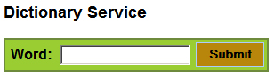
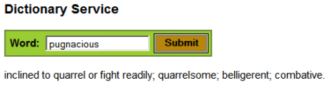

# 追求代码质量: 对 Ajax 应用程序进行单元测试

# 追求代码质量: 对 Ajax 应用程序进行单元测试

*使用 GWT 更轻松地测试异步应用程序*

您可能从编写 Ajax 应用程序中获得了极大乐趣，但是对它们执行单元测试却着实让人头痛。 在本文中，Andrew Glover 着手解决 Ajax 的弱点（其中之一），即应对异步 Web 应用程序执行单元测试的固有挑战。 幸运的是，他发现在 Google Web Toolkit 的帮助下，解决这个特殊的代码质量问题要比预想的容易。

*Ajax* 在近期无疑是 Web 开发界最时髦的字眼之一 —— 与 Ajax 相关的工具、框架、书籍以及 Web 站点的剧增就是该技术流行的最好证明。 此外，Ajax 应用程序也相当灵巧，不是吗？不过，像任何一个开发过 Ajax 应用程序的人证实的一样， 对 Ajax 执行测试真的很不方便。事实上，Ajax 的出现已经从根本上使得许多测试框架和工具*失效*，因为它们并没有针对异步 Web 应用程序测试进行设计！

有趣的是，某个支持 Ajax 的框架的开发人员注意到了这个限制， 并为此做了一些非常新颖的设计：内置的可测试性。除此之外，由于该框架简化了使用 Java™ 代码（而不是 JavaScript）创建 Ajax 应用程序，它的起点甚高，并且充分利用了 Java 平台上无可置疑的标准测试框架：JUnit。

我所论及的框架当然是非常流行的 Google Web Toolkit，也就是 GWT。在本文中，我将向您展示 GWT 如何实际地利用 Java 兼容性， 使 Ajax 应用程序的每个部分都能像与之对应的同步应用程序一样进行测试。

## 改进代码质量

别错过 Andrew Glover 的 [代码质量讨论论坛](http://www.ibm.com/developerworks/forums/dw_forum.jsp?S_CMP=cn-a-j&S_TACT=105AGX52&forum=812 cat=10)，里面有关于代码语法、测试框架以及如何编写专注于质量的代码的帮助。

## JUnit 和 GWTTestCase

因为与 GWT 有关的 Ajax 应用程序采用 Java 代码编写， 所以非常适合开发人员使用 JUnit 进行测试。 事实上，GWT 开发小组还为此创建了一个帮助器类 `GWTTestCase`，扩展自 JUnit 的 3.8.1 `TestCase`。 该基类添加了一些功能，可测试 GWT 代码并处理某些基础实现从而启动并运行 GWT 组件。

## Google Web Toolkit

Google Web Toolkit 在 Java Web 开发社区的发布声势浩大， 同时也获得了与之相称的巨大轰动。GWT 为利用 Java 代码进行设计、构建和部署支持 Ajax 的 Web 应用程序提供了一种新颖的方式。Java Web 开发人员不再需要学习 JavaScript 并花费数个小时解决特定于浏览器的问题，他们可以直接进行与 Ajax 有关的富含信息的动态 Web 应用程序设计。

需要提醒的是：`GWTTestCase` 并非用来测试 与 UI 相关的代码 —— 它是为了便于测试那些由 UI 交互*触发* 的异步问题。对 `GWTTestCase` 用途的误解使许多刚接触 GWT 的开发人员备受挫折， 因为他们期望能够用它方便地模拟用户界面，但最终发现这是徒劳的。

Ajax 组件有两个基本组成： 体验和功能，这些都被设计成异步方式。 图 1 演示了一个模拟 Web 表单的简单 Ajax 组件。 由于该组件支持 Ajax，表单的提交是异步执行的（即：无需重新载入与传统表单提交关联的页面）。

##### 图 1\. 一个支持 Ajax 的简单 Web 表单



输入一个有效单词，单击组件的 **Submit** 按钮，将向服务器发送消息请求该单词的定义。 该定义通过回调异步返回，相应地插入到 Web 页面，如图 2 所示：

##### 图 2\. 单击 Submit 按钮后显示响应



### 功能性和集成测试

图 2 所示的交互测试可用于多个不同场景， 但是其中两种场景最为常见。从功能性观点考虑，您或许希望编写一个测试：填入表单值，单击 **Submit** 按钮，然后验证表单是否显示定义。 另外一个选择是集成测试，使您能够验证客户端代码的异步功能。GWT 的 `GWTTestCase` 正是 被设计用来执行此类测试。

需要牢记的是：在 `GWTTestCase` 测试用例环境下不可以进行用户界面测试。 在设计和构建 GWT 应用程序时，您必须清楚*不要依赖用户界面* 测试代码。 这种思路需要把交互代码从业务逻辑中分离出来， 正如您已经了解的，这是最佳的入门实践！

举例而言，重新查看图 1 和图 2 所示的 Ajax 应用程序。 该应用程序由四个逻辑部分构成：`TextBox` 用于输入目标单词，`Button` 用于执行单击，还有两个 `Label`（一个用于 `TextBox`，另一个显示定义）。 实际 GWT 模块的初始方法如清单 1 所示， 但是您该如何测试这段代码呢？

##### 清单 1\. 一个有效的 GWT 应用程序，但是如何测试它？

```
public class DefaultModule implements EntryPoint {

 public void onModuleLoad() {
   Button button = new Button("Submit");
   TextBox box = new TextBox();
   Label output = new Label();
   Label label = new Label("Word: ");

   HorizontalPanel inputPanel = new HorizontalPanel();
   inputPanel.setStyleName("input-panel");
   inputPanel.setVerticalAlignment(HasVerticalAlignment.ALIGN_MIDDLE);
   inputPanel.add(label);
   inputPanel.add(box);

   button.addClickListener(new ClickListener() {
    public void onclick(Widget sender) {
      String word = box.getText();
      WordServiceAsync instance = WordService.Util.getInstance();
       try {
         instance.getDefinition(word, new AsyncCallback() {

           public void onFailure(Throwable error) {
             Window.alert("Error occurred:" + error.toString());
           }

           public void onSuccess(Object retValue) {
             output.setText(retValue.toString());
           }
          });
        }catch(Exception e) {
          e.printStackTrace();
        }
    }
   });

   inputPanel.add(button);
   inputPanel.setCellVerticalAlignment(button,
     HasVerticalAlignment.ALIGN_BOTTOM);

   RootPanel.get("slot1").add(inputPanel);
   RootPanel.get("slot2").add(output);
   }
} 
```

清单 1 的代码在运行时发生了严重的错误：它无法*按照* JUnit 和 GWT 的 `GWTTestCase` 进行测试。 事实上，如果我试着为这段代码编写测试，从技术方面来说它可以运行，但是无法按照逻辑工作。考虑一下：您如何对这段代码进行验证？惟一可用于测试的 `public` 方法返回的是 `void`， 那么，您怎么能够验证其功能的正确性呢？

如果我想以白盒方式验证这段代码，就必须分离业务逻辑和特定于用户界面的代码，这就需要进行重构。这本质上意味着把清单 1 中的代码分离到一个便于测试的独立方法中。 但是这并非听上去那么简单。很明显组件挂钩是通过 `onModuleLoad()` 方法实现， 但是如果我想强制其行为，*可能* 必须操纵某些用户界面（UI）组件。

* * *

## 分解业务逻辑和 UI 代码

第一步是为每个 UI 组件创建访问器方法， 如清单 2 所示。按照该方式，我可以在需要时获取它们。

##### 清单 2\. 向 UI 组件添加访问器方法使其可用

```
public class WordModule implements EntryPoint {

  private Label label;
  private Button button;
  private TextBox textBox;
  private Label outputLabel;

  protected Button getButton() {
   if (this.button == null) {
    this.button = new Button("Submit");
   }
   return this.button;
  }

  protected Label getLabel() {
   if (this.label == null) {
    this.label = new Label("Word: ");
   }
   return this.label;
  }

  protected Label getOutputLabel() {
   if (this.outputLabel == null) {
    this.outputLabel = new Label();
   }
   return this.outputLabel;
  }

  protected TextBox getTextBox() {
   if (this.textBox == null) {
    this.textBox = new TextBox();
    this.textBox.setVisibleLength(20);
   }
   return this.textBox;
  }
} 
```

现在我实现了对所有与 UI 相关的组件的编程式访问（假设所有需要进行访问的类都在同一个包内）。以后我可能需要使用其中一种访问进行验证。我现在希望*限制* 使用访问器，如我已经指出的，这是因为 GWT 并非设计用来进行交互测试。所以，我不是真的要试图测试某个按钮实例是否被单击， 而是要测试 GWT 模块是否会对给定的单词调用服务器端代码，并且服务器端会返回一个有效定义。方法为将 `onModuleLoad()` 方法的定义获取逻辑推入（不是故意用双关语！）一个可测试方法中，如清单 3 所示：

##### 清单 3\. 重构的 onModuleLoad 方法委托给更易于测试的方法

```
public void onModuleLoad() {
  HorizontalPanel inputPanel = new HorizontalPanel();
  inputPanel.setStyleName("disco-input-panel");
  inputPanel.setVerticalAlignment(HasVerticalAlignment.ALIGN_MIDDLE);

  Label lbl = this.getLabel();
  inputPanel.add(lbl);

  TextBox txBox = this.getTextBox();
  inputPanel.add(txBox);

  Button btn = this.getButton();

  btn.addClickListener(new ClickListener() {
   public void onClick(Widget sender) {
     submitWord();
   }
  });

  inputPanel.add(btn);
  inputPanel.setCellVerticalAlignment(btn,
      HasVerticalAlignment.ALIGN_BOTTOM);

  if(RootPanel.get("input-container") != null) {
   RootPanel.get("input-container").add(inputPanel);
  }

  Label output = this.getOutputLabel();
  if(RootPanel.get("output-container") != null) {
   RootPanel.get("output-container").add(output);
  }
} 
```

如清单 3 所示，我已经把 `onModuleLoad()` 的定义获取逻辑委托给 `submitWord` 方法， 如清单 4 定义：

##### 清单 4\. 我的 Ajax 应用程序的实质！

```
protected void submitWord() {
  String word = this.getTextBox().getText().trim();
  this.getDefinition(word);
}

protected void getDefinition(String word) {
 WordServiceAsync instance = WordService.Util.getInstance();
 try {
   instance.getDefinition(word, new AsyncCallback() {

   public void onFailure(Throwable error) {
    Window.alert("Error occurred:" + error.toString());
   }

   public void onSuccess(Object retValue) {
    getOutputLabel().setText(retValue.toString());
   }
  });
 }catch(Exception e) {
   e.printStackTrace();
 }
} 
```

`submitWord()` 方法又委托给 `getDefinition()` 方法，我可以用 JUnit 测试它。`getDefinition()` 方法从逻辑上独立于特定于 UI 的代码（对于绝大部分而言），并且可以在没有单击按钮的情况下得到调用。另一方面， 与异步应用程序有关的状态问题和 Java 语言的语义规则也规定了我不能在测试中*完全* 避免与 UI 相关的交互。仔细查看清单 4 中的代码，您能够发现激活异步回调的 `getDefinition()` 方法操纵了某些 UI 组件 —— 一个错误警告窗口以及一个 `Label` 实例。

我还可以通过获得输出 `Label` 实例的句柄，断言其文本是否是给定单词的定义，从而验证应用程序的功能。 在用 `GWTTestCase` 测试时，最好*不要* 尝试手工 强制改变组件状态，而应该让 GWT 完成这些工作。举例而言，在清单 4 中，我想验证对某个给定单词返回了其 正确定义并放入一个输出 `Label` 中。无需操作 UI 组件来设置这个单词；我只要直接调用 `getDefinition` 方法，然后断言 `Label` 具有对应定义。

既然我已经编写好了计划进行测试的 GWT 应用程序，我需要实际编写测试，这意味着设置 GWT 的 `GWTTestCase`。

* * *

## 设置 GWTTestCase

若想从 `GWTTestCase` 的测试魔力中获益，需要遵守一些规则。 幸运的是，规则很简单：

*   所有用于实现测试的类和待测 GWT 模块必须位于同一个包内。
*   运行测试时，您必须至少传递一个 VM 参数，指明在哪种 GWT 模式（托管或 Web）下运行测试。
*   您必须实现 `getModuleName()` 方法，它返回一个 `String`，表示您的 XML 模块文件。

最后，因为与服务器端实体通信的 Ajax 应用程序在本质上是异步的，GWT 还提供了 `Timer` 类 ， 以便延迟 JUnit，使异步行为在进行相关断言之前全部完成。

### 实现 getModuleName 和 Timer 类

我已经指出，我的测试集中于 `getDefinition()` 方法（如 清单 4 所示）。 您可以从代码看到，测试逻辑非常简单：传入一个单词（比如 *pugnacious*），然后验证相应的 `Label` 文本是否得到正确定义。很简单，对吗？但是不要忘记，`getDefinition()` 方法在 `AsyncCallback` 对象中具有某种相关的异步性。

`GWTTestCase` 类是一个*抽象* 类，因为它的 `getModuleName()` 方法就是这么声明的；因此，当您 扩展该类时，您需要实现 `getModuleName()`（除非您是在为框架创建自己的基抽象类）。模块名实际上就是您的 GWT XML 文件所在的包结构的名称去掉文件扩展名。举个例子，在本例中， 我有一个名为 WordModule.gwt.xml 的 XML 文件，它位于 一个目录结构如：com/acme/gwt。相应的， 模块的逻辑名称为 `com.acme.gwt.WordModule`， 这会让您想到 Java 平台的普通包模式。

我已经得到一个模块名，可以开始定义测试用例了，如清单 5 所示：

##### 清单 5\. 您必须实现 getModuleName 方法并提供一个有效的名字

```
import com.google.gwt.junit.client.GWTTestCase;
import com.google.gwt.user.client.Timer;

public class WordModuleTest extends GWTTestCase {

 public String getModuleName() {
   return "com.acme.gwt.WordModule";
 }
} 
```

到目前为止一切良好，但是我还没有执行任何测试！由于我的 Ajax 应用程序使用 `AsyncCallback` 对象，在通过测试用例调用 `getDefinition()` 方法时， 我必须强迫 JUnit 延迟运行；否则测试将由于没有任何响应而失败。这就要用到 GWT 的 `Timer` 类。`Timer` 使我能够重写 `getDefinition()` 的 `run` 方法，在 `Timer` 内完成测试用例逻辑。（测试用例以独立线程运行，有效地阻塞 JUnit 完成整个测试用例）。

以我的测试为例，我将首先调用 `getDefinition()` 方法，然后提供一个 `Timer` 的 `run()` 方法的实现。`run()` 方法得到输出 `Label` 实例的文本并验证是否是正确定义。 定义了 `Timer` 实例后，我就需要确定其何时运行，同时强制 JUnit 挂起直至 `Timer` 实例完成。也许听起来有点复杂，不必担心，因为实践起来非常简易。实际上，清单 6 展示了整个过程：

##### 清单 6\. 使用 GWT 轻松测试

```
public void testDefinitionValue() throws Exception {
 WordModule module = new WordModule();
 module.getDefinition("pugnacious");
 Timer timer = new Timer() {
   public void run() {
    String value = module.getOutputLabel().getText();
    String control = "inclined to quarrel or fight readily;...";   
    assertEquals("should be " + control, control, value);
    finishTest();
   }
  };
  timer.schedule(200);
  delayTestFinish(500);
} 
```

正如您所见，`Timer` 的 `run()` 方法 是我真正验证 Ajax 应用程序功能及其应用远程过程调用的地方。 请注意 run 方法的最后一步是调用 `finishTest()` 方法， 它意味着一切如预期运行，JUnit 可以不受阻塞正常运行。 在实践中，您可能会发现需要根据异步行为完成所需的时间调整延迟时间。 但用 JUnit 测试 GWT 应用程序的要点在于：您能够在*无需* 部署完整功能的 Web 应用程序的情况下测试它。因此，您能够*更早地* 并且更 *频繁地* 测试您的 GWT 应用程序。

* * *

## 运行 GWT 测试

## 使用 GWT 进行功能测试

像本文演示的这类简单 Ajax 应用程序*可以* 从功能角度进行验证， 使用包括 Selenium 在内的框架，它会驱动浏览器模拟实际用户行为。不过，要想用 Selenium 运行功能测试，您必须部署完整功能的 Web 应用程序。

前面我曾提到，如果您想实际运行您的 GWT JUnit 测试，您必须执行大量琐碎的工作来配置运行环境。比如说，要想通过 Ant 的 `junit` 任务运行我的测试，我就必须确保某些文件 位于类路径中并向低层 JVM 提供一个参数。特别是，在调用 `junit` 任务时， 我还要确保托管源文件（以及测试）的目录（或多个目录）位于类路径中，还要告诉 GWT 以何种模式运行。 我倾向于使用 *hosted* 模式，这意味着要使用 *www-test* 标志 ，如清单 7 所示：

##### 清单 7\. 用 Ant 运行 GWT 测试

```
<junit dir="./" failureproperty="test.failure" printSummary="yes" 
     fork="true" haltonerror="true">

 <jvmarg value="-Dgwt.args=-out www-test" />

 <sysproperty key="basedir" value="." />
 <formatter type="xml" />
 <formatter usefile="false" type="plain" />
 <classpath>
  <path refid="gwt-classpath" />
  <pathelement path="build/classes" />
  <pathelement path="src" />
  <pathelement path="test" />
 </classpath>
 <batchtest todir="${testreportdir}">
  <fileset dir="test">
   <include name="**/**Test.java" />
  </fileset>
 </batchtest>
</junit> 
```

运行 GWT 测试现在转变成调用问题了。还需注意的是 GWT 测试属于轻量级测试， 所以我可以频繁运行测试，甚至是连续运行，就像我在一个持续集成环境（Continuous Integration）中一样。

* * *

## 结束语

在本文所示的 GWT 测试用例中，您已经看到用于验证 Ajax 应用程序所需的基本步骤。 您可以继续测试我的示例 GWT 应用程序，比如测试一些边界用例，但是我认为重点在于：如果使用包含测试特性的框架编写 Ajax 应用程序，测试要比想象中容易。

要对 GWT 应用程序进行良好测试（对绝大多数应用程序也适用），关键在于设计应用程序时要把测试一并考虑。还要注意 `GWTTestCase` 不是被用来进行交互测试的。 您不能使用 `GWTTestCase` 直接模拟用户。不过您能够以一种间接的方式用它来验证用户交互，正如本文中演示的那样。