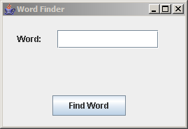
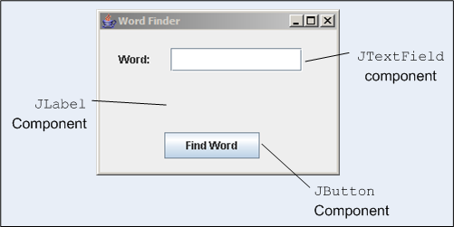
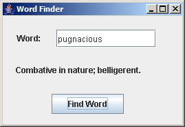
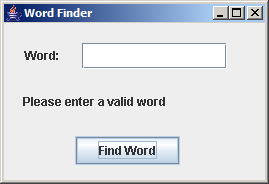
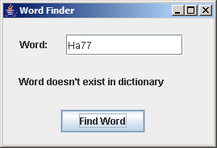

# 追求代码质量: 使用 TestNG-Abbot 实现自动化 GUI 测试

# 追求代码质量: 使用 TestNG-Abbot 实现自动化 GUI 测试

*使用 fixture 对象轻松验证 GUI 组件*

TestNG-Abbot 是一种测试框架，它为 GUI 组件的测试带来了新的活力。本月，Andrew Glover 将带领您亲历使用 TestNG-Abbot 测试 GUI 过程中难度最大的部分，即理解用户场景的实现过程。一旦理解了它，您会发现将 GUI 组件隔离并使用框架所含的极其方便的 fixture 对象对其进行验证是多么地简单。

使用 Swing、AWT 和类似的技术构建用户界面通常会给开发人员进行测试带来挑战，原因如下：

*   底层图形框架的复杂性
*   GUI 中表现形式和业务逻辑之间的耦合
*   缺乏直观的自动测试框架

当然，前两个原因并不新鲜 —— 图形框架本来就很复杂，而且向 GUI 应用程序添加业务功能总是会给测试造成麻烦。另一方面，过去几年中有许多方便的框架涌现出来，确实使 GUI 测试更加*便利*。

本月，我将介绍一种新的框架，它极大地减轻了 GUI 测试的痛苦。

## TestNG-Abbot 简介

TestNG-Abbot 源自于两个成功的开发人员测试框架的结合：Abbot 和 TestNG。Abbot 是一种 JUnit 扩展框架，主要目的是使 GUI 组件实现编程隔离，它还提供了一种验证 GUI 行为的简易方法。举例来说，可以使用它来获取对按钮组件的引用，使用编程的方法点击按钮，然后检验其操作。Abbot 还附带了一个脚本记录器，使用它就能够以 XML 格式布设测试场景，可以通过编程的方式运行它。

## 希望改善代码质量吗？

那么千万不要错过 Andrew 的 [改善 Java 代码质量论坛](http://www.ibm.com/developerworks/forums/dw_forum.jsp?S_TACT=105AGX52&cat=10&S_CMP=cn-a-j&forum=812)，在那里可以学到关于代码度量标准、测试框架以及编写质量为先的代码的第一手知识。

在本系列中，我已经介绍了一些关于 TestNG 的内容，这里将继续介绍 TestNG。基本上，TestNG 是 JUnit 的一个替代物。除了所有预期的功能外，它还增加了一些额外功能。正如我在其他文章中提到的一样，TestNG 特别适合于更高层次的测试，其中，它可以用来测试依赖关系并只返回失败了的测试 —— 简而言之，在测试 GUI 时，这类型测试非常方便。（参见 Resources 中有关 TestNG 的更多内容。）

它的起源就如此让人印象深刻，所以 TestNG-Abbot 成为测试工具中的神童就没什么好奇怪的了。同 Abbot 一样，TestNG-Abbot 使 GUI 组件能够进行编程隔离。同时，它使用了 TestNG 的断言，将 GUI 操作细节提取到了简单的 fixture 中，后者能够公开验证方法。如能正确使用，TestNG-Abbot 的直观的 fixture 类能够使 GUI 测试如同从小男孩手里偷一块糖一样简单。（当然，您不会想那么干的！）

### 直观的 fixture 类

TestNG-Abbot 的当前版本支持七种 fixture 类型，其中一种类型用于操作按钮、菜单标签以及文本项组件，如文本字段。此外，这些 fixture 类型根据名字在逻辑上链接到了测试中的代码（即 GUI 组件）。这使得 GUI 和其测试实现了松耦合，这样做至少有以下两个好处：

*   测试不会依赖于特定位置的 GUI 组件 —— 这样无需中断测试就可对其进行移动。
*   可以在早期进行测试，并且不会受到开发期间布局和外观改变的影响。

虽然目前只支持七种 fixture 类型，很快就会支持其他 fixture 类型。更多的 fixture 类型只会增加 TestNG-Abbot 在编程验证 GUI 方面的高效性。

* * *

## GUI 验证不再普通！

虽然 TestNG-Abbot 使得验证 GUI 的过程更加简单，这并不意味着这个过程很简单。必须使 GUI 测试区别于单元或组件测试。验证 GUI 中业务规则的过程变成了对用户场景进行验证；或者，换种说法，GUI 测试包括验证可见状态的改变。

比方说，如果按下了定单输入 GUI 上的保存按钮，业务规则会保证命令的内容被保存到数据库中。然而，在一个用户场景中，会保证成功的状态信息被插入了按钮下 —— 这正是使用 TestNG-Abbot 能够编写的测试。事实上，如果 GUI 设计良好的话，可以测试被保存到数据库中的命令内容而*无需* 测试 GUI。接着您还可以同时并及早地编写这两个特别的测试。

## 加油！

记住 TestNG-Abbot 并不妨碍端对端测试（end-to-end）。可以轻松将 TestNG-Abbot 和 DbUnit 结合在一起，比如，创建一个同时验证用户场景和业务规则的可重复测试。

## Word Finder GUI

为了使您了解 TestNG-Abbot 工作原理，我创建了一个简单的 GUI，它执行一种功能 —— 在底层字典（也就是一个数据库）中查阅一个给定的单词并显示其释义。不管该应用程序实际的代码如何，测试该 GUI 用户场景包括三个步骤：

1.  在文本框中输入一个单词。
2.  单击 **Find Word** 按钮。
3.  验证是否给出了该单词释义。

当然，也存在一些极端的例子，比如一个用户按下了 Find Word 按钮但没有输入单词，或者，用户输入了一个无效的单词。我将通过一些其他的测试案例说明如何处理这类场景。

### 了解 GUI

图 1 显示了已启动的 Word Finder GUI。记住该 GUI 之所以简单只有一个原因：它演示了 TestNG-Abbot 的三个 fixture 类以及一些要引导的测试用例！

##### 图 1\. Word Finder GUI



当使用 TestNG-Abbot 进行测试时，应该首先检查 GUI 的组件。Word Finder GUI 由图 2 所示的三个组件组成：

##### 图 2\. Word Finder GUI 的组件



如您所见，Word Finder GUI 由一个 `JTextField`（用来输入要查询的单词）、一个 `JButton`（使 GUI 从字典数据库中获取释义）和一个 `JEditorPane` （显示释义）组成。

在良好的场景中，如果我输入 *pugnacious* 然后单击 Find Word 按钮，`JEditorPane` 将显示 “Combative in nature; belligerent”，如图 3 所示：

##### 图 3\. 良好的场景 —— 工作良好！



* * *

## 使用 TestNG-Abbot 进行测试

要开始使用 TestNG-Abbot，需要创建一个常规的测试 fixture，它将使用 TestNG 的 `BeforeMethod` 和 `AfterMethod` 注释为您的 GUI 创建一个实例。TestNG-Abbot 框架附带了一个方便的 `AbbotFixture` 对象，它简化了 GUI 组件的使用，实际上也引导了整个测试过程。要在测试 fixture 中使用该对象，需要在测试前将一个 GUI 实例传递给 fixture 对象的 `showWindow()` 方法，然后使用名为 `cleanUp()` 的方法对 fixture 进行清理。

在清单 1 中，我创建了一个 TestNG 测试（实际上并没有对其做任何测试），该测试在 fixture 中使用 TestNG-Abbot 的 `AbbotFixture` 对象来存放 Word Finder GUI 的实例。

##### 清单 1\. 使用 AbbotFixture 对象定义 WordFindGUITest

```
public class WordFindGUITest {
 private AbbotFixture fixture;

 @BeforeMethod
 private void initializeGUI() {
  fixture = new AbbotFixture();
  fixture.showWindow(new WordFind(), new Dimension(269, 184));
 }

 @AfterMethod
 public void tearDownGUI() {
  fixture.cleanUp();
 }
} 
```

由于 Word Finder GUI 的用户可见的行为会影响 图 2 所示的三个组件，需要通过编程对其进行调整，以确保工作能正常进行。比如，验证 图 3 演示的良好的场景，需要执行下面三个步骤：

1.  获得对 `JTextField` 的引用并向其添加一些文本。
2.  获得 `JButton` 的句柄并单击它。
3.  获得对 `JLabel` 组件的引用并检验是否显示了正确的释义。

### 检验良好的场景

使用 TestNG-Abbot，可以通过这三个方便的 fixture 类型执行上面所属的三个步骤：`TextComponentFixture` 用于 `JTextField`；`ButtonFixture` 用于 **Find Word** 按钮；`LabelFixture` 用来验证 `JLabel` 中特定的文本。

清单 2 显示了用于验证 图 3 中演示的内容是否可以正常工作的代码：

##### 清单 2\. 测试一个良好场景

```
@Test
public void assertDefinitionPresent() {
 TextComponentFixture text1 = new TextComponentFixture(this.fixture,
   "wordValue");
 text1.enterText("pugnacious");

 ButtonFixture bfix = new ButtonFixture(this.fixture, "findWord");
 bfix.click();

 LabelFixture fix = new LabelFixture(this.fixture, "definition");
 fix.shouldHaveThisText("Combative in nature; belligerent.");
} 
```

注意 fixture 对象通过一个逻辑名称和特定的 GUI 组件连接在一起。例如，在 Word Finder GUI 中，通过编程将 `JButton` 对象与 “findWord” 名称联系起来。请注意在定义按钮时，我是如何通过调用组件的 `setName()` 方法做到这点的，如清单 3 所示：

##### 清单 3\. 定义 Find Word 按钮

```
findWordButton = new JButton();
findWordButton.setBounds(new Rectangle(71, 113, 105, 29));
findWordButton.setText("Find Word");
findWordButton.setName("findWord"); 
```

同样要注意，在 清单 2 中，我是如何通过将 “findWord” 名称传递给 TestNG-Abbot 的 `ButtonFixture` 对象而获得对按钮的引用。“单击” 按钮（调用 `click` 方法）然后使用 TestNG-Abbot 的 `LabelFixture` 对象插入单词的释义，多么酷！不过不要就此满足。

* * *

## 测试意外场景

当然，如果我非常希望验证我的 Word Finder GUI，我必须确保在用户执行意外操作时 —— 程序能够正常工作，比如在输入单词之前按下 Find Word 按钮，或者情况更糟，比如他们输入了一个无效的单词。举例来说，如果用户没有向文本字段输入内容，GUI 应该显示特定的信息，如清单 4 所示：

##### 图 4\. 糟糕的极端例子



当然，使用 TestNG-Abbot 测试这种情况非常简单，不是吗？我所做的仅仅是将空值传送到 `TextComponentFixture` 中，按下按钮（通过对 `ButtonFixture` 使用 `click` 方法）并插入 “Please enter a valid word” 响应！

##### 清单 4\. 测试一个极端例子：如果有人没有输入单词就按下了按钮该怎么办？

```
@Test
public void assertNoWordPresentInvalidText() {
 TextComponentFixture text1 = new TextComponentFixture(this.fixture,
   "wordValue");
 text1.enterText("");

 ButtonFixture bfix = new ButtonFixture(this.fixture, "findWord");
 bfix.click();

 LabelFixture fix = new LabelFixture(this.fixture, "definition");
 fix.shouldHaveThisText("Please enter a valid word");
} 
```

如清单 4 所示，一旦理解了获得所需 GUI 组件的引用时，事情并不是很困难。最后一步是检验*其他* 糟糕的极端例子 —— 输入了无效的单词。这个过程与 清单 1 和 清单 3 非常相似：仅仅是将所需的 `String` 传递到 `TextComponentFixture` 对象，单击，然后插入特定的文本。如清单 5 所示：

##### 清单 5\. 轻松验证另一个极端例子！

```
@Test
public void assertNoWordPresentInvalidText() {
 TextComponentFixture text1 = new TextComponentFixture(this.fixture,
   "wordValue");
 text1.enterText("Ha77");

 ButtonFixture bfix = new ButtonFixture(this.fixture, "findWord");
 bfix.click();

 LabelFixture fix = new LabelFixture(this.fixture, "definition");
 fix.shouldHaveThisText("Word doesn't exist in dictionary");
} 
```

清单 5 很好地验证了图 5 演示的功能，难道您不这样认为吗？

##### 图 5\. 输入了无效单词



真不错！我们已经使用 TestNG-Abbot 轻而易举地验证了三种不同的用户场景。对于每种情况，我需要的只是被测试的组件的逻辑名称以及一系列步骤，以便创建场景。

* * *

## 继续测试 GUI

TestNG-Abbot 可能是测试工具中的新生儿，但它从其前辈那里继承了一些非常有用的特性。本文向您展示了如何使用 TestNG-Abbot 通过编程的方法将 GUI 组件隔离，然后使用 fixture 公开组件的验证方法。在这个过程中，您了解了对正常情况下的场景（所有事务都合乎逻辑）以及无法预见场景下（包括意外操作）进行测试是多么简单。总之，你只需要知道场景和组件在其中起到了作用。使用 TestNG-Abbot 方便的 fixture 对象可以很轻易地改变组件的行为。