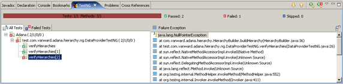

# 追求代码质量: 用 AOP 进行防御性编程

# 追求代码质量: 用 AOP 进行防御性编程

*OVal 省去了编写重复性条件的麻烦事*

虽然防御性编程有效地保证了方法输入的条件，但如果在一系列方法中使用它，不免过于重复。本月，Andrew Glover 将向您展示通过一种更为容易的方式，即使用 AOP、契约式设计和一个便捷的叫做 OVal 的库，来向代码中添加可重用的验证约束条件。

开发人员测试的主要缺点是：绝大部分测试都是在理想的场景中进行的。在这些情况下并不会出现缺陷 —— 能导致出现问题的往往是那些边界情况。

什么是边界情况呢？比方说，把 `null` 值传入一个并未编写如何处理 `null` 值的方法中，这就是一种边界情况。大多数开发人员通常都不能成功测试这样的场景，因为这没多大意义。但不管有没有意义，发生了这样的情况，就会抛出一个 `NullPointerException`，然后整个程序就会崩溃。

本月，我将为您推荐一种多层面的方法，来处理代码中那些不易预料的缺陷。尝试为应用程序整合进防御性编程、契约式设计和一种叫做 OVal 的易用的通用验证框架。

## 下载 OVal 和 AspectJ

要实现本文中描述的编程解决方案，需要下载 OVal 和 AspectJ。现在请从 参考资料 中下载这些技术，并照着那些例子做。

## 将敌人暴露出来

清单 1 中的代码为给定的 `Class` 对象（省去了 `java.lang.Object`，因为所有对象都最终由它扩展）构建一个类层次。但如果仔细看的话，您会注意到一个有待发现的潜在缺陷，即该方法对对象值所做的假设。

##### 清单 1\. 不检验 null 的方法

```
public static Hierarchy buildHierarchy(Class clzz){

 Hierarchy hier = new Hierarchy();
 hier.setBaseClass(clzz);
 Class superclass = clzz.getSuperclass();

 if(superclass != null && superclass.getName().equals("java.lang.Object")){
  return hier; 
 }else{      
  while((clzz.getSuperclass() != null) && 
    (!clzz.getSuperclass().getName().equals("java.lang.Object"))){
     clzz = clzz.getSuperclass();
     hier.addClass(clzz);
  }            
  return hier;
 }
} 
```

刚编好这个方法，我还没注意到这个缺陷，但由于我狂热地崇拜开发人员测试，于是我编写了一个使用 TestNG 的常规测试。而且，我还利用了 TestNG 方便的 `DataProvider` 特性，借助该特性，我创建了一个通用的测试用例并通过另一个方法来改变它的参数。运行清单 2 中定义的测试用例会产生两个通过结果！一切都运转良好，不是吗？

##### 清单 2\. 验证两个值的 TestNG 测试

```
import java.util.Vector;
import static org.testng.Assert.assertEquals;
import org.testng.annotations.DataProvider;
import org.testng.annotations.Test;

public class BuildHierarchyTest {

 @DataProvider(name = "class-hierarchies")
 public Object[][] dataValues(){
  return new Object[][]{
   {Vector.class, new String[] {"java.util.AbstractList", 
      "java.util.AbstractCollection"}},
   {String.class, new String[] {}}
  };
 }

 @Test(dataProvider = "class-hierarchies"})
 public void verifyHierarchies(Class clzz, String[] names) throws Exception{
  Hierarchy hier = HierarchyBuilder.buildHierarchy(clzz);
  assertEquals(hier.getHierarchyClassNames(), names, "values were not equal");
 }
} 
```

至此，我还是没有发现缺陷，但一些代码问题却困扰着我。如果有人不经意地为 `Class` 参数传入一个 `null` 值会怎么样呢？清单 1 中第 4 行的 `clzz.getSuperclass()` 调用会抛出一个 `NullPointerException`，是这样吗？

测试我的理论很容易；甚至都不用从头开始。仅仅把 `{null, null}` 添加到初始 `BuildHierarchyTest` 的 `dataValues` 方法中的多维 `Object` 数组中，然后再次运行它。我定会得到如图 1 所示的 `NullPointerException`：

##### 图 1\. 可怕的 NullPointerException



参见这里的 全图。

## 关于静态分析

诸如 FindBugs 等静态分析工具通过将字节码和一系列 bug 模式相匹配来检验类或 JAR 文件从而寻找潜在问题。针对样例的代码运行 FindBugs *不会* 揭示出清单 1 中找到的 `NullPointerException`。

## 防御性编程

一旦出现这个问题，下一步就是要拿出对抗的策略。问题是我控制不了这个方法能否接收这种输入。对于这类问题，开发人员通常会使用防御性编程技术，该技术专门用来在发生摧毁性后果前捕捉潜在错误。

对象验证是处理不确定性的一项经典的防御性编程策略。相应地，我会添加一项检验来验证 `clzz` 是否为 `null`，如清单 3 所示。如果其值最终为 `null`，我就会抛出一个 `RuntimeException` 来警告他人注意这个潜在问题。

##### 清单 3\. 添加验证 null 值的检验

```
public static Hierarchy buildHierarchy(Class clzz){

 if(clzz == null){
  throw new RuntimeException("Class parameter can not be null");
 }

 Hierarchy hier = new Hierarchy();
 hier.setBaseClass(clzz);

 Class superclass = clzz.getSuperclass();

 if(superclass != null && superclass.getName().equals("java.lang.Object")){
  return hier; 
 }else{      
  while((clzz.getSuperclass() != null) && 
    (!clzz.getSuperclass().getName().equals("java.lang.Object"))){
     clzz = clzz.getSuperclass();
     hier.addClass(clzz);
  }            
  return hier;
 }
} 
```

很自然，我也会编写一个快速测试用例来验证我的检验是否真能避免 `NullPointerException`，如清单 4 所示：

##### 清单 4\. 验证 null 检验

```
@Test(expectedExceptions={RuntimeException.class})
public void verifyHierarchyNull() throws Exception{
 Class clzz = null;
 HierarchyBuilder.buildHierarchy(null);        
} 
```

在本例中，防御性编程似乎解决了问题。但仅依靠这项策略会存在一些缺陷。

### 防御的缺陷

## 关于断言

清单 3 使用一个条件来验证 `clzz` 的值，实际上 `assert` 也同样好用。使用断言，无需指定条件，也不需要指定异常语句。在启用了断言的情况下，防御性编程的关注点全部由 JVM 处理。

尽管防御性编程有效地保证了方法的输入条件，但如果在一系列方法中使用它，不免过于重复。熟悉面向方面编程（或 AOP）的人们会把它认为是*横切关注点*，这意味着防御性编程技术横跨了代码库。许多不同的对象都采用这些语法，尽管从纯面向对象的观点来看这些语法跟对象毫不相关。

而且，横切关注点开始渗入到*契约式设计*（DBC）的概念中。DBC 是这样一项技术，它通过在组件的接口显式地陈述每个组件应有的功能和客户机的期望值来确保系统中所有的组件完成它们应尽的职责。从 DBC 的角度讲，组件应有的功能被认为是*后置条件*，本质上就是组件的责任，而客户机的期望值则普遍被认为是*前置条件*。另外，在纯 DBC 术语中，遵循 DBC 规则的类针对其将维护的内部一致性与外部世界有一个契约，即人所共知的*类不变式*。

* * *

## 契约式设计

我在以前的一篇关于用 Nice 编程的文章中介绍过 DBC 的概念，Nice 是一门与 JRE 兼容的面向对象编程语言，它的特点是侧重于模块性、可表达性和安全性。有趣的是，Nice 并入了功能性开发技术，其中包括了一些在面向方面编程中的技术。功能性开发使得为方法指定前置条件和后置条件成为可能。

尽管 Nice 支持 DBC，但它与 Java™ 语言完全不同，因而很难将其用于开发。幸运的是，很多针对 Java 语言的库也都为 DBC 提供了方便。每个库都有其优点和缺点，每个库在 DBC 内针对 Java 语言进行构建的方法也不同；但最近的一些新特性大都利用了 AOP 来更多地将 DBC 关注点包括进来，这些关注点基本上就相当于方法的包装器。

前置条件在包装过的方法执行前击发，后置条件在该方法完成后击发。使用 AOP 构建 DBC 结构的一个好处（请不要同该语言本身相混淆！）是：可以在不需要 DBC 关注点的环境中将这些结构关掉（就像断言能被关掉一样）。以横切的方式对待安全性关注点的真正妙处是：可以有效地*重用* 这些关注点。众所周知，重用是面向对象编程的一个基本原则。AOP 如此完美地补充了 OOP 难道不是一件极好的事情吗？

* * *

## 结合了 OVal 的 AOP

OVal 是一个通用的验证框架，它通过 AOP 支持简单的 DBC 结构并明确地允许：

*   为类字段和方法返回值指定约束条件
*   为结构参数指定约束条件
*   为方法参数指定约束条件

此外，OVal 还带来大量预定义的约束条件，这让创建新条件变得相当容易。

由于 OVal 使用 AspectJ 的 AOP 实现来为 DBC 概念定义*建议*，所以必须将 AspectJ 并入一个使用 OVal 的项目中。对于不熟悉 AOP 和 AspectJ 的人们来说，好消息是这不难实现，且使用 OVal （甚至是创建新的约束条件）并不需要真正对方面进行编码，只需编写一个简单的自引导程序即可，该程序会使 OVal 所附带的默认方面植入您的代码中。

在创建这个自引导程序方面前，要先下载 AspectJ。具体地说，您需要将 `aspectjtools` 和 `aspectjrt` JAR 文件并入您的构建中来编译所需的自引导程序方面并将其编入您的代码中。

* * *

## 自引导 AOP

下载了 AspectJ 后，下一步是创建一个可扩展 OVal `GuardAspect` 的方面。它本身不需要做什么，如清单 5 所示。请确保文件的扩展名以 .aj 结束，但不要试着用常规的 `javac` 对其进行编译。

##### 清单 5\. DefaultGuardAspect 自引导程序方面

```
import net.sf.oval.aspectj.GuardAspect;

public aspect DefaultGuardAspect extends GuardAspect{    
 public DefaultGuardAspect(){
  super();        
 }    
} 
```

AspectJ 引入了一个 Ant 任务，称为 `iajc`，充当着 `javac` 的角色；此过程对方面进行编译并将其编入主体代码中。在本例中，只要是我指定了 OVal 约束条件的地方，在 OVal 代码中定义的逻辑就会编入我的代码，进而充当起前置条件和后置条件。

请记住 `iajc` 代替了 `javac`。例如，清单 6 是我的 Ant build.xml 文件的一个代码片段，其中对代码进行了编译并把通过代码标注发现的所有 OVal 方面编入进来，如下所示：

##### 清单 6\. 用 AOP 编译的 Ant 构建文件片段

```
<target name="aspectjc" depends="get-deps">

 <taskdef resource="org/aspectj/tools/ant/taskdefs/aspectjTaskdefs.properties">
  <classpath>
   <path refid="build.classpath" />
  </classpath>
 </taskdef>

 <iajc destdir="${classesdir}" debug="on" source="1.5">
  <classpath>
   <path refid="build.classpath" />
  </classpath>
  <sourceroots>
   <pathelement location="src/java" />
   <pathelement location="test/java" />
  </sourceroots>
 </iajc>

</target> 
```

为 OVal 铺好了路、为 AOP 过程做了引导之后，就可以开始使用 Java 5 标注来为代码指定简单的约束条件了。

* * *

## OVal 的可重用约束条件

用 OVal 为方法指定前置条件必须对方法参数进行标注。相应地，当调用一个用 OVal 约束条件标注过的方法时，OVal 会在该方法真正执行*前* 验证该约束条件。

在我的例子中，我想要指定当 `Class` 参数的值为 `null` 时，`buildHierarchy` 方法不能被调用。OVal 通过 `@NotNull` 标注支持此约束条件，该标注在方法所需的所有参数前指定。也要注意，任何想要使用 OVal 约束条件的类也必须在类层次上指定 `@Guarded` 标注，就像我在清单 7 中所做的那样：

##### 清单 7\. OVal 约束条件

```
import net.sf.oval.annotations.Guarded;
import net.sf.oval.constraints.NotNull;

@Guarded
public class HierarchyBuilder {  

 public static Hierarchy buildHierarchy(@NotNull Class clzz){

  Hierarchy hier = new Hierarchy();
  hier.setBaseClass(clzz);

  Class superclass = clzz.getSuperclass();

  if(superclass != null && superclass.getName().equals("java.lang.Object")){
   return hier; 
  }else{      
   while((clzz.getSuperclass() != null) && 
     (!clzz.getSuperclass().getName().equals("java.lang.Object"))){
       clzz = clzz.getSuperclass();
       hier.addClass(clzz);
    }            
   return hier;
  }
 }      
} 
```

通过标注指定这个约束条件意味着我的代码不再会被重复的条件弄得乱七八糟，这些条件检查 `null` 值，并且一旦找到该值就会抛出异常。现在这项逻辑由 OVal 处理，且处理的方法有些相似 —— 事实上，如果违反了约束条件，OVal 会抛出一个 `ConstraintsViolatedException`，它是 `RuntimeException` 的子类。

当然，我下一步就要编译 `HierarchyBuilder` 类和 清单 5 中相应的 `DefaultGuardAspect` 类。我用 清单 6 中的 `iajc` 任务来实现这一目的，这样我就能把 OVal 的行为编入我的代码中了。

接下来，我更新 清单 4 中的测试用例来验证是否抛出了一个 `ConstraintsViolatedException`，如清单 8 所示：

##### 清单 8\. 验证是否抛出了 ConstraintsViolatedException

```
@Test(expectedExceptions={ConstraintsViolatedException.class})
public void verifyHierarchyNull() throws Exception{
 Class clzz = null;
 HierarchyBuilder.buildHierarchy(clzz);        
} 
```

### 指定后置条件

正如您所见，指定前置条件其实相当容易，指定后置条件的过程也是一样。例如，如果我想对所有调用 `buildHierarchy` 的程序保证它不会返回 `null` 值（这样，这些调用程序就不需要再检查这个了），我可以在方法声明之上放置一个 `@NotNull` 标注，如清单 9 所示：

##### 清单 9\. OVal 中的后置条件

```
@NotNull
public static Hierarchy buildHierarchy(@NotNull Class clzz){   
 //method body
} 
```

当然，`@NotNull` 绝不是 OVal 提供的惟一约束条件，但我发现它能非常有效地限制这些令人讨厌的 `NullPointerException`，或至少能够快速地*暴露* 它们。

### 更多的 OVal 约束条件

OVal 也支持在方法调用前或后对类成员进行预先验证。这种机制具有限制针对特定约束条件的重复条件测试的好处，如集合大小或之前讨论过的非 `null` 的情况。

例如，在清单 10 中，我使用 `HierarchyBuilder` 定义了一个为类层次构建报告的 Ant 任务。请注意 `execute()` 方法是如何调用 `validate` 的，后者会依次验证 `fileSet` 类成员是否含值；如果不含，会抛出一个异常，因为没有了要评估的类，该报告不能运行。

##### 清单 10\. 带条件检验的 HierarchyBuilderTask

```
public class HierarchyBuilderTask extends Task {
 private Report report;
 private List fileSet;

 private void validate() throws BuildException{
  if(!(this.fileSet.size() > 0)){
   throw new BuildException("must supply classes to evaluate");
  }
  if(this.report == null){
   this.log("no report defined, printing XML to System.out");
  }
 }

 public void execute() throws BuildException {
  validate();
  String[] classes = this.getQualifiedClassNames(this.fileSet);
  Hierarchy[] hclz = new Hierarchy[classes.length];

  try{
   for(int x = 0; x < classes.length; x++){
    hclz[x] = HierarchyBuilder.buildHierarchy(classes[x]);                
   }        
   BatchHierarchyXMLReport xmler = new BatchHierarchyXMLReport(new Date(), hclz);
   this.handleReportCreation(xmler);
  }catch(ClassNotFoundException e){
   throw new BuildException("Unable to load class check classpath! " + e.getMessage());
  }  
 }
//more methods below....
} 
```

因为我用的是 OVal，所以我可以完成下列任务：

*   对 `fileSet` 类成员指定一个约束条件，确保使用 `@Size` 标注时其大小总是至少为 1 或更大。
*   确保在使用 `@PreValidateThis` 标注调用 `execute()` 方法*前* 验证这个约束条件。

这两步让我能够有效地去除 `validate()` 方法中的条件检验，让 OVal 为我完成这些，如清单 11 所示：

##### 清单 11\. 经过改进、无条件检验的 HierarchyBuilderTask

```
@Guarded
public class HierarchyBuilderTask extends Task {
 private Report report;

 @Size(min = 1)
 private List fileSet;

 private void validate() throws BuildException {
  if (this.report == null) {
   this.log("no report defined, printing XML to System.out");
  }
 }

 @PreValidateThis
 public void execute() throws BuildException {
  validate();
  String[] classes = this.getQualifiedClassNames(this.fileSet);
  Hierarchy[] hclz = new Hierarchy[classes.length];

  try{
   for(int x = 0; x < classes.length; x++){           
    hclz[x] = HierarchyBuilder.buildHierarchy(classes[x]);                
   }        
   BatchHierarchyXMLReport xmler = new BatchHierarchyXMLReport(new Date(), hclz);
   this.handleReportCreation(xmler);
  }catch(ClassNotFoundException e){
   throw new BuildException("Unable to load class check classpath! " + e.getMessage());
  }  
 }
 //more methods below....
} 
```

清单 11 中的 `execute()` 一经调用（由 Ant 完成），OVal 就会验证 `fileSet` 成员。如果其为空，就意味着没有指定任何要评估的类，就会抛出一个 `ConstraintsViolatedException`。这个异常会暂停这一过程，就像初始代码一样，只不过初始代码会抛出一个 `BuildException`。

* * *

## 结束语

防御性编程结构阻止了一个又一个缺陷，但这些结构本身却不免为代码添加了重复的逻辑。把防御性编程技术和面向方面编程（通过契约式设计）联系起来是抵御所有重复性代码的一道坚强防线。

OVal 并不是惟一可用的 DBC 库，事实上其 DBC 结构对比其他框架来说是相当有限的（例如，它未提供指定类不变式的简易方法）。从另一方面讲，OVal 很容易使用，对约束条件也有很大的选择余地，若想要花少量力气就可向代码添加验证约束条件，它无疑是个上佳之选。另外，用 OVal 创建定制约束条件也相当简单，所以请不要再添加条件检验了，尽情享用 AOP 吧！