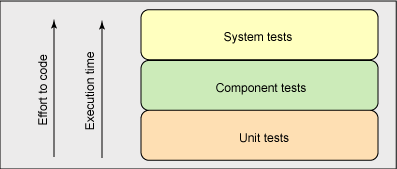

# 追求代码质量: 通过测试分类实现敏捷构建

# 追求代码质量: 通过测试分类实现敏捷构建

*以不同频率运行测试来缩短构建持续期*

人人都认可开发人员测试的重要性，但为什么运行测试还是需要花费太多时间？本月，Andrew Glover 揭示了三种用来确保端到端系统健壮性的测试类型，随后展示了如何按类型来自动排序及运行测试。即使是使用当今大型测试套件，这样做也能显著地减少构建时间。

如果这样说不会（令您）很痛苦的话，请设想您是一名任职于一家 2002 年早期创建的公司的开发人员。在金钱的驱动下，您和您的团队接到了一项任务，即使用最新且最强大的 Java™ API 构建一个大型的数据驱动的 Web 应用程序。您和公司管理层都坚定不疑地相信这就是最终将被称为*敏捷过程* 的东西。从第一天起，您就用 JUnit 构建测试，且把它作为 Ant 构建过程的一部分尽可能频繁地运行。还将设置一个定时任务在夜间运行构建。在接下来的某个时刻，有人会下载 CruiseControl，不断增长的测试套件会在每次签入时运行。

时至今日

经过过去几年的努力，您的公司已经开发了一个庞大的代码库和一个同样庞大的 JUnit 测试套件。一切都很正常，直到大约一年前，测试套件包含了 2000 个测试，同时人们开始注意到运行构建过程用时超过三个小时。在此之前的几个月，由于 CI 服务器资源紧张，您在代码签入时通过 Continuous Integration（CI）停止运行单元测试，并将测试切换到夜间运行，这使得之后的早晨时间非常紧张，于是开发人员努力去弄清楚是什么出错以及为什么出错。

这些天，似乎测试套件整晚极少超过一次运行，为什么会这样呢？因为它们费时太多！没人会仅仅为了弄明白系统是否运行良好而几个小时守在那里。此外，整个测试套件都是在晚上运行，不是吗？

由于测试运行得太不频繁，它们常常充满了错误。因而，您和您的团队开始质疑单元测试的价值：如果它们对代码质量那么重要，那又为什么会让人这么头痛呢？你们的结论是：单元测试有其重要的作用，但必须要能用一种更为敏捷的方式运行它们。

## 尝试测试分类

您所需要的是一个将构建转换到一种更为敏捷状态的策略。您需要这样一种解决方案，使一天当中运行测试的次数超过一次，并使测试套件恢复到要用三个小时才能完 成构建之前的水平。

为完整地恢复整个测试套件，在试图提出一个策略之前，很有必要弄清楚通用术语 “单元测试” 的含义。诸如 “我家有一个动物” 和 “我喜欢车” 这样的表述并不很具体，“我们编写单元测试” 也是一样。这年头，单元测试能代表一切。

就拿之前有关动物和车的表述来说：它们导致了更多的疑问。例如，您家有哪种动物？是一只猫、一条蜥蜴还是一头熊？“我家有一头熊” 和 “我家有一只猫” 截然不同。同样，当和汽车销售员交谈时，只说 “我喜欢车” 没什么用处。您喜欢哪种车：赛车、卡车还是旅行车？任何一个答案都能带来截然不同的结果。

同样，对于开发人员测试来说，按照*类型* 将测试分类也是很有用的。这样做能够实现更为精确的语言，并且能使您的团队以不同的频率运行不同的测试类型。为了避免运行所有 “单元测试” 所需的令人恐惧的三小时构建时间，分类是关键。

* * *

## 三种类型

测试套件可以形象地分为三层，每一层代表一种不同的开发人员测试类型，该测试类型由其运行时间的长短决定。正如在图 1 中看到的那样，每一层都增加了总的构建时间，要么增加了运行时间，要么最终增加了编写时间。

##### 图 1.测试分类的三个层次



底层由运行时间最短的测试构成，可以想象的到，它们也最易于编写。这些测试占用的代码量也是最少的。顶层由更高级别的测试构成，这些测试占用了应用程序更大的部分。这些测试有一点难于编写，执行时间也要长得多。中间层是处于这两个极端中间的测试类型。

三种类型如下所示：

*   单元测试
*   组件测试
*   系统测试

让我们分别来看一下。

## 改进代码质量

别错过 Andrew 的相关 [讨论论坛](http://www.ibm.com/developerworks/forums/dw_forum.jsp?S_TACT=105AGX52&cat=10&S_CMP=cn-a-j&forum=812)，里面有关于代码语法、测试框架以及如何编写专注于质量的代码的帮助。

## 1\. 单元测试

单元测试*隔离地* 验证一个或多个对象。单元测试不处理数据库、文件系统或任何可能延长测试运行时间的内容；因而，从第一天就可以编写单元测试。事实上，这也正是 JUnit 设计的确切目的所在。单元测试的隔离概念有无数的模拟对象库作后盾，这些库便利了将一个特定的对象从其外部依赖项中隔离出来。而且，单元测试能够在真正要测试的代码前编写 —— 由此有了*测试优先开发* 的概念。

单元测试通常易于编写，因为它们并不依靠于架构的依赖项，且通常运行得很快。缺点是，独立的单元测试只能覆盖稍显有限的代码。单元测试的重大价值在于：它们使开发人员能够在尽可能低的层面上保证对象的可靠性。

由于单元测试运行得如此之快且如此易于编写，代码库中应包含许多单元测试，并且应该尽可能多地运行它们。在执行构建时，应该*经常* 运行它们，不管是在机器上，还是在 CI 环境的上下文中（这意味着，代码一经签入 SCM 环境，就要运行单元测试）。

* * *

## 2\. 组件测试

组件测试验证多个相互作用的对象，但它突破了隔离的概念。由于组件测试处理一个架构的多个层次，所以它们经常用于处理数据库、文件系统、网络元素等。同样，提前编写组件测试有点难，所以将其包含至一个真正的测试优先/测试驱动的场景中是很大的挑战。

编写组件测试要花更长的时间，因为它们比单元测试所涉及的东西要多。另一方面，由于其宽广的范围，它们实现了比单元测试更广的代码覆盖率。当然它们也要花更多时间运行，所以同时运行很多的组件测试会*显著地* 增加总的测试时间。

许多框架有助于测试大型架构组件。DbUnit 是这类框架的一个典型例子。DbUnit 能够很好地处理在测试状态间建立一个数据库这样的复杂性，因而它会使编写依赖于数据库的测试变得较为简单。

当构建的测试延长时，通常都预示着包含了一个大型的组件测试套件。由于这些测试比真正的单元测试运行时间长，因而不能一直运行它们。相应地，在 CI 环境中这些测试可以*至少* 每小时运行一次。在签入任何代码前，也应该总在一个本地开发人员机器上运行这些测试。

## 验收测试

*验收测试* 和功能测试类似，不同之处在于，理想情况下，验收测试是由客户或最终用户编写的。正如功能测试一样，验收测试也像最终用户测试那样进行。Selenium（参见 参考资料）是一个备受瞩目的验收框架，它使用浏览器测试 Web 应用程序。Selenium 在构建过程中可以是自动运行的，就像 JUnit 测试一样。但 Selenium 是一个新平台：它不使用 JUnit，在使用方式上也不相似。

## 3\. 系统测试

系统测试*端到端地* 验证一个软件应用程序。因而，它们引入了一个更高级别的架构复杂度：整个应用程序必需为要进行的系统测试而运行。如果是一个 Web 应用程序，您就需要访问数据库以及 Web 服务器、容器和任何与运行系统测试相关的配置。其遵循这样的原则，即大多数系统测试都在软件生命周期的较后周期中编写。

编写系统测试是个挑战，也需要大量的时间来实际地执行。而另一方面，就架构性代码覆盖率来讲，系统测试是一件极为划算的事情。

系统测试和功能测试很相似。所不同的是，它们并不仿效用户，而是*模拟出* 一个用户。与在组件测试中一样，现在创建了大量的框架来为这些测试提供方便。例如，jWebUnit 通过模拟一个浏览器来测试 Web 应用程序。

## 用 jWebUnit 还是 Selenium 呢？

jWebUnit 是为系统测试设计的一个 JUnit 扩展框架；因而它需要您来编写测试。Selenium 在验收测试和功能测试方面表现卓越，不同于 jWebUnit，它使非程序员也能够编写测试。理想情况下，团队可以*同时* 使用两种工具来验证应用程序的功能。

## 实现测试分类

所以，您的单元测试套件就是名副其实的包括单元测试、组件测试和系统测试的套件。不仅如此，在检查了这些测试后，您现在知道构建花了三个小时的原因是：绝大部分时间都被组件测试所占用。下一个问题是，如何用 JUnit 实现测试分类？

有几种方式可选，但这里我们只关注于其中两种最简单的方式：

*   根据所需种类创建定制的 JUnit 套件文件。
*   为每种测试类型创建定制目录。

## 用 TestNG 进行测试分类

用 TestNG 实现测试分类相当简单。用 TestNG 的 `group` 注释按照种类在逻辑上划分测试，这与将适当的 `group` 注释应用到所需测试中一样简单。这样一来，运行一个特定类型实际上就是将一个相应的组名称传递给一个测试运行程序，如 Ant。

## 创建定制套件

可以使用 JUnit 的 `TestSuite` 类（属于 `Test` 类型）来定义许多互相归属的测试。首先，创建一个 `TestSuite` 实例，并为其添加相应的测试类或测试方法。然后，可以通过定义一个叫做 `suite()` 的 `public static` 方法，在 `TestSuite` 实例中指定 JUnit。包含的所有测试随后将在单个运行中执行。因而，可以通过创建单元 `TestSuite`、组件 `TestSuite` 和系统 `TestSuite` 来实现测试分类。

例如，清单 1 中显示的类创建了一个 `TestSuite`，其持有 `suite()` 方法中所有的组件测试。请注意此类并不是非常特定于 JUnit 的。它既没有扩展 `TestCase`，也没有定义任何测试用例。但它会反射性地找到 `suite()` 方法并运行由它返回的所有测试。

##### 清单 1\. 用于组件测试的 TestSuite

```
package test.org.acme.widget;

import junit.framework.Test;
import junit.framework.TestSuite;
import test.org.acme.widget.*;

public class ComponentTestSuite {

 public static void main(String[] args) {
  junit.textui.TestRunner.run(ComponentTestSuite.suite());
 }

 public static Test suite(){
  TestSuite suite = new TestSuite();
  suite.addTestSuite(DefaultSpringWidgetDAOImplTest.class);
  suite.addTestSuite(WidgetDAOImplLoadTest.class);
  ...
  suite.addTestSuite(WidgetReportTest.class);
  return suite;
 }
} 
```

定义 `TestSuite` 的过程的确需要浏览现有的测试，并将它们添加到相应的类中（即，将所有的单元测试添加到一个 `UnitTestSuite` 中）。这也意味着，由于在一个给定分类中编写新测试，不得不将它们按照一定的程序添加到适当的 `TestSuite` 中，当然，还需要*重新编译* 它们。

运行独立的 `TestSuites`，然后试着创建单一的 Ant 任务，Ant 任务调用正确的测试集。可以定义一个 `component-test` 任务，用于组织 `ComponentTestSuite` 等，正如清单 2 中所示：

##### 清单 2\. 只运行组件测试的 Ant 任务

```
<target name="component-test" 
           if="Junit.present" 
           depends="junit-present,compile-tests">
 <mkdir dir="${testreportdir}"/>   
 <junit dir="./" failureproperty="test.failure" 
             printSummary="yes" 
             fork="true" haltonerror="true">
   <sysproperty key="basedir" value="."/>     
   <formatter type="xml"/>      
   <formatter usefile="false" type="plain"/>     
   <classpath>
    <path refid="build.classpath"/>       
    <pathelement path="${testclassesdir}"/>        
    <pathelement path="${classesdir}"/>      
   </classpath>
   <batchtest todir="${testreportdir}">
    <fileset dir="test">
     <include name="**/ComponentTestSuite.java"/>                 
    </fileset>
   </batchtest>
 </junit>
</target> 
```

理想情况下，还需要有调用单元测试和系统测试的任务。最后，在想要运行整个测试套件时，应该创建一个依赖于所有三种测试种类的第四项任务，如清单 3 中如示：

##### 清单 3\. 用于所有测试的 Ant 任务

```
<target name="test-all" depends="unit-test,component-test,system-test"/> 
```

创建定制 `TestSuite` 是实现测试分类的一个快速解决方案。这个方法的缺点是：一旦创建新测试，就必须通过编程将它们添加到适当的 `TestSuite` 中，这很痛苦。为每种测试创建定制目录更具扩展性，且允许*不* 经过重新编译就添加新的经过分类的测试。

* * *

## 创建定制目录

我发现，用 JUnit 实现测试分类最简单的方法是将测试在逻辑上划分为与其测试类型相应的特定目录。使用这项技术，所有的单元测试将驻留在一个 *unit* 目录中，所有的组件测试将驻留在一个 *component* 目录中，依此类推。

例如，在一个保存所有未分类测试的 *test* 目录中，可以创建三个新的子目录，如清单 4 所示：

##### 清单 4\. 实现测试分类的目录结构

```
acme-proj/
       test/
          unit/
          component/
          system/ 
          conf/ 
```

为运行这些测试，必需至少定义四个 Ant 任务：为单元测试定义一个，为组件测试定义一个，依此类推。第 4 项任务是一个方便的任务，它运行所有三种测试类型（如 清单 3 所示）。

该 JUnit 任务和 清单 2 中定义的任务非常相似。所不同的是该任务 `batchtest` 方面的一个细节。此时，`fileset` 指向一个具体的目录。在清单 5 的例子中，它指向 *unit* 目录。

##### 清单 5\. 用于运行所有单元测试的 JUnit 任务的批量测试方面

```
<batchtest todir="${testreportdir}">
 <fileset dir="test/unit"> 
  <include name="**/**Test.java"/>       
 </fileset>
</batchtest> 
```

请注意，这个测试只运行 *test/unit* 目录下的所有测试。当创建了新的单元测试（或针对此问题的任何其他测试），只需要将它们放到该目录下，一切就准备妥当了！比起需要将一行新代码添加到 `TestSuite` 文件并进行重新编译，这样还是多少简单了一点。

* * *

## 问题解决了！

回到最初的场景中，假设您和您的团队认为使用特定目录是针对构建时间问题的最具扩展性的解决方案。该任务最困难的地方是检查及分配测试类型。您重构了 Ant 构建文件并创建了 4 项新任务（为单个的测试类型创建了三项，为运行所有这些测试类型创建了一项）。不仅如此，您还修改了 CruiseControl，从而只在（代码）签入时运行真正的单元测试，并以小时为基础运行组件测试。在进一步检查之后，发现系统测试也可以按小时运行，所以您创建了一个将组件测试和系统测试一起运行的额外任务。

最终结果是，测试每天都运行很多次，您的团队能够更快地发现集成错误 —— 通常在几个小时之内。

当然，创建敏捷性构建并未解决全部问题，但它在确保代码质量方面确实扮演了至关重要的角色。测试运行得更加频繁了，针对开发人员测试价值的顾虑成为一段遥远的记忆。另外，更重要的是，现在 2006 年您的公司获得了极大的成功！