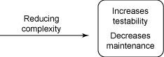
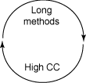
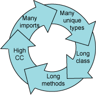
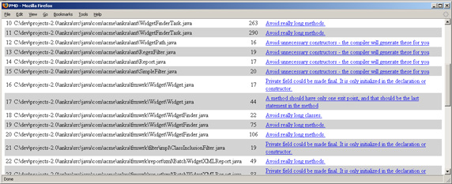
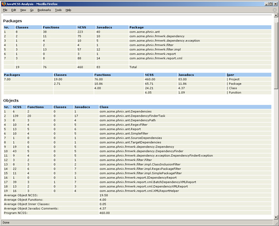

# 追求代码质量: 驯服复杂的冗长代码

# 追求代码质量: 驯服复杂的冗长代码

*测量代码是否冗长的工具和度量*

只是从远处看一眼乱七八糟四处蔓延的代码块，开发人员就会感到心惊肉跳 —— 这很正常！冗长的代码常常是复杂性的标志，会导致代码难以测试和维护。本月将学习三种测试代码复杂性的重要方法，它们分别基于方法长度、类长度和内部类耦合。在这一期的 *追求代码质量* 系列文章中，专家 Andrew Glover 将向您展示如何使用诸如 PMD 和 JavaNCSS 之类的工具，在您需要的时候获得更高的精度。

我毫不惭愧地承认，在看到复杂的代码块时，我也会感到恐惧和心里发毛。事实上，我敢说您在遇到大量方法和乱七八糟四处蔓延的类时，*也会* 有些心里发毛的。不能说在这些情况下寻求退路的人不是完人，这只是优秀开发人员的一种本能。过于复杂的代码难以测试和维护，这通常还意味着更高的出错率。

我在 本系列前面的文章 中已经解释了圈复杂性，它是令人讨厌的代码的一种先兆。具有高圈复杂度值的测试方法几乎总是把事情弄得一团糟，无法轻易收场。上一个月，我向您展示了如何使用 Extract Method 模式重构您的代码，从而将您带出迷宫。降低方法的复杂度可以使代码更易于测试和维护，如图 1 所示：

##### 图 1\. 降低复杂度可以使代码更易于维护和测试



不过，圈复杂性并不是确定高风险代码的惟一复杂性度量。您还可以利用类长度、方法长度和内部类耦合。这些度量之间存在着错综复杂的关联，但是很容易发现这些关联。这个月，我将解释它们为什么那么重要，以及如何使用 PMD 和 JavaNCSS 跟踪它们。

## 代码太多了！

了解简单代码和流畅代码之间的区别非常重要。简单代码不必过分简单或易于编写，只需*易于理解* 即可。您可以使用 C++ 编写简单代码，就像使用 Visual Basic 编写它们那样。不过，用任何语言*反简化* 代码的最快方式都是一次编写大量的代码。

## 提高代码质量

不要错过 Andrew 的 [讨论论坛](http://www.ibm.com/developerworks/forums/dw_forum.jsp?S_TACT=105AGX52&cat=10&S_CMP=cn-a-j&forum=812)，可从中获得大多数紧急问题的答案。

考虑一下如何将此规则应用于方法和类。大多数人对记住信用卡号感到头疼的一个简单原因是，我们一次只能管理 7(±2) 片数据。了解了这一点，就会明白过多的条件会给以后带来麻烦，使测试和维护变得很困难。相同的原理也可以应用于逻辑块。

所有给定代码主体通常包含已分组的语句，它们拥有共同的目标，比如创建一个集合，将数据项添加到该集合中。但是，在一个长方法（long method）中分组数量众多的逻辑块可能会让人很快忘记该方法的总体意图，因为很少有人可以有效处理这样一个大的数据集。恰恰是这个缺点带来了代码基中的维护问题。冗长的方法是缺陷的避风港，因为很少有人可以有效地分析它们。长方法不仅完成太多的工作，也需要人们费很大的劲去理解！

就像长方法会让开发人员讨厌一样，长类（long class）也会令开发人员讨厌。相同的讨论也可以应用于总体代码，冗长的类可能会做太多的工作，并承担太多的责任。

### 什么样才算太长？

当然了，长方法或类的划分有点主观。有一个很有帮助的经验法则，您可以说非代码注释行超过 100 行的方法是长方法。不过，实际的数值是根据谈论的人而变化的。就我而言，截止点（cutoff point）大约是 50 行代码，但有些开发人员会说，如果某一方法需要您向下滚动整整一天才能看完，那么该方法太长了。截止点的定义取决于您自己。

类似地，您必须有自己的确定正确类大小的良好判断。许多人所提倡的一条经验法则是，类的代码行超过 1,000 行就可以说该类太长了。而另一些人则认为最好不要超过 500 行代码。

* * *

## 内部类耦合

对于一对象与其他对象之间的关系，复杂模式会不断重复其自身。对于导入许多外部依赖项或者拥有许多 `public` 方法的类，不但理解起来有些困难，而且所带来的责任重担的增加也会导致某种*脆弱*。

我将从依赖项开始。如果某一对象导入的外部类超过 80 个（不包括普通的 Java™ 系统库），那么就可以说该类具有高度*输出耦合*，这意味着更改导入的类可能会影响该类本身。在最糟糕的情况下，如果导入的是具体的类，并且它们的行为发生更改，那么执行导入的类可能会中断！（请参阅 参考资料，了解关于输出耦合的更多信息。）

观察对象导入的数量就很容易预测脆弱性，但如果使用 `.*` 符号（例如 `com.acme.user.*`）导入整个包，则很可能产生误导。为了更精确起见，可能需要注意对象所拥有的*惟一类型* 的数量（该数量可通过解析代码获得 —— *不是*`import` 语句）。如果应用程序的包结构大致上以某种在少数包中包含许多类的方式设计，则惟一类型度量（types metric）可能很有帮助。

包含许多 `public` 方法的类也有许多导入。这些类通常会成为代码基的中心，就像 Facades 或工具类那样。因为存在这种责任（通过大量 `public` 方法导出），所以它们具有高度的输入耦合，也会导致反向的脆弱性。如果这些类中的任何一个发生更改，各种表面上不相关的应用程序部分*可能* 发生中断。

* * *

## 复杂性是如何产生关联的

到目前为止，所给出的模式都在暗示臃肿的代码（长方法、太多的 public 方法、过多的条件和导入，等等）将影响可读性、可测试性和可维护性。因为该模式用各种度量来重复自己，所以所有这些因素都会导致*相互关联*。例如，长方法通常得容忍高圈复杂度值，如图 2 所示：

##### 图 2\. 长方法与圈复杂性相互关联



不过，相关性并不止于此。具有过多导入的类会有许多惟一类型。这些类通常非常大。而大型的类通常拥有长方法，长方法又常常有很高的圈复杂度值。图 3 展示了复杂性度量是如何相关的：

##### 图 3\. 复杂性度量是如何相关的



* * *

## PMD 和 JavaNCSS

少量的繁琐代码可用 PMD 和（更小范围的）JavaNCSS 轻松处理，很容易结合使用这两种工具，以构建诸如 Ant 和 Maven 之类的平台。

可以将 PMD 看作是基于规则的引擎，它分析源代码并报告正被违反的某一规则的所有实例。PMD 目前定义了大约 200 个规则，其中一些特定规则是针对方法长度、类长度和惟一类型的，还有一些用于计算 `public` 方法。您还可以定义定制规则和修改现有规则（例如，为了反映域的需求）。

### 定制 PMD

例如，我将使用 PMD 的经过恰当命名的 ExcessiveMethodLength 规则来发现长方法。此规则的默认长度阈值是 100（这意味着如果某个所扫描方法的长度超过 100 行，则 PMD 会报告出现一个违规），但是如果您喜欢的话，可以降低该阈值。

PMD 规则可以定义属性，通过站在 PMD 开发团队的角度很好地进行预见，您可以通过使用规则集文件在运行的时候覆盖这些属性。要将 ExcessiveMethodLength 规则的默认值从 100 降低到 50，可以将 `properties` 元素添加到 `rule` 定义中并引用属性的名称。在清单 1 中，我将一个名为 `minimum` 的属性添加到了 PMD `rule` 定义中：

##### 清单 1\. 定制 ExcessiveMethodLength 规则

```
<rule ref="rulesets/codesize.xml/ExcessiveMethodLength">
 <properties>
  <property name="minimum" value="50"/>
 </properties>
</rule> 
```

用 Ant 工具调用带有定制规则集文件的 PMD 需要通过 PMD 任务的 `rulesetfiles` 属性提供一条到该定制文件的路径，如清单 2 中所示：

##### 清单 2\. 引用定制规则集文件

```
<pmd rulesetfiles="./tools/pmd/rules-pmd.xml">
 <formatter type="xml" toFile="${defaulttargetdir}/pmd_report.xml"/>
 <formatter type="html" toFile="${defaulttargetdir}/pmd_report.html"/>
 <fileset dir="./src/java">
  <include name="**/*.java"/>
 </fileset>
</pmd> 
```

PMD 报告由源文件导致的违规，正如您在图 4 中可以看到的，在本例中，只有少数几个方法的源代码行超过了 50 行：

##### 图 4\. PMD Ant 报告的示例



对于长类，PMD 有 ExcessiveClassLength 规则，长类的默认值为 1,000 行代码。对于 ExcessiveMethodLength 规则，很容易使用更适合的值覆盖默认值。此外，PMD 还有一个用来计算惟一类型的规则，即 CouplingBetweenObjects 规则。要计算导入，请参见 ExcessiveImports 规则。这两个规则都是可配置的。

### 使用 JavaNCSS 测量代码是否冗长

PMD 定义了用来分析源代码的特定规则，与 PMD 相对，JavaNCSS 分析代码基并报告*所有一切* 与代码长度相关的事项，包括类大小、方法大小和类中找到的方法数量。对于 JavaNCSS，阈值无关紧要，它计算所找到的每个文件并报告值，而*不管* 大小如何。尽管与 PMD 相比较而言，这类数据看起来似乎有些呆板（并且可能有点罗嗦！），但它有它存在的道理。

通过报告所有文件大小，JavaNCSS 使理解相关值成为可能，而 PMD 常常难以做到这一点。例如，PMD 只报告违规的文件，这意味着只理解部分代码基的数据，而 JavaNCSS 在上下文中提供了代码长度数据，如图 5 所示：

##### 图 5\. JavaNCSS Ant 报告的示例



* * *

## 结束语

绿地开发（greenfield development）是指开发团队首先开发一个空白的 IDE 控制台，并用漂亮、简洁的代码填充它，这只是软件应用程序生存期中一个*非常小* 的片段。如今，很多跨国企业仍然在运行基于 COBOL 的应用程序，从开发人员的角度看，这意味着要与您不认识的人在很久以前编写的代码作斗争。

在遇到这样的难题时，通常会令人感到非常厌恶，您只能在连续几天的时间里声称自己生病了进行逃避。随后的某一时刻，您必须面对大量代码块并将它们搞定。使用针对类长度、方法长度和内部类耦合的复杂性度量（即对象导入和惟一类型）是理解您所面临的困难的第一步。从一些与类大小和方法大小有关的经验法则开始，然后使用诸如 PMD 和 JavaNCSS 之类的工具详细介绍。

当第一次在遗留代码基上使用复杂性度量时，您将了解到一个庞大的数量，但不要就此停住脚步。通过继续监视复杂性度量，您可以作出更明智的决定，并在不断扩展和维护代码时降低风险。