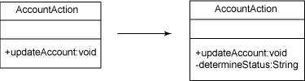
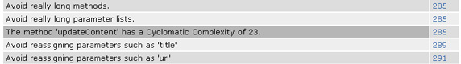

# 追求代码质量: 用代码度量进行重构

# 追求代码质量: 用代码度量进行重构

*用代码度量和提取方法模式进行目的明确的重构*

在 [*追求代码质量*](http://www.ibm.com/developerworks/cn/views/java/articles.jsp?view_by=search&search_by=%E8%BF%BD%E6%B1%82%E4%BB%A3%E7%A0%81%E8%B4%A8%E9%87%8F) 的前一期中，学习了如何用代码度量客观地测量代码质量。这个月，Andrew Glover 将介绍如何使用相同的度量方法和提取方法模式进行有针对性的重构。

在我上中学的时候，有一位英语教师说：“写作就是重写别人*已经* 重写过的东西。” 直到大学，我才真正理解了他这句话的意思。而且，当我自觉地采用这个实践的时候，就开始喜欢上了写作。我开始为我写的东西自豪。我开始真正在意我的表达方式和要传达的内容。

当我开始开发人员生涯时，我喜欢阅读有经验的专家编写的技术书籍，而且想知道为什么他们花这么多时间编写代码。那时，编写代码看起来是件容易的工作 —— 有些人（总是比我级别高的人）会给我一个问题，而我会用任何可行的方法解决它。

直到我开始与其他开发人员合作大型项目，才开始理解我的技能的真正意义所在。我也就在这个时候起，开始有意识地关心我编写的代码，甚至关心起*其他人* 编写的代码。现在我知道了，如果不注意代码质量，那么迟早它们会给我造成一团乱麻。

## 提高代码质量

不要错过 Andrew 的附带 [讨论组](http://www.ibm.com/developerworks/forums/dw_forum.jsp?S_TACT=105AGX52&cat=10&S_CMP=cn-a-j&forum=812) ，可以在这里得到最迫切问题的答案。

我*恍然大悟* 的一刻出现在 1999 年底，那时我正在阅读 Martin Fowler 那本影响重大的书 *Refactoring: Improving the Design of Existing Code（重构：改进现有代码的设计*，这本书对一系列重构模式进行分类，并由此建立了重构的公共词汇。在此之前，我一直都在重构我的代码（或者其他人的代码），但是却不知道自己做的就是重构。现在，我开始为我编写和重构的代码感到更加自豪，因为我做的工作正是在促进代码的编写方式并让它们日后更易维护。

## 什么是重构？

按照我的观点，重构就是改进*已经改进的* 代码的行为。实际上，重构是个永不停止的代码编写过程，它的目的是通过结构的改进而提高代码体的可维护性，*但却不* 改变代码的整体行为。重要的是要记住重构与*重写* 代码明显不同。

重写代码会修改代码的行为甚至合约，而重构保持对外接口不变。对于重构方法的客户机来说，看不到区别。事情像以前一样工作，但是工作得更好，主要是因为增强的可测试性或者明显的性能提升。

### 主动和被动重构

那么问题就变成了*“我怎么才能知道什么时候该进行重构呢？”* 一段代码的可维护性是个主观的问题。但是，我们中的多数人都会发现，维护自己编写的代码要比维护其他人编写的代码容易得多。但在这点上也有争议 —— 在整个职业生涯中维护自己的代码是最大挑战。没有几个真正的 “代码牛仔” 足够幸运地能够不断地变换工作，而不必修改其他人的代码。对于我们中的多数人来说，必须维护其他人的代码恰恰是程序员生活的一部分。决定代码是否需要重构的方法，通常是*主观的*。

但是，也有可能客观地判断代码是否应当重构，不论是自己的代码还是别人的代码。在 这个系列前面的文章中，我介绍了如何用代码度量客观地测试代码质量。实际上，可以用代码度量很容易地找出可能难以维护的代码。一旦客观地判断出代码中有问题，那么就可以用方便的重构模式改进它。

## 总是运行测试用例！

重构别人编写的代码的秘诀是*不要把它弄得更糟*。在我重构生涯的早期，学到的一件事就是*在修改一些东西之前* 拥有一个测试用例很重要。我是通过艰苦的一夜，在我自己整理得很好的重构方法中苦苦寻觅，只为找到一个我不小心破坏的别人编写的工作正常的代码之后学到这个教训的，不小心破坏的原因就在于重构之前没有对应的测试用例。请注意我的警告，在自己进行重构之前，总是要运行测试用例！

## 提取方法模式

Martin Fowler 的书出版之后的几年中，增加了许多新的重构模式分类；但是，迄今为止最容易学习的模式，也可能是最有效的模式，仍然是*提取方法（Extract Method）* 模式。在这个模式中，方法的一个逻辑部分被移除，并被赋予自己的方法定义。现在被移走的方法体被新方法的调用代替，如图 1 的 UML 图所示：

##### 图 1\. 提取方法模式实践



提取方法模式提供了两个关键好处：

*   原来的方法现在更短了，因此也更容易理解。
*   移走并放在自己方法中的逻辑体现在更容易测试。

* * *

## 降低圈复杂度

在使用的时候，对于被高度圈复杂度值感染的方法来说，提取方法是一剂良药。您可能会记得，圈复杂度通过度量方法的路径数量；所以，可以认为如果*提取* 出其中一些路径，重构方法的整体复杂性会降低。

例如，假设在运行了像 PMD 这样的代码分析工具之后，结果报告显示其中一个类包含的一个方法有较高的圈复杂度值，如图 2 所示：

##### 图 2\. 圈复杂度值高达 23！



在仔细查看了这个方法之后，发现这个方法过长的原因是使用了太多的条件逻辑。正如我以前在这个系列中指出的（请参阅 参考资料），这会增加方法中产生缺陷的风险。谢天谢地，`updateContent()` 方法还有个测试用例。即使已经认为这个方法有风险，测试也会减轻*一些* 风险。

另一方面，测试已经精心地编写成可以测试 `updateContent()` 方法中的 23 个路径。实际上，好的规则应当是：应当编写*至少 23 个测试*。而且，要想编写一个测试用例，恰好能隔离出方法中的第 18 个条件，那将是极大的挑战！

### 小就是美

是否真的要测试长方法中的第 18 个条件，是个判断问题。但是，如果逻辑中包含真实的业务值，就会想到测试它，这个时候就可以看到提取方法模式的作用了。要把风险降到最小很简单，只需把条件逻辑分解成更小的片段，然后创建容易测试的新方法。

例如，`updateContent()` 方法中下面的这小段条件逻辑创建一个状态 `String`。如清单 1 所示，逻辑的隔离看起来足够简单：

##### 清单 1\. 条件逻辑成熟到可以进行提取

```
//...other code above

String retstatus = null;
if ( lastChangedStatus != null && lastChangedStatus.size() > 0 ){
 if ( status.getId() == ((IStatus)lastChangedStatus.get(0)).getId() ){
  retstatus = "Change in Current status";
 }else{
  retstatus = "Account Previously Changed in: " + 
    ((IStatus)lastChangedStatus.get(0)).getStatusIdentification();
 }
}else{
  retstatus = "No Changes Since Creation";
}

//...more code below 
```

通过把这一小段条件逻辑提取到简洁的新方法中（如清单 2 所示），就做到了两件事：一，把 `updateContent()` 方法的整体复杂性降低了 5；二，逻辑的隔离很完整，可以容易地对它进行测试。

##### 清单 2\. 提取方法产生 getStatus

```
private String getStatus(IStatus status, List lastChangedStatus) {
  String retstatus = null;
  if ( lastChangedStatus != null && lastChangedStatus.size() > 0 ){
    if ( status.getId() == ((IStatus)lastChangedStatus.get(0)).getId() ){
      retstatus = "Change in Current status";
    }else{
      retstatus = "Account Previously Changed in: " + 
        ((IStatus)lastChangedStatus.get(0)).getStatusIdentification();
    }
  }else{
    retstatus = "No Changes Since Creation";
  }
  return retstatus;
} 
```

现在可以把 `updateContent()` 方法体中的一部分替换成对新创建的 `getStatus()` 方法的调用，如清单 3 所示：

##### 清单 3\. 调用 getStatus

```
//...other code above

String iStatus = getStatus(status, lastChangedStatus);

//...more code below 
```

请记住运行现有的测试，以验证什么都没被破坏！

* * *

## 测试私有方法

您将注意到在 清单 2 中定义的新 `getStatus()` 方法被声明为 `private`。这在想验证*隔离的* 方法的行为的时候就形成了一个有趣的挑战。有许多方法可以解决这个问题：

*   把方法声明成 `public`。
*   把方法声明成 `protected`，并把测试用例放在同一个包中。
*   在父类中建立一个内部类，这个内部类是个测试用例。

还有另一个选择：保留方法现有的声明不变（即 `private`），并采用优秀的 JUnit 插件项目来测试它。

### PrivateAccessor 类

JUnit 插件项目有一些方便的工具，可以帮助 JUnit 进行测试。其中最有用的一个就是 `PrivateAccessor` 类，它把对 `private` 方法的测试变成小菜一碟，无论选择的测试框架是什么。`PrivateAccessor` 类对 JUnit 没有显式的依赖，所以可以把它用于任何测试框架，例如 TestNG。

`PrivateAccessor` 的 API 很简单 —— 向 `invoke()` 方法提供方法的名称（作为 `String`）和方法对应的参数类型和相关的值（分别在 `Class` 和 `Object` 数组中），就会返回被调用方法的值。在幕后，`PrivateAccessor` 类实际上利用 Java 的反射 API 关闭了对象的可访问性。但是请记住，如果虚拟机有定制的安全性设置，那么这个工具可能无法正确工作。

在清单 4 中，调用 `getStatus()` 方法时两个参数值都设置为 `null`。`invoke()` 方法返回一个 `Object`，所以要转换成 `String`。还请注意 `invoke()` 方法声明它要 `throws Throwable`，必须捕获异常或者让测试框架处理它，就像我做的那样。

##### 清单 4\. 测试私有方法

```
public void testGetStatus() throws Throwable{
  AccountAction action = new AccountAction();

  String value = (String)PrivateAccessor.invoke(action,
      "getStatus", new Class[]{IStatus.class, List.class},
       new Object[]{null, null});

  assertEquals("should be No Changes Since Creation", 
    "No Changes Since Creation", value);
} 
```

请注意 `invoke()` 方法被覆盖成可以接受一个 `Object` 实例（如清单 4 所示）或一个 `Class`（这时期望的 `private` 方法也是 `static` 的）。

还请记住，使用反射调用 `private` 方法会对生成的结果带来一定程度的脆弱性。如果有人改变了 `getStatus()` 方法的名字，以上测试就会失败；但是，如果经常测试，就可以迅速地进行适当的修正。

* * *

## 结束语

在抗击圈复杂度时，请记住大部分编写到应用程序中的路径是应用程序的整体行为所*固有的*。也就是说，很难显著地减少路径的整体数量。重构只是把这些路径放在更小的代码段中，从而更容易测试。这些小的代码段也更容易维护。