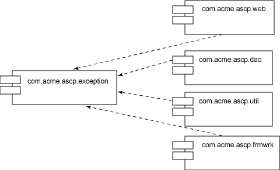
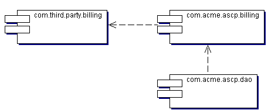
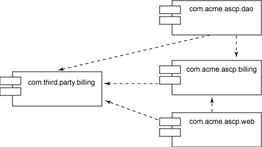
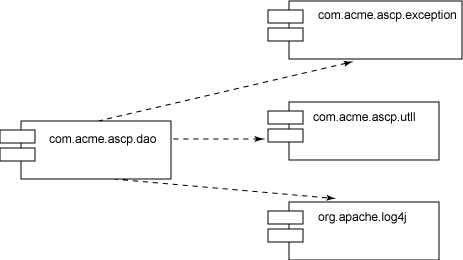
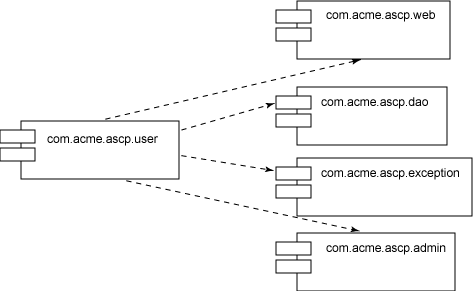
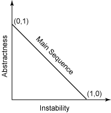
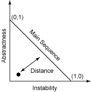

# 追求代码质量: 软件架构的代码质量

# 追求代码质量: 软件架构的代码质量

*使用耦合度量来支持系统架构*

大多数设计良好的软件架构都趋向于支持系统的可扩展性、可维护性和可靠性。遗憾的是，对质量问题的疏忽极可能使软件架构师的努力白费。在[追求代码质量](http://www.ibm.com/developerworks/cn/views/java/articles.jsp?view_by=search&search_by=%E8%BF%BD%E6%B1%82%E4%BB%A3%E7%A0%81%E8%B4%A8%E9%87%8F) 系列的这一期文章中，质量专家 Andrew Glover 解释如何持续地监视并纠正会影响软件架构的长期生存能力的代码质量方面。

[上一期文章中](http://www.ibm.com/developerworks/cn/java/j-cq03316/)，我展示了如何使用代码度量来评估代码质量。尽管在那一期介绍的圈复杂度针对低级细节，如方法中执行路径的数量，但其他类型的度量针对的是代码的更高级方面。在本期文章中，我将展示如何使用各种*耦合度量* 来分析和支持软件架构。

我将从两个比较有趣的耦合度量开始，即*传入耦合* 和*传出耦合*。这些基于整数的度量表示几个相关对象（即相互协调以产生行为的对象）。任一度量中高数值表示架构的维护问题：高传入耦合表示对象具有太多职责，而高传出耦合表示对象不够独立。在本期文章中，我将介绍每个这样的问题及其解决的方法。

## 传入耦合

具有太多职责并非什么坏事。例如，组件（或包）通常试图用于整个架构中，这就会给它们带来高传入耦合值。核心框架（如 Strut）、登录包（如 log4j）之类的实用工具以及异常层次结构通常具有高传入耦合。

在图 1 中，可以看到一个包 `com.acme.ascp.exception` 具有一个值为 4 的传入耦合。这并不奇怪，因为 `web`、`dao`、`util` 和 `frmwrk` 包都希望利用一个公共的异常框架。

##### 图 1\. 传入耦合的符号

如图 1 所示，`exception` 包具有一个值为 4 的传入耦合（或者叫做 *Ca*），这并非是件坏事。异常层次结构很少会出现很大的改变。监视 `exception` 包的传入耦合是个好主意，然而，由于彻底改变了这个包中的行为或契约，所以将引起它的四个依赖包全都出现连锁反应。

* * *

## 测量抽象性

通过进一步检查 `exception` 包并注意抽象到具体类的比率，可以派生出另一个度量：*抽象性*。在本例中，`exception` 包具有零抽象性，因为它的所有类都是具体的。这与我前面的观察是一致的：`exception` 包中的高度具体性表示对 `exception` 作出的任何更改将影响所有相关包，即 `com.acme.ascp.frmwrk`、`com.acme.ascp.util`、`com.acme.ascp.dao` 和 `com.acme.ascp.web`。

通过理解传入耦合表示组件的职责，并持续监视这个度量，可以防止软件架构出现*熵（entropy）*，即使在大多数设计良好的系统中也很容易出现熵。

* * *

## 支持设计灵活性

很多架构设计在利用第三方包时都考虑到了灵活性。获得灵活性最好是通过使用接口来防止架构在第三方包中发生更改。例如，系统设计师可以创建一个内部*接口包* 来利用第三方记帐代码，但是只对这些使用记帐代码的包公开接口。顺便说一下，这与 JDBC 的工作原理类似。

##### 图 2\. 通过设计获得灵活性

如图 2 所示，acme.ascp 应用程序通过 `com.acme.ascp.billing` 包与第三方记帐包相耦合。这创建了一定级别的灵活性：如果有了另一个第三方记帐包更加有利用价值，那么应该只有一个包会受到变更的影响。此外，`com.acme.ascp.billing` 的抽象性值是 0.8，这表明它可以通过接口和抽象类来防止被修改。

如果要转换到第三方实现，只需要对 `com.acme.ascp.billing` 包进行重构。更好的方法是：通过在设计中考虑灵活性以及了解变更的隐含意义，可以通过开发人员测试来防止修改所造成的任何损害。

在对内部记帐包作出变更前，您可以分析代码覆盖率报告，以确定是否有任何测试*真正* 测试了这个包。找到一些级别的覆盖率后，您可以更仔细地检查这些测试案例来验证它们是否足够了。如果未找到覆盖率，您将会知道，关闭并插入新库的努力将更具风险性并可能花费更长的时间。

使用代码度量收集所有这些似乎正确的信息非常容易。另一方面，如果您根本不了解与测试覆盖率相关的包耦合的知识，那么为替换第三方库确定的时间最多就是个猜测！

* * *

## 监视熵

前面提到过，即使计划得最好的架构也会出现熵。通过团队磨损或未充分记录的意图，没有经验的开发人员可能会疏忽地导入似乎有用的包，不久以后，系统传入耦合的值将开始增长。

例如，将图 3 与 图 2 进行比较。您注意到架构增加的脆弱性了吗？现在不仅 `dao` 包直接利用第三方记帐包，而且另一个甚至不想直接使用任何记帐代码的包也引用了这两个记帐包！

##### 图 3\. 出现代码熵

试图为另一个包关闭 `com.third.party.billing` 包确实很具有挑战性！设想一下降低产生缺陷和中断系统各种行为方面的风险所需的测试脚手架。事实上，像这样的架构很少变更，因为它们无法支持修改。更糟糕的是，即使像对现有组件的升级这样的重要修改也会导致整个代码基中断的事情出现。

* * *

## 传出耦合

如果传入耦合是一些依赖于某个特定组件的组件的话，那么传出耦合则是某个特定组件所依赖的一些组件。可以把传出耦合看作传入耦合的*逆转*。

对于更改如何影响代码来说，传出耦合的引号意义与传入耦合的类似。例如，图 4 描述了 `com.acme.ascp.dao` 包，它具有一个值为 3 的传出耦合（或者叫做 *Ce*）：

##### 图 4\. dao 包中的传出耦合

如图 4 所示，`com.acme.ascp.dao` 包依赖于 `org.apache.log4j`、`com.acme.ascp.util` 和 `com.acme.ascp.exception` 组件来履行其行为契约。与传入耦合中一样，依赖性级别本身并不是什么坏事。重要的是您对耦合的了解以及耦合如何影响对相关组件的更改。

与传入耦合一样，抽象性度量在传出耦合中起作用。在 图 4 中，`com.acme.ascp.dao` 包完全是具体的；因此它的抽象性为 0。这表示其传出耦合包含 `com.acme.ascp.dao` 的组件自己会变得脆弱，因为 `com.acme.ascp.dao` 包与 3 个附加的包具有传出耦合。如果它们中的一个（比如说 `com.acme.ascp.util`）发生更改，将会在 `com.acme.ascp.dao` 中发生连锁反应。因为 `dao` 无法通过接口或抽象类隐藏注入细节，所以任何更改都可能影响它的依赖组件。

* * *

## 耦合与覆盖相加等于……

检查传出耦合的关系数据，并将其与代码覆盖相关联，会促进作出更明智的决策。例如，假设一个新的需求传达给开发团队。您可以将与该需求相关的更改精确到图 4 所示的 `com.acme.ascp.util` 包。而且，在以前几个版本中，依赖于 `util` 并且具有 0 抽象性的 `dao` 包具有很多高优先权的缺陷（非常可能是因为对这个包进行的开发人员测试太有限，有意思的是，最大的可能是由于代码中的高复杂性值引起的）。

在这种情况下，您的优势是了解 `com.acme.ascp.util` 和 `com.acme.ascp.dao` 之间的关系。知道 `dao` 包依赖于 `util` 这一事实告诉您，为支持新需求而在 `util` 中进行的任何修改可能会对易出故障的 `dao` 包产生负面的影响！

看到这个链接将帮助进行风险评估，甚至帮助进行工作级别的分析。如果未注意到这个链接，您可能已经猜到将需要快速编码工作来支持新需求。如果已经看到这个链接，就可以分配适当的时间和资源来降低 `dao` 包中的间接损害。

* * *

## 监视依赖性

正像连续地监视传入耦合可以揭示架构设计中的熵一样，监视传出耦合也有助于发现不必要的依赖性。例如，在图 5 中，似乎在一些地方有人决定 `com.acme.ascp.web` 包要为 `com.acme.ascp.user` 提供内容。在 `user` 包中的某处，一个或多个对象正在实际从 `web` 包导入一个对象。

##### 图 5\. user 包中的传出耦合

很明显，这并非架构设计最初意图。但是，由于您一直针对传出耦合而监视系统，所以可以轻松地重构并改正这些不一致。或许，`web` 包中有用的实用工具对象应该移动到实用工具包，以便其他包可以利用它而不会引起不必要的依赖性。

* * *

## 测量不稳定性

您可以将系统的传出耦合和传入耦合的数量结合起来，形成另一个度量：*不稳定性*。通过将传出耦合除以传出传入耦合的和（`Ce / (Ca + Ce)`），可以生成一个比率，表示一个稳定的包（值接近于 0）或者不稳定的包（值接近于 1）。如这个等式所示，传出耦合对包的稳定性*起作用*：一个包越依赖于其他包，面对更改时它越容易受到连锁反应的影响。反过来说，一个包越被依赖，它越不可能发生更改。

例如，在图 5 中，`user` 包的不稳定性值为 1，这表示它有一个值为 4 的传出耦合，而没有传入耦合。像 `com.acme.ascp.dao` 这样的包中的更改*将会* 影响 `user` 包。

在设计和实现架构时，依赖于稳定的包是有益的，因为这些包不太可能更改。类似地，不稳定的包依赖性会在发生更改时增大架构内发生间接损害的风险。

* * *

## 到主序列的距离

到目前为止，我已经介绍了传入耦合和传出耦合，前者可用来评估更改包造成的影响，后者可用来评估外界的更改如何影响包。我还谈及了抽象性度量和不稳定性度量，前者在您想要了解如何轻松地对包进行修改时很有用，后者可用来了解包依赖性如何影响某个特定的包。

还可以使用另一个度量来了解影响软件架构的因素。这个度量通过 X, Y 坐标上的一条直线来平衡抽象性和不稳定性。*主序列* 是笛卡儿坐标上从 `X=0` 和 `Y=1` 到 `X=1` 和`Y=0` 的一条直线，如图 6 所示：

##### 图 6\. 主序列

通过沿着这条直线绘制包并测量它们到主序列的距离，可以推断包的*平衡*。如果包对于抽象性和不稳定性是平衡的，它的距离就接近于 0，如果包不平衡，那么它距离主序列的距离就接近于 1，如图 7 所示：

##### 图 7\. 到主序列的距离

检查*到主序列的距离* 度量会产生有趣的结果。例如，上面的 `user` 包生成的值为 0。就一个实现包来说，这个包是平衡的，即高度不稳定。

总体来说，“到主序列的距离” 度量尝试补偿实际实现。没有代码基包含所有抽象性和不稳定性值为 1 或 0 的包 —— 多数包的值位于这两个数字之间。通过监视 “到主序列的距离” 度量，可以衡量包是否正在变得不平衡。寻找偏远的值，如值接近于 1 的包（这表示它们距离主序列尽可能地远），有助于了解特定的不平衡如何影响架构的可维护性（例如，通过脆弱性）。

* * *

## 结束语

在本期文章中，您已经了解几种可以持续监视的架构度量。通过代码分析工具可以报告传入和传出耦合、不稳定性、抽象性、到主序列的距离，这些代码分析工具包括 JDepend、JarAnalyzer 和 Metrics plug-in for Eclipse（参见 参考资料）。监视系统的代码耦合度量有助于您掌握可破坏架构的常见趋势，即设计刚度、包熵和不必要的依赖性。此外，根据抽象性和不稳定性来测量系统平衡将使您不断的了解系统的可维护性。