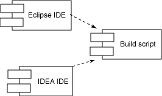
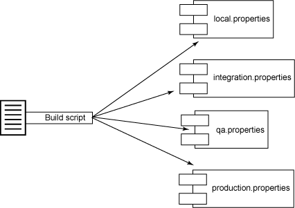
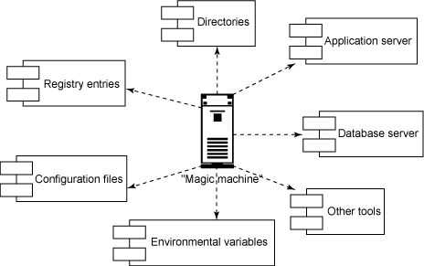

# 让开发自动化: 除掉构建脚本中的气味

# 让开发自动化: 除掉构建脚本中的气味

*创建一致、可重复、可维护的构建*

您把多少时间花在维护项目构建脚本上？也许远远超出您预期的或者可以忍受的时间。其实大可不必遭受如此痛苦的经历。在这一期的*让开发自动化* 中，开发自动化专家 Paul Duvall 将演示如何改进很多常见的妨碍团队创建一致的、可重复的、可维护的构建的实践。

当描述代码之类的东西时，我不喜欢 “气味（smell）”这个词。因为用拟人的手法来谈论比特和字节往往令人觉得很怪异。并不是说“气味”这个词不能准确地反映出某种表明代码可能有错误的症状，只是我觉得这样听起来很滑稽。然而，我依然选择再次用这种令人厌烦的方式来描述软件构建，坦白说，这是因为这些年我见过的很多构建脚本都*散发着难闻的气味*。

在创建构建脚本时，即使是伟大的程序员也常常会遇到困难。就好像最近才学会如何编写*程序性* 代码似的 —— 他们还会编写庞大的单块构建文件、通过复制-粘贴编写代码、对属性进行硬编码等等。我总是很想知道为什么会这样。也许是因为构建脚本没有被编译成客户最终会使用的东西？然而我们都知道，要创建客户最终使用的代码，构建脚本是中心，如果那些脚本败絮其中，那么要想有效地*创建* 软件，就需要克服重重挑战。

幸运的是，您可以轻松地在构建（不管是 Ant、Maven 还是定制的）之上部署一些实践，它们虽然可以帮助您创建一致的、可重复的、可维护的构建，但其过程会很长。学习如何创建更好的构建脚本的一种有效的方法是搞清楚哪些事情*不要* 去做，理解其中的道理，然后看看做事的*正确* 方法。在本文中，我将详细论述您应该避免的 9 种最常见的构建中的气味，为什么应该避免它们，以及如何修复它们：

*   惟 IDE 的构建
*   复制-粘贴式的编写脚本方法
*   冗长的目标
*   庞大的构建文件
*   没有清理干净
*   硬编码的值
*   测试失败还能构建成功
*   魔力机
*   格式的缺失

## 关于本系列

作为一名开发人员，我们的工作就是为用户将过程自动化。然而，我们当中有很多人却忽视了将我们自己的开发过程自动化的机会。为此，我编写了 *让开发自动化* 这个系列的文章，专门探索软件开发过程自动化的实际应用，并教您*何时*以及*如何*成功地应用自动化。

这里无意给出完整的列表，不过这份列表的确代表了近年来我读过的和*写过的*构建脚本中，我遇到的较为常见的一些气味。有些工具，例如 Maven，是为处理与构建有关的很多管道而设计的，它们可以帮助减轻部分气味。但是无论使用什么工具，还是有很多问题会发生。

## 避免惟 IDE 的构建

惟 IDE（IDE-only）的构建是指*只能*通过开发人员的 IDE 执行的构建，不幸的是，这似乎在构建中很常见。惟 IDE 的构建的问题是，它助长了 “在我的计算机上能运行”问题，即软件在开发人员的环境中可以运行，但是在任何其他人的环境中就不能运行。而且，由于惟 IDE 构建自动化程度不是很高，因而为集成到持续集成（Continuous Integration）环境带来极大的挑战。实际上，没有人为的干预，惟 IDE 常常无法自动化。

我们要清楚：使用 IDE 来执行构建并没有错，但是 IDE 不应该成为*能*构建软件的惟一环境。特别是，一个完全用脚本编写的构建，可以使开发团队能够使用多种 IDE，因为只存在从 IDE 到构建的依赖性，而不存在相反方向的依赖性，如图 1 所示：

##### 图 1\. IDE 与构建的依赖关系



惟 IDE 的构建有碍自动化，清除的惟一方法就是创建可编写脚本的构建。有足够的文档和太多的书籍可以为您提供指导（见 参考资料），而像 Maven 之类的项目也为从头开始定义构建提供了极大的方便。不管采用何种方法，都是选择一种构建平台，然后尽快地让项目成为可编写脚本的。

* * *

## 复制-粘贴就像廉价的香水

复制代码是软件项目当中一个常见的问题。实际上，甚至很多流行的开放源码项目都存在 20％ 到 30％ 的复制代码。代码复制令软件程序更难于维护，同理，构建脚本中的复制代码也存在这样的问题。例如，想象一下，假设您需要通过 Ant 的 `fileset` 类型引用特定的文件，如清单 1 所示：

##### 清单 1\. 复制-粘贴 Ant 脚本

```
<fileset dir="./brewery/src" >
  <include name="**/*.java"/>
  <exclude name="**/*.groovy"/>
</fileset> 
```

如果需要在其他地方引用这组文件，例如为了编译、检查或生成文档，那么最终您可能会在多个地方使用相同的 `fileset`。如果在将来某个时候，您需要对那个 `fileset` 做出修改（比如说排除 `.groovy` 文件），那么最终可能需要在多个地方做更改。显然，这不是可维护的解决方案。然而，要除掉这股气味其实很简单。

如清单 2 所示，通过 Ant 的 `patternset` 类型可以引用一个逻辑名称，以表示所需要的文件。那么，当需要向 `fileset` 添加（或排除）文件时，只需更改*一次*。

##### 清单 2\. 复制-粘贴 Ant 脚本

```
<patternset id="sources.pattern">
  <include name="**/*.java"/>
  <exclude name="**/*.groovy"/>
</patternset>
...
<fileset dir="./brewery/src">
  <patternset refid="sources.pattern"/>
</fileset> 
```

对于精通面向对象编程的人来说，这种修复方法看上去很熟悉：既定的惯例不是在不同的类中一次又一次地定义相同的逻辑，而是将那个逻辑放在一个方法中，在不同地方都可以调用这个方法。于是，这个方法成为惟一的维护点，从而可以限制错误级联并可以鼓励重用。

* * *

## 不要掺入冗长目标的气味

Martin Fowler 在他撰写的 *Refactoring* 这本书中，对代码中存在*冗长方法*的气味这个问题做了精妙的描述 —— 过程越长，越难理解。实际上，冗长方法最终会担负太多的责任。当谈到构建时， *冗长目标*这种构建气味是指更难于理解和维护的脚本。清单 3 就展示了一个相当冗长的目标：

##### 清单 3\. 冗长目标

```
 <target name="run-tests">
    <mkdir dir="${classes.dir}"/>
    <javac destdir="${classes.dir}" debug="true">
      <src path="${src.dir}" />
      <classpath refid="project.class.path"/>
    </javac>
    <javac destdir="${classes.dir}" debug="true">
      <src path="${test.unit.dir}"/>
      <classpath refid="test.class.path"/>
    </javac>
    <mkdir dir="${logs.junit.dir}" />
    <junit fork="yes" haltonfailure="true" dir="${basedir}" printsummary="yes">
      <classpath refid="test.class.path" />
      <classpath refid="project.class.path"/>
      <formatter type="plain" usefile="true" />
      <formatter type="xml" usefile="true" />
      <batchtest fork="yes" todir="${logs.junit.dir}">
        <fileset dir="${test.unit.dir}">
          <patternset refid="test.sources.pattern"/>
        </fileset>
      </batchtest>
    </junit>    
    <mkdir dir="${reports.junit.dir}" />
    <junitreport todir="${reports.junit.dir}">
      <fileset dir="${logs.junit.dir}">
        <include name="TEST-*.xml" />
        <include name="TEST-*.txt" />
      </fileset>
      <report format="frames" todir="${reports.junit.dir}" />
    </junitreport>
  </target> 
```

这个冗长的目标（相信我，我还见过*冗长*得多的目标）要执行四个不同的过程：编译源代码、编译测试、运行 JUnit 测试和创建一个 JUnitReport。要担负的责任已经够多了，更不用说将所有 XML 放在一个地方所增加的相关的复杂性。实际上，这个目标可以拆分成四个不同的、逻辑上的目标，如清单 4 所示：

##### 清单 4\. 提取目标

```
 <target name="compile-src">
    <mkdir dir="${classes.dir}"/>
    <javac destdir="${classes.dir}" debug="true">
      <src path="${src.dir}" />
      <classpath refid="project.class.path"/>
    </javac>
  </target>

  <target name="compile-tests">
    <mkdir dir="${classes.dir}"/>
    <javac destdir="${classes.dir}" debug="true">
      <src path="${test.unit.dir}"/>
      <classpath refid="test.class.path"/>
    </javac>
  </target>

  <target name="run-tests" depends="compile-src,compile-tests">
    <mkdir dir="${logs.junit.dir}" />
    <junit fork="yes" haltonfailure="true" dir="${basedir}" printsummary="yes">
      <classpath refid="test.class.path" />
      <classpath refid="project.class.path"/>
      <formatter type="plain" usefile="true" />
      <formatter type="xml" usefile="true" />
      <batchtest fork="yes" todir="${logs.junit.dir}">
        <fileset dir="${test.unit.dir}">
          <patternset refid="test.sources.pattern"/>
        </fileset>
      </batchtest>
    </junit>    
  </target>

  <target name="run-test-report" depends="compile-src,compile-tests,run-tests">
      <mkdir dir="${reports.junit.dir}" />
      <junitreport todir="${reports.junit.dir}">
      <fileset dir="${logs.junit.dir}">
        <include name="TEST-*.xml" />
        <include name="TEST-*.txt" />
      </fileset>
      <report format="frames" todir="${reports.junit.dir}" />
    </junitreport>
  </target> 
```

可以看到，由于每个目标只担负一种责任，清单 4 中的代码理解起来要容易得多。根据用途分离目标，不但可以减少复杂性，还为在不同上下文中使用目标创造了条件，必要时还可以重用。

* * *

## 庞大的构建文件也有一种很重的气味

Fowler 还将 *庞大的类*也看作一种代码气味。就构建脚本而言，有这种类似气味的就是庞大的构建文件，它相当难以读懂。很难知道哪个目标是做什么的，目标的依赖关系是什么。这同样会给维护带来问题。而且，庞大的构建文件通常有相当多的剪切-粘贴的痕迹。

为了缩小构建文件，可以从脚本中找出逻辑上相关的部分，将它们提取到更小的构建文件中，由主构建文件来执行这些较小的构建文件（例如，在 Ant 中，可以使用 `ant` 任务调用其他构建文件）。

通常，我喜欢根据核心功能拆分构建脚本，确保它们可以作为独立脚本来执行（想想构建组件化）。例如，在我的 Ant 构建中，我喜欢定义四种类型的开发者测试：单元、组件、系统和功能。而且，我还喜欢运行四种类型的自动检查工具：编码标准、依赖性分析、代码覆盖范围和代码复杂度。我不是将这些测试和检查工具的执行放在一个庞大的构建脚本中（还加上编译、数据库集成和部署），而是将测试和检查工具的执行目标提取到两个不同的构建文件中，如图 2 所示：

##### 图 2\. 提取构建文件



更小、更简洁的构建文件维护和理解起来要容易得多。实际上，这种模式对于代码而言同样适用。我们似乎在这里看到了模式的概念，不是吗？

* * *

## 没有清理

没有严格减少所有底层假设的构建无疑是一颗定时炸弹。例如，如果构建没有避免一些简单的假设，例如会去掉用陈旧的数据生成的二进制文件，那么前一次构建遗留下来的文件就会引起错误。或者，正是*由于*前一次构建留下的文件，构建竟然得以"成功"，这种情况更糟糕。

幸运的是，这个问题的解决办法很直观：只需删除任何之前的构建留下的所有目录和文件，就可以很容易地消除假设。这个简单的动作就可以减少假设，保证构建的成功或失败都是正确的。清单 5 演示了通过使用 `delete` Ant 任务删除之前的构建所使用的所有文件或目录，从而清理构建环境的一个例子：

##### 清单 5\. 事先清理

```
<target name="clean">
  <delete dir="${logs.dir}" quiet="true" failonerror="false"/>    
  <delete dir="${build.dir}" quiet="true" failonerror="false"/>    
  <delete dir="${reports.dir}" quiet="true" failonerror="false"/>    
  <delete file="cobertura.ser" quiet="true" failonerror="false"/>     
</target> 
```

众所周知，旧的构建遗留下来的文件会导致很多不必要的麻烦。为了自己的方便，在运行一个构建之前，务必先删除构建所创建的任何工件。

* * *

## 硬编码的臭味

复制-粘贴式的编程有碍重用，将值进行硬编码又何尝不是呢。当构建脚本包含硬编码的值时，如果某个方面需要修改，那么就需要在多个地方修改那个值。更糟糕的是，很可能会忽略了某个地方而没有改那个值，从而引起与不匹配的值相关的错误，这种错误是很隐蔽的。而且，如果相信我的建议，选择使用多个构建脚本，那么硬编码的值将可能会成为构建维护中最终的挑战。在这一点上也请相信我！

例如，在清单 6 中，`run-simian` 任务有很多硬编码的路径和值，即 `_reports` 目录：

##### 清单 6\. 硬编码的值

```
 <target name="run-simian">
    <taskdef resource="simiantask.properties" 
      classpath="simian.classpath" classpathref="simian.classpath" />
    <delete dir="./_reports" quiet="true" />
    <mkdir dir="./_reports" />
    <simian threshold="2" language="java" 
      ignoreCurlyBraces="true" ignoreIdentifierCase="true" ignoreStrings="true" 
      ignoreStringCase="true" ignoreNumbers="true"  ignoreCharacters="true">
      <fileset dir="${src.dir}"/>
      <formatter type="xml" toFile="./_reports/simian-log.xml" />
    </simian>
    <xslt taskname="simian"
      in="./_reports/simian-log.xml" 
      out="./_reports/Simian-Report.html" 
      style="./_config/simian.xsl" />
  </target> 
```

如果硬编码 `_reports` 目录，那么当我决定将 Simian 报告放到另一个目录时，就会很麻烦。而且，如果其他工具在脚本的其他地方使用这个目录，那么很可能会有人输错目录名称，导致报告显示在不同的目录中。这时可以定义一个属性值，由这个属性值指向这个目录。然后，在整个脚本中都可以引用这个属性，这意味着当需要更改的时候，只需光顾一个地方，即属性的定义。清单 7 展示了重构之后的 `run-simian` 任务：

##### 清单 7\. 使用属性

```
 <target name="run-simian">
    <taskdef resource="simiantask.properties" 
      classpath="simian.classpath" classpathref="simian.classpath" />
    <delete dir="${reports.simian.dir}" quiet="true" />
    <mkdir dir="${reports.simian.dir}" />
    <simian threshold="${simian.threshold}" language="${language.type}" 
      ignoreCurlyBraces="true" ignoreIdentifierCase="true" ignoreStrings="true" 
      ignoreStringCase="true" ignoreNumbers="true"  ignoreCharacters="true">
      <fileset dir="${src.dir}"/>
      <formatter type="xml" toFile="${reports.simian.dir}/${simian.log.file}" />
    </simian>
    <xslt taskname="simian"
      in="${reports.simian.dir}/${simian.log.file}" 
      out="${reports.simian.dir}/${simian.report.file}" 
      style="${config.dir}/${simian.xsl.file}" />
  </target> 
```

硬编码的值不仅没有提高灵活性，反而拟制了灵活性。就像在源代码中很容易硬编码数据库连接 `String` 一样，在构建脚本中也应该避免将路径之类的东西硬编码。

* * *

## 测试失败时，构建却能成功

构建远远不止于单纯的源代码编译，它还可能包括自动化开发者测试的执行，如果想让软件一直正常运行，那么决不能允许构建中有任何失败的测试。别忘了，如果测试都得不到信任，那么还要测试干什么呢？

清单 8 是这种构建气味的一个例子。注意 `junit` Ant 任务的 `haltonfailure` 属性被设置为 `false`（它的缺省值）。这意味着即使任何 JUnit 测试是失败的，构建也*不会*失败。

##### 清单 8\. 气味：测试失败，构建却成功

```
<junit fork="yes" haltonfailure="false" dir="${basedir}" printsummary="yes">
  <classpath refid="test.class.path" />
  <classpath refid="project.class.path"/>
  <formatter type="plain" usefile="true" />
  <formatter type="xml" usefile="true" />
  <batchtest fork="yes" todir="${logs.junit.dir}">
  <fileset dir="${test.unit.dir}">
    <patternset refid="test.sources.pattern"/>
  </fileset>
  </batchtest>
</junit> 
```

有两种方法防止构建中的这种气味。第一种方法是将 `haltonfailure` 属性设置为 `true`。这样就可以防止测试失败构建却成功的情况发生。

对于这种方法，我惟一不喜欢的地方是，我想看看有多大百分比的测试遭到了失败，以便弄清楚失败的模式。因此第二种方法就是，每当有测试失败，就设置一个属性。然后，我对 Ant 进行配置，使得当执行了所有的测试之后，构建最终失败。这两种方法都行之有效。清单 9 演示了使用 `tests.failed` 属性的第二种方法：

##### 清单 9\. 测试令构建失败

```
<junit dir="${basedir}" haltonfailure="false" printsummary="yes" 
  errorProperty="tests.failed" failureproperty="tests.failed">
  <classpath>
    <pathelement location="${classes.dir}" />
  </classpath>
  <batchtest fork="yes" todir="${logs.junit.dir}" unless="testcase">
    <fileset dir="${src.dir}">
      <include name="**/*Test*.java" />
   </fileset>
  </batchtest>
  <formatter type="plain" usefile="true" />
  <formatter type="xml" usefile="true" />
</junit>
<fail if="tests.failed" message="Test(s) failed." /> 
```

如果测试失败时构建还能通过，就会提供关于安全性的一种错感。如果测试失败，那么让构建也失败：早一点从容地处理问题，总比以后问题半夜三更把您从梦中唤醒要好。

* * *

## 魔力机的气味

在本文谈到的所有气味当中，这一种也许是最难闻的，因为*魔力机（magic machine）*是那种刚好*惟一*能够构建一个公司的软件应用程序的硬件。这种情况看上去难以相信，实则不然。在我的职业生涯中，就多次碰到过它。当依赖性丢失，或者当不断累积的问题爆发时，这些机器就获得了所谓的魔力。

我们很容易看出，公司基础设施中的一台正常的机器是如何获得魔力的：随着时间的推移，开发者无意间在机器的脚本中添加了硬性的依赖性，包含了对目录路径的全限定引用，甚至安装了只有一台机器上有的工具，久而久之，构建在任何其他机器上再也不能运行了。图 3 就展示了一个例子：

##### 图 3\. 魔力机



对一台机器的硬编码引用，包括特定驱动器（例如 C：）的路径，以及机器上特有的工具，都是令一台机器着魔的罪魁祸首。*每当*看到对 C: 盘的引用，或者看到对特定工具（例如 `grep`）的调用时，应该马上更改脚本。如果发现自己声称 "`C:\Program Files\` 目录在*每*台机器上都有" 的时候，也要三思。

* * *

## 不良格式也有气味

和主流语言中的编程格式一样，在管理构建脚本的时候，也有类似的考虑。当为构建脚本考虑编程格式的时候，需要考虑以下几个方面：

*   属性名称
*   目标名称
*   目录名称
*   环境变量名称
*   缩进
*   代码行长度

就个人而言，对于格式上的约定，我喜欢尽可能利用他人的规则。幸运的是，有人已经提供了那样的参考，即 *The Elements of Ant Style* （见 参考资料）。在这本书中，作者描述了各种规则，例如用小写字母加上用于分隔单词的连字符来命名目标，以及代码行长度和缩进等。不管选择哪一种方法，始终如一地应用有关格式的规则有助于构建文件的长期维护。

* * *

## 构建从来没有如此好闻

我尚能忍受廉价香水的气味。但是，如果说有一样东西我无法忍受的话，那一定是难于维护的构建脚本所散发出的气味。差劲的代码显然会浪费您宝贵的时间，设计不良的构建也不例外。如果构建中还飘散着不一致的、不可重复的和不可维护的气味，那么现在就花时间重构这些至关重要的资源吧。您的开发环境定会香如玫瑰。