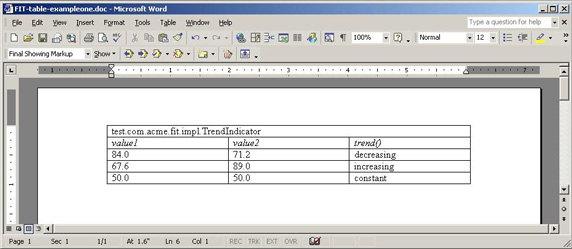
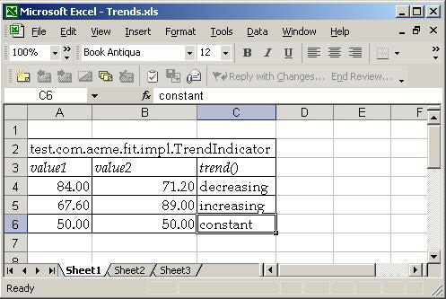
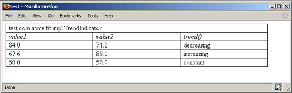
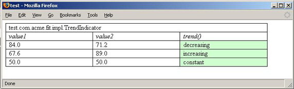
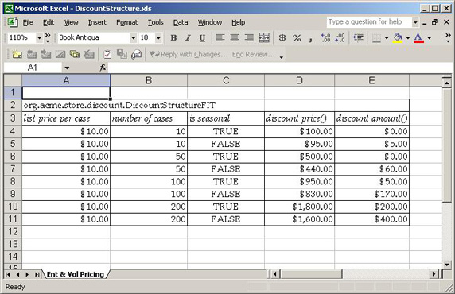
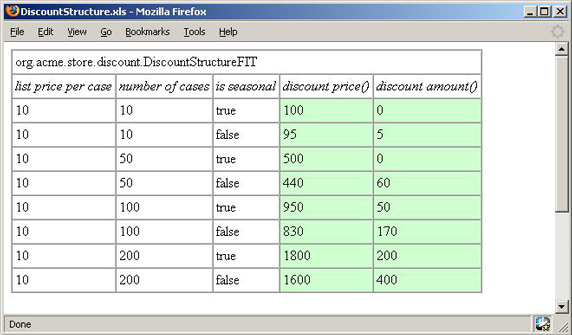

# 追逐代码质量: 决心采用 FIT

# 追逐代码质量: 决心采用 FIT

*试用 FIT 和 JUnit 进行需求测试工作！*

JUnit 假定测试的所有方面都是开发人员的地盘，而集成测试框架（FIT）在编写需求的业务客户和实现需求的开发人员之间做了协作方面的试验。这是否意味着 FIT 和 JUnit 是竞争关系呢？绝对不是！代码质量完美主义者 Andrew Glover 介绍了如何把 FIT 和 JUnit 两者最好的地方结合在一起，实现更好的团队工作和有效的端到端测试。

在软件开发的生命周期中，*每个人都对质量负有责任*。理想情况下，开发人员在开发周期中，用像 Junit 和 TestNG 这样的测试工具保证早期质量，而质量保证团队用功能性系统测试在周期末端跟进，使用像 Selenium 这样的工具。但是即使拥有优秀的质量保证，有些应用程序在交付的时候仍然被认为是质量低下的。为什么呢？*因为它们并没有做它们应当做的事。*

在客户、（编写应用程序需求的）业务部门和（实现需求的）开发团队之间的沟通错误，通常是摩擦的原因，有时还是开发项目彻底失败的常见原因。幸运的是，存在一些方法可以帮助需求作者和实现者之间*尽早* 沟通。

## 下载 FIT

集成测试框架（FIT）最初是由 Ward Cunningham 创建的，他就是 wiki 的发明人。请访问 Cunningham 的 Web 站点了解关于 FIT 的更多知识并 [免费下载它](http://fit.c2.com/)。

## FIT 化的解决方案

*集成测试框架* （FIT）是一个测试平台，可以帮助需求编写人员和把需求变成可执行代码的人员之间的沟通。使用 FIT，需求被做成表格模型，充当开发人员编写的测试的数据模型。表格本身充当输入和测试的预期输出。

图 1 显示了用 FIT 创建的结构化模型。第一行是测试名称，下一行的三列是与输入（`value1` 和 `value2`）和预期结果（`trend()`）有关的标题。

##### 图 1\. 用 FIT 创建的结构化模型



好消息是，对于编程没有经验的人也能编写这个表格。FIT 的设计目的就是让消费者或业务团队在开发周期中，尽早与实现他们想法的开发人员协作。创建应用程序需求的简单表格式模型，可以让每个人清楚地看出代码和需求是否是一致的。

清单 1 是与图 1 的数据模型对应的 FIT 代码。不要太多地担心细节 —— 只要注意代码有多么简单，而且代码中没有包含验证逻辑（例如，断言等）。可能还会注意到一些与表 1 中的内容匹配的变量和方法名称；关于这方面的内容后面介绍。

##### 清单 1\. 根据 FIT 模型编写的代码

```
package test.com.acme.fit.impl;
import com.acme.sedlp.trend.Trender;
import fit.ColumnFixture;
public class TrendIndicator extends ColumnFixture {
  public double value1;
  public double value2;
  public String trend(){        
    return Trender.determineTrend(value1, value2).getName();
  }
} 
```

清单 1 中的代码由研究上面表格并插入适当代码的开发人员编写。最后，把所有东西合在一起，FIT 框架读取表 1 的数据，调用对应的代码，并确定结果。

* * *

## FIT 和 JUnit

FIT 的优美之处在于，它让组织的消费者或业务端能够尽早参与测试过程（例如，在开发期间）。JUnit 的力量在于编码过程中的单元测试，而 FIT 是更高层次的测试工具，用来判断规划的需求实现的正确性。

例如，虽然 JUnit 擅长验证两个 `Money` 对象的合计与它们的两个值的合计相同，但 FIT 可以验证总的订单价格是其中商品的价格减去任何相关折扣之后的合计。区别虽然细微，但的确重大！在 JUnit 示例中，要处理具体的对象（或者需求的实现），但是使用 FIT 时要处理的是高级的*业务过程*。

这很有意义，因为编写需求的人通常不太考虑 `Money` 对象 —— 实际上，他们可能根本不知道这类东西的存在！但是，他们确实要考虑，当商品被添加到订单时，总的订单价格应当是商品的价格减去所有折扣。

FIT 和 JUnit 之间绝不是竞争关系，它们是保证代码质量的好搭档，正如在后面的 案例研究 中将要看到的。

* * *

## 测试用的 FIT 表格

表格是 FIT 的核心。有几种不同类型的表格（用于不同的业务场景），FIT 用户可以用不同的格式编写表格。用 HTML 编写表格甚至用 Microsoft Excel 编写都是可以的，如图 2 所示：

##### 图 2\. 用 Microsoft Excel 编写的表格



也有可能用 Microsoft Word 这样的工具编写表格，然后用 HTML 格式保存，如图 3 所示：

##### 图 3\. 用 Microsoft Word 编写的表格



开发人员编写的用来执行表格数据的代码叫作*装备（fixture）*。要创建一个装备类型，必须扩展对应的 FIT 装备，它映射到对应的表。如前所述，不同类型的表映射到不同的业务场景。

* * *

## 用装备进行装配

最简单的表和装备组合，也是 FIT 中最常用的，是一个简单的列表格，其中的列映射到预期过程的输入和输出。对应的装备类型是 `ColumnFixture`。

如果再次查看 清单 1，将注意到 `TrendIndicator` 类扩展了 `ColumnFixture`，而且也与图 3 对应。请注意在图 3 中，第一行的名称匹配完全限定名称（`test.com.acme.fit.impl.TrendIndicator`）。下一行有三列。头两个单元格的值匹配 `TrendIndicator` 类的 `public` 实例成员（`value1` 和 `value2`），最后一个单元格的值只匹配 `TrendIndicator` 中的方法（`trend`）。

现在来看清单 1 中的 `trend` 方法。它返回一个 `String` 值。可以猜测得到，对于表中每个剩下的行，FIT 都会替换值并比较结果。在这个示例中，有三个 “数据” 行，所以 FIT 运行 `TrendIndicator` 装备三次。第一次，`value1` 被设置成 84.0，`value2` 设置成 71.2。然后 FIT 调用 `trend` 方法，并把从方法得到的值与表中的值比较，应当是 “decreasing”。

通过这种方式，FIT 用装备代码测试 `Trender` 类，每次 FIT 执行 `trend` 方法时，都执行类的 `determineTrend` 方法。当代码测试完成时，FIT 生成如图 4 所示的报告：

##### 图 4\. FIT 报告 trend 测试的结果



trend 列单元格的绿色表明测试通过（例如，FIT 设置 `value1` 为 84.0，`value2` 为 71.2，调用 `trend` 得到返回值 “decreasing”）。

* * *

## 查看 FIT 运行

可以通过命令行，用 Ant 任务并通过 Maven 调用 FIT，从而简单地把 FIT 测试插入构建过程。因为自动进行 FIT 测试，就像 JUnit 测试一样，所以也可以定期运行它们，例如在持续集成系统中。

最简单的命令行运行器，如清单 2 所示，是 FIT 的 `FolderRunner`，它接受两个参数 —— 一个是 FIT 表格的位置，一个是结果写入的位置。不要忘记配置类路径！

##### 清单 2\. FIT 的命令行

```
%>java fit.runner.FolderRunner ./test/fit ./target/ 
```

FIT 通过插件，还可以很好地与 Maven 一起工作，如清单 3 所示。只要下载插件，运行 `fit:fit` 命令，就 OK 了！（请参阅 参考资料 获得 Maven 插件。）

##### 清单 3\. Maven 得到 FIT

```
C:\dev\proj\edoa>maven fit:fit
 __  __
|  \/  |__ _Apache__ ___
| |\/| / _` \ V / -_) ' \  ~ intelligent projects ~
|_|  |_\__,_|\_/\___|_||_|  v. 1.0.2
build:start:
java:prepare-filesystem:
java:compile:
    [echo] Compiling to C:\dev\proj\edoa/target/classes
java:jar-resources:
test:prepare-filesystem:
test:test-resources:
test:compile:
fit:fit:
    [java] 2 right, 0 wrong, 0 ignored, 0 exceptions
BUILD SUCCESSFUL
Total time: 4 seconds
Finished at: Thu Feb 02 17:19:30 EST 2006 
```

* * *

## 试用 FIT：案例研究

现在已经了解了 FIT 的基础知识，我们来做一个练习。如果还没有 [下载 FIT](http://fit.c2.com/)，现在是下载它的时候了！如前所述，这个案例研究显示出可以容易地把 FIT 和 JUnit 测试组合在一起，形成多层质量保证。

假设现在要为一个酿酒厂构建一个订单处理系统。酿酒厂销售各种类型的酒类，但是它们可以组织成两大类：季节性的和全年性的。因为酿酒厂以批发方式运作，所以酒类销售都是按桶销售的。对于零售商来说，购买多桶酒的好处就是折扣，而具体的折扣根据购买的桶数和酒是季节性还是全年性的而不同。

麻烦的地方在于管理这些需求。例如，如果零售店购买了 50 桶季节性酒，就没有折扣；但是如果这 50 桶*不是* 季节性的，那么就有 12％ 的折扣。如果零售店购买 100 桶季节性酒，那就有折扣，但是只有 5％。100 桶更陈的非季节性酒的折扣达到 17％。购买量达到 200 时，也有类似的规矩。

对于开发人员，像这样的需求集可能让人摸不着头脑。但是请看，我们的啤酒-酿造行业分析师用 FIT 表可以很容易地描述出这个需求，如图 5 所示：

##### 图 5\. 我的业务需求非常清晰！



### 表格语义

这个表格从业务的角度来说很有意义，它确实很好地规划出需求。但是作为开发人员，还需要对表格的语言了解更多一些，以便从表格得到值。首先，也是最重要的，表格中的初始行说明表格的名称，它恰好与一个匹配的类对应（`org.acme.store.discount.DiscountStructureFIT`）。命名要求表格作者和开发人员之间的一些协调。至少，需要指定完全限定的表格名称（也就是说，必须包含包名，因为 FIT 要动态地装入对应的类）。

请注意表格的名称以 *FIT* 结束。第一个倾向可能是用 *Test* 结束它，但要是这么做，那么在自动环境中运行 FIT 测试和 JUnit 测试时，会与 JUnit 产生些冲突，JUnit 的类通常通过命名模式查找，所以最好避免用 *Test* 开始或结束 FIT 表格名称。

下一行包含五列。每个单元格中的字符串都特意用斜体格式，这是 FIT 的要求。前面学过，单元格名称与装备的实例成员和方法匹配。为了更简洁，FIT 假设任何值以括号结束的单元格是方法，任何值不以括号结束的单元格是实例成员。

### 特殊智能

FIT 在处理单元格的值，进行与对应装备类的匹配时，采用智能解析。如 图 5 所示，第二行单元格中的值是用普通的英文编写的，例如 “number of cases”。FIT 试图把这样的字符串按照首字母大写方式连接起来；例如，“number of cases” 变成 “`numberOfCases`”，然后 FIT 试图找到对应的装备类。这个原则也适用于方法 —— 如图 5 所示，“discount price()” 变成了 “`discountPrice()`”。

FIT 还会智能地猜测单元格中值的具体*类型*。例如，在 图 5 余下的八行中，每一列都有对应的类型，或者可以由 FIT 准确地猜出，或者要求一些定制编程。在这个示例中，图 5 有三种不同类型。与 “number of cases” 关联的列匹配到 `int`，而与 “is seasonal” 列关联的值则匹配成 `boolean`。

剩下的三列，“list price per case”、“discount price()” 和 “discount amount()” 显然代表当前值。这几列要求定制类型，我将把它叫作 `Money`。有了它之后，应用程序就要求一个代表钱的对象，所以在我的 FIT 装备中遵守少量语义就可以利用上这个对象！

### FIT 语义总结

表 1 总结了命名单元格和对应的装备实例变量之间的关系：

##### 表 1\. 单元格到装备的关系：实例变量

| 单元格值 | 对应的装备实例变量 | 类型 |
| --- | --- | --- |
| list price per case | `listPricePerCase` | `Money` |
| number of cases | `numberOfCases` | `int` |
| is seasonal | `isSeasonal` | `boolean` |

表 2 总结了 FIT 命名单元格和对应的装备方法之间的关系：

##### 表 2\. 单元格到装备的关系：方法

| 表格单元格的值 | 对应的装备方法 | 返回类型 |
| --- | --- | --- |
| discount price() | `discountPrice` | `Money` |
| discount amount() | `discountAmount` | `Money` |

* * *

## 该构建了！

要为酿酒厂构建的订单处理系统有三个主要对象：一个 `PricingEngine` 处理包含折扣的业务规则，一个 `WholeSaleOrder` 代表订单，一个 `Money` 类型代表钱。

### Money 类

第一个要编写的类是 `Money` 类，它有进行加、乘和减的方法。可以用 JUnit 测试新创建的类，如清单 14 所示：

##### 清单 4\. JUnit 的 MoneyTest 类

```
package org.acme.store;
import junit.framework.TestCase;
public class MoneyTest extends TestCase {
  public void testToString() throws Exception{
    Money money = new Money(10.00);
    Money total = money.mpy(10);
    assertEquals("$100.00", total.toString());
  }
  public void testEquals() throws Exception{
    Money money = Money.parse("$10.00");
    Money control = new Money(10.00);
    assertEquals(control, money); 
  }
  public void testMultiply() throws Exception{
    Money money = new Money(10.00);
    Money total = money.mpy(10);

    Money discountAmount = total.mpy(0.05);    
    assertEquals("$5.00", discountAmount.toString());
  }
  public void testSubtract() throws Exception{
    Money money = new Money(10.00);
    Money total = money.mpy(10);
    Money discountAmount = total.mpy(0.05);
    Money discountedPrice = total.sub(discountAmount);
    assertEquals("$95.00", discountedPrice.toString());
  }
} 
```

### WholeSaleOrder 类

然后，定义 `WholeSaleOrder` 类型。这个新对象是应用程序的核心：如果 `WholeSaleOrder` 类型配置了桶数、每桶价格和产品类型（季节性或全年性），就可以把它交给 `PricingEngine`，由后者确定对应的折扣并相应地在 `WholeSaleOrder` 实例中配置它。

`WholesaleOrder` 类的定义如清单 5 所示：

##### 清单 5\. WholesaleOrder 类

```
package org.acme.store.discount.engine;
import org.acme.store.Money;
public class WholesaleOrder {
  private int numberOfCases;
  private ProductType productType;    
  private Money pricePerCase;    
  private double discount;
  public double getDiscount() {
    return discount;
  }
  public void setDiscount(double discount) {
    this.discount = discount;
  }
  public Money getCalculatedPrice() {
    Money totalPrice = this.pricePerCase.mpy(this.numberOfCases);
    Money tmpPrice = totalPrice.mpy(this.discount);
     return totalPrice.sub(tmpPrice);
  }
  public Money getDiscountedDifference() {        
    Money totalPrice = this.pricePerCase.mpy(this.numberOfCases);
    return totalPrice.sub(this.getCalculatedPrice());
  }
  public int getNumberOfCases() {
    return numberOfCases;
  }
  public void setNumberOfCases(int numberOfCases) {
    this.numberOfCases = numberOfCases;
  }
  public void setProductType(ProductType productType) {
    this.productType = productType;
  }
  public String getProductType() {
    return productType.getName();
  }
  public void setPricePerCase(Money pricePerCase) {
    this.pricePerCase = pricePerCase;
  }
  public Money getPricePerCase() {
    return pricePerCase;
  }    
} 
```

从清单 5 中可以看到，一旦在 `WholeSaleOrder` 实例中设置了折扣，就可以通过分别调用 `getCalculatedPrice` 和 `getDiscountedDifference` 方法得到折扣价格和节省的钱。

### 更好地测试这些方法（用 JUnit）！

定义了 `Money` 和 `WholesaleOrder` 类之后，还要编写 JUnit 测试来验证 `getCalculatedPrice` 和 `getDiscountedDifference` 方法的功能。测试如清单 6 所示：

##### 清单 6\. JUnit 的 WholesaleOrderTest 类

```
package org.acme.store.discount.engine.junit;
import junit.framework.TestCase;
import org.acme.store.Money;
import org.acme.store.discount.engine.WholesaleOrder;
public class WholesaleOrderTest extends TestCase {
  /*
   * Test method for 'WholesaleOrder.getCalculatedPrice()'
   */
  public void testGetCalculatedPrice() {
    WholesaleOrder order = new WholesaleOrder();
    order.setDiscount(0.05);
    order.setNumberOfCases(10);
    order.setPricePerCase(new Money(10.00));
    assertEquals("$95.00", order.getCalculatedPrice().toString());
  }
  /*
   * Test method for 'WholesaleOrder.getDiscountedDifference()'
   */
  public void testGetDiscountedDifference() {
    WholesaleOrder order = new WholesaleOrder();
    order.setDiscount(0.05);
    order.setNumberOfCases(10);
    order.setPricePerCase(new Money(10.00));
    assertEquals("$5.00", order.getDiscountedDifference().toString());
  }
} 
```

### PricingEngine 类

`PricingEngine` 类利用*业务规则引擎*，在这个示例中，是 Drools（请参阅 “关于 Drools”）。`PricingEngine` 极为简单，只有一个 `public` 方法：`applyDiscount`。只要传递进一个 `WholeSaleOrder` 实例，引擎就会要求 Drools 应用折扣，如清单 7 所示：

##### 清单 7\. PricingEngine 类

```
package org.acme.store.discount.engine;
import org.drools.RuleBase;
import org.drools.WorkingMemory;
import org.drools.io.RuleBaseLoader;
public class PricingEngine {
  private static final String RULES="BusinessRules.drl";
  private static RuleBase businessRules;
  private static void loadRules() throws Exception{
    if (businessRules==null){            
      businessRules = RuleBaseLoader.
         loadFromUrl(PricingEngine.class.getResource(RULES));
    }
  }    
  public static void applyDiscount(WholesaleOrder order) throws Exception{
    loadRules();             
    WorkingMemory workingMemory = businessRules.newWorkingMemory( );
    workingMemory.assertObject(order);       
    workingMemory.fireAllRules();        
  }
} 
```

## 关于 Drools

Drools 是一个为 Java™ 语言度身定制的规则引擎实现。它提供可插入的语言实现，目前规则可以用 Java、Python 和 Groovy 编写。要获得更多信息，或者下载 Drools，请参阅 [Drools 主页](http://drools.codehaus.org/)。

### Drools 的规则

必须在特定于 Drools 的 XML 文件中定义计算折扣的业务规则。例如，清单 8 中的代码段就是一个规则：如果桶数大于 9，小于 50，不是季节性产品，则订单有 5％ 的折扣。

##### 清单 8\. BusinessRules.drl 文件的示例规则

```
<rule-set name="BusinessRulesSample"

          xs:schemaLocation="http://drools.org/rules rules.xsd
                             http://drools.org/semantics/java java.xsd">
<rule name="1st Tier Discount">
  <parameter identifier="order">
    <class>WholesaleOrder</class>
  </parameter>
  <java:condition>order.getNumberOfCases() > 9 </java:condition>
  <java:condition>order.getNumberOfCases() < 50 </java:condition>
  <java:condition>order.getProductType() == "year-round"</java:condition>
  <java:consequence>      
    order.setDiscount(0.05);
  </java:consequence>
</rule>
</rule-set> 
```

* * *

## 标记团队测试

有了 `PricingEngine` 并定义了应用程序规则之后，可能渴望验证所有东西都工作正确。现在问题就变成，用 JUnit 还是 FIT？为什么不两者都用呢？通过 JUnit 测试所有组合是可能的，但是要进行许多编码。最好是用 JUnit 测试少数几个值，迅速地验证代码在工作，然后依靠 FIT 的力量运行想要的组合。请看看当我这么尝试时发生了什么，从清单 9 开始：

##### 清单 9\. JUnit 迅速地验证了代码在工作

```
package org.acme.store.discount.engine.junit;
import junit.framework.TestCase;
import org.acme.store.Money;
import org.acme.store.discount.engine.PricingEngine;
import org.acme.store.discount.engine.ProductType;
import org.acme.store.discount.engine.WholesaleOrder;
public class DiscountEngineTest extends TestCase {
  public void testCalculateDiscount() throws Exception{
    WholesaleOrder order = new WholesaleOrder();
    order.setNumberOfCases(20);
    order.setPricePerCase(new Money(10.00));
    order.setProductType(ProductType.YEAR_ROUND);
    PricingEngine.applyDiscount(order);
    assertEquals(0.05, order.getDiscount(), 0.0);
  }
  public void testCalculateDiscountNone() throws Exception{
    WholesaleOrder order = new WholesaleOrder();
    order.setNumberOfCases(20);
    order.setPricePerCase(new Money(10.00));
    order.setProductType(ProductType.SEASONAL);

    PricingEngine.applyDiscount(order);
    assertEquals(0.0, order.getDiscount(), 0.0);
  }
} 
```

### 还没用 FIT？那就用 FIT！

在 图 5 的 FIT 表格中有八行数据值。可能已经在 清单 7 中编写了前两行的 JUnit 代码，但是真的想编写整个测试吗？编写全部八行的测试或者在客户添加新规则时再添加新的测试，需要巨大的耐心。好消息就是，现在有了更容易的方法。不过，不是忽略测试 —— 而是用 FIT！

FIT 对于测试业务规则或涉及组合值的内容来说非常漂亮。更好的是，其他人可以完成在表格中定义这些组合的工作。但是，在为表格创建 FIT 装备之前，需要给 `Money` 类添加一个特殊方法。因为需要在 FIT 表格中代表当前货币值（例如，像 $100.00 这样的值），需要一种方法让 FIT 能够认识 `Money` 的实例。做这件事需要两步：首先，必须把 `static parse` 方法添加到定制数据类型，如清单 10 所示：

##### 清单 10\. 添加 parse 方法到 Money 类

```
 public static Money parse(String value){
   return new Money(Double.parseDouble(StringUtils.remove(value, '$')));
 } 
```

`Money` 类的 `parse` 方法接受一个 `String` 值（例如，FIT 从表格中取出的值）并返回配置正确的 `Money` 实例。在这个示例中，`$` 字符被删除，剩下的 `String` 被转变成 `double`，这与 `Money` 中现有的构造函数匹配。

不要忘记向 `MoneyTest` 类添加一些测试来来验证新添加的 `parse` 方法按预期要求工作。两个新测试如清单 11 所示：

##### 清单 11\. 测试 Money 类的 parse 方法

```
 public void testParse() throws Exception{
   Money money = Money.parse("$10.00");
   assertEquals("$10.00", money.toString());
 }
 public void testEquals() throws Exception{
   Money money = Money.parse("$10.00");
   Money control = new Money(10.00);
   assertEquals(control, money);
} 
```

### 编写 FIT 装备

现在可以编写第一个 FIT 装备了。实例成员和方法已经在表 1 和表 2 中列出，所以只需要把事情串在一起，添加一两个方法来处理定制类型：`Money`。为了在装备中处理特定类型，还需要添加另一个 `parse` 方法。这个方法的签名与前一个略有不同：这个方法是个对 `Fixture` 类进行覆盖的实例方法，这个类是 `ColumnFixture` 的双亲。

请注意在清单 12 中，`DiscountStructureFIT` 的 `parse` 方法如何*比较* `class` 类型。如果存在匹配，就调用 `Money` 的定制 `parse` 方法；否则，就调用父类（`Fixture`）的 `parse` 版本。

清单 12 中剩下的代码是很简单的。对于图 5 所示的 FIT 表格中的每个数据行，都设置值并调用方法，然后 FIT 验证结果！例如，在 FIT 测试的第一次运行中，`DiscountStructureFIT` 的 `listPricePerCase` 被设为 $10.00，`numberOfCases` 设为 10，`isSeasonal` 为 true。然后执行 `DiscountStructureFIT` 的 `discountPrice`，返回的值与 $100.00 比较，然后执行 `discountAmount`，返回的值与 $0.00 比较。

##### 清单 12\. 用 FIT 进行的折扣测试

```
package org.acme.store.discount;
import org.acme.store.Money;
import org.acme.store.discount.engine.PricingEngine;
import org.acme.store.discount.engine.ProductType;
import org.acme.store.discount.engine.WholesaleOrder;
import fit.ColumnFixture;
public class DiscountStructureFIT extends ColumnFixture {
  public Money listPricePerCase;
  public int numberOfCases;
  public boolean isSeasonal;
  public Money discountPrice() throws Exception {
    WholesaleOrder order = this.doOrderCalculation();
    return order.getCalculatedPrice();
  }
  public Money discountAmount() throws Exception {
    WholesaleOrder order = this.doOrderCalculation();
    return order.getDiscountedDifference();
  }
 /**
  * required by FIT for specific types
  */
  public Object parse(String value, Class type) throws Exception {
    if (type == Money.class) {
      return Money.parse(value);
    } else {
      return super.parse(value, type);
    }
  }
  private WholesaleOrder doOrderCalculation() throws Exception {
    WholesaleOrder order = new WholesaleOrder();
    order.setNumberOfCases(numberOfCases);
    order.setPricePerCase(listPricePerCase);
    if (isSeasonal) {
      order.setProductType(ProductType.SEASONAL);
    } else {
      order.setProductType(ProductType.YEAR_ROUND);
    }
    PricingEngine.applyDiscount(order);
    return order;
  }
} 
```

现在，比较 清单 9 的 JUnit 测试用例和清单 12。是不是清单 12 更有效率？当然*可以* 用 JUnit 编写所有必需的测试，但是 FIT 可以让工作容易得多！如果感觉到满意（应当是满意的！），可以运行构建，调用 FIT 运行器生成如图 6 所示的结果：

##### 图 6\. 这些结果真的很 FIT ！



* * *

## 结束语

FIT 可以帮助企业避免客户和开发人员之间的沟通不畅、误解和误读。把编写需求的人*尽早* 带入测试过程，是在问题成为开发恶梦的根源之前发现并修补它们的明显途径。而且，FIT 与现有的技术（比如 JUnit）完全兼容。实际上，正如本文所示，JUnit 和 FIT 互相补充。请把今年变成您*追逐代码质量* 的重要纪年 —— 由于决心采用 FIT！