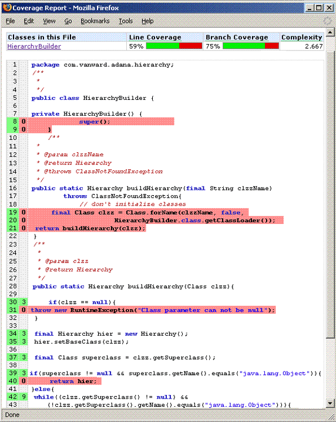
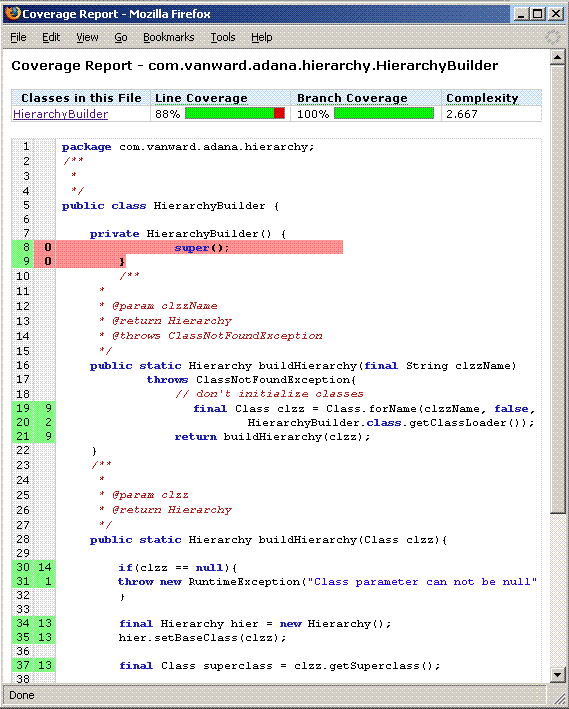
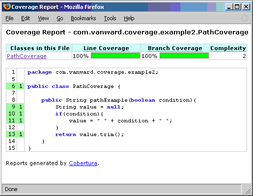
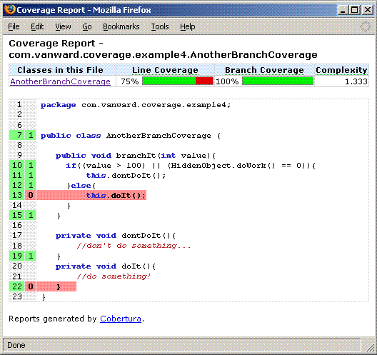

# 追求代码质量: 不要被覆盖报告所迷惑

# 追求代码质量: 不要被覆盖报告所迷惑

*您是否曾被测试覆盖度量引入歧途？*

测试覆盖工具对单元测试具有重要的意义，但是经常被误用。这个月，Andrew Glover 会在他的新系列 —— *追求代码质量* 中向您介绍值得参考的专家意见。第一部分深入地介绍覆盖报告中数字的真实含义。然后他会提出您可以尽早并经常地利用覆盖来确保代码质量的三个方法。

您还记得以前大多数开发人员是如何追求代码质量的吗。在那时，有技巧地放置 `main()` 方法被视为灵活且适当的测试方法。经历了漫长的道路以后，现在自动测试已经成为高质量代码开发的基本保证，对此我很感谢。但是这还不是我所要感谢的全部。Java™ 开发人员现在拥有很多通过代码度量、静态分析等方法来度量代码质量的工具。我们甚至已经设法将重构分类成一系列便利的模式！

要获得有关代码质量问题的答案，您可以访问由 Andrew Glover 主持的 [Code Quality](http://www.ibm.com/developerworks/forums/dw_forum.jsp?S_TACT=105AGX52&cat=10&S_CMP=cn-a-j&forum=812) 论坛。

所有的这些新的工具使得确保代码质量比以前简单得多，不过您还需要知道如何使用它们。在这个系列中，我将重点阐述有关保证代码质量的一些有时看上去有点神秘的东西。除了带您一起熟悉有关代码质量保证的众多工具和技术之外，我还将为您说明：

*   定义并有效度量最影响质量的代码方面。
*   设定质量保证目标并照此规划您的开发过程。
*   确定哪个代码质量工具和技术可以满足您的需要。
*   实现最佳实践（清除不好的），使确保代码质量*及早并经常地* 成为开发实践中轻松且有效的方面。

在这个月，我将首先看看 Java 开发人员中最流行也是最容易的质量保证工具包：测试覆盖度量。

## 谨防上当

这是一个晚上鏖战后的早晨，大家都站在饮水机边上。开发人员和管理人员们了解到一些经过良好测试的类可以达到超过 90% 的覆盖率，正在高兴地互换着 NFL 风格的点心。团队的集体信心空前高涨。从远处可以听到 “放任地重构吧” 的声音，似乎缺陷已成为遥远的记忆，响应性也已微不足道。但是一个很小的反对声在说：

*女士们，先生们，不要被覆盖报告所愚弄*。

现在，不要误解我的意思：并不是说使用测试覆盖工具是愚蠢的。对单元测试范例，它是很重要的。不过更重要的是您如何理解所得到的信息。许多开发团队会在这儿犯第一个错。

高覆盖率只是表示执行了很多的代码，并不意味着这些代码被*很好地* 执行。如果您关注的是代码的质量，就必须精确地理解测试覆盖工具能做什么，不能做什么。然后您才能知道如何使用这些工具去获取有用的信息。而不是像许多开发人员那样，只是满足于高覆盖率。

* * *

## 测试覆盖度量

测试覆盖工具通常可以很容易地添加到确定的单元测试过程中，而且结果可靠。下载一个可用的工具，对您的 Ant 和 Maven 构建脚本作一些小的改动，您和您的同事就有了在饮水机边上谈论的一种新报告：*测试覆盖报告*。当 `foo` 和 `bar` 这样的程序包令人惊奇地显示*高* 覆盖率时，您可以得到不小的安慰。如果您相信至少您的部分代码可以保证是 “没有 BUG” 的，您会觉得很安心。但是这样做是一个错误。

存在不同类型的覆盖度量，但是绝大多数的工具会关注*行覆盖*，也叫做*语句覆盖*。此外，有些工具会报告*分支覆盖*。通过用一个测试工具执行代码库并捕获整个测试过程中与被 “触及” 的代码对应的数据，就可以获得测试覆盖度量。然后这些数据被合成为覆盖报告。在 Java 世界中，这个测试工具通常是 JUnit 以及名为 Cobertura、Emma 或 Clover 等的覆盖工具。

*行覆盖*只是指出代码的哪些行被执行。如果一个方法有 10 行代码，其中的 8 行在测试中被执行，那么这个方法的行覆盖率是 80%。这个过程在总体层次上也工作得很好：如果一个类有 100 行代码，其中的 45 行被触及，那么这个类的行覆盖率就是 45%。同样，如果一个代码库包含 10000 个非注释性的代码行，在特定的测试运行中有 3500 行被执行，那么这段代码的行覆盖率就是 35%。

报告*分支覆盖* 的工具试图度量决策点（比如包含逻辑 `AND` 或 `OR` 的条件块）的覆盖率。与行覆盖一样，如果在特定方法中有两个分支，并且两个分支在测试中都被覆盖，那么您可以说这个方法有 100% 的分支覆盖率。

问题是，这些度量有什么用？很明显，很容易获得所有这些信息，不过您需要知道如何使用它们。一些例子可以阐明我的观点。

* * *

## 代码覆盖在活动

我在清单 1 中创建了一个简单的类以具体表述类层次的概念。一个给定的类可以有一连串的父类，例如 `Vector`，它的父类是 `AbstractList`，`AbstractList` 的父类又是 `AbstractCollection`，`AbstractCollection` 的父类又是 `Object`：

##### 清单 1\. 表现类层次的类

```
package com.vanward.adana.hierarchy;
import java.util.ArrayList;
import java.util.Collection;
import java.util.Iterator;
public class Hierarchy {
  private Collection classes;
  private Class baseClass;
  public Hierarchy() {
    super();
    this.classes = new ArrayList();
  }
  public void addClass(final Class clzz){
    this.classes.add(clzz);
  }
  /**
   * @return an array of class names as Strings
   */
  public String[] getHierarchyClassNames(){
    final String[] names = new String[this.classes.size()];        
    int x = 0;
    for(Iterator iter = this.classes.iterator(); iter.hasNext();){
       Class clzz = (Class)iter.next();
       names[x++] = clzz.getName();
    }        
    return names;
  }
  public Class getBaseClass() {
    return baseClass;
  }
  public void setBaseClass(final Class baseClass) {
    this.baseClass = baseClass;
  }
} 
```

正如您看到的，清单 1 中的 `Hierarchy` 类具有一个 `baseClass` 实例以及它的父类的集合。清单 2 中的 `HierarchyBuilder` 通过两个复制 `buildHierarchy` 的重载的 `static` 方法创建了 `Hierarchy` 类。

##### 清单 2\. 类层次生成器

```
package com.vanward.adana.hierarchy;
public class HierarchyBuilder {  
  private HierarchyBuilder() {
    super();        
  }
  public static Hierarchy buildHierarchy(final String clzzName) 
    throws ClassNotFoundException{
      final Class clzz = Class.forName(clzzName, false, 
          HierarchyBuilder.class.getClassLoader());        
      return buildHierarchy(clzz);
  }
  public static Hierarchy buildHierarchy(Class clzz){
    if(clzz == null){
      throw new RuntimeException("Class parameter can not be null");
    }
    final Hierarchy hier = new Hierarchy();
    hier.setBaseClass(clzz);
    final Class superclass = clzz.getSuperclass();
    if(superclass != 
      null && superclass.getName().equals("java.lang.Object")){
       return hier; 
    }else{      
       while((clzz.getSuperclass() != null) && 
          (!clzz.getSuperclass().getName().equals("java.lang.Object"))){
             clzz = clzz.getSuperclass();
             hier.addClass(clzz);
       }            
       return hier;
    }
  }      
} 
```

* * *

## 现在是测试时间！

有关测试覆盖的文章怎么能缺少测试案例呢？在清单 3 中，我定义了一个简单的有三个测试案例的 JUnit 测试类，它将试图执行 `Hierarchy` 类和 `HierarchyBuilder` 类：

##### 清单 3\. 测试 HierarchyBuilder！

```
package test.com.vanward.adana.hierarchy;
import com.vanward.adana.hierarchy.Hierarchy;
import com.vanward.adana.hierarchy.HierarchyBuilder;
import junit.framework.TestCase;
public class HierarchyBuilderTest extends TestCase {

  public void testBuildHierarchyValueNotNull() {        
     Hierarchy hier = HierarchyBuilder.buildHierarchy(HierarchyBuilderTest.class);
     assertNotNull("object was null", hier);
  }
  public void testBuildHierarchyName() {        
     Hierarchy hier = HierarchyBuilder.buildHierarchy(HierarchyBuilderTest.class);
     assertEquals("should be junit.framework.Assert", 
       "junit.framework.Assert", 
         hier.getHierarchyClassNames()[1]);      
  }
  public void testBuildHierarchyNameAgain() {        
     Hierarchy hier = HierarchyBuilder.buildHierarchy(HierarchyBuilderTest.class);
     assertEquals("should be junit.framework.TestCase", 
       "junit.framework.TestCase", 
         hier.getHierarchyClassNames()[0]);      
  }

} 
```

因为我是一个狂热的测试人员，我自然希望运行一些覆盖测试。对于 Java 开发人员可用的代码覆盖工具中，我比较喜欢用 Cobertura，因为它的报告很友好。而且，Corbertura 是开放源码项目，它派生出了 JCoverage 项目的前身。

* * *

## Cobertura 的报告

运行 Cobertura 这样的工具和运行您的 JUnit 测试一样简单，只是有一个用专门逻辑在测试时检查代码以报告覆盖率的中间步骤（这都是通过工具的 Ant 任务或 Maven 的目标完成的）。

正如您在图 1 中看到的，`HierarchyBuilder` 的覆盖报告说明部分代码*没有* 被执行。事实上，Cobertura 认为 `HierarchyBuilder` 的行覆盖率为 59%，分支覆盖率为 75%。

##### 图 1\. Cobertura 的报告



这样看来，我的第一次覆盖测试是失败的。首先，带有 `String` 参数的 `buildHierarchy()` 方法根本没有被测试。其次，另一个 `buildHierarchy()` 方法中的两个条件都没有被执行。有趣的是，所要关注的正是第二个没有被执行的 `if` 块。

因为我所需要做的只是增加一些测试案例，所以我并不担心这一点。一旦我到达了所关注的区域，我就可以很好地完成工作。注意我这儿的逻辑：我使用测试报告来了解什么*没有* 被测试。现在我已经可以选择使用这些数据来增强测试或者继续工作。在本例中，我准备增强我的测试，因为我还有一些重要的区域未覆盖。

### Cobertura：第二轮

清单 4 是一个更新过的 JUnit 测试案例，增加了一些附加测试案例，以试图完全执行 `HierarchyBuilder`：

##### 清单 4\. 更新过的 JUnit 测试案例

```
package test.com.vanward.adana.hierarchy;
import com.vanward.adana.hierarchy.Hierarchy;
import com.vanward.adana.hierarchy.HierarchyBuilder;
import junit.framework.TestCase;
public class HierarchyBuilderTest extends TestCase {

  public void testBuildHierarchyValueNotNull() {        
     Hierarchy hier = HierarchyBuilder.buildHierarchy(HierarchyBuilderTest.class);
     assertNotNull("object was null", hier);
  }
  public void testBuildHierarchyName() {        
     Hierarchy hier = HierarchyBuilder.buildHierarchy(HierarchyBuilderTest.class);
     assertEquals("should be junit.framework.Assert", 
       "junit.framework.Assert", 
         hier.getHierarchyClassNames()[1]);      
  }
  public void testBuildHierarchyNameAgain() { zo       
     Hierarchy hier = HierarchyBuilder.buildHierarchy(HierarchyBuilderTest.class);
     assertEquals("should be junit.framework.TestCase", 
       "junit.framework.TestCase", 
         hier.getHierarchyClassNames()[0]);      
  }
  public void testBuildHierarchySize() {        
     Hierarchy hier = HierarchyBuilder.buildHierarchy(HierarchyBuilderTest.class);
     assertEquals("should be 2", 2, hier.getHierarchyClassNames().length);
  }
  public void testBuildHierarchyStrNotNull() throws Exception{
    Hierarchy hier = 
       HierarchyBuilder.
       buildHierarchy("test.com.vanward.adana.hierarchy.HierarchyBuilderTest");
    assertNotNull("object was null", hier);
  }
  public void testBuildHierarchyStrName() throws Exception{        
    Hierarchy hier = 
       HierarchyBuilder.
       buildHierarchy("test.com.vanward.adana.hierarchy.HierarchyBuilderTest");
    assertEquals("should be junit.framework.Assert", 
      "junit.framework.Assert",
        hier.getHierarchyClassNames()[1]);
  }
  public void testBuildHierarchyStrNameAgain() throws Exception{
    Hierarchy hier = 
       HierarchyBuilder.
       buildHierarchy("test.com.vanward.adana.hierarchy.HierarchyBuilderTest");
    assertEquals("should be junit.framework.TestCase", 
      "junit.framework.TestCase",
        hier.getHierarchyClassNames()[0]);      
  }
  public void testBuildHierarchyStrSize() throws Exception{        
     Hierarchy hier = 
        HierarchyBuilder.
        buildHierarchy("test.com.vanward.adana.hierarchy.HierarchyBuilderTest");
     assertEquals("should be 2", 2, hier.getHierarchyClassNames().length);        
  }
  public void testBuildHierarchyWithNull() {
     try{
       Class clzz = null;
       HierarchyBuilder.buildHierarchy(clzz);
       fail("RuntimeException not thrown");
     }catch(RuntimeException e){}
  }
} 
```

当我使用新的测试案例再次执行测试覆盖过程时，我得到了如图 2 所示的更加完整的报告。现在，我覆盖了未测试的 `buildHierarchy()` 方法，也处理了另一个 `buildHierarchy()` 方法中的两个 `if` 块。然而，因为 `HierarchyBuilder` 的构造器是 `private` 类型的，所以我不能通过我的测试类测试它（我也不关心）。因此，我的行覆盖率仍然只有 88%。

##### 图 2\. 谁说没有第二次机会



正如您看到的，使用一个代码覆盖工具*可以* 揭露重要的没有相应测试案例的代码。重要的事情是，在阅读报告（*特别* 是覆盖率高的）时需要小心，它们也许隐含危险的信息。让我们看看两个例子，看看在高覆盖率后面隐藏着什么。

* * *

## 条件带来的麻烦

正如您已经知道的，代码中的许多变量可能有多种状态；此外，条件的存在使得执行有多条路径。在留意这些问题之后，我将在清单 5 中定义一个极其简单只有一个方法的类：

##### 清单 5.您能看出下面的缺陷吗？

```
package com.vanward.coverage.example01;
public class PathCoverage {
  public String pathExample(boolean condition){
    String value = null;
    if(condition){
      value = " " + condition + " ";
    }
    return value.trim();
  }
} 
```

您是否发现了清单 5 中有一个隐藏的缺陷呢？如果没有，不要担心，我会在清单 6 中写一个测试案例来执行 `pathExample()` 方法并确保它正确地工作：

##### 清单 6\. JUnit 来救援！

```
package test.com.vanward.coverage.example01;
import junit.framework.TestCase;
import com.vanward.coverage.example01.PathCoverage;
public class PathCoverageTest extends TestCase {
  public final void testPathExample() {
    PathCoverage clzzUnderTst = new PathCoverage();
    String value = clzzUnderTst.pathExample(true);
    assertEquals("should be true", "true", value);
  }
} 
```

我的测试案例正确运行，我的神奇的代码覆盖报告（如下面图 3 所示）使我看上去像个超级明星，测试覆盖率达到了 100%！

##### 图 3\. 覆盖率明星



我想现在应该到饮水机边上去说了，但是等等，我不是怀疑代码中有什么缺陷呢？认真检查清单 5 会发现，如果 `condition` 为 `false`，那么第 13 行确实会抛出 `NullPointerException`。*Yeesh*，这儿发生了什么？

这表明行覆盖的确不能很好地指示测试的有效性。

* * *

## 路径的恐怖

在清单 7 中，我定义了另一个包含 *indirect* 的简单例子，它仍然有不能容忍的缺陷。请注意 `branchIt()` 方法中 `if` 条件的后半部分。（`HiddenObject` 类将在清单 8 中定义。）

##### 清单 7\. 这个代码足够简单

```
package com.vanward.coverage.example02;
import com.acme.someotherpackage.HiddenObject;
public class AnotherBranchCoverage {

  public void branchIt(int value){
    if((value > 100) || (HiddenObject.doWork() == 0)){
      this.dontDoIt();
    }else{
      this.doIt();
    }
  }                             
  private void dontDoIt(){
    //don't do something...
  }
  private void doIt(){
    //do something!
  }   
} 
```

呀！清单 8 中的 `HiddenObject` 是*有害的*。与清单 7 中一样，调用 `doWork()` 方法会导致 `RuntimeException`：

##### 清单 8\. 上半部分！

```
package com.acme.someotherpackage.HiddenObject;
public class HiddenObject {
  public static int doWork(){
    //return 1;
    throw new RuntimeException("surprise!");
  }
} 
```

但是我的确可以通过一个良好的测试捕获这个异常！在清单 9 中，我编写了另一个好的测试，以图挽回我的超级明星光环：

##### 清单 9\. 使用 JUnit 规避风险

```
package test.com.vanward.coverage.example02;
import junit.framework.TestCase;
import com.vanward.coverage.example02.AnotherBranchCoverage;
public class AnotherBranchCoverageTest extends TestCase {

  public final void testBranchIt() {
    AnotherBranchCoverage clzzUnderTst = new AnotherBranchCoverage();
    clzzUnderTst.branchIt(101);
  }    
} 
```

您对这个测试案例有什么想法？您也许会写出更多的测试案例，但是请设想一下清单 7 中不确定的条件有不止一个的缩短操作会如何。设想如果前半部分中的逻辑比简单的 `int` 比较更复杂，那么*您* 需要写多少测试案例才能满意？

### 仅仅给我数字

现在，对清单 7、8、9 的测试覆盖率的分析结果不再会使您感到惊讶。在图 4 的报告中显示我达到了 75% 的行覆盖率和 100% 的分支覆盖率。最重要的是，我执行了第 10 行！

##### 图 4.愚弄的报酬



从第一印象看，这让我骄傲。但是这个报告有什么误导吗？只是粗略地看一看报告中的数字，会导致您相信代码是经过*良好测试的*。基于这一点，您也许会认为出现缺陷的风险很低。这个报告并不能帮助您确定 `or` 缩短操作的后半部分是一个定时炸弹！

* * *

## 质量测试

我不止一次地说：您可以（而且应该）使用测试覆盖工具作为您的测试过程的一部分。但是*不要被覆盖报告所愚弄*。关于覆盖报告您需要了解的主要事情是，覆盖报告最好用来检查哪些代码*没有经过* 充分的测试。当您检查覆盖报告时，找出较低的值，并了解为什么特定的代码没有经过充分的测试。知道这些以后，开发人员、管理人员以及 QA 专业人员就可以在真正需要的地方使用测试覆盖工具。通常有下列三种情况：

*   估计修改已有代码所需的时间
*   评估代码质量
*   评定功能测试

现在我可以断定对测试覆盖报告的一些使用方法会将您引入歧途，下面这些最佳实践可以使得测试覆盖报告可以真正为您所用。

### 1\. 估计修改已有代码所需的时间

对一个开发团队而言，针对代码编写测试案例自然可以增加集体的信心。与没有相应测试案例的代码相比，经过测试的代码更容易重构、维护和增强。测试案例因为暗示了代码在测试工作中是*如何* 工作的，所以还可以充当内行的文档。此外，如果被测试的代码发生改变，测试案例通常也会作相应的改变，这与诸如注释和 Javadoc 这样的静态代码文档不同。

在另一方面，没有经过相应测试的代码更难于理解和*安全地* 修改。因此，知道代码有没有被测试，并看看实际的测试覆盖数值，可以让开发人员和管理人员更准确地预知修改已有代码所需的时间。

再次回到饮水机边上，可以更好地阐明我的观点。

> 市场部的 Linda：“我们想让系统在用户完成一笔交易时做 *x* 工作。这需要多长时间。我们的用户需要尽快实现这一功能。”
> 
> 管理人员 Jeff：“让我看看，这个代码是 Joe 在几个月前编写的，需要对业务层和 UI 做一些变动。Mary 也许可以在两天内完成这项工作。”
> 
> Linda：“Joe？他是谁？”
> 
> Jeff：“哦，Joe，因为他不知道自己在干什么，所以被我解雇了。”

情况似乎有点不妙，不是吗？尽管如此，Jeff 还是将任务分配给了 Mary，Mary 也认为能够在两天内完成工作 —— 确切地说，在看到代码之前她是这么认为的。

> Mary：“Joe 写这些代码时是不是*睡着了*？这是我所见过的最差的代码。我甚至不能确认这是 Java 代码。除非推倒重来，要不我根本没法修改。”

情况对 “饮水机” 团队不妙，不是吗？但是我们假设，如果在这个不幸的事件的当初，Jeff 和 Mary 就拥有一份测试报告，那么情况会如何呢？当 Linda 要求实现新功能时，Jeff 做的第一件事就是检查以前生成的覆盖报告。注意到需要改动的软件包几乎没有被覆盖，然后他就会与 Mary 商量。

> Jeff：“Joe 编写的这个代码很差，绝大多数没经过测试。您认为要支持 Linda 所说的功能需要多长时间？”
> 
> Mary：“这个代码很混乱。我甚至都不想看到它。为什么不让 Mark 来做呢？”
> 
> Jeff：“因为 Mark 不编写测试，刚被我解雇了。我需要您测试这个代码并作一些改动。告诉我您需要多长时间。”
> 
> Mary：“我至少需要两天编写测试，然后我会重构这个代码，增加新的功能。我想总共需要四天吧。”

正如他们所说的，知识的力量是强大的。开发人员可以在试图修改代码*之前* 使用覆盖报告来检查代码质量。同样，管理人员可以使用覆盖数据更好地估计开发人员实际所需的时间。

### 2\. 评估代码质量

开发人员的测试可以降低代码中存在缺陷的风险，因此现在很多开发团队在新开发和更改代码的同时需要编写单元测试。然而正如前面所提到的 Mark 一样，并不总是在编码的同时进行单元测试，因而会导致低质量代码的出现。

监控覆盖报告可以帮助开发团队迅速找出不断增长的*没有* 相应测试的代码。例如，在一周开始时运行覆盖报告，显示项目中一个关键的软件包的覆盖率是 70%。如果几天后，覆盖率下降到了 60%，那么您可以推断：

*   软件包的代码行增加了，但是没有为新代码编写相应的测试（或者是新增加的测试不能有效地覆盖新代码）。
*   删除了测试案例。
*   上述两种情况都发生了。

能够监控事情的发展，无疑是件好事。定期地查阅报告使得设定目标（例如获得覆盖率、维护代码行的测试案例的比例等）并监控事情的发展变得更为容易。如果您发现测试没有如期编写，您可以提前采取一些行动，例如对开发人员进行培训、指导或帮助。与其让用户 “在使用中” 发现程序缺陷（这些缺陷本应该在几个月前通过简单的测试暴露出来），或者等到管理人员发现没有编写单元测试时再感到惊讶（和愤怒），还不如采取一些预防性的措施。

使用覆盖报告来确保正确的测试是一项伟大的实践。关键是要训练有素地完成这项工作。例如，使每晚生成并查阅覆盖报告成为*连续累计* 过程的一部分。

### 3\. 评定功能测试

假设覆盖报告在指出*没有经过* 足够测试的代码部分方面非常有效，那么质量保证人员可以使用这些数据来评定与功能测试有关的关注区域。让我们回到 “饮水机” 团队来看看 QA 的负责人 Drew 是如何评价 Joe 的代码的：

> Drew 对 Jeff 说：“我们为下一个版本编写了测试案例，我们注意到很多代码没有被覆盖。那好像是与股票交易有关的代码。”
> 
> Jeff：“哦，我们在这个领域有好些问题。如果我是一个赌徒的话，我会对这个功能区域给予特别的关注。Mary 正在对这个应用程序做一些其他的修改 —— 她在编写单元测试方面做得很好，但是这个代码也太差了点。”
> 
> Drew：“是的，我正在确定工作的资源和级别，看上去我没必要那么担心了，我估计我们的团队会对股票交易模块引起足够的关注。”

知识再次显示了其强大的力量。与其他软件生命周期中的风险承担者（例如 QA）配合，您可以利用覆盖报告所提供的信息来降低风险。在上面的场景中，也许 Jeff 可以为 Drew 的团队提供一个早期的不包含 Mary 的所有修改的版本。不过无论如何，Drew 的团队都应该关注应用程序的股票交易方面，与其他具有相应单元测试的代码相比，这个地方似乎存在更大的缺陷风险。

* * *

## 测试有什么好处

对单元测试范例而言，测试覆盖度量工具是一个有点奇怪的组成部分。对于一个已存在的有益的过程，覆盖度量可以增加其深度和精度。然而，您应该仔细地阅读代码覆盖报告。单独的高覆盖率并不能确保代码的质量。对于减少缺陷，代码的高覆盖并不是必要条件，尽管高覆盖的代码的确*更少* 有缺陷。

测试覆盖度量的窍门是使用覆盖报告找出*未经* 测试的代码，分别在微观和宏观两个级别。通过从顶层开始分析您的代码库，以及分析单个类的覆盖，可以促进深入的覆盖测试。一旦您能够综合这些原则，您和您的组织就可以在真正需要的地方使用覆盖度量工具，例如估计一个项目所需的时间，持续监控代码质量以及促进与 QA 的协作。